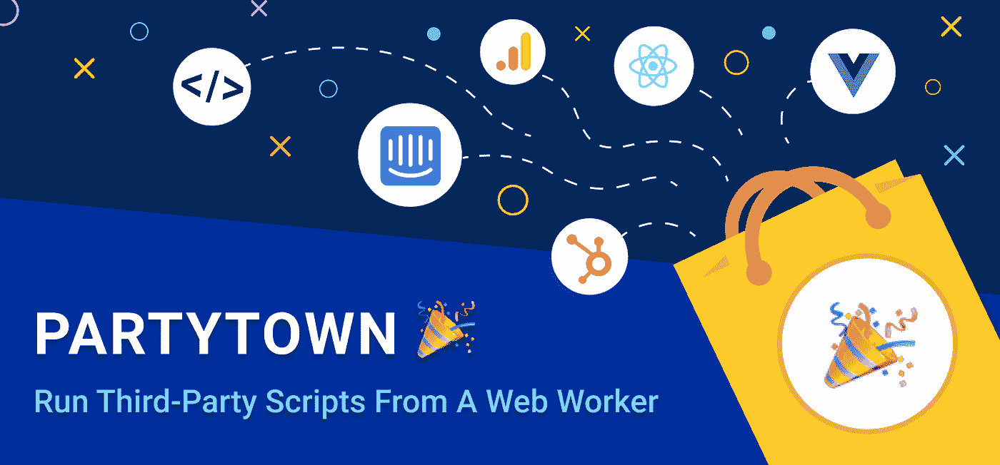
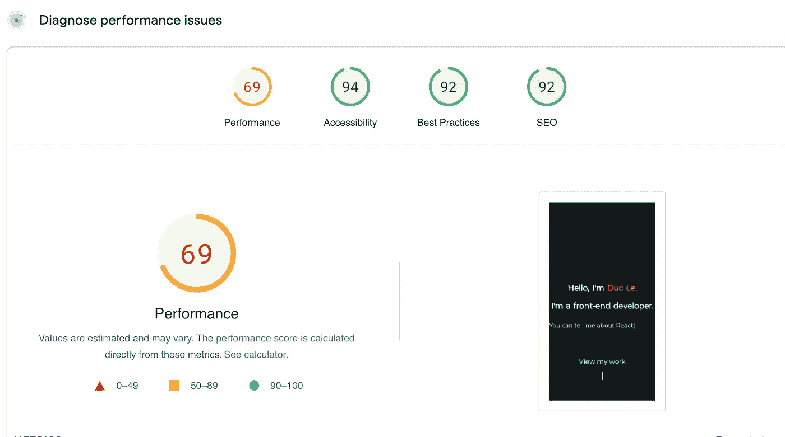
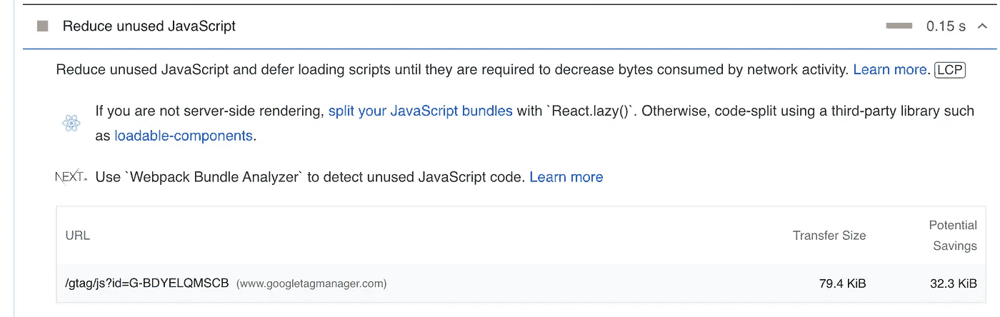
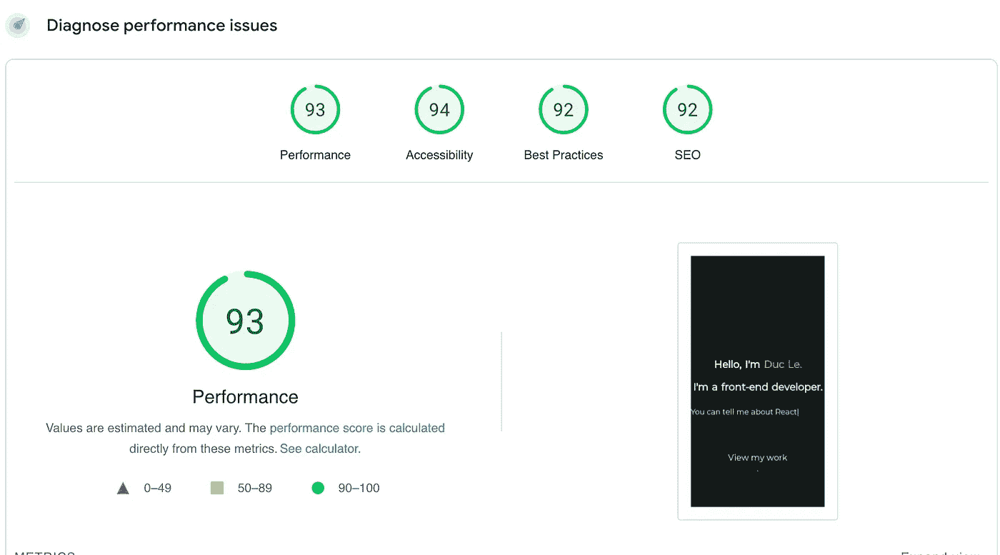

# 使用您的第三方脚本，而不会影响 Partytown 的性能

> 原文：<https://levelup.gitconnected.com/use-your-third-party-scripts-without-the-performance-hit-with-partytown-b2860cd27007>



# 介绍

**Partytown** 是一个惰性加载的库，帮助将资源密集型脚本重定位到 [web worker](https://developer.mozilla.org/en-US/docs/Web/API/Web_Workers_API) 中，并脱离[主线程](https://developer.mozilla.org/en-US/docs/Glossary/Main_thread)。它的目标是通过将主线程专用于您的代码，将第三方脚本卸载给 web worker，优化您的页面速度和 lighthouse 得分，从而帮助提高站点速度。

即使你的网站遵循当今所有的最佳实践，并拥有完美的灯塔评分。当添加第三方脚本时，您的性能优势很可能会荡然无存。

# 建立

根据 Partytown:

> Partytown 与大多数 web 开发库的主要不同之处在于它的设置和配置。在最底层，Partytown 可以只使用普通的 HTML，这意味着它不需要成为构建过程的一部分，不需要捆绑器，不需要特定的框架，等等。因为它可以与任何 HTML 页面集成，这也使得为几乎任何生态系统(如 Shopify、WordPress、Nextjs、Gatsby 等)创建包装组件或插件变得更加容易。

您可以通过以下方式安装软件包:

```
yarn add @builder.io/partytown
```

# 例子

虽然 Partytown 可以只使用普通的 HTML，但在这个例子中，我将向您展示如何使用 Partytown 和一个非常常见的前端库 React 或 NextJS，以及一个非常常见的第三方脚本 **Google Tag Manager** 进行分析。

来看看我此刻的网站表现(移动):



你可以看到虽然其他评分都很高，但性能只有 react 69 和灯塔分第三方剧本是主要因素。所以我们现在就用 **Partytown** 来优化它

首先，从根索引页面，我们只需要为我们的脚本包含`type="text/partytown"`:

```
<script
 async
 type="text/partytown"
 src="https://www.googletagmanager.com/gtag/js?id=G-BDYELQMSCB"
></script>
<script type="text/partytown" id="gtm">
 {`
   window.dataLayer = window.dataLayer || [];
   window.gtag = function gtag(){window.dataLayer.push(arguments);}
   gtag('js', new Date());
   gtag('config', 'G-BDYELQMSCB',{ 'debug_mode':true });
 `}
</script>
```

因为`gtag`向用户代码调用的`window`添加了一个全局变量，以便向服务发送数据。

因为 GTM 实际上是加载在 web worker 中的，所以我们需要转发这些调用。`forward`配置用于设置哪些`window`变量应该被修补和转发。正向字符串值属于要调用的函数:

```
<Partytown debug={true} forward={['gtag']} />
```

现在，您可以在应用程序中安全地调用`window.gtag`。

我们来看看实现 **Partytown:** 后的分数



性能分数现在是 93，大大提高了，灯塔给我们的建议不再存在。

# 结论

如今，第三方脚本非常普遍，尤其是当网站需要像 Hotjar、谷歌分析或脸书像素这样的跟踪器和广告时。

我希望这篇文章能帮助你在很短的时间内提高你的网站性能