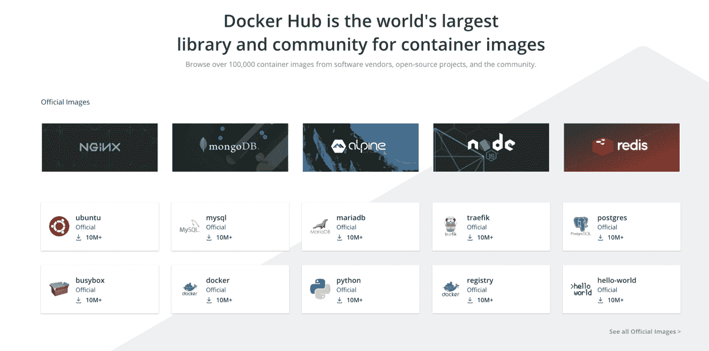

# 对软件开发人员有用的 Docker 命令

> 原文：<https://levelup.gitconnected.com/useful-docker-commands-for-software-developers-bc4d433b51dc>

## 每个开发者都应该知道的最有用的 Docker 命令


卡尔·帕夫洛维奇在 [Unsplash](https://unsplash.com/s/photos/software-development?utm_source=unsplash&utm_medium=referral&utm_content=creditCopyText) 的照片

[**Docker**](https://www.docker.com/) 可以被认为是一种技术或工具，它被设计成使用一个或多个容器来创建、部署和运行应用程序。简而言之，我们可以说 Docker 是一个用于封装应用程序的工具。当你在做一个与 Kubernetes 相关的项目时，Docker 可以被用作一个容器运行时工具，这意味着 Docker 可以帮助你处理 Kubernetes 项目中的容器。

因此，在这篇文章中，我将讨论最有用的 docker 命令，它们可以帮助您完成 DevOps 项目。让我们从在你的电脑上安装 docker 开始。

# 安装 Docker

Docker 为您提供了一个单独的 Docker 桌面软件，您可以将其安装在 Mac、Windows 或 Linux 操作系统上。你可以根据你的操作系统在这里下载 docker 桌面[](https://docs.docker.com/get-docker/)****，这个动作会在你的本地机器上安装一个 docker 客户端，帮助你连接 Docker 服务器。一旦你完成了 docker 的下载和安装，你就可以启动 docker 桌面，在你的终端上使用下面的命令来验证 docker 是否在你的电脑上正常工作。****

```
**$ docker versionOR$ docker -v**
```

****如果你得到一个成功的输出，docker 可以在你的计算机内部使用而不会导致错误。接下来，让我们试着在你的电脑里运行一个 docker 镜像。****

# ****运行预建的 docker 映像。****

****基本上，Docker 图像被认为是用于创建 Docker 容器的模板。你可以从 docker Hub[中找到 Docker 的官方图片，在你的终端上运行一个命令，你就可以在你的电脑中部署一个 Docker 容器。因此，Docker 容器可以被标识为 Docker 映像的运行实例。](https://hub.docker.com/search?q=&type=image)****

****让我们看一个例子。****

****[**Alpine**](https://hub.docker.com/_/alpine) 是一个最小的 Docker 映像，您可以在 Docker Hub 上找到，通过在您的终端上运行下面的命令，您可以将 Alpine docker 映像从 Docker Hub 拖到您的本地计算机上。****

```
**$ docker pull alpine**
```

****实际上，这是您可以尝试的基本命令，该命令总是获取最新版本的映像。但是您可以通过更改 docker 图像的标签来定制 docker 容器，如下所示。****

```
**$ docker pull alpine:3.12.3**
```

****之后，您可以使用`docker run`命令从该特定映像运行 docker 容器。****

```
**$ docker run alpine:3.12.3// This command deploys a docker container inside your computer and then immediately stops the container since it has no command to run.[ We can use the *-it* flag in *docker run* command to get an interactive shell of the container. To go out of the shell, type *exit in the shell]**ex:* docker run -it alpine:3.12.3**
```

*****您可以不使用* `*docker pull*` *和* `*docker run*` *命令在计算机内部部署容器，而是直接使用带有镜像名称的* `*docker run*` *命令，它将在计算机内部部署容器。【例:* ***码头工人跑高山*******

*****让我们试试另一个例子。*****

*****[**节点**](https://hub.docker.com/_/node) 在 docker Hub 上也有一个官方的 Docker 映像，我们不用运行默认命令，而是用一个轻量级标签定制它，如下所示。*****

```
***$ docker pull node:10.23-alpine***
```

*****这个版本的节点是使用[**alpine:3.11**](https://github.com/nodejs/docker-node/blob/c2604466d06ba562fd9040d18c57af16545c6a5b/10/alpine3.11/Dockerfile)docker 镜像构建的。*****

**********

*****Docker Hub 网站截图|来源:[https://hub.docker.com](https://hub.docker.com/)*****

*****同样，您可以尝试从 docker Hub 运行不同的 Docker 映像，或者为您的项目创建自己的 Docker 映像。*****

# *****创建您自己的 docker 图像。*****

*****Docker 图像可以使用 docker 文件创建，这些是特殊的 YAML 文件。让我们看看下面的例子。*****

```
***FROM node:10.23-alpine

WORKDIR /usr/src/app

COPY package*.json ./

RUN npm install

COPY . .

EXPOSE 8080

CMD ["node", "app.js"]***
```

*****您可以使用任何文本编辑器来创建这种类型的配置文件。但是文件名必须是 **Dockerfile** 。一旦你的 docker 文件准备好了，你可以使用`docker build`命令创建 docker 镜像。*****

```
***$ docker build . -t my-node-app//***.*** indicates that the Dockerfile is in the current directory***-t*** helps you to tag you image name***my-node-app*** will be the name of your docker image [name:tag format]***
```

*****然后，您可以使用`docker run`命令从您的 docker 映像部署一个容器，就像我们在上一步 ***【例如:docker run my-node-app】***中所做的那样。*****

# *****一些重要的 docker 命令*****

*   *****`docker help`或`docker — help`*****

*****该命令输出可以与 docker 命令一起运行的可用选项和标志。当你不知道一个特定的命令时，你可以简单地为你现有的命令添加`-- help`标志，你可以得到命令 ***【例如:docker run—help】***的可用选项和建议。*****

*   *****这将列出你电脑中所有可用的 docker 图片。*****
*   *****`docker ps`-这可以让你查看此时你的电脑里有哪些正在运行的容器。*****
*   *****`docker ps -a`-一旦一个集装箱停止处理，你将不会在 docker ps 列表上看到它。此时，您可以使用`docker ps -a`命令列出您计算机中的所有容器，这将输出两个正在运行的&停止的容器。*****
*   *****`docker start`-这允许您使用容器 id ***【例如:码头工人开始<容器 id>***】重新启动前一个容器。*****
*   *****`docker stop`-当你需要停止一个容器的过程时，你可以使用这个带有容器 ID ***的命令【例如:docker stop<container-ID>***。*****
*   *****`docker rm`-这个命令帮助你从你的电脑 ***【例如:docker RM<container-id><container-id>***】中移除一个或多个容器。*****
*   *****`docker rmi`-该命令帮助您从计算机 ***【例如:docker RMI<image-name:tag>或<image-id>***】中删除一个或多个 docker 图像。*****

# *****执行到 docker 容器中*****

*****在容器中执行或者为容器获取一个执行 shell 是 docker 的一个非常有用的特性。有时你需要进入容器内部，检查它的细节和属性，这个特性会给你很大的帮助。您可以使用如下的`docker exec`命令。*****

```
***$ docker exec -it <container-id> sh// this command only works when your container has a running status***
```

# *****检查正在运行的容器的本地端口*****

*****通常，具有 web 界面的应用程序通常运行在端口 80 或 443 上。同样，在 Docker 上运行的应用程序中，您可以定义一个/多个端口，并在`docker run`命令中公开它们。*****

*****在之前的步骤中，我们有`Dockerfile`，您可以看到一个 **EXPOSE 8080** 字段，它表示我们的应用程序应该运行的特定端口。在`docker run`命令中，我们可以将其与本地端口绑定，如下所示。*****

```
***$ docker run -p 5000:8080 --name c1 my-node-app***
```

*****与上面的命令一样，我们可以将本地端口 5000 绑定到应用程序端口 8080。使用`docker port`命令，我们可以识别绑定到特定 docker 容器的本地端口。*****

```
***$ docker port <container-id>***
```

# *****结论*****

*******恭喜你！**你已经成功地讲述了最有用的 docker 命令，这些命令可以帮助每一个希望开始 DevOps 项目的开发人员。*****

*****感谢阅读。我希望本文中的信息对您有用。如果您有任何问题或反馈，请不要犹豫，在下面留下回复，以便我可以回复您。*****

# *****资源*****

*   *****[Docker 文档](https://docs.docker.com/)*****
*   *****[Docker 桌面](https://docs.docker.com/get-docker/)*****
*   *****[码头枢纽](https://hub.docker.com/)*****

*****感谢阅读！*****