# 对开发者有用的免费在线工具

> 原文：<https://levelup.gitconnected.com/useful-free-online-tools-for-developers-ed882d4761c1>

## 提示和技巧

## 这是一个有用的免费在线工具列表，可以帮助开发者完成日常任务。

丹-克里斯蒂安·pădureț在 [Unsplash](https://unsplash.com/?utm_source=unsplash&utm_medium=referral&utm_content=creditCopyText) 上拍摄的照片

作为一名软件开发人员，你有一些经常需要处理的任务。诸如快速编译、运行和测试一行代码、格式化代码、转换某些代码或将其导出为图像、编辑或转换图像等任务，以及一些其他类似的任务。

因此，我整理了一份我通常用于此类任务的**免费** **在线**工具清单。

 [## 🔥订阅艾哈迈德的时事通讯🔥

### 订阅艾哈迈德的时事通讯📰直接获得最佳实践、教程、提示、技巧和许多其他很酷的东西…

medium.com](https://medium.com/subscribe/@eng_ahmed.tarek) 

# 代码编译器

代码编译器很快被用来编译你的代码并运行它来查看结果。当您想要快速测试一段代码，并且不想为此打开新的 IDE 窗口时，它们非常有用。

## [网络游戏](https://dotnetfiddle.net/)

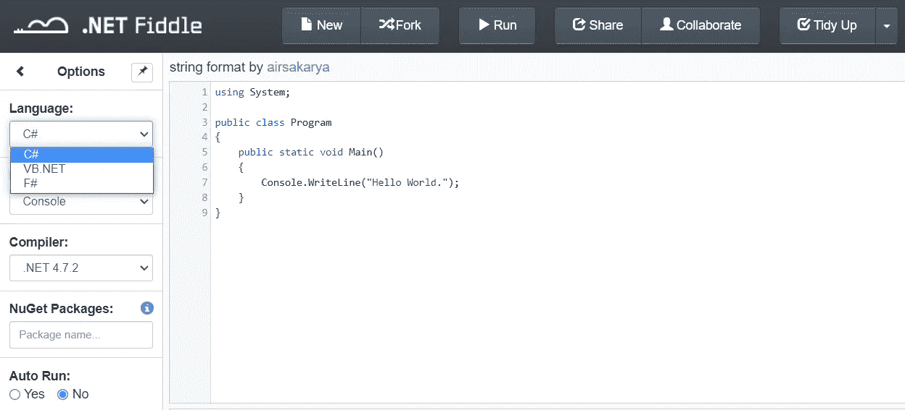

[网络游戏](https://dotnetfiddle.net/)

使用 [**DotNetFiddle**](https://dotnetfiddle.net/) ，你可以快速编译和运行你的 C#、F#和 VB.NET 代码。

## [小提琴](https://jsfiddle.net/)

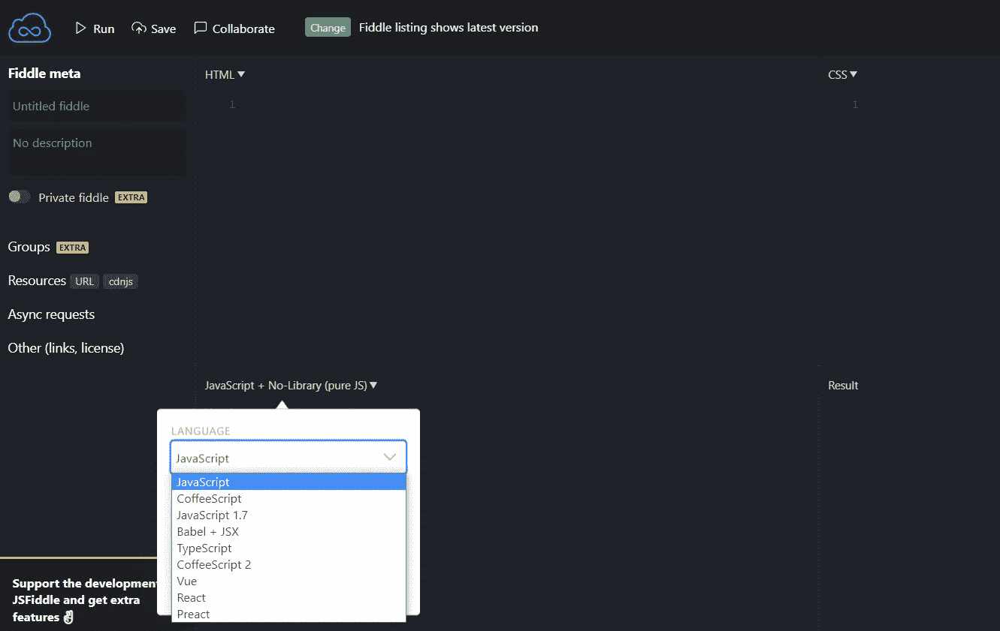

[JSFiddle](https://jsfiddle.net/)

使用 [**JSFiddle**](https://jsfiddle.net/) ，你可以快速编译并运行你的 JavaScript 代码。它支持许多 JavaScript 框架，如 vanilla JavaScript、CoffeeScript、Babel、TypeScript、Vue、React 等等…

## [OnlineGDB](https://www.onlinegdb.com/)

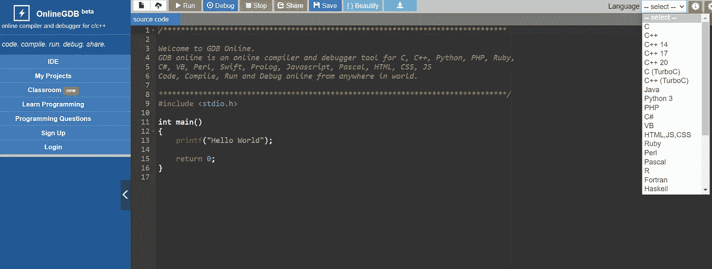

OnlineGDB

[**OnlineGDB**](https://www.onlinegdb.com/) 是一款针对 C、C++、Python、PHP、Ruby、C#、VB、Perl、Swift、Prolog、Javascript、Pascal、…等多种语言的在线编译器和调试器工具。

## [厨师长](https://www.codechef.com/ide)

[主厨](https://www.codechef.com/ide)

使用 [**CodeChef**](https://www.codechef.com/ide) ，你可以编译&运行你的代码。在线编译器支持多种编程语言，如 Python、C++、C、Kotlin、NodeJS 等等。

## [IdeOne](https://ideone.com/)

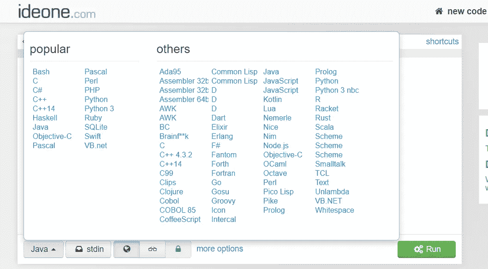

[IdeOne](https://ideone.com/)

使用 [**IdeOne**](https://ideone.com/) ，可以快速编译并运行多种语言的代码。

# 代码格式化程序

代码格式化程序用于快速将代码格式化成合适的格式，控制空格、缩进和其他属性。

## [JSONLint](https://jsonlint.com/)

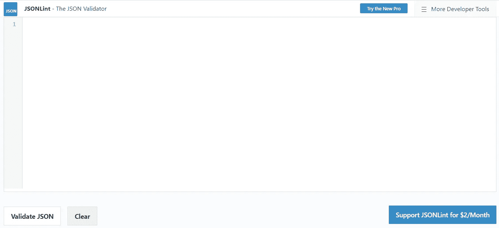

[JSONLint](https://jsonlint.com/)

JSONLint 是 JSON 的验证器和重格式化器，JSON 是一种轻量级的数据交换格式。复制粘贴，直接键入，或者在上面的编辑器中输入一个 URL，让 JSONLint 整理并验证你杂乱的 JSON 代码。

## [SAML 开发者工具](https://www.samltool.com/)

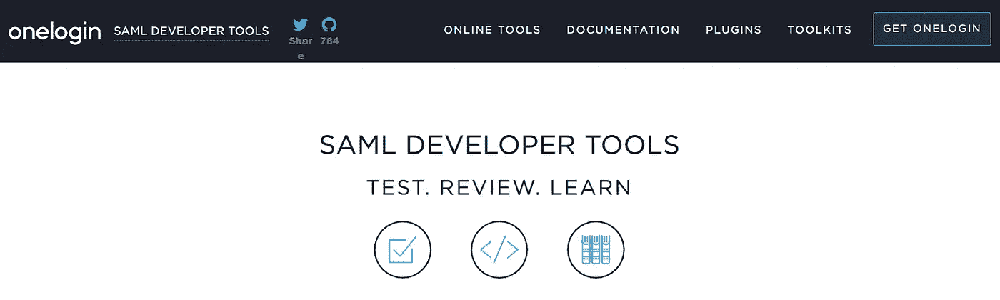

[SAML 开发者工具](https://www.samltool.com/)

[**SAML 开发者工具**](https://www.samltool.com/) 提供了一套以安全断言标记语言(SAML)为中心的工具。它是一种基于 XML 的开放标准数据格式，用于在各方之间交换身份验证和授权数据，尤其是在身份提供者和服务提供者之间。

## [网络格式器](https://webformatter.com/)

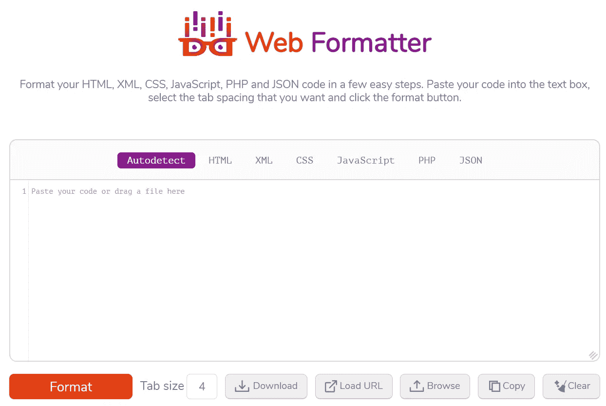

[网络格式器](https://webformatter.com/)

使用 [**Web Formatter**](https://webformatter.com/) ，你可以通过几个简单的步骤格式化你的 HTML、XML、CSS、JavaScript、PHP 和 JSON 代码。将代码粘贴到文本框中，选择所需的制表符间距，然后单击“格式”按钮。

## [代码美化](https://codebeautify.org/)

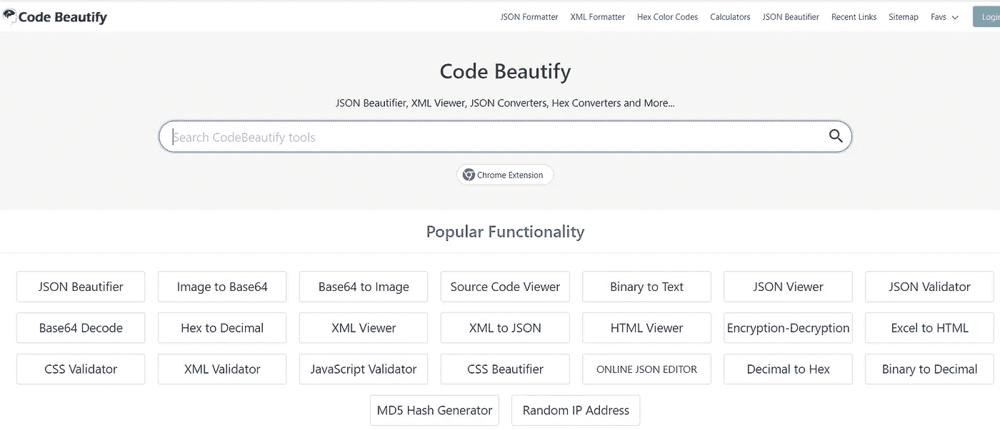

[代码美化](https://codebeautify.org/)

[**代码美化**](https://codebeautify.org/) 为开发人员提供了一套很棒的不同工具，包括编译器、格式化器、转换器……我建议一直把它放在身边。

# 转换器

转换器用于将代码从一种格式转换成另一种格式。

## [碳](https://carbon.now.sh/)

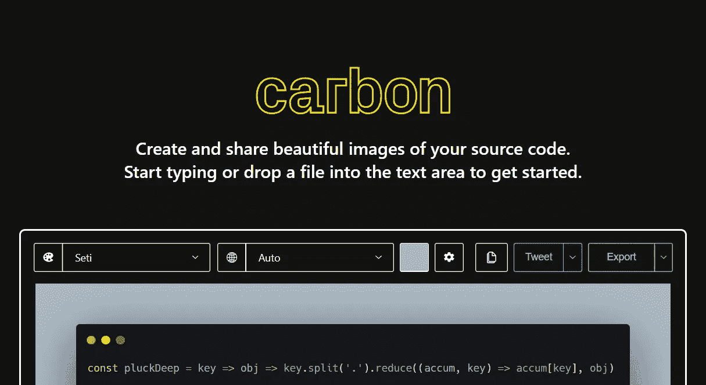

[碳](https://carbon.now.sh/)

使用 [**Carbon**](https://carbon.now.sh/) ，你可以创建并分享你的源代码的美丽图像。
开始输入或将文件放入文本区即可开始。

## [希利特](http://hilite.me/)

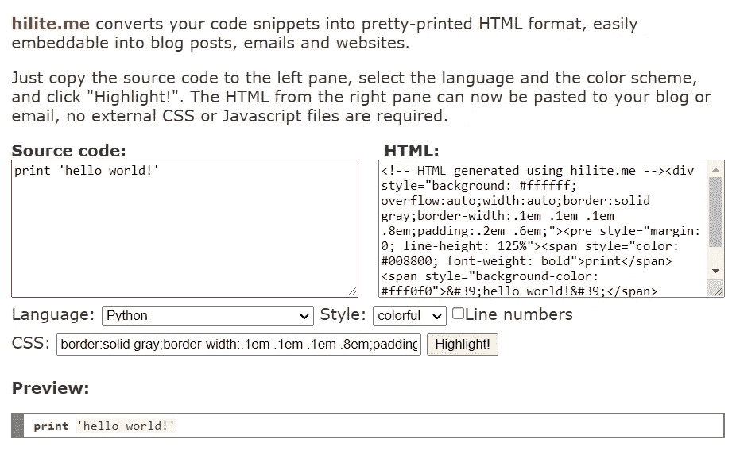

[希利特](http://hilite.me/)

Hilite 将你的代码片段转换成印刷精美的 HTML 格式，轻松嵌入到博客文章、电子邮件和网站中。

只需将源代码复制到左侧窗格，选择语言和配色方案，然后单击“突出显示！”。右侧窗格中的 HTML 现在可以粘贴到您的博客或电子邮件中，不需要外部 CSS 或 JavaScript 文件。

## [JSON cs harp](https://json2csharp.com/)

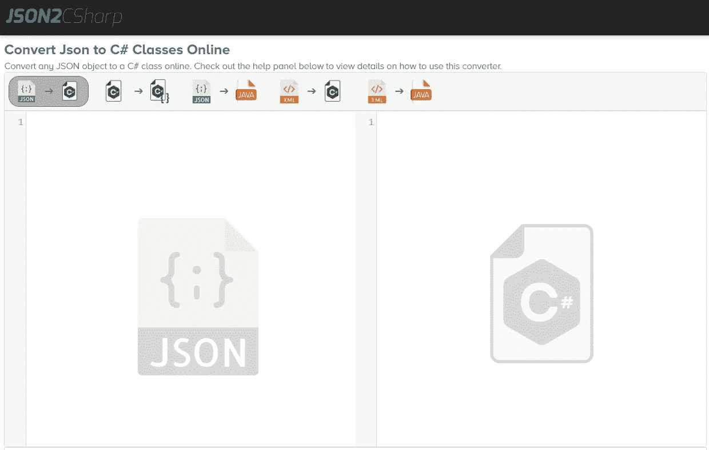

[Json2Csharp](https://json2csharp.com/)

使用 [**Json2Csharp**](https://json2csharp.com/) ，可以将任何 Json 对象转换成 C#类。

## [快速键入](https://app.quicktype.io/)

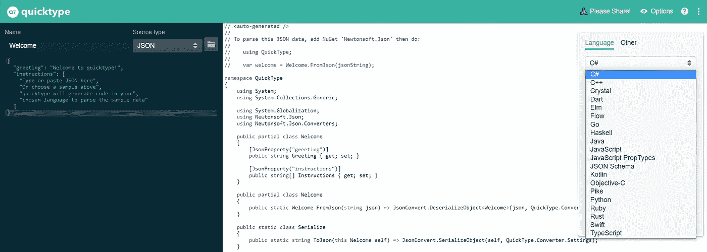

[快速键入](https://app.quicktype.io/)

使用 [**QuickType**](https://app.quicktype.io/) ，可以将任何 JSON 对象转换成自己喜欢的语言的对象。

## [HTML 编码器](https://www.opinionatedgeek.com/codecs/htmlencoder)

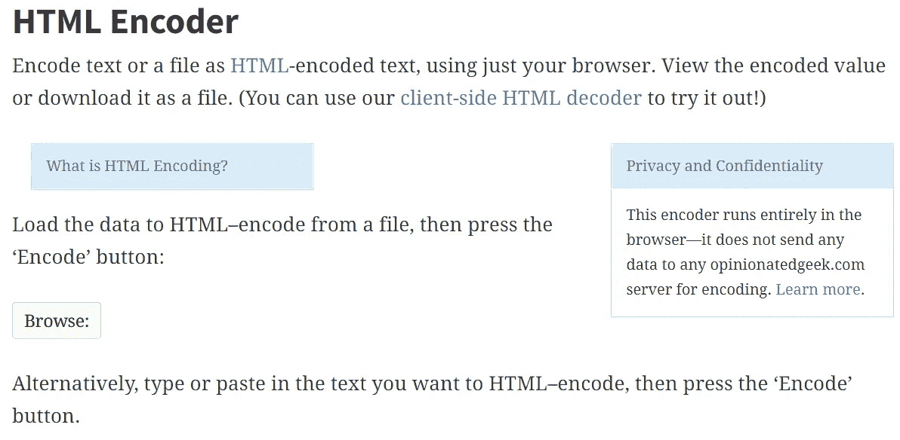

[HTML 编码器](https://www.opinionatedgeek.com/codecs/htmlencoder)

使用 [**HTML 编码器**](https://www.opinionatedgeek.com/codecs/htmlencoder) ，您可以将文本或文件编码为 HTML 编码的文本，只需使用您的浏览器。查看编码值或将其作为文件下载。

## [HTML 解码器](https://www.opinionatedgeek.com/codecs/htmldecoder)

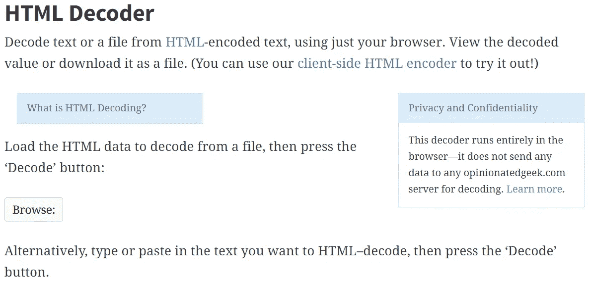

[HTML 解码器](https://www.opinionatedgeek.com/codecs/htmldecoder)

使用 [**HTML 解码器**](https://www.opinionatedgeek.com/codecs/htmldecoder) ，你可以从 HTML 编码的文本中解码文本或文件，只需使用你的浏览器。查看解码值或将其作为文件下载。

## [URL 编码器/解码器](https://meyerweb.com/eric/tools/dencoder/)

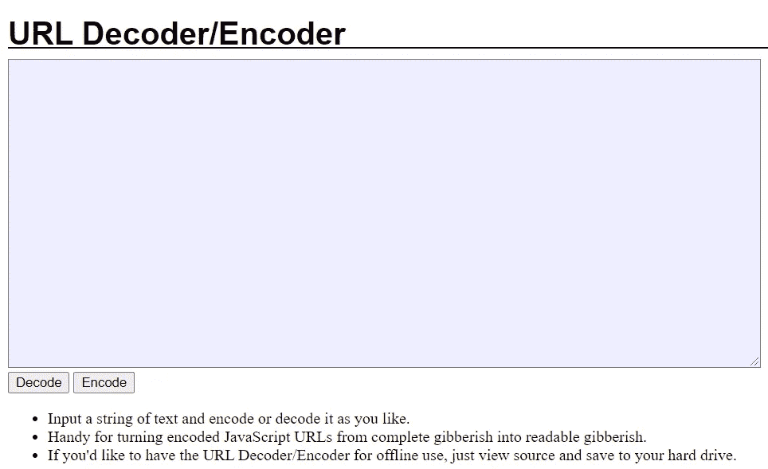

[URL 编码器/解码器](https://meyerweb.com/eric/tools/dencoder/)

使用 [**URL 编码器/解码器**](https://meyerweb.com/eric/tools/dencoder/) ，可以对 URL 进行编码或解码。

# 图像编辑器

图像编辑器用于快速对图像进行编辑，有时甚至从头开始创建图像。这些工具中的一些非常复杂，以至于它们提供了许多专业工具和功能，就像 Photoshop 等专业工具所提供的一样。

## [光视觉](https://www.photopea.com/)

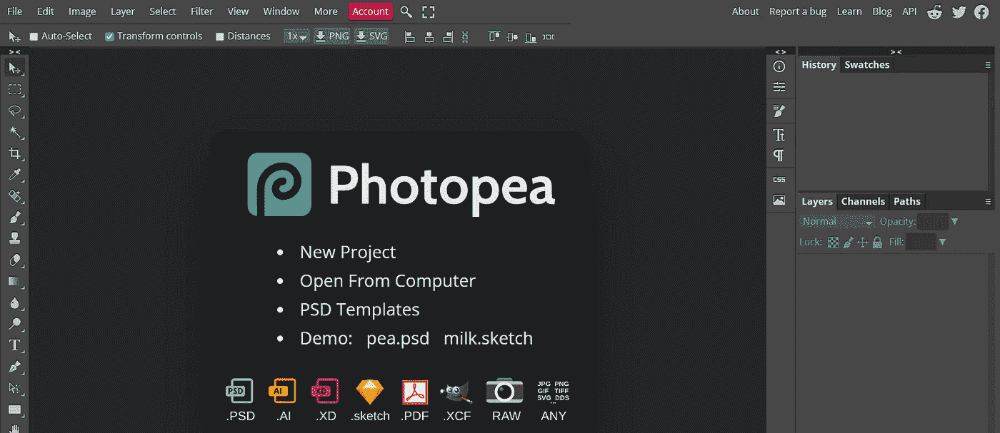

[光视觉](https://www.photopea.com/)

简单来说，如果你熟悉 Photoshop，你会喜欢 [**PhotoPea**](https://www.photopea.com/) 。

## [Pixlr](https://pixlr.com/)

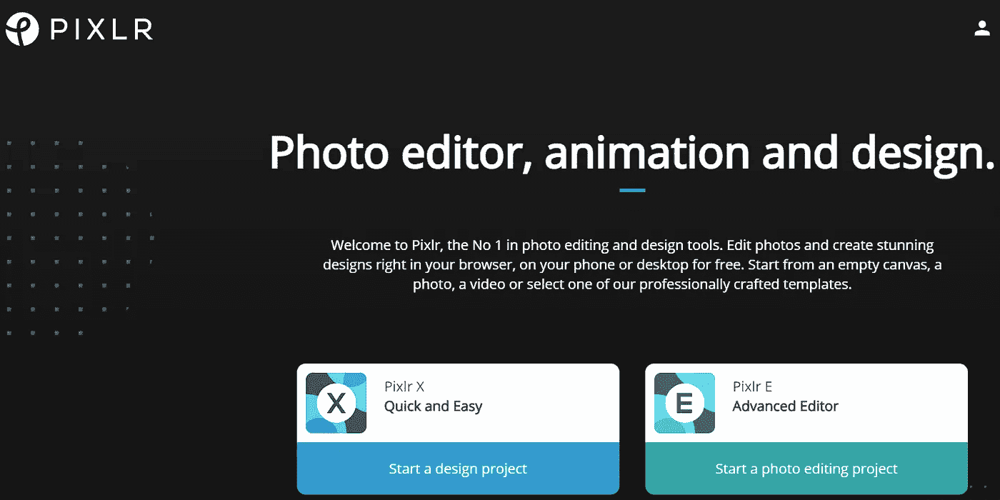

[Pixlr](https://pixlr.com/)

[**Pixlr**](https://pixlr.com/) 是照片编辑和设计工具中排名第一的。在您的浏览器、手机或台式机上免费编辑照片和创建令人惊叹的设计。从空白画布、照片、视频开始，或者选择一个专业制作的模板。

## [新月](https://www4.lunapic.com/editor/)

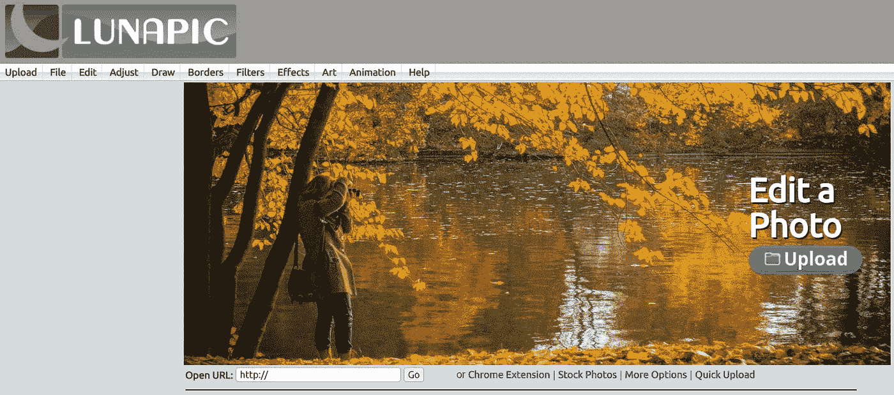

[新月](https://www4.lunapic.com/editor/)

[**Lunapic**](https://www4.lunapic.com/editor/) 是我见过的最伟大的在线图片编辑器之一。您可以享受使用一套伟大的工具和功能，这将有助于您轻松完成工作。

# 图像尺寸调整器

图像尺寸调节器用于在不降低图像分辨率和质量的情况下调整图像尺寸。这些工具中的一些提供了保持背景透明并且不使用纯色替换它的能力。

## [ResizePng](https://onlinepngtools.com/resize-png)

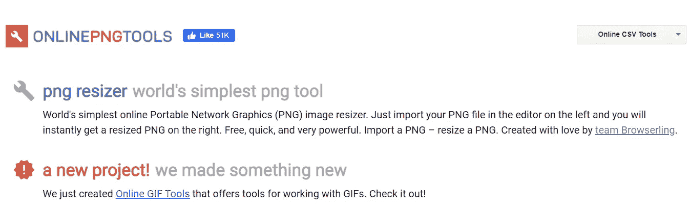

[ResizePng](https://onlinepngtools.com/resize-png)

[**ResizePng**](https://onlinepngtools.com/resize-png) 是世界上最简单的在线便携式网络图形(Png)图像缩放器。只需在左边的编辑器中导入您的 PNG 文件，您将立即在右边得到一个调整大小的 PNG 文件。免费，快捷，非常强大。

## [ResizeImage](https://resizeimage.net/)

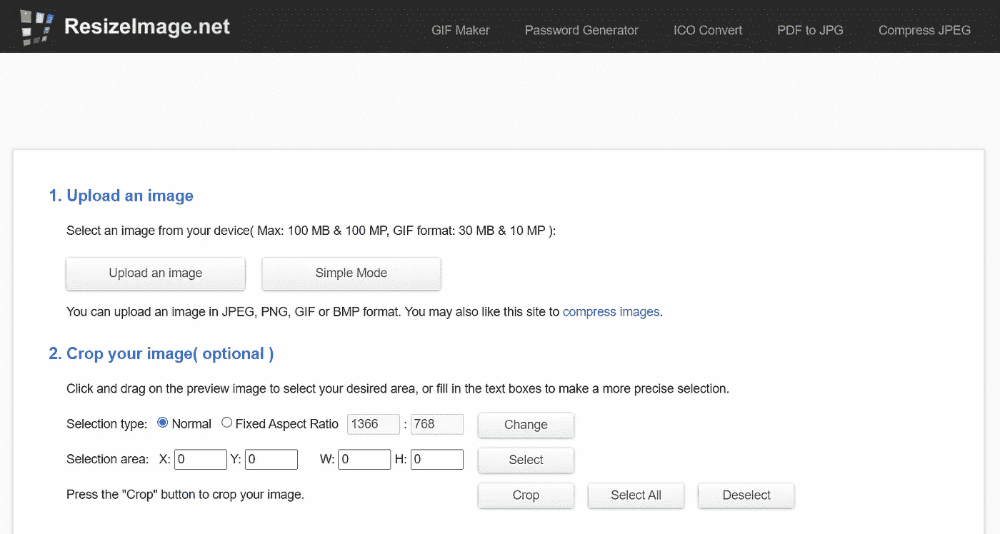

[ResizeImage](https://resizeimage.net/)

使用 [**ResizeImage**](https://resizeimage.net/) ，可以**上传**一幅图像，**裁剪**该图像，**旋转**该图像，**调整**该图像的大小，使背景**透明**，选择输出图像**格式**，**优化**您的图像，最后**下载**最终图像。

# 图像转换器

图像转换器用于将图像从一种格式转换为另一种格式。

## [Img2Go](https://www.img2go.com)

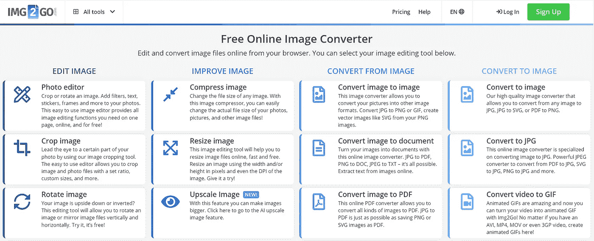

[Img2Go](https://www.img2go.com)

使用 [**Img2Go**](https://www.img2go.com) ，可以将图像从任意格式转换为另一种格式。它提供了一套很棒的工具来帮助您以简单易行的步骤完成工作。

# 多方面的

在这一类别中，你会发现一个做不同事情的在线工具列表。

## [Regex101](https://regex101.com/)

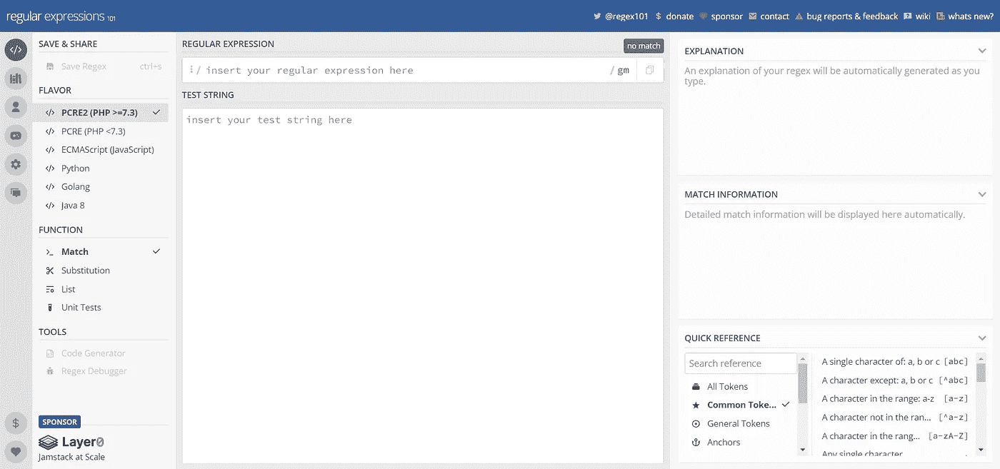

[Regex101](https://regex101.com/)

[**Regex101**](https://regex101.com/) 是一个很棒的工具，可以帮助你根据测试输入数据构建和验证你的正则表达式。此外，它帮助您理解和学习，因为它通过将您的正则表达式分解成多个部分并解释每个部分来为您提供分析。

## [标记验证服务](https://validator.w3.org/#validate_by_uri+with_options)

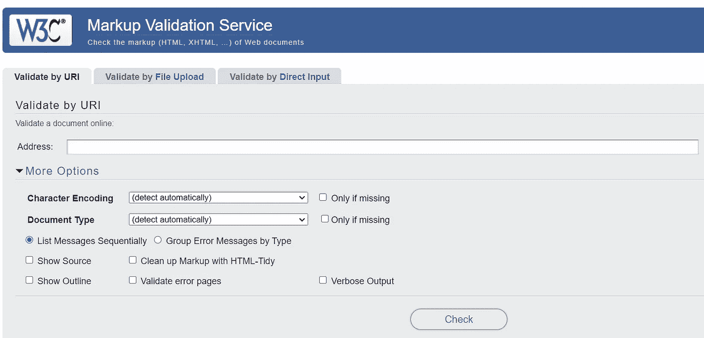

[标记验证服务](https://validator.w3.org/#validate_by_uri+with_options)

[**标记验证服务**](https://validator.w3.org/#validate_by_uri+with_options) 检查 HTML、XHTML、SMIL、MathML 等 Web 文档的[标记有效性](https://validator.w3.org/docs/help.html#validation_basics)。如果您希望验证特定内容，如 [RSS/Atom feeds](https://validator.w3.org/feed/) 或 [CSS 样式表](http://jigsaw.w3.org/css-validator/)、 [MobileOK 内容](https://validator.w3.org/mobile/)，或者[查找断开的链接](https://validator.w3.org/checklink)，还有[其他可用的验证器和工具](http://www.w3.org/QA/Tools/)。作为替代，你也可以试试我们的[非基于 DTD 的验证器](https://validator.w3.org/nu)。

## [PingDom](https://tools.pingdom.com/)

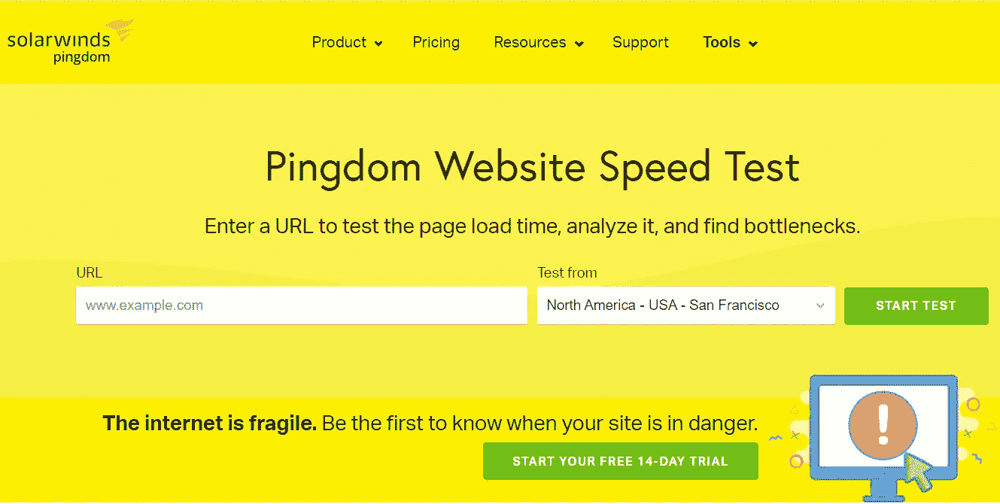

[PingDom](https://tools.pingdom.com/)

[**PingDom**](https://tools.pingdom.com/) 帮你分析你的网站加载速度。

该测试旨在通过识别网页的哪些方面是快、慢、太大等等来帮助您的网站变得更快。

简而言之，它是一个易于使用的工具，旨在帮助各地的网站管理员和 web 开发人员优化他们的网站性能。

## [缩小器](https://www.minifier.org/)

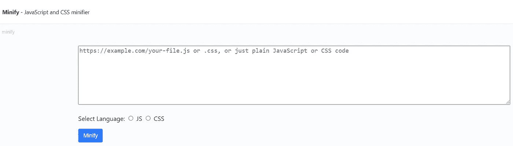

[缩小器](https://www.minifier.org/)

[**Minifier**](https://www.minifier.org/) 去除空白，剥离注释，合并文件，优化/缩短一些常见的编程模式。它附带了一个巨大的测试套件。

伊莱莎·特拉达在 [Unsplash](https://unsplash.com/?utm_source=unsplash&utm_medium=referral&utm_content=creditCopyText) 上拍摄的照片

# 最后的话

这些是我日常经常使用的工具。如果你有其他你真正喜欢的工具，请随时与我分享。

就这样，希望你觉得读这个故事和我写它一样有趣。

## 希望这些内容对你有用。如果您想支持:

如果您还不是**媒介**的会员，您可以使用 [**我的推荐链接**](https://medium.com/@eng_ahmed.tarek/membership) ，这样我可以从**媒介**中获得您的一部分费用，您无需支付任何额外费用。
▎订阅 [**我的简讯**](https://medium.com/subscribe/@eng_ahmed.tarek) 将最佳实践、教程、提示、技巧和许多其他很酷的东西直接发送到您的收件箱。

# 其他资源

这些是你可能会发现有用的其他资源。

 [## 观察者设计模式。NET C#

### 中了解观察者设计模式。NET C#做了一些改进。

levelup.gitconnected.com](/observer-design-pattern-in-net-c-55633462f18e)  [## 使用系统的最佳实践。计时器计时开始。NET C#

### 如何完全控制计时器，并能够用单元测试来覆盖它。

levelup.gitconnected.com](/best-practice-for-using-system-timers-timer-in-net-c-867ab6b5027) 