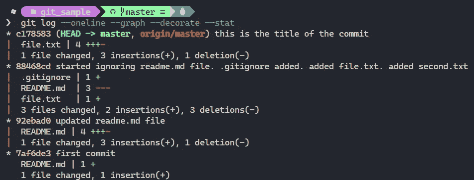

# 您可能不知道的有用的 Git 命令

> 原文：<https://levelup.gitconnected.com/useful-git-commands-you-might-not-know-2ff7c0c6a4e9>

## 饭桶

## 让我们开始吧。


照片由[扬西·敏](https://unsplash.com/@yancymin?utm_source=medium&utm_medium=referral)在 [Unsplash](https://unsplash.com?utm_source=medium&utm_medium=referral) 拍摄

学习 Git 很重要，因为作为一名软件开发人员，您每天都会用到它。Git 有时很容易，有时很难。在这篇文章中，我将讨论一些人们可能不知道或者没有经常使用的 git 命令。但是他们确实很有帮助。

# 向提交消息添加描述

假设您已经在项目中添加了一个新文件或者更改了一个现有文件，现在是时候将它添加到远程存储库中了。第一件事是在本地提交您的文件。我们大多数人都会用`git commit -m "file changed"`或者`git commit -m "nth commit"`。你用的最多的是哪一个？

嗯，这是不好的做法。提交消息是告诉另一个开发人员做了什么更改的最好方式。写一个好的提交消息的另一个原因是，在某种程度上，你是自己的未来。因此，编写好的提交消息来完美地描述变更是一个很好的实践。

**标题**应不超过 50 个字符。在**描述**中描述提交消息的内容和原因。最好提一下更改或添加的组件。

```
git commit -m "commit title" -m "this is the description of the commit."
```

如果你写的`git commit`没有`-m`标志，那么将会打开一个编辑器(对我们大多数人来说是 vi 编辑器)。


为编写提交消息而打开的 VI 编辑器

# 更改上一次提交的消息

假设您在提交消息中提交了一个未被注意到的错别字。事情变得更有关联了。别担心，它会发生在我们最好的人身上。好的一面是有一个命令可以改变之前的提交消息。

```
git commit --amend -m "new message for the commit"
```

这将在本地更改先前提交的提交消息。要远程更改它，命令是:

```
git push origin master --force-with-lease
```

**注意:另外，请记住，上述命令不会改变提交次数。相反，它将替换最近的提交。**

# 提交后忽略文件

重要的是要记住，一旦**文件**被提交，它将被跟踪，即使文件路径被添加到**。gitignore** 文件。第一步是在. gitignore 中添加文件的路径。

```
git rm --cached <path/to/file>
git add .gitignore
git commit -m "stopped tracking <filename>"
```

# 创建空提交

有些人可能认为这是有史以来最没用的 git 命令。但它有自己的用处。有时您可能需要触发一些部署，或者您可能需要测试一些集成。

```
git commit --allow-empty -m "no files added to this commit"
```

# 向以前的提交添加/更新文件

另一个你可能会想到的情况。假设您在提交代码之前忘记了从代码中删除 print 语句。我支持你，我的开发者伙伴。您可以做的一件事是删除 print 语句并进行新的提交`git commit -m “removed the print statements from the code”`。看起来不太好。下面提到另一种方法:

1.  从文件中删除不需要的代码。将文件添加到临时区域。

```
git add .
```

2.提交文件而不改变先前写入的消息

```
git commit --amend --no-edit
```

3.用新的提交消息提交文件

```
git commit --amend -m "new commit message"
```

4.正确地远程更改代码

```
git push origin master --force-with-lease
```

如果您想在之前的提交中添加一个新文件，可以遵循相同的步骤。因为我们正在修改提交，所以提交的数量不会改变。

# 撤消上次提交

1.  正在本地撤消上次提交。`--soft` flag 将保留对文件所做的更改。

```
git reset --soft HEAD~1
```

2.远程撤销最后一次提交

```
git push origin master --force-with-lease
```

# 有风格的日志记录

`git log`用于显示提交日志。但是太无聊了。它会显示很多可能有用也可能没用的数据。有许多标志可以和`git log`一起使用，以一种令人愉快的方式显示关于提交的有用数据。

1.  `--oneline`:这个标志用于在一行中打印所有内容。它将包括提交 id 和提交消息。
2.  `--stat`:该标志负责显示哪些文件被修改和添加。
3.  `--decorate`:这将显示所有引用，如分支、标签等。对于每次提交。
4.  `--graph`:此标志使您能够以图形方式查看日志。

```
git log --oneline --stat --decorate --graph
```



日志记录使用各种标志提交历史记录

# 提交历史记录

提交的历史？这不就是`git log`的作用吗？是和否。`git log`显示了可由父节点，即**头**访问的提交日志。如果您想查看存储库的所有撤消历史记录，那么命令是:

```
git reflog
```

# 附加说明

> “我不总是使用武力，但当我这样做的时候，我会用租赁的方式”

[Mohammad-Ali A ' r ABI](https://medium.com/u/13982d09d3b0?source=post_page-----2ff7c0c6a4e9--------------------------------)在他的文章[**Git Force vs Force with Lease**](https://itnext.io/git-force-vs-force-with-lease-9d0e753e8c41)**中提到了上述引文，它是完美的。**

**除非您想破坏代码库，否则不应该在提交时使用`--force`标志。此命令用本地分支中的新代码覆盖远程分支中的现有代码，忽略远程分支的当前状态。因此，如果其他开发人员做了一些更改，它将被覆盖。最好的选择是使用`--force-with-lease`。**

**我希望这篇文章对你有帮助。感谢您的阅读。在 [LinkedIn](https://www.linkedin.com/in/ashish-yoel-585a6116a/) 上与我联系。**

# **资源**

**[](https://gitbetter.substack.com/p/5-useful-git-commands-you-might-not?s=r) [## 你可能不知道的 5 个有用的 git 命令

### 你好。我是斯雷巴拉吉。您收到这封电子邮件是因为您已经订阅了 Git 来升级您的游戏。选择…

gitbetter.substack.com](https://gitbetter.substack.com/p/5-useful-git-commands-you-might-not?s=r) [](https://itnext.io/git-force-vs-force-with-lease-9d0e753e8c41) [## Git Force 与 Force with Lease

### 以及何时使用它们

itnext.io](https://itnext.io/git-force-vs-force-with-lease-9d0e753e8c41)**