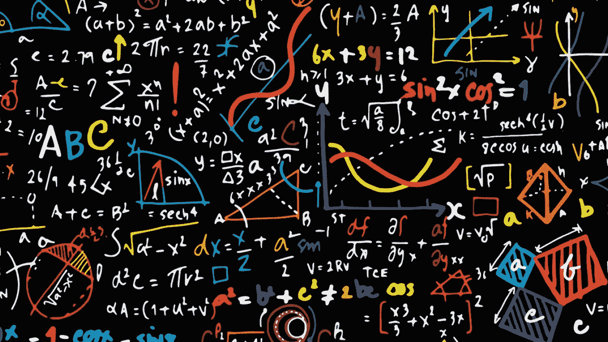
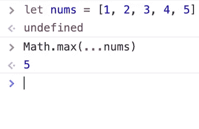
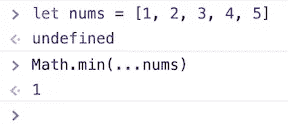
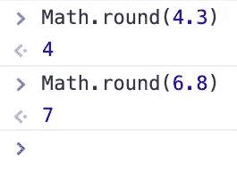
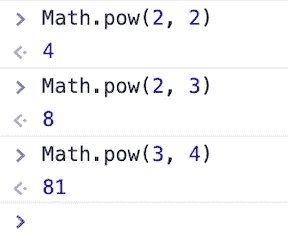
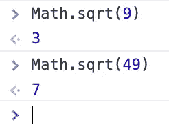
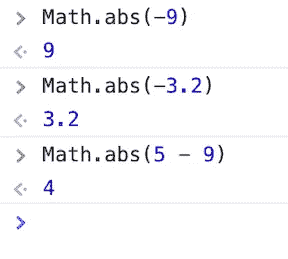
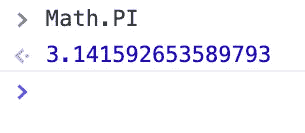

# 有用的 Javascript 数学函数

> 原文：<https://levelup.gitconnected.com/useful-javascript-math-functions-d1016478f0f2>

当处理大量数据时，有时您会遇到一组数字，然后您必须处理这些数字来收集和分析信息。最棒的是 Javascript 自带了一个内置的数学对象，它有很多在很多情况下都会派上用场的属性！我将讨论几个函数，希望对你将来的使用有所帮助。

*`Math.max()`函数返回数组中最大的数，你所要做的就是将它传递到括号内，但是当你使用一个变量作为数组时，你必须在它之前传递扩展操作符，就像这样:*

**

*传入扩展操作符(…)，否则它将返回 NaN*

> ****Math.min()****

*`Math.min()`函数类似于 max 函数，但它返回数组中最小的数字，就像 max 一样，当你使用一个变量作为数组时，你必须在它之前传递 spread 运算符*

**

> ****Math.round()****

*`Math.round()`函数返回舍入到最接近的整数的数值:*

**

*舍入最接近的整数*

> ****math . pow()****

*`Math.pow(x, y)`函数接受两个参数，返回 x 的 y 次方值:*

**

> ****Math.sqrt()****

*`Math.sqrt()`函数返回任意给定正数的平方根:*

**

> ****Math.abs()****

*`Math.abs()`函数返回任意数字的绝对值，这基本上将它转换为正数，并且在使用查找差值而不返回负数时也很有用:*

**

> ****数学。圆周率****

*`Math.PI`函数计算圆周率的 16 位数字(π):*

**

*返回π*

*这些只是 Math 对象拥有的众多函数中的一部分，虽然它们可能很简单，但是了解并实践这些函数将会让您在处理整数和解决算术问题时更有优势。*