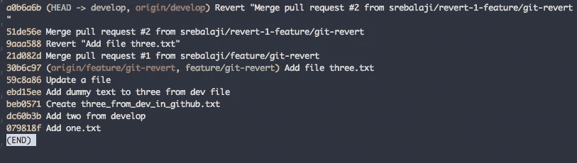
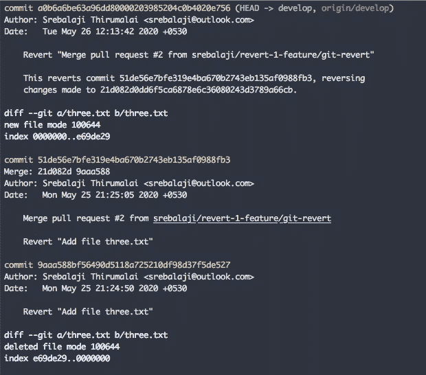
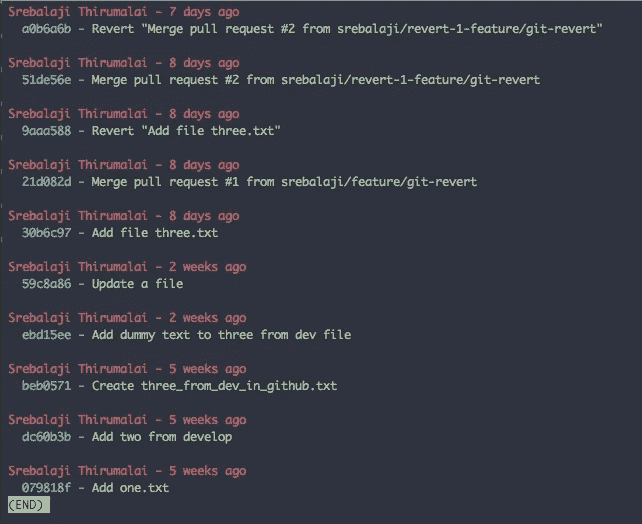

# 你可能不知道的关于 git 日志的有用技巧

> 原文：<https://levelup.gitconnected.com/useful-tricks-you-might-not-know-about-git-log-ed5ac32625ef>


如果你使用 Git 有一段时间了，你应该会遇到`git log`。众所周知，git log 是一个简单的命令，可以帮助我们查看变更或项目历史。

即使如此简单，它也是一个非常强大的工具，它提供了许多选项来帮助我们查看项目变更及其结构。我们将在本文中看到一些最常用的选项。

## git log -oneline

```
git log --oneline
```

该命令帮助您以更清晰的方式查看提交。它将每个提交压缩为一行，并且只有最少的信息，如较短的提交散列、提交消息。



## 按时间段筛选提交

这些命令将过滤掉给定时间段内的提交。例如， **-after** 只会过滤给定时间段之后的提交， **-before** 只会过滤给定时间段之前的提交。

```
git log --after="2020-15-05"
```

以上命令将只显示 2020 年 5 月 15 日之后的提交

```
git log --after="2020-15-05" --before="2020-25-05"
```

上面的命令将只显示从 5 月 15 日到 5 月 25 日的提交

您也可以使用以下日期格式

```
git log --after="yesterday" // shows only commits from yesterdaygit log --after="today" // shows only today commits git log --before="10 day ago" // omits last 10 days commits git log --after="1 week ago" //show only commits from last week git log --after="2 week ago" git log --after="2 month ago" // shows only last 2 months commits
```

## 具有不同更改的 git 日志

该命令将显示包含差异更改的日志。以便您可以知道每次提交中所做的更改。



在上图中，您可以看到 git diff 的变化。

## 按作者筛选提交

```
git log --author="Srebalaji"
```

上面的命令将过滤掉特定作者提交的内容。注意，Git 通过正则表达式模式过滤掉。所以不要担心精确的名称匹配或区分大小写。

Git 日志可以接受多个选项，因此您可以根据需要组合选项。举个例子，

```
git log --after="1 week ago" --author="srebalji" -p
```

上面的命令将根据各自的作者过滤过去一周的提交，并显示差异变化。

## 按日志消息筛选提交

有时，您需要通过日志消息过滤提交。Git 接受一个 regex 模式来搜索日志消息，并显示所有匹配的提交。

```
git log --grep="ISSUE-43560"
```

上面的命令将根据各自的模式过滤提交。记住默认情况下是区分大小写的。

为了使搜索**不区分大小写**，可以传递 **-i** 参数

```
git log -i --grep="issue-43560"
```

以下命令使用正则表达式模式搜索，并将搜索两个问题 id。

```
git log -i --grep="issue-43560\|issue-89786"
```

## 按文件筛选提交

有时，您需要所有影响某些特定文件的提交更改。这将在许多地方实现。

```
git log main.rb
```

该命令将过滤对相应文件进行了更改的提交。

您还可以向它传递多个文件。

```
git log main.rb search.rb login.rb
```

你可以看到我过滤掉了三个文件。

记住你也可以传递多个选项。

```
git log -i --grep="fix " main.rb search.rb
```

该命令将过滤掉对指定文件所做的提交更改，还将按照给定的搜索模式匹配日志消息。

## 按文件内容过滤提交

您可能需要在源代码中搜索已经添加到提交历史记录中的特定字符串。这可以通过以下方式实现

```
git log -S"function login()"
```

上面的命令将搜索字符串“function login()”。默认情况下，它区分大小写。

您可以通过添加 **-i.** 使其不区分大小写，并且要查看内容，您可以查看差异变化。

```
git log -i -S"function login()" -p
```

## 仅显示合并提交

这个命令帮助我们了解对当前分支所做的合并。

```
git log --merges
```

上面的命令将只显示当前分支中的合并提交。仅此而已。

## 显示分支之间的差异

我们已经在以前的一期杂志中看到过这个命令。

```
git log master..develop
```

这个命令将帮助您显示来自 develop 的所有提交，但是不在 master 分支中。通过这种方式，您可以知道有多少新的提交被添加到了开发分支中，而主分支中却没有。并确保在比较之前在本地有更新的更改。

## 自定义格式化日志消息

Git 还提供了定制日志消息格式的选项。你可以查看[自定义漂亮选项](https://www.git-scm.com/docs/git-log#_pretty_formats)获得更多选项。

举个例子，

```
git log --pretty=format:"%Cred%an - %ar%n %Cblue %h -%Cgreen %s %n"
```



在上图中可以看到，提交日志是定制格式的。如果您只想查看日志的特定细节，这非常简单而且非常方便。

希望你学到了什么:)

如果你有任何技巧或疑问，可以在评论中留下反馈。

**你可以在这里找到我的其他 git 相关文章**

```
1\. [How git revert works](/how-git-revert-works-9b87b8b03dd3)2\. [How git cherry-pick works and how to use it effectively](/what-is-git-cherry-pick-and-how-to-use-it-effectively-665247192442)3\. [Automate repetitive tasks in Git](/automate-repetitive-tasks-with-custom-git-commands-76a4b71d262f)4\. [Useful tricks of git fetch and git pull](/how-to-use-git-fetch-and-git-pull-effectively-c6a4becfbc16)5\. [A very basic intro of Git](https://medium.com/@srebalaji/a-very-basic-intro-of-git-b9cab0e64153)
```

**本帖原载于我的简讯**[**GitBetter**](https://gitbetter.substack.com/)**。如果你已经来了这么久，那么我想你会对 Git 非常感兴趣。可以订阅**[**Git better**](https://gitbetter.substack.com/)**获取 Git 的招数、技巧、高级话题。**

感谢您的阅读:)