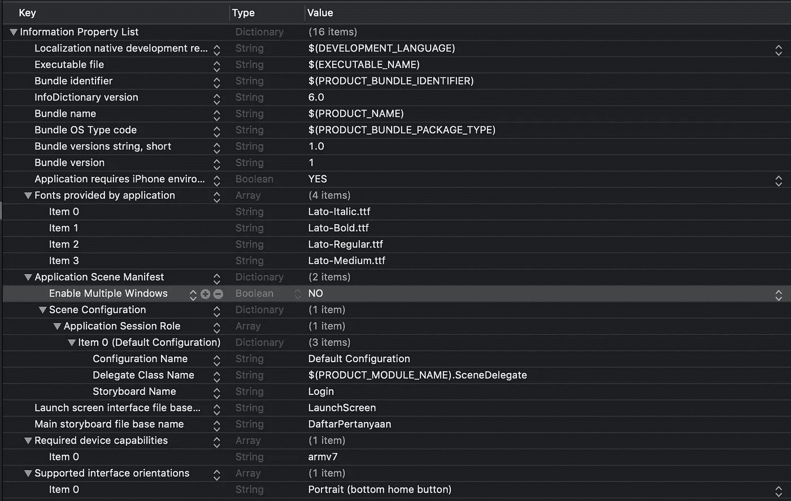
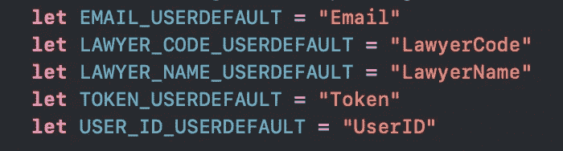
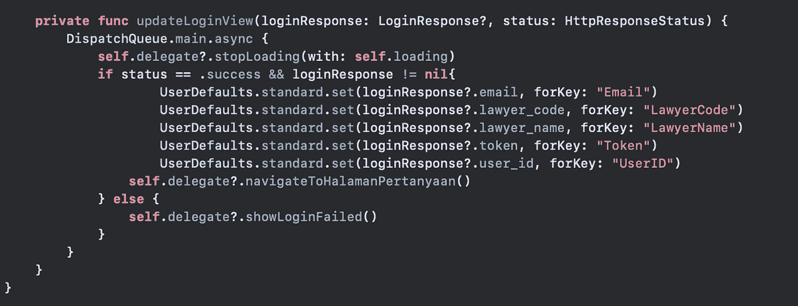
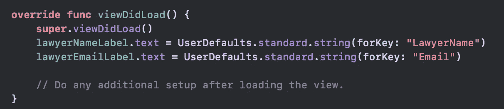
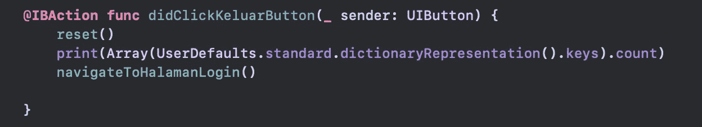
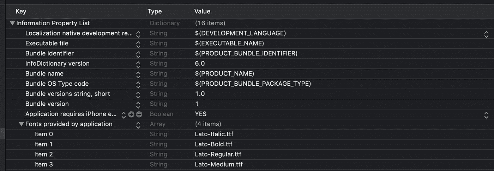

# Swift 中的用户默认值

> 原文：<https://levelup.gitconnected.com/user-defaults-in-swift-dfe228f684c6>


所有 iOS 应用程序都有一个内置的数据字典，只要安装了应用程序，它就会存储少量的用户设置。这个系统叫做 UserDefault。

# 什么是用户默认值？

根据苹果的文档，UserDefaults 是用户默认数据库的一个接口，你可以在应用程序启动时持久存储键值对。

UserDefault 可以保存整数、布尔值、字符串、数组、字典、日期等等，但是你要注意不要保存太多的数据，因为这会减慢你的应用程序的启动速度。

UserDefaults 就像字典一样，由键和值组成。例如:

```
var dict = [
    "Name": "Yafonia",
    "Age" : 21,
    "Language": "Indonesian"
]
```

用户默认值保存在`.plist`文件中，在这种情况下保存在`Info.plist`中。



Info.plist 文件上的用户默认值

# 何时使用用户默认值

用户默认值最适用于简单的数据。如果需要存储多个对象，最好使用真正的数据库。以下是保存在用户默认值中的几个数据示例:

*   用户信息，如姓名、电子邮件地址、年龄、职业
*   应用程序设置，如用户界面语言、应用程序颜色主题或字体
*   flags(is loggin，用于检查用户是否登录，等等。)

# 将数据保存在用户默认值中

我们可以在用户默认值上保存几种变量类型:

*   布尔值用`Bool`，整数用`Int`，浮点用`Float`，双精度用`Double`
*   带有`String`的字符串，带有`Data`的二进制数据，带有的[日期，带有`URL`类型的 URL](https://learnappmaking.com/swift-date-datecomponents-dateformatter-how-to/)
*   带有`Array`和`Dictionary`的集合类型

在内部，`UserDefaults`类只能存储`NSData`、`NSString`、`NSNumber`、`NSDate`、`NSArray`和`NSDictionary`类。

例如，在这个项目中，我想保存几个帐户的信息，如电子邮件，代码，姓名，令牌和用户 ID。所以我将 loginResponse 中的值设置为键的值(Email、LawyerCode、LawyerName、Token、UserID)。所有的值都是字符串。



除了帐户信息，还有一个名为`"Token"`的键用于登录信息。如果该键上有值，则用户已登录，反之亦然。你也可以使用标志，例如你可以用`boolean`值来调用它`"isLoggedIn"`。

# 获取用户默认值中的数据

获取用户默认值中的数据就像保存数据一样简单。让我们看看下面的例子。


我的项目上的帐户页面

对于上面的这个页面，我需要帐户的名称(例如:lawyer_staging)和电子邮件(例如:lawyer_staging@justika.com)，这是保存在用户默认设置中的关键字`"Email"`和`"LawyerName"`。所以我们接下来要做的是:



要显示帐户的名称和电子邮件，您可以将标签的文本设置为您从 UserDefaults 获得的数据。对，就这么简单！

# 重置用户默认值中的数据

也许你一直在想，既然我不使用标志来显示登录信息，那么当用户没有登录时会是什么情况呢？

如果用户注销了，那么我们可以重置用户默认值上的键和值。我们如何做到这一点？



因此，当用户点击“Keluar”按钮时，我们可以重置所有用户默认的登录信息的键和值。当用户登录时，在用户默认值中再次设置密钥和值。

# 用户默认的用户界面语言

如上所述，我们也可以保存应用程序设置，如用户界面语言的用户默认设置。例如，字体信息保存在用户默认值中。



信息列表

在上图中，你可以看到有一个名为`"Fonts provided by application"`的键，那是我们保存字体的地方。

# 结论

我们可以轻松地使用用户默认设置来保存简单的数据，如用户信息、应用程序设置和字符串、布尔、整数、数组、字典、日期等形式的标志。