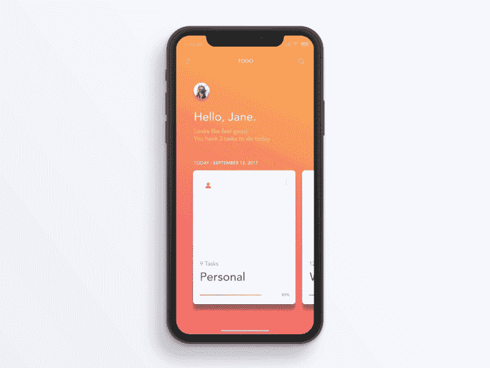
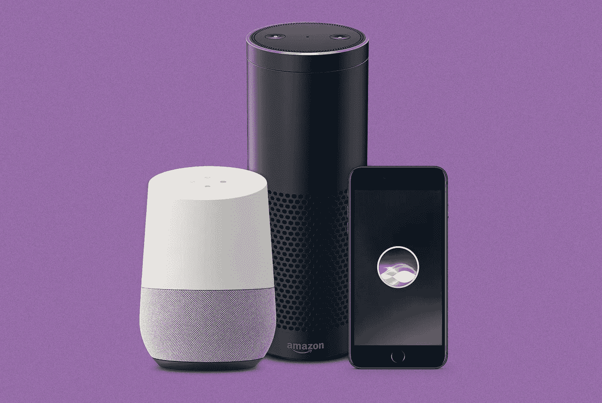
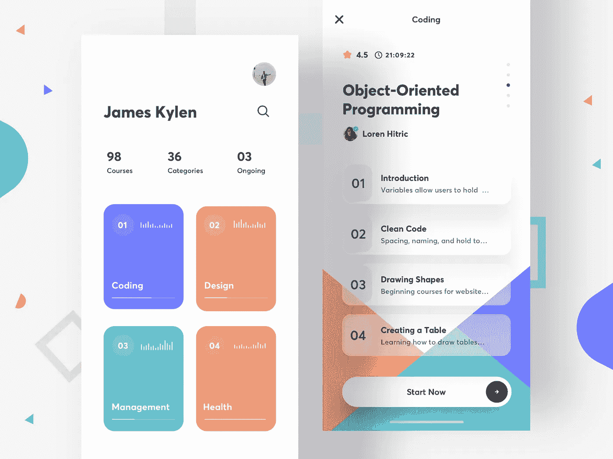
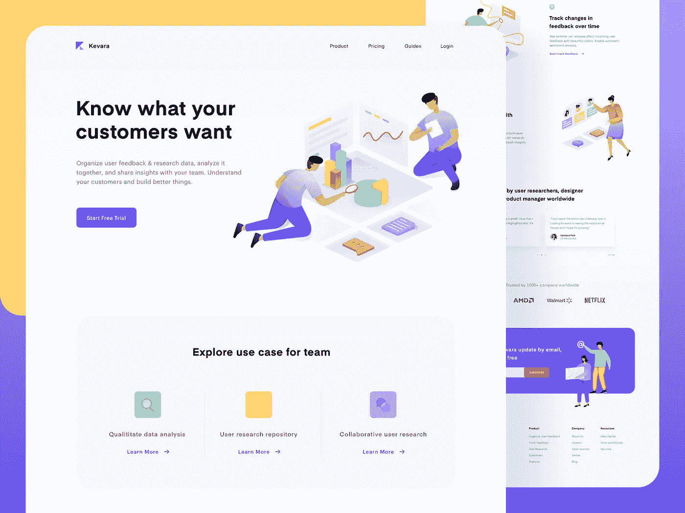
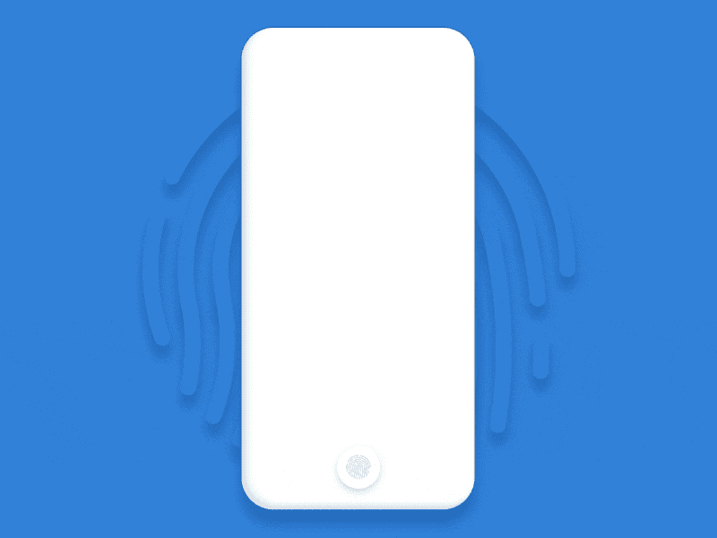

# 2019 年用户体验(UX)趋势

> 原文：<https://levelup.gitconnected.com/user-experience-ux-trends-in-2019-b4fcb4a3cba9>

用户体验(UX)设计是为用户创造有意义和相关体验的产品的过程。

# 1.无框架的体验

随着 iPhone X 和三星 Galaxy S8 的发布，全面屏和无边框体验已经成为常态。用户希望应用程序能够利用这一屏幕空间，提供身临其境、更丰富的内容体验，以及照片或视频等高质量视觉效果。

UX 设计师需要适应这些用户的期望，同时也保持舒适和功能性的设计。

# 2.语音用户界面

越来越多的消费者转向 Alexa、Siri 或 Google Home 来查找信息、控制日常任务，或者只是为了娱乐。

语音 UI 通过允许用户使用语音作为输入，提供了一种更快、更容易、更愉快的控制计算机和设备的方式。据预测，大约 50%的搜索引擎查询将是基于语音的。

# 3.省时设计

当今最成功的网站和应用程序以一种易于消费的格式提供的不仅仅是相关信息。它们创造了直观的体验，减少了摩擦，节省了用户的时间。

在移动和桌面环境中，时间是成功的关键。用户希望产品能帮助他们尽快实现目标，而省时的设计是帮助他们实现这一目标的关键。节省时间的设计允许用户从安装应用程序/访问网站的那一刻起，直到他们采取行动的那一刻，采取有限数量的步骤。

# 4.更好的个性化

个性化策略是公司和网站访问者之间建立的一种关系或“契约”。

个性化不仅节省时间，还能让企业增加销售额。这就是为什么在 UX，品牌正从一劳永逸的体验转向个性化。在用户数据和人工智能或机器学习等现代技术的帮助下，这成为可能。换句话说，现代用户体验趋势是基于用户自身的需求和偏好。

# 5.拇指友好体验(认证趋势)

借助指纹的认证已经是移动应用的标准。然而，在 2019 年，这一趋势将被类似于苹果 Face ID 或其他生物识别认证手段的技术所“更新”。这样，一些服务可能会拒绝要求其用户创建密码，而是使用他们的生物特征数据，如果他们的设备支持该技术的话。轻松的身份验证手段正在成为用户的一件平常事，也是 UX 设计的新趋势之一。因此，公司将重新考虑身份验证的 UI 设计，很可能是过程本身。

> ***发表于*** [***迪内什库马尔***](https://www.dineshk.me)