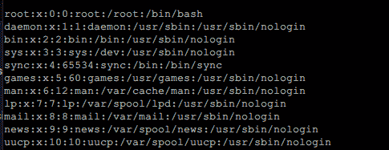
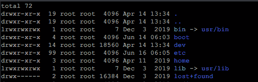

# 解释了 Linux 中的用户管理

> 原文：<https://levelup.gitconnected.com/user-management-in-linux-explained-825b8a518abc>

以下是如何保护您的系统


Linux 作为一个真正的多用户、多名称空间的操作系统，在用户管理方面提供了很多选择。下面是你需要知道的掌握它的方法。

# 什么是用户和组？

多用户操作系统意味着 Linux 可以被多个用户同时使用。然而，认为用户只能是人类的想法是错误的。大多数 Linux 发行版有更多的用户，每个用户负责系统的某个方面。您不能轻易地登录到它们，但是您可以从它们的名称运行命令并设置权限。那么，组就是需要访问特定资源的用户组。例如，`www`组中的任何人都可以访问 HTTP 服务器。要列出系统中的所有用户，请运行以下命令:

```
$ less /etc/passwd
```

`/etc/passwd`是保存用户信息的文件，`less`很好地输出了它。前一段时间，`passwd`也存储用户的密码，但出于安全考虑，不再存储了。下面是一个全新安装的 Ubuntu Server 的输出示例:



`passwd`文件的格式如下:

*   用户名
*   密码(替换为 x 并存储在`/etc/shadow`中)
*   UID(用户 ID，一个数字)
*   GID(组 ID，也是一个数字)
*   用户的全名
*   用户的主目录
*   用户的登录 shell(登录时运行的程序。`nologin`是一个什么都不做的程序，用来阻止系统用户登录)

# 管理用户

**创建一个新的 Linux 用户**:使用`useradd`命令如下:

```
$ useradd <name>
```

另外，`useradd`可以带这些参数:

*   `-d <home directory>` -设置用户的主目录
*   `-s <shell>` -设置用户的登录外壳
*   `-g <group>` -设置用户的主要组(稍后将详细介绍)
*   `-u <uid>` -设置用户的 UID(默认自动生成)

创建用户后，需要为他设置一个密码。与 windows 不同，如果用户没有密码，就无法以他的身份登录。要设置密码，请运行以下命令:

您将被提示输入密码两次。

**要修改一个 Linux 用户:**像这样使用`usermod`命令:

```
# usermod <username>
```

与`useradd`一样，`usermod`将接受相同的参数来设置用户的字段。

**删除一个 Linux 用户:**像这样使用`userdel`命令:

```
# userdel <username>
```

它接受一个参数`-r`来删除用户的主目录和邮件。

# 管理组

与用户一样，您可以创建、修改和删除组。要查看用户的组成员资格及其 UID，请使用:

```
$ id <username>
```

与用户一样，您可以列出设置中的所有组:

```
$ cat /etc/group
```

**创建一个组:**像这样使用`groupadd`命令:

```
# groupadd <groupname>
```

`groupadd`提出了这些论点:

*   `-g <GID>`设置群组 id
*   `-f`强制命令成功返回，即使组已经存在

创建组后，您可能希望向其中添加一些用户。`gpasswd`工具可以做到这一点:

```
# gpasswd <username> <groupname>
```

最后，您可以用`groupmod`(与`groupadd`相同的参数)编辑组，用`groupdel`删除组。

# 超级用户访问

`root`，即超级用户，是系统中的特殊用户，拥有无限的权力。`root`可以读取、写入和执行每一个文件。但是，当然，随着强大的能力而来的是巨大的责任(`rm -rf *`确实是一个非常有趣的命令)，所以一些发行版完全禁用了`root`。相反，你可以使用`sudo`命令运行一个特定的程序*作为* `root`。`sudo`是这样使用的:

```
$ sudo apt-get install cowsay
```

在这里，输入密码后，`apt-get install cowsay`命令将作为`root`运行。对`sudo`的访问由`/etc/sudoers`文件控制。在里面，你会发现这样的台词:

```
Defaults env_reset 
username ALL=(ALL:ALL) ALL 
%sudo ALL=(ALL:ALL) ALL
```

`Defaults env_reset`线清除所有环境变量。这是一项安全预防措施。然后，`username ALL=(ALL:ALL) ALL`命令会这样做:

*   让`username`
*   在`ALL`主机上
*   作为`ALL`用户和`ALL`组运行命令
*   `ALL`允许命令

所以，语法是这样的:

```
<username> <allowed hosts>=(<allowed users>:<allowed groups> <allowed_commands>
```

下一行以一个`%`符号开始。这意味着该规则适用于`sudo`组中的任何用户。这很方便，因为您不必在创建新用户时编辑该文件，相反，您可以将他们添加到`sudo`组。

现在，可能会出现需要以正版`root`身份登录的情况。`su`命令将当前用户切换到`root`，如果您使用`sudo`运行它，您将能够使用您自己的密码切换到`root`:

```
$ whoami // michael 
$ sudo su //entering michael's password
# whoami // root
```

当以`root`身份登录时，您可以简单地运行`passwd`来更改`root`的密码，并能够直接登录(请不要这样做)。

# 文件权限和所有权

我要讲的最后一个话题是文件权限。系统上的每个文件和文件夹都有它们，以及所有权信息。权限具有以下值:

*   `0`或`---`–不允许
*   `1`或`--x`–允许执行
*   `2`或`-w-`–允许写入
*   `3`或`-wx`–允许写入和执行
*   `4`或`r--`–允许读取
*   `5`或`r-x`–允许读取和执行
*   `6`或`rw-`——允许读写
*   `7`或`rwx`–允许的一切

此外，每个文件和目录都有一个*所有者*。所有者是对文件拥有绝对控制权的用户。也可以将所有者指定为一个组。因此，每个文件都有 3 种不同的权限:所有者、拥有组和其他所有人。您可以通过运行`ls -al`轻松查看权限:



在第一列你可以看到权限，按照`user` `group` `everyone`的顺序指定。例如，只有`root`可以编辑`boot`目录，但是任何人都可以从中读取和执行内容。

要更改文件或目录的权限，使用`chmod`命令:

```
$ chmod [options] [mode] [files]
```

最常见的`chmod`选项是`-R`。它代表递归，意味着该规则将应用于文件夹中的所有子文件夹。以下是一些例子:

```
$ chmod 777 -R ./bin 
This changes permissions on all files in bin to allow everything$ chmod +x runme.sh
This makes the script runme.sh executable
```

除了权限，你可以使用`chown`命令来**改变一个文件/目录**的所有权。其语法类似于:

```
$ chown [options] [user:group] [files]
```

它采用相同的选项`-R`，做同样的事情。以下是一些例子:

```
$ chown -R mike /home/mike 
Set ownership to mike for all files in his home directory$ chown www-user:www-group /var/www 
Set ownership of /var/www folder to user www-user and group www-group
```

# 粘性钻头

Linux 中的许可系统有一个有趣的概念，叫做粘性位。粘滞位是可以在任何目录上设置的参数。它禁止除所有者以外的任何人删除或重命名其中的文件。请注意，其他用户不一定能够编辑该文件。即使他们可以编辑它，用粘滞位只有所有者可以删除或重命名文件。您可以使用以下命令在文件夹上设置粘滞位:

```
$ chmod +t someDirectory/
```

如果设置了 sticky 位，它的权限字符串末尾会有一个`t`，像这样:`drwxrwxr-t`。要复位粘性位，请使用:

```
$ chmod -t someDirectory/
```

# 结束语

感谢您的阅读，我希望现在您对使用 Linux 系统感觉更舒服了。请让我知道你在操作 Linux 时遇到的任何问题，我会在接下来的文章中提到的！

# 资源

*   `man passwd`
*   `man useradd`
*   `man <insert command name here>`
*   [15 个基本的 Linux 命令行提示&技巧](https://medium.com/better-programming/15-essential-linux-command-line-tips-and-tricks-95e2bfa2890f)
*   [所以你认为你了解 Linux 用户管理](https://www.linux.com/topic/desktop/so-you-think-you-know-linux-user-management/)