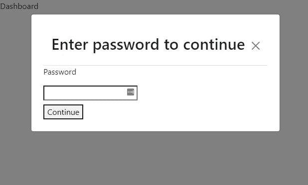

# React 应用程序中的用户重新认证。

> 原文：<https://levelup.gitconnected.com/user-re-authentication-in-your-web-app-b11b98faa1f8>

一种在用户闲置一段时间后对其进行认证的方法。



# 介绍…

增强应用安全性的方法之一是在必要时对用户进行重新认证。在本指南中，我们将使用`react-idle-timer`库在前端应用程序上实现一个重新认证特性，以检测用户何时空闲了一段时间。对于本指南，认证设置将只是`localStorage`。

**React-idle-timer** 是一个 javascript 库，用于检测和监控 web 应用程序上的用户活动。我们将把它用于这个应用程序，运行`yarn add react-idle-timer`安装在你的回购。

# 应用程序。

我们的 Nextjs 应用程序将有 2 个页面，即`login.js`和`index.js`。`login.js`将包含登录视图和逻辑，而`index.js`将包含我们的“仪表板”屏幕和重新授权逻辑。

在`login.js`中，我们将创建一个简单的登录表单和一个登录函数，将一个随机令牌保存到`localStorage`并重定向到我们的`index.js`页面。

*在本指南中，只有表单按钮是真正有效的，但要确保您的表单输入在您的应用程序中也是有效的。*

接下来是我们的`index.js`页面，在这里实现了重新认证特性。

我们从`react-idle-timer`导入`useIdleTimer`钩子，并在一些属性中调用它。

```
const { isIdle } = useIdleTimer({onIdle,timeout: 15000});
```

我们经过两处房产。

1.  onIdle:当用户空闲一段时间后调用的函数。
2.  超时:一段不活动的时间(以毫秒为单位),在此之后我们的用户被声明为空闲(调用 onIdle)。在本指南中，我们将超时设置为 15 秒，但在实际应用中，超时时间可能是 15-30 分钟

`useIdleTimer` *接受其他属性，如 onActive、crossTab、startManually 等。但是为了本指南的目的和简单性，我们将只讨论两个属性。*

最后，在我们的`index.js`文件中，我们创建了一个模型，当用户空闲时，该模型变得可见，并且用户输入他们的密码来重新验证他们自己。如果关闭模态或重新加载页面，则调用`logout`函数。

我们已经通过一种简单的方法在您的 web 应用中实现了重新认证。你应该查看一下 [react-idle-timer 文档](https://idletimer.dev/)以获得更多信息和用例。

编码快乐！