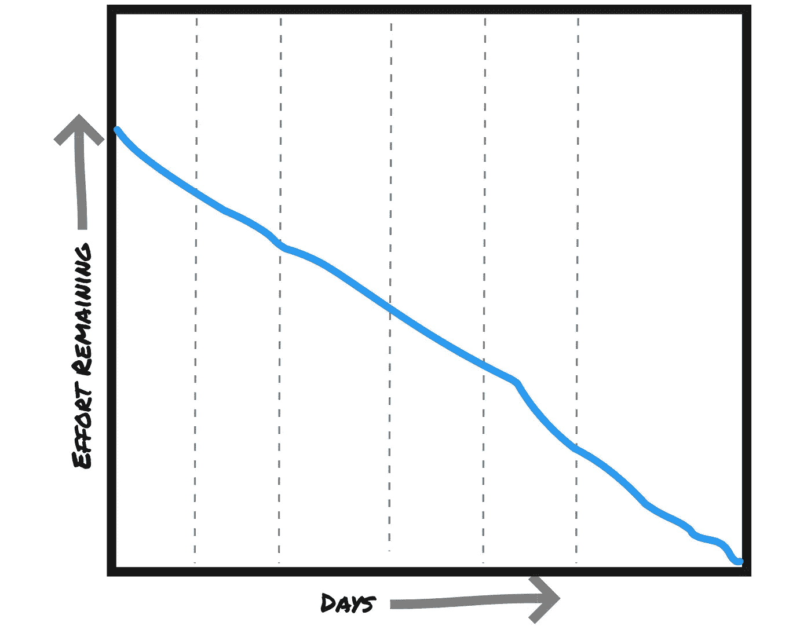
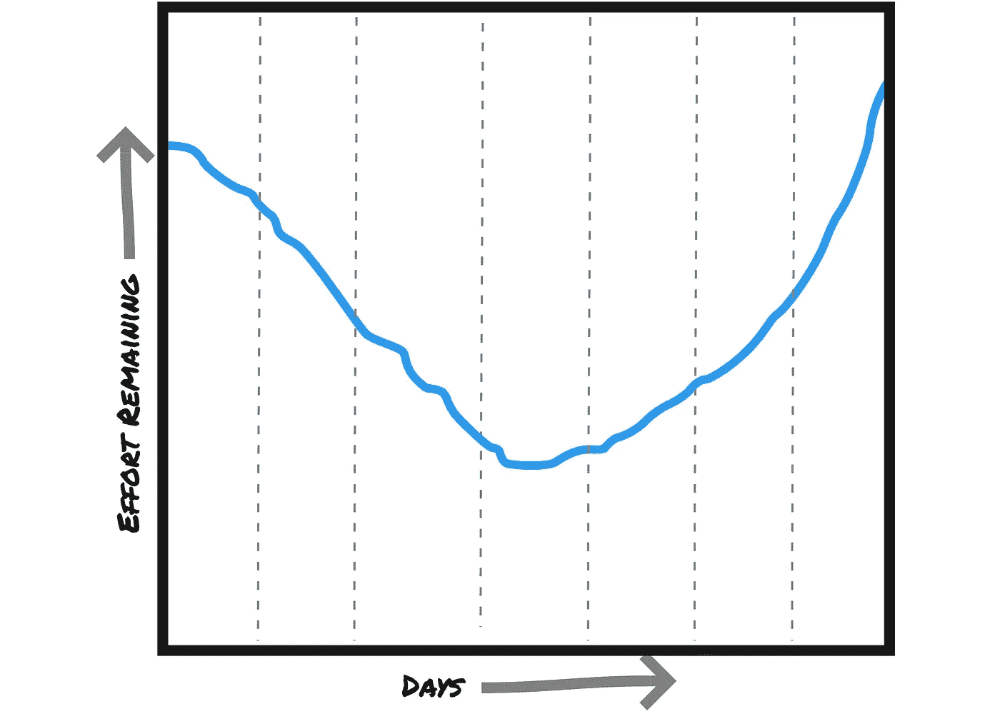
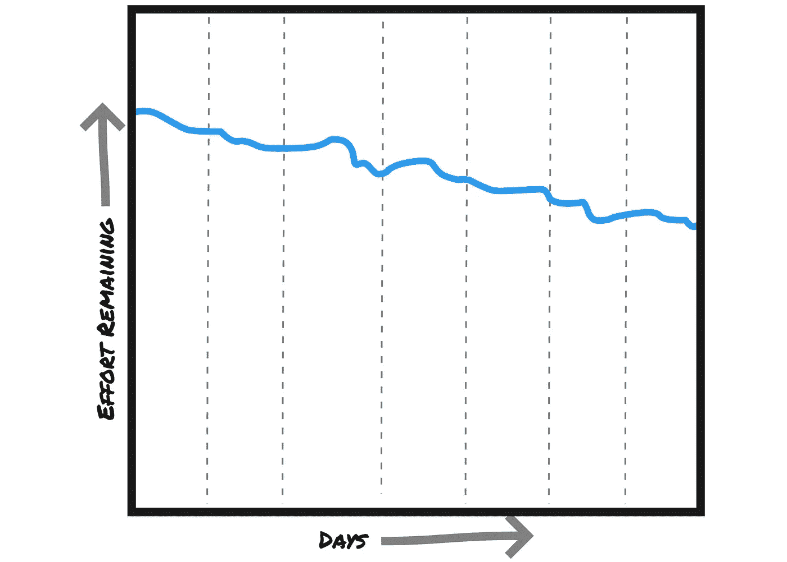
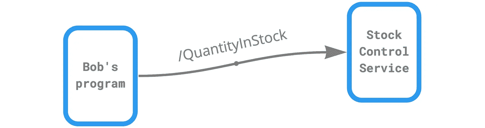

# 为什么开发人员似乎总是得到错误的估计…你能做些什么

> 原文：<https://levelup.gitconnected.com/user-story-estimates-burndown-always-wrong-96bd267ffb9f>


你的燃尽图看起来是可疑的 V 型吗？[图片由[Oliver SJ strm 拍摄，](https://unsplash.com/@ollivves?utm_source=medium&utm_medium=referral)由我裁剪]

在冲刺阶段，剩余的工作量似乎总是*上升*而不是下降？很多团队都会遇到这种情况，原因几乎都是一样的。

经典的(尽管经常被误解和误用)[燃尽图](https://en.wikipedia.org/wiki/Burn_down_chart)代表了当前冲刺阶段剩余努力的累计。在任何冲刺的开始，它看起来都很乐观:



啊，梦想是建立在什么东西上的——每个人都期待冲刺如何结束

但是在每次冲刺结束时，现实往往看起来更像这样:



冲刺到底进行得如何

如果这就是你在你的项目中所看到的，那就有一个很好的理由，而且——幸运的是——也是一个简单的解决方案。(提示:与运气无关！)

当然，开发人员因低估完成某件事情所需的时间而臭名昭著。霍夫施塔特定律很难摆脱，项目经理通常会将他们的估计翻倍来减轻这一点。

但是这里发生了别的事情。如果问题仅仅是单个任务花费的时间比预期的长，燃尽图就不会燃烧然后恢复。相反，您会看到类似这样的内容:



如果估计是欠火候，它甚至勉强烧毁…

每项任务花费的时间都比预期的要长，所以到冲刺阶段结束时，只完成了几项任务。剩余的努力会慢慢减少，永远不会达到 0。但是仍然没有烧完。

然而，这个 V 形图是许多项目中经常出现的模式，一个接一个的冲刺。但是为什么呢？

# 为什么我的燃尽图在每次冲刺中途又开始燃烧？

敏捷团队通常围绕故事来计划软件特性的交付。这里有一个相当典型的例子:

> 作为一名库存管理员，我想查看特定 SKU 中有多少商品可供运输，这样我就可以回复查询和预订。

没什么可做的，但这是重点。细节将在以后，在相关开发人员和业务知识的保管者(产品所有者、客户、BA、领域专家等)之间的未来对话中出现。

这本身就是一个问题，因为这意味着开发人员必须在不清楚自己要做什么的情况下开始工作。当他们最终获得细节时，这是一个巨大的惊喜，事实证明有比任何人预期的更多的工作。

如果团队使用[行为驱动开发](https://medium.com/@aparna.gopalakrishnan/https-medium-com-aparna-small-things-about-bdd-a08b8196733) (BDD)将故事扩展到测试场景中，*和*他们在开始设计和编码之前就这么做了，那么这是朝着正确方向迈出的一步…但这也不是完整的答案。

这种对测试场景的探索与领域专家、测试人员和至少一个开发人员一起工作效果最好。由此产生的场景往往是面向目标的:

```
**Feature:** Show number of items in stock for SKU **Background:**
    **Given** the user is logged in **Scenario:** product has items in stock
    **Given** a product "AA1234" with 5 items in stock
     **When** the user requests a stock check for SKU "AA1234"
     **Then** 5 is returned
```

看起来很简单…实现它的代码可能比规范中的代码要少。一个开发人员(让我们称他为 Bob)估计这是一个快速简单的故事点。开始编码吧！

> 但是…

在编写代码时，Bob 意识到库存检查必须在不同的微服务中进行，这是由不同的团队开发的。不过不用担心，这只是一个简单的 REST API 调用:



所需的 API 端点还不存在，所以 Bob 与`Stock Control Service`团队讨论并就 API 路径、数据模式等达成一致。与此同时，Bob 创建了一个存根端点来进行测试，并记下稍后添加一个集成测试，这样就涵盖了全部内容。

没有灾难，但仍然，这已经变成了一个 3 分球。🤔

几天后，`Stock Control Service`团队提供了新 API 端点的细节。哦，等等，它并不总是返回股票数量。有时它会返回 404，表示没有找到 SKU。

不仅如此。有时它会返回一个“临时”数量，表示一些库存已经被保留，但可能会在几分钟后释放。库存管理员也想看到这个附加值吗？

诸如此类……每次发现新的复杂性，剩下的故事点(和未解决的问题)的数量不降反升。冲刺开始有这样的感觉:


照片:[威利安·贾斯丁·德·瓦斯康塞洛斯](https://unsplash.com/@willianjusten?utm_source=medium&utm_medium=referral)

那么，一个团队要做什么呢？

所有这些不愉快的经历都是在开发过程中发现的。所以你可能想通过在代码被设计和编写之前发现它们来抢占先机。俗话说，空谈不值钱。

> 在你开始讲述每一个故事之前，把它扩展成场景，集中在“不愉快的道路”上

正是这种对不愉快路径的强调——从商业角度来看，可能出错或结果不同的事情——造成了差异。

听起来很明显，当它被这样放的时候。当然，不能期望团队有预知能力，预测不可预料的事情…但是如果允许(甚至鼓励)他们花时间深入探索业务规则和事件，并将它们组织成结构化的场景，那么会令人惊讶地发现许多“不可预料的”结果。

为了说明这是如何工作的，让我们重新看一下这个例子。

# 擦除和倒带

Bob 与来自`Stock Control Service`团队、BA、测试中开发人员等的某人一起，都花了半个小时左右的时间与领域专家一起将故事扩展到*至少*一条快乐的路，以及他们能想到的尽可能多的不快乐的路:

```
SKU doesn’t exist 😦Inventory clerk doesn’t belong to the right role 😦No items available 😦Provisional quantity is different from actual quantity in stock 😦Items are perishable — only include items in date, and flag others for removal 😦Several items available 😃
```

当您有领域专家在场时，请抓住机会捕捉每个场景的预期结果:

```
SKU doesn’t exist ▶ *user is taken back to product selection screen*Inventory clerk doesn’t belong to the right role ▶ *query fails*No items available ▶ *result shows as 0*Provisional quantity is different from quantity ▶ *add them together*
```

…等等(你明白了)。

额外的好处是，您消除了猜测(“应该发生什么？”)当开发人员稍后实现这些场景时。你让领域专家和产品所有者积极地思考他们希望他们的新产品如何表现。

当你把这些增强的场景变成 BDD 风格的`Given` / `When` / `Then`测试时，左边的场景是`When`，右边的期望结果是`Then`——每个场景的接受标准:

```
**Feature:** Show number of items in stock for SKU **Background:**
    **Given** the user is logged in **Scenario:** Product SKU doesn't exist 😦
    **When** the user requests a stock check for SKU "AAAAA"
    **Then** user is taken back to product selection screen
```

对每一条不愉快的路径都这样做可以确保在团队开始编码之前— **和他们提供工作评估之前**详细考虑故事行为。

询问搜索性的问题通常可以发现遗漏的故事，或者导致在编写任何代码之前就改变设计。

但是不要就此打住…

# 在你开始编码之前，也要探索技术上不愉快的道路

到目前为止，我们已经查看了业务级别的场景。稍后，当你(作为一名开发人员)在键盘前，或者与你的冷静的开发团队成员一起用白板演示设计时，尽可能多地定义你所能想到的*技术层面的*不愉快路径是值得的。您通常会将这些定义为[组件测试](/write-tests-at-three-levels-909561a9544b)场景。

想想什么会出错，把每一条都定义为一条不愉快的道路。那就再考虑一下。头脑风暴，事件风暴，谷仓风暴…不遗余力地探索潜在的失败，并交替快乐的道路。

> 👉我已经写了更多关于这个过程的[组件测试部分。请将其视为本文的第 2 部分…](https://codeburst.io/component-tests-vs-unit-tests-tdd-71b921d48907)

# 所以总而言之

开发人员低估故事和任务可能还有其他原因，但是在正确的时间缺乏正确的信息是主要原因。

如果您按照我在本文中描述的步骤，一次一个用户故事，您应该会注意到真正的不同。

这个想法是你尽可能地在项目生命周期的“左边”识别和说明潜在的失败[。虫子越往右边被抓，代价就越大。](https://www.stickyminds.com/article/shift-left-approach-software-testing)

> 无论你是在做一个超级敏捷的、一次一个故事的、一周冲刺的 CI 项目，还是一个稳定的瀑布项目，这个原则都适用。

因此，团队已经探索了他们下一个故事的场景，并且已经开发了原型设计来揭示更多的场景，准备好你的下一个 sprint 的燃尽图表现得更像这样:


尼古拉·伯恩森的照片(由我剪辑)

*我所描述的 BDD 的“专门化”来自* [*面向领域的测试*](https://www.domainorientedtesting.com/)*(DOT)——今年某个时候出版。如果你有兴趣，一定要在 LinkedIn* *上* [*加入点点群。*](https://www.linkedin.com/groups/13804489/)