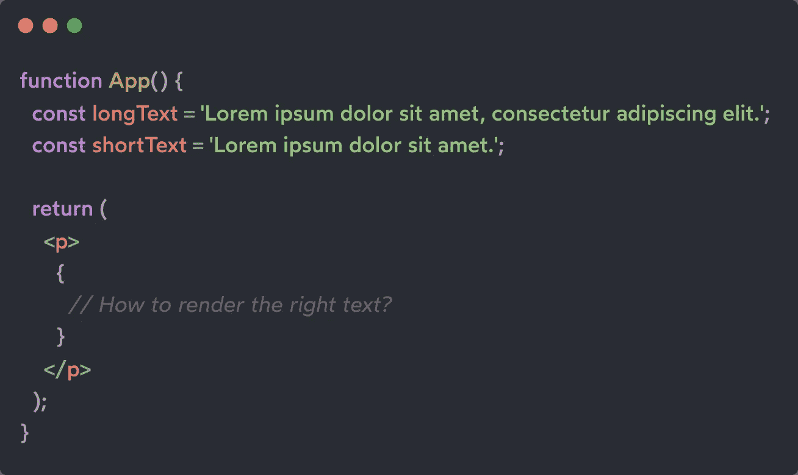
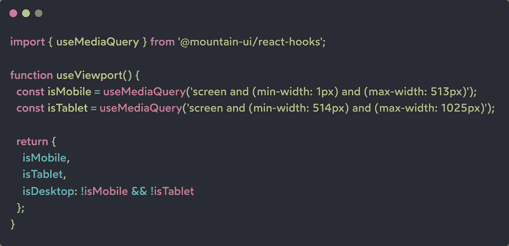
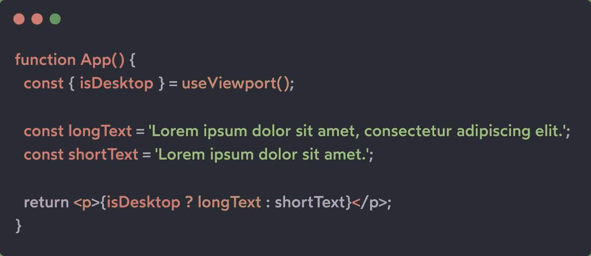

# 使用视口自定义挂钩

> 原文：<https://levelup.gitconnected.com/useviewport-custom-hook-575f385fdf9e>

## 一个简单的自定义钩子来访问屏幕尺寸类型。有用的获取 isMobile，isTablet 和 isDesktop 布尔值。

以赛亚·贝克斯在 [Unsplash](https://unsplash.com?utm_source=medium&utm_medium=referral) 上的照片

## 为什么我们需要关于视窗的信息？

使用 web 应用程序，我们希望为页面用户提供最佳体验。这意味着要认识到在桌面模式下呈现一个元素是否比在移动设备上更好，反之亦然。

[CSS 媒体查询](https://developer.mozilla.org/en-US/docs/Web/CSS/Media_Queries/Using_media_queries)非常擅长处理这些场景，帮助根据屏幕大小应用合适的样式。

但是有时，为了在不同的视窗上呈现正确的内容，我们需要使用 JavaScript 在脚本级别管理这个逻辑。

一个简单的例子是根据屏幕大小呈现不同的文本:

幸运的是，React 自定义挂钩“useMediaQuery”有助于实现这一目的，它提供了从 React 编写的组件直接访问媒体查询结果的功能。

## 那我为什么需要 useViewport？

“useMediaQuery”自定义挂钩对于检索传递的媒体查询的布尔值非常有用，但是当在代码库中多次使用它时，它可能会使代码变得有点不可读和难以理解。

这就是为什么，利用钩子的可组合性，我们可以将这种重复的逻辑抽象成“useViewport”自定义钩子。

## useViewport 技术实现

React 开发人员通常使用一些布尔标志来了解当前设备是否具有典型的移动、平板或桌面视口大小。

这意味着我们的定制钩子必须至少返回这三个值，我们将记为:

*   **isMobile**
*   **istatable t**
*   **isDesktop**

在这个实现中，我使用 [useMediaQuery 钩子](https://github.com/tonyghiani/mountain-ui/blob/master/packages/react-hooks/src/useMediaQuery/useMediaQuery.ts)来检索设备是移动设备还是平板设备，并且使用这两个布尔值，我可以直接将所有其他设备分类为桌面模式。

显然，您可以为您的应用程序定义您喜欢的媒体断点，实现中使用的那些只是可能传递媒体查询以使用 media query 的示例。

## 包扎

现在我们已经准备好了钩子，我们终于可以完成之前未完成的用例实现了:

