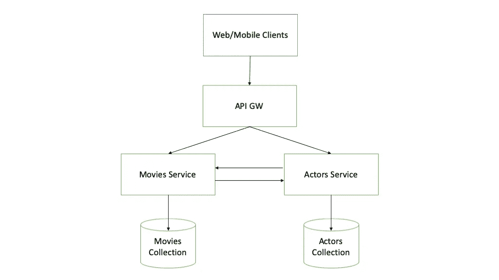
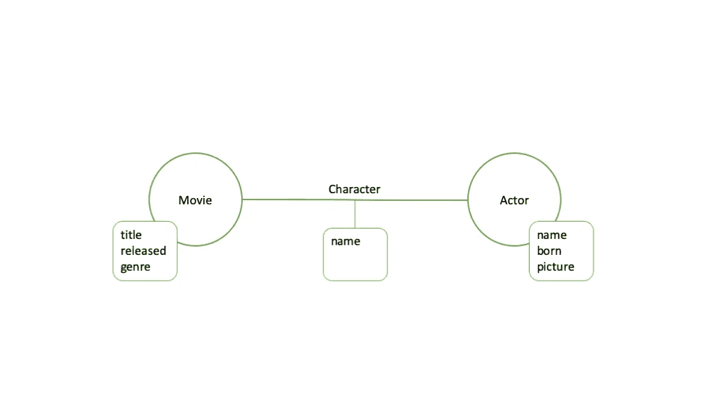

# 通过微服务使用图形数据库

> 原文：<https://levelup.gitconnected.com/using-a-graph-database-with-microservices-1029a8d28d03>

[微服务架构](https://martinfowler.com/articles/microservices.html)不需要介绍。近年来，它已被不同领域和规模的许多公司广泛采用。一些公司已经重新设计了他们的整体架构，并将其分解为微服务，而其他公司则从头开始构建纯微服务架构。

无论如何，一个真正的微服务平台需要每个服务对自己的数据负责(也称为隔离持久化或分散化数据管理)。这个概念是通过[每个服务一个数据库的模式](https://microservices.io/patterns/data/database-per-service.html)实现的，这意味着每个微服务都应该有自己的私有数据库实例、集合或表，不与其他服务共享。

如果我们允许微服务之间的数据库共享，这意味着我们的数据模型由多个服务管理，很难保证一致性和不变性。所有其他服务要么通过负责服务的 API 请求数据，要么保存一个只读的非规范(可能是物化的)副本。

现在，让我们从一个虚构的例子开始，它经常在图形数据库的上下文中使用。在我们的数据模型中，我们有电影和演员，我们想要描述它们之间的关系:对于每部电影，我们想要知道演员阵容，对于每个演员，我们想要知道他们的电影记录。这是一个简化版的在线互联网电影数据库，也就是众所周知的 IMDb.com。此外，为了简单起见，我们将只存储每部电影的标题，类型和发行年份。同样，对于演员，我们将存储他们的姓名、图片网址和出生年份。此外，我们还希望存储每个演员在每部电影中扮演的角色的名称。

有了这个简单的数据模型，我们的微服务架构就一目了然了。我们大概需要一个管理电影的微服务，一个管理演员的微服务。按照前面介绍的数据库服务前模式，我们将需要电影的数据库集合和演员的单独集合。如果我们选择一个文档数据库(如 MongoDB 或 Couchbase)，我们的电影数据模型将如下所示:

```
{ “id”: “m1”, “title”: “The Matrix”, “released”: 1999, “genre”: “Sci-Fi”, “actors”: [{ “actor_id”: “a1”, “actor_name”: “Keanu Reeves”, “character”: “Neo” }, { “actor_id”: “a2”, “actor_name”: “Laurence Fishburne”, “character”: “Morpheus” }, { “actor_id”: “a3”, “actor_name”: “Carrie-Anne Moss”, “character”: “Trinity” }]}
```

对于演员来说:

```
{ “id”: “a1”, “name”: “Keanu Reeves”, “born”: 1964, “picture”: “http://www.media.com/actors/keanu_reeves.jpg”, “movies”: [{ “movie_id”: “m1”, “title”: “The Matrix”, “character”: “Neo” }, { “movie_id”: “m2”, “title”: “The Matrix Reloaded”, “character”: “Neo” }, { “movie_id”: “m3”, “title”: “The Matrix Revolutions”, “character”: “Neo” }]}
```

在这个例子中，我们使用一种“外键”来引用电影和演员，反之亦然。当我们想要获取特定电影或演员的完整数据时，这个键会很有用。我们还在电影文档中保存演员姓名，在演员姓名中保存电影名称。主要动机是保持这些文档的可读性，但它也有助于在不需要查询多个服务/集合的情况下生成快速视图。不利的一面是，我们存储相同数据的多个副本，但这不是问题，因为这些数据是不可变的。另一个有趣的观察是，角色名字既不是电影的属性，也不是演员。它实际上是电影演员关系的一个属性。在这个数据模型中，它作为嵌入文档保存在电影和演员中。



微服务架构

现在我们已经定义了数据模型和微服务，让我们看一些用例。

在第一个用例中，我们应该显示一个简单的电影视图，包括标题、发行年份、类型和演员(演员和角色名)。让我们假设我们已经知道电影 ID(例如，我们在搜索结果中得到一个链接)。这个用例的实现很容易。客户端应用程序需要使用电影 ID 调用电影服务。movies 服务需要从数据库中执行一次读取，并以 JSON 对象的形式返回包含所有必需数据的电影文档。

很好，但是如果我们还需要显示每个演员的照片呢？这里稍微复杂一点，因为图片 URL 没有存储在电影文档中。我们可以想出几个解决这个问题的办法:

1.  将图片 URL 添加到电影文档中的演员引用。这个解决方案可以工作，但是它有两个主要的缺点:(a)每次我们更新演员的图片(假设它是一个不同的 URL)，我们需要更新演员记录中的所有引用；以及(b)我们需要显示的关于每个演员的数据越多，我们需要复制的数据就越多。如果在我们已经填充了数据库之后引入这样的需求，会发生什么？
2.  让客户端应用程序通过从 actors 服务获取每个 actors 的数据来处理它。显然，我们可以看到，这种方法的基本实现将在客户端和后端之间添加许多 API 调用。如果我们向 actors 服务添加一个端点，该端点将接收一个 actor IDs 列表，而不是每次调用只接收一个，那么这种方法的效率可以得到提高。然而，actors 服务需要从数据库中获取所有这些文档，并将它们发送回客户端。
3.  通过将这个逻辑添加到电影服务中，让后端来处理它。使用这种方法，movies 服务调用 actors 服务，获取额外的数据(在本例中是图片 URL ),并将其组合到响应中。正如前面的解决方案(2)中所建议的，可以通过在单个调用中获取多个参与者的数据来进行改进。缺点是，现在我们引入了电影和演员服务之间的依赖关系。

现在让我们看一个更复杂的用例。在这个用例中，我们想要为一个特定的演员找到在同一部电影中与她或他一起演出的所有其他演员。如何才能实现这一要求？基本的方法是首先查询 actors 服务，并获得原演员出演的所有电影的列表。然后，我们需要查询电影服务，并获得在这些电影中扮演的所有独特演员(没有重复)的列表。如果我们想要他们的照片或任何其他不在电影服务中的数据，我们最终需要再次查询演员服务以获得他们的详细信息。是的，它可以工作，但是有更有效的方法吗？对于任何处理关系数据库的人来说，答案很简单:SQL。

的确，有了 SQL，我们可以将这种逻辑从服务层转移到数据库层，并高效地运行一个 SQL 查询来获得结果。但在此之前，我们需要将数据重组为关系数据模型。不涉及太多细节，上面介绍的基本数据模型需要 3 个表:电影、演员和角色(演员-电影关系)。在这个阶段，我们已经可以看到，我们可能有一个数据所有权的问题。谁拥有字符表？是电影服务、演员服务，还是我们应该添加第三个微服务？即使我们解决了这个问题，我们仍然希望对 3 个表运行单个 SQL 查询(使用 SQL join)。这将打破数据隔离的概念，因为单个服务需要访问属于其他服务的表。这不是我们选择关系数据库必须付出的唯一代价。这也意味着我们应该坚持严格的数据模式，当这些表的大小超过一定限制时，我们可能会遇到规模问题。随着我们向数据模型中添加更多的实体和关系(例如导演、作者、评论)，表的数量将会增加。

图形数据库，顾名思义，是一个(NoSQL)数据库，使用图形数据模型进行语义查询。图形数据模型是指由节点和连接它们的边(即关系)组成的结构。图形数据库的主要优点是它以自然和有效的方式存储图形数据模型。正如我们前面看到的，试图在文档或关系数据库中表示图形数据模型可能会变得很麻烦，因为它需要大量的副本(文档)或表(关系)。有了图形数据库，我们不需要担心图形模型的表示，因为数据库会为我们处理它。



图形模型

我们如何为我们的模型使用图形数据库？这很简单。我们需要 2 个节点类型:电影和演员。我们需要电影和演员之间的关系。姑且称之为性格(即角色)。电影节点将具有以下属性:标题、发行年份和流派。Actor 节点将具有以下属性:名称、出生年份和图片。字符边缘将具有属性名称。这就是我们所需要的。图形数据库使得快速找到给定节点的所有邻居变得容易。因此，找到电影中的所有演员或演员出演的所有电影是很容易的。此外，当我们需要查找同一部电影中的演员时，对 graph DB 的简单查询将返回唯一的结果。我们只需要从一个特定的 Actor 节点开始，然后寻找通过一个电影节点和两个角色边连接起来的其他 Actor(我们不会在本文中详细讨论查询语法，因为这是 graph DB 供应商特有的)。

一旦我们意识到图形数据库将与我们的数据模型完美匹配，就该重新设计我们的微服务了。以前我们有 2 个微服务:电影和演员。但是，我们如何管理图形数据库中的数据所有权呢？它没有任何集合或表，所以我们可以尝试基于节点类型来拆分它。当然，电影服务将拥有电影节点，演员服务将拥有演员节点。有道理，但是谁拥有角色关系？我们需要第三方服务吗？还是由电影和演员共享？这就是我们的数据所有权概念开始打破的地方。想想查询…许多查询会返回不同类型的节点。例如，如果我们寻找在某部电影中演出的所有演员。我们从一个电影节点开始，寻找演员节点。如果这个查询由 movies 服务执行，它将需要访问 Actor 节点，反之亦然。如果我们想要充分利用每个节点可以连接到任何其他节点的图模型，我们将失去管理数据所有权和微服务之间隔离的能力。

不幸的是，这个问题没有干净的解决方案。似乎在图形数据库模型和每个服务一个数据库的模式之间有一个内在的矛盾。一种选择是抛弃这种模式，允许微服务之间的数据共享。我们仍然应该确保每个节点类型都是由单个服务创建和修改的，但是其他服务可以读取它。这可能是一个合理的妥协。另一个解决方案是实现一个单独的微服务来管理图表。该服务将为所有其他服务提供对图形数据库的独占访问。图形服务将管理整个数据模型，并负责对图形数据库的任何读取和写入。这种方法没有提供真正的数据隔离，但是它防止了两个不同的微服务访问数据库中相同数据实体的风险。

总之，我们讨论了使用图形数据库的优势，特别是对于基于图形的数据模型。然而，在微服务架构的上下文中使用图形数据库在数据所有权和隔离方面具有挑战性。为了充分利用图形数据库的功能，我们可能需要对微服务指南进行调整。