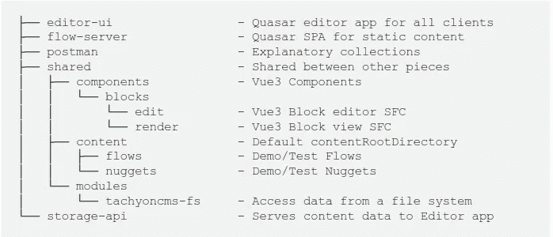

# 使用单边回购增加共享

> 原文：<https://levelup.gitconnected.com/using-a-monorepo-to-increase-sharing-8dc68e3d838a>

本文介绍了如何将 TachyonCMS 代码组织成一个 monorepo，以及如何最大限度地重用。目标是让开发更顺利，但当然也有取舍。



期望的 Monrepo 结构

我会把这三个回购合并成一个新的单一回购。

流量服务器—[https://github.com/TachyonCMS/flow-server](https://github.com/TachyonCMS/flow-server)
桌面编辑器—[https://github.com/TachyonCMS/desktop-editor](https://github.com/TachyonCMS/desktop-editor)
存储 API—[https://github.com/TachyonCMS/storage-api](https://github.com/TachyonCMS/storage-api)

# 新回购

[https://github.com/TachyonCMS/tachyoncms](https://github.com/TachyonCMS/tachyoncms)

# 优势

*   更容易在服务之间共享代码
*   只有一个地方可以找到代码

# 不足之处

*   最小公分母
*   噪音

当不同部分共享代码时，单一回购最有价值。越来越多的分享意味着越来越多的依赖，走在前沿会加剧这个问题。解决这些依赖会迫使你妥协。

示例:

*   Quasar 2 在纱线 2 下断裂，所以我们必须坚持使用纱线 1。
*   电子在输入`fs-extra`时断裂，所以我们必须坚持使用`fs`

# 步骤 1:创建新的回购协议

你可以使用任何手段来做到这一点。我使用了 [GitHub web 界面](https://github.com/)来创建 [TachyonCMS mono repo](https://github.com/TachyonCMS/tachyoncms) 。

# 第二步:检查回购

```
git clone [git@github.com](mailto:git@github.com):TachyonCMS/tachyoncms.git
```

# 步骤 3:定义新的目录结构

这是我们希望 mono repo 的根目录中的目录结构。

```
├── editor-ui                 - Quasar editor app for all clients
├── flow-server               - Quasar SPA for static content
├── postman                   - Explanatory collections
├── shared                    - Shared between other pieces
│   ├── components            - Vue3 Components
│   │   └── blocks            
│   │       └── edit          - Vue3 Block editor SFC
│   │       └── render        - Vue3 Block view SFC
│   ├── content               - Default contentRootDirectory
│   │   ├── flows             - Demo/Test Flows
│   │   └── nuggets           - Demo/Test Nuggets
│   └── modules
│       └── tachyoncms-fs     - Access data from a file system       
└── storage-api               - Serves content data to Editor app
```

# 步骤 4:将代码移入单声道回购程序

我们不会复制代码的本地版本，而是从 GitHub 中为每一个版本检查干净的副本。

将每个 repo 中所需的分支克隆到 mono repo 中所需的目录中。您可以像我为`editor-ui`所做的那样定义目标目录名，或者像我为`flow-server`所做的那样接受回购名称

```
git clone --depth=1 --branch=web-app [git@github.com](mailto:git@github.com):TachyonCMS/desktop-editor.git editor-uigit clone --depth=1 --branch=main [git@github.com](mailto:git@github.com):TachyonCMS/flow-server.git git clone --depth=1 --branch=main [git@github.com](mailto:git@github.com):TachyonCMS/storage-api.git
```

移除`.git`文件夹，这样它们就不会和主文件夹冲突了。

```
rm -rf ./editor-ui/.git
rm -rf ./flow-server/.git
rm -rf ./storage-api/.git
```

存储 API 被拆分。

*   文件系统库成为了`tachyoncm-fs`根目录的主要工件。
*   “routes”和“server”文件应该只将调用路由到适当的`tachyon-cms`方法。我们希望避免在其中添加业务逻辑，因为该逻辑可能需要由使用该模块的**任何东西**来实现，所以该功能应该是文件系统模块的一部分。即一个路由不应该调用两个函数。

来自旧的`desktop-client`的块编辑器和渲染器代码被移动到`shared`目录，以便完全相同的文件可以在 TachyonCMS 编辑器应用和流服务器应用中使用，以及在任何未来的代码中使用。

# 第五步:使用单一回购

`shared`目录中的代码被其他多段代码访问。

# 超光速粒子

TachyonCMS-FS 允许管理存储在本地驱动器上的 TachyonCMS 数据文件。这由电子编辑器 UI 和 REST 存储 API 使用。

这个相同的文件系统模块将被需要操作数据的 Websocket 存储 API 和脚本使用。

# 渲染和编辑块

编辑器应用程序和流服务器中都使用渲染块。想要管理或显示块数据的其他软件可以重用它们。

# 内容

我们提供共享内容目录。为了演示的目的，这里已经预先填充了一些数据，在每次测试运行期间，都会从这里写入和删除新的文件。

# 何时不使用单向回购？

我也就此写了一篇文章。