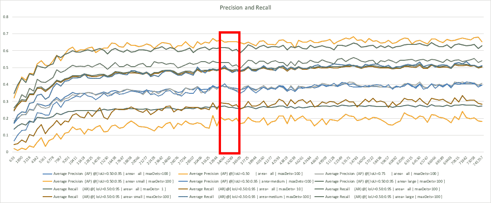

# 使用 alwaysAI 构建自己的车牌检测模型

> 原文：<https://levelup.gitconnected.com/using-alwaysai-to-build-your-own-license-plate-detection-model-5914c8b2068>


车牌检测模型的输出示例。

在本教程中，我们将介绍创建'**always ai/vehicle _ license _ mobilenet _ SSD**'模型的步骤和决策点，这是一个用于识别车辆和牌照的对象检测模型。

在 alwaysAI，我们希望所有开发人员都能使用计算机视觉。计算机视觉中更具挑战性的部分之一是模型训练。本教程的目的是详细概述如何使用 alwaysAI 模型训练工具快速轻松地训练自定义模型，从数据收集开始，到测试模型的性能结束，包括模型训练的一些提示和技巧。

关于模型训练的一般信息，请查看这篇文章:[计算机视觉模型训练简介](https://alwaysai.co/blog/introduction-to-computer-vision-model-training?&utm_campaign=Open%20Beta&utm_source=aai_blog&utm_content=making_license_plate_model)。

如果你想加入我们的模特训练测试计划，训练你自己的模特，你可以填写[这个简短的调查](https://alwaysai.surveykiwi.com/model-training-signup)来报名！

# 车牌模型介绍

开发该模型的目的是使其足够通用，能够检测美国和欧洲的车牌，并应用于一些现场使用案例，包括仪表板摄像机和静态交通摄像机:

*   十字路口
*   天桥
*   停车场
*   商店或房屋正面

该模型检测四轮车辆，包括

*   轿子
*   卡车
*   公共汽车

# 数据收集

我们从支持上述期望用例的不同角度收集数据。这包括来自高速公路立交桥、高角度街景、低角度街景、停车库和停车场的图像。我们的目标是从尽可能多的角度和距离捕捉代表可读板的图像。下面是一些包含图片的例子。


大多数数据最初是作为视频收集的，然后从视频中对单个帧进行采样。

拥有大量非常相似的图像不会增强模型的性能，因此我们对所有收集的数据进行了采样，以确保输入数据足够多样。对于照片，这仅仅意味着排除太相似的个别照片。对于视频，需要做更多的工作。首先，这些视频在 QuickTime Player 等应用程序中进行编辑，以删除视频中大量不可用的部分，如死画面或没有汽车的镜头等。一旦视频被清理了一点，它们就被使用 [ffmpeg](https://ffmpeg.org/) 采样。

使用的命令是

```
ffmpeg -i movie_name.mov -r 2 -q:v 1 image_name_%4d.png
```

该命令每秒采样 2 帧(用'-r 2 ')并使用最高质量(用'-q:v 1 ')保存为 png，png 使用无损压缩(而不是 jpg)。

一旦视频被采样，产生的图像被手动扫描，以消除近似重复或不包含感兴趣的对象的帧。

我们还创建了一个数据收集入门应用程序，使您能够使用 edge 设备收集数据并执行简单的采样，该应用程序可供模型培训测试版用户使用。如上所述，您可以使用“ffmpeg”来执行更高级的采样。

# 数据注释

计算机视觉注释工具( [CVAT](https://github.com/opencv/cvat) )用于执行数据注释，使用 alwaysAI CLI 注释工具，可通过“aai annotate”访问。使用 CVAT，在给定时间可以上传的数据量是有限制的，所以注释是成批完成的，注释集后来被合并，我们将在本文后面介绍。对于每个任务(每个任务包含大约 40-100 张图片)，标签保持不变。

最初，我们使用“汽车”和“牌照”的标签，但是我们决定“车辆”更适合一般的模型，而“牌照”可以避免路上空白的问题。CVAT 的一个有用的特性是，你可以作为超级用户登录，导航到'[管理](https://github.com/opencv/cvat/blob/develop/cvat/apps/documentation/user_guide.md#administration-panel)面板，并随时修改注释任务的标签！

当一系列图像包含相同的标注对象时，使用[插值模式](https://github.com/opencv/cvat/blob/develop/cvat/apps/documentation/user_guide.md#track-mode-basics)；此模式使注释能够从一帧持续到下一帧，从而显著减少了注释数据集所需的时间。

注意:CVAT 不会自动保存你的工作，所以记得经常保存！

CVAT 支持多种注释格式，但 alwaysAI 目前只使用 PASCAL VOC 格式。


以 PASCAL VOC 格式导出数据集的例子。

# 要注释什么

总的来说，我们选择注释任何可识别的牌照和车辆，并在它们周围画一个方框。偶尔，这意味着注释没有牌照的车辆或注释部分被遮挡的车辆，尽管我们试图尽可能地限制这些情况。如果图像的一部分清楚地代表了我们想要检测的对象，即使它非常小，我们也会对它进行注释。


# 合并注释

正如我们上面提到的，你可能无法一次上传所有的图片。因此，您最终会得到多个需要合并的导出数据集。如果您为训练传递多个文件，训练工具将自动合并您的数据集，但是，如果您希望仅使用一个数据集并简化训练命令，也可以使用 alwaysAI CLI 命令“aai dataset merge”轻松完成此操作。

```
aai dataset merge dataset1.zip dataset2.zip dataset3.zip
```

在上面的命令中，我们显示了三个数据集被合并，但是您可以根据需要指定尽可能多的数据集进行合并。

*注意:我们在合并直接从 CVAT 导出的“原始”注释集方面取得了最大的成功。如果您需要在不是从 CVAT 导出的数据集上进行训练，请先尝试压缩父注释目录中的单个文件夹(“Annotation”和“JPEGImages”)。然后尝试合并产生的压缩文件。*

# 训练模型

我们使用 alwaysAI 的 CLI 工具对模型进行了训练。该工具目前处于封闭测试阶段，我们正在快速迭代其特性和功能。关于培训功能的更多文档将很快发布。

*注:如果你有兴趣加入模联培训测试版，请填写此* [*简短调查*](https://alwaysai.surveykiwi.com/model-training-signup) *！*

目前，该工具可以通过使用 Tensorflow 1.14 在 COCO 数据集上训练的 mobilenet ssd 网络上使用迁移学习来训练对象检测模型。支持使用 CPU 或 GPU 进行训练，一旦完成，该模型立即与 alwaysAI 平台兼容。

我们最初使用个人笔记本电脑上的 CPU 训练模型，特别是 MacBook Pro。我们从批量大小 1 开始，增加到 16，这时笔记本电脑的内存就用完了。这很可能是在数据集中使用大图像的结果。我们决定对概念模型的验证使用 4 的批量大小，改变历元和训练图像的数量。一旦我们对模型的进展感到满意，我们就决定大幅增加纪元的数量。本次培训的规格和各种配置如下表所示，培训时间约为 20 小时。

五金器具

*注意:有更强大的 EC2 实例可用；我们可以将 GPU 的数量增加到 24 个，或者使用更强大的 Tesla V100 内核，但我们希望在更真实的机器上进行测试。*


用于创建牌照检测模型的训练配置。

# 分析模型性能


车牌检测模型的最终性能指标(丢失和地图)

该模型的最终统计数据表明，我们训练的步数超过了要求。对于损耗图，你可以看到一条相对平坦的长线。它上下波动，但肯定变平了。在精确度和召回率的图表中，我突出显示了趋势停止上升的区域。似乎我们可以在大约 35k 步时停止训练，并获得类似的结果。

这是培训课程的损失图表。x 轴表示步数，每 200 步绘制一次损耗。


损失与步骤

这是训练过程中输出的精度和召回统计数据。



映射和回忆与步骤

虽然图表显示了扁平化，但模型似乎并没有过度适应我们的数据集。这可以通过绘制验证损失来确认，这是我们即将实现的功能。我们最依赖的测试是对新数据的视觉测试，使用 alwaysAI 平台很容易执行，这是我们接下来要描述的。

使用 alwaysAI CLI 训练的模型可以使用发布

```
aai app publish <username/modelname>
```

发布模型后，您可以使用将其添加到应用程序中

```
aai app model add <username/modelname>
```

您还可以在本地测试它，而不用发布它，方法是使用

```
aai app model add --local-version <version>
```

我们希望测试模型的实时性能，因此我们修改了现有的 starter 应用程序，以使用文件流，并使用预先收集的视频来表示所需的用例。你可以在这个博客中看到这是如何做到的。

测试车牌检测器模型的一些示例输出如下所示:


# 后续步骤

要访问车牌检测器和许多其他预先训练的模型，注册一个免费的[帐户](https://alwaysai.co/auth?register=true?&utm_campaign=Open%20Beta&utm_source=medium&utm_content=making_license_plate_model)，立即开始使用计算机视觉。如果您有兴趣参加我们的模型训练封闭测试版，并训练您自己的对象检测模型，请填写[调查](https://alwaysai.surveykiwi.com/model-training-signup)进行报名！

您可以在这里找到创建'**alwaysai/vehicle _ license _ mobilenet _ SSD**'模型[中使用的数据集的子集，在这里](https://www.alwaysai.co/docs/_static/beta/dataset_sample_592.zip?&utm_campaign=Open%20Beta&utm_source=medium&utm_content=making_license_plate_model)找到更大的版本[，以及在](https://www.alwaysai.co/docs/_static/beta/dataset_sample_1186.zip?&utm_campaign=Open%20Beta&utm_source=medium&utm_content=making_license_plate_model) [GitHub](https://github.com/alwaysai/license-plate-detector) 上测试您的模型的相应车牌跟踪器应用程序的所有代码。

托德·格里德和谷嘉诚对本文的贡献