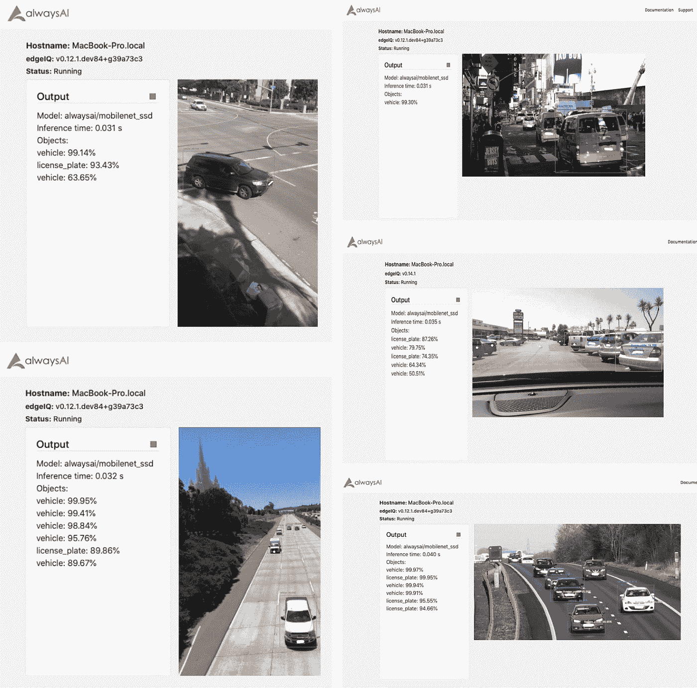
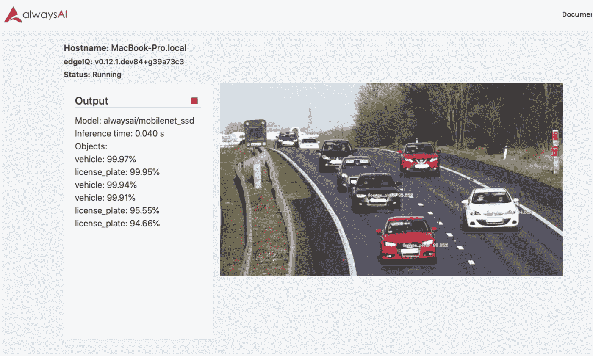

# 从头开始建立一个车牌追踪器

> 原文：<https://levelup.gitconnected.com/using-alwaysais-model-training-tool-to-build-a-license-plate-tracker-dd5f6185047a>



在本教程中，我们将介绍如何使用 alwaysAI 的模型训练工具创建的车牌检测模型来创建自己的车牌跟踪器。如果你想了解更多关于车牌检测模型是如何建立的，请阅读[这篇博客](https://alwaysai.co/blog/creating-a-license-plate-detection-model?&utm_campaign=Open%20Beta&utm_source=medium&utm_content=license_plate_tracker_sample)。要了解更多关于模特培训的信息，你可以阅读这篇[模特培训概述文章](https://alwaysai.co/blog/introduction-to-computer-vision-model-training?&utm_campaign=Open%20Beta&utm_source=medium&utm_content=license_plate_tracker_sample)。

模型训练工具将很快推出，但是如果您现在有兴趣训练自己的对象检测模型，您可以填写此[调查](https://alwaysai.surveykiwi.com/model-training-signup)来参加我们的模型训练测试计划。你可以使用一个免费的数据集来训练你自己的车牌检测模型，这里找到了[这里是](https://www.alwaysai.co/docs/_static/beta/dataset_sample_584.zip?&utm_campaign=Open%20Beta&utm_source=medium&utm_content=license_plate_tracker_sample)，185MB，由 584 个图像/注释对组成。然后，您可以使用我们将在本教程中构建的示例应用程序来测试您的新模型！本教程完成的代码，以及测试视频和数据集链接，可在 [GitHub](https://github.com/alwaysai/license-plate-detector) 上获得。

要完成本教程，您必须具备:

1.  一个 [alwaysAI 账号](https://alwaysai.co/auth?register=true?&utm_campaign=Open%20Beta&utm_source=medium&utm_content=license_plate_tracker_sample)(免费！)
2.  在您的机器上设置 alwaysAI(也是免费的)
3.  诸如 [sublime](https://www.sublimetext.com/) 之类的文本编辑器或者诸如 [PyCharm](https://www.jetbrains.com/pycharm/) 之类的 IDE，两者都提供免费版本，或者任何你喜欢的代码

该应用程序包括一些有用的功能，您可以将它们整合到您的其他项目中，即:

*   使用相关性跟踪器来减少开销
*   使用多个文件作为应用程序的输入
*   标记单个检测到的对象以提高可读性

请查看 alwaysAI [博客](https://alwaysai.co/blog?&utm_campaign=Open%20Beta&utm_source=medium&utm_content=license_plate_tracker_sample)了解更多关于[计算机视觉](https://alwaysai.co/blog/computer-vision-101?&utm_campaign=Open%20Beta&utm_source=medium&utm_content=license_plate_tracker_sample)、[开发模型](https://alwaysai.co/blog/computer-vision-application-lifecycles-explained? &utm_campaign=Open%20Beta&utm_source=medium&utm_content=license_plate_tracker_sample)、如何[改变模型](https://alwaysai.co/blog/change-computer-vision-models-alwaysai-platform?&utm_campaign=Open%20Beta&utm_source=medium&utm_content=license_plate_tracker_sample)等的背景信息。

**我们开始吧！**

我们将把本教程分为两部分:

1.  建立
2.  App.py

# 建立

在本教程中，我们将从头开始构建应用程序。注册并登录后，转到[https://alwaysai.co](https://alwaysai.co/?&utm_campaign=Open%20Beta&utm_source=medium&utm_content=license_plate_tracker_sample)并导航到您的仪表板。您可以按照这里概述的步骤[创建一个新项目](https://alwaysai.co/docs/getting_started/working_with_projects.html?&utm_campaign=Open%20Beta&utm_source=medium&utm_content=license_plate_tracker_sample)。对于此应用程序，您需要选择“从头创建项目”。在仪表板上创建项目后，向下滚动到“模型”部分，然后单击“+”号添加模型。浏览型号类别以找到“alwaysai/vehicle _ license _ mobilenet _ SSD”，它将出现在“对象检测”型号中。将此模型添加到您的项目中，方法是单击它，选择“添加到项目”并从下拉菜单中选择您的项目。导航回您的项目仪表板以获取配置哈希代码，然后按照[文档页面](https://alwaysai.co/docs/getting_started/working_with_projects.html?&utm_campaign=Open%20Beta&utm_source=medium&utm_content=license_plate_tracker_sample)中的描述完成本地项目配置。

最后，在 app.py 所在的目录中创建一个名为“ **video** 的文件夹。这是我们存储输入视频的地方。您可以在 [GitHub](https://github.com/alwaysai/license-plate-detector) 资源库中找到一些示例视频，以及本教程的完整代码。

# App.py

现在，我们将内容添加到 **app.py** 。这里有几个不同的活动部分，但是我们将从头到尾遍历代码，并边走边解释它们！

首先，确保以下行位于 app.py 的顶部:

```
import time
import edgeiq
```

这将导入必要的库(edgeiq 是 alwaysAI python API)。然后，将“main()”的内容替换为以下内容:

```
def main():
    # The current frame index
   frame_idx = 0 # The number of frames to skip before running detector
   detect_period = 30 obj_detect = edgeiq.ObjectDetection(
           "alwaysai/vehicle_license_mobilenet_ssd")
   obj_detect.load(engine=edgeiq.Engine.DNN) print("Loaded model:\n{}\n".format(obj_detect.model_id))
   print("Engine: {}".format(obj_detect.engine))
   print("Accelerator: {}\n".format(obj_detect.accelerator))
   print("Labels:\n{}\n".format(obj_detect.labels)) tracker = edgeiq.CorrelationTracker(max_objects=5) fps = edgeiq.FPS()
```

如果你以前使用过任何 alwaysAI 的启动器或示例应用程序，我们在这里所做的是非常标准的:我们只是设置主方法，使用**alwaysAI/vehicle _ license _ mobilenet _ SSD**模型创建对象检测器，并将对象检测器的配置打印到控制台。

我们还创建了三个重要变量: **frame_idx** 、 **detect_period** 和 **tracker** 。

变量**跟踪器**是相关性跟踪器对象。使用跟踪器，如 edge IQ 库中的[相关性跟踪器](https://alwaysai.co/docs/application_development/object_tracking.html?&utm_campaign=Open%20Beta&utm_source=medium&utm_content=license_plate_tracker_sample)，可以减少 CPU 的使用和推断时间。

变量 **frame_idx** 跟踪我们已经进行了多少次迭代，而 **detect_period** 定义了我们执行对象检测的频率。如果帧数不能被 30 整除，我们将检查跟踪器当前是否正在跟踪任何对象(使用“计数”)，如果是，我们将“预测”变量设置为被跟踪的预测。为了减少开销，增加 detect_period，反之亦然。

*注意:在循环语句中比较使用模(例如 m % n)和整数(例如 0)返回的值是每* ***n*** *次迭代执行任务的一种常见方式，并且可以应用到您的其他项目中。如果您将* ***n*** *设置为 2，并将结果比较为 0，则您的循环任务将执行每一次* ***甚至*** *迭代，例如。*

接下来，将所有代码内容直接复制到刚刚添加的内容下。这将实例化一个“try”块，以及一个“finally”对应块，无论“try”执行与否，它都将被执行，并将关闭流，停止跟踪每秒的帧数并打印关闭消息。

```
 try:
        # blank for now, will fill in later!finally:
        fps.stop()
        streamer.close()
        print("elapsed time {:.2f}".format(fps.get_elapsed_seconds()))
        print("approx. FPS: {:.2f}".format(fps.compute_fps())) print("Program Ending")
```

现在配置已经完成，我们有了一个应用程序的框架，我们将填充对象跟踪和文件导入部分。所有剩余的代码将进入我们在上一步中创建的“try”块。

**在‘try’块**内，粘贴以下代码:

```
 video_paths = edgeiq.list_files(base_path="./video/", valid_exts=".mp4")
        streamer = edgeiq.Streamer().setup() for video_path in video_paths:
                with edgeiq.FileVideoStream(video_path)as video_stream:
```

此代码使用 edge IQ 命令“list_files”来获取您存储在“video”文件夹中的文件扩展名为“mp4”的所有文件的列表。然后，它遍历返回列表中的每个文件路径，并在每个路径上运行嵌套代码，这将在下一节中介绍。

向“视频”文件夹中添加尽可能多的. mp4 文件，以便测试您的新应用程序！

**接下来，我们将添加跟踪逻辑。**对于“视频”文件夹中的每个文件，我们将使用该视频作为输入流，并检测和跟踪车牌和车辆。

*注意:在下面代码中的“while”循环开始处定义的名为“predictions”的变量是一个列表，它将用于存储发送给 streamer 的预测。它将在每个‘detect _ period’更新，否则它将保存‘tracker’预测。*

将以下代码直接添加到初始化 streamer 的 for 循环语句下(为了保持连续性，所有代码都是一次性给出的，但是代码注释为每个步骤提供了附加信息):

```
 # Allow Webcam to warm up
                time.sleep(2.0)
                fps.start() # loop detection
                while video_stream.more(): frame = video_stream.read()
                    predictions = [] # if using new detections, update 'predictions'
                    if frame_idx % detect_period == 0:
                        results = obj_detect.detect_objects(frame, confidence_level=.5) # Generate text to display on streamer
                        text = ["Model: {}".format(obj_detect.model_id)]
                        text.append(
                                "Inference time: {:1.3f} s".format(results.duration))
                        text.append("Objects:")
                        # Stop tracking old objects
                        if tracker.count:
                            tracker.stop_all() # Set predictions to the new predictions
                        predictions = results.predictions if not predictions:
                            text.append("no predictions") # use 'number' to identify unique objects
                        number = 0
                        for prediction in predictions:
                            number = number + 1
                            text.append("{}_{}: {:2.2f}%".format(
                               prediction.label, number, prediction.confidence * 100))
                            tracker.start(frame, prediction) else:
                        # otherwise, set 'predictions' to those
                        # stored in the correlation tracker object
                            if tracker.count:
                                predictions = tracker.update(frame) # either way, use 'predictions' to mark up the image and update text
                        frame = edgeiq.markup_image(
                              frame, predictions, show_labels=True, show_confidences=False, colors=obj_detect.colors)
                        streamer.send_data(frame, text)
                        frame_idx += 1 fps.update() if streamer.check_exit():
                            break
```

**就是这样！**

现在，您可以构建并启动应用程序(如果您需要帮助，请参见本博客)，您应该会看到类似如下所示的输出



如果您想从头开始构建自己的车牌模型和追踪器，您可以在 [GitHub](https://github.com/alwaysai/license-plate-detector) 上找到调查链接、数据集、测试视频和应用程序代码。

托德·格里德和谷嘉诚对本文的贡献

# 分级编码

感谢您成为我们社区的一员！ [**订阅我们的 YouTube 频道**](https://www.youtube.com/channel/UC3v9kBR_ab4UHXXdknz8Fbg?sub_confirmation=1) 或者加入 [**Skilled.dev 编码面试课程**](https://skilled.dev/) 。

[](https://skilled.dev) [## 编写面试问题

### 掌握编码面试的过程

技术开发](https://skilled.dev)