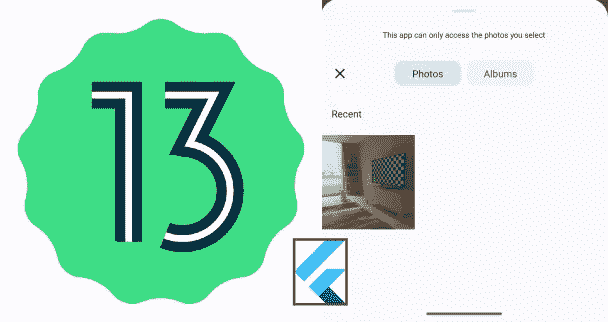
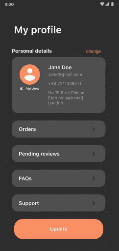
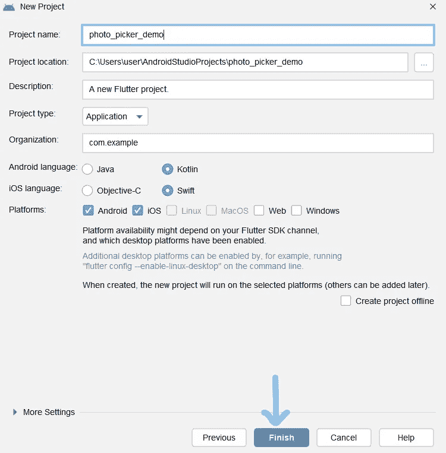

# 在 Flutter 中使用 Android 13 无权限照片拾取器

> 原文：<https://levelup.gitconnected.com/using-android-13-permissionless-photopicker-in-flutter-dcb12abbbcc0>



Android 13 提供了一种无需请求许可即可挑选媒体文件的新方式。



取自安卓开发者

在本文中，我将展示如何在 32 以上 API 的 flutter 应用程序中使用这个图片拾取器。

我们开始吧

这里是 GitHub [链接](https://github.com/Arunshaik2001/photo_picker_demo)

**第一步:**新建一个名为 photo_picker_demo 的 flutter 项目。



**第二步:**现在，在 android 端使用照片拾取器之前。我们需要创建一个方法通道，它将调用在 android 13 中打开新照片拾取器的功能。

**在 MainActivity.kt 文件中，您需要注册方法通道并传递该方法通道的处理程序。**

确保使用**flutterfragmentation activity、**而不是 **FlutterActivity** 扩展 MainActivity，因为它提供了照片拾取功能

**步骤 3:** 现在，我们将为我们的通道创建一个处理程序。

我在这里注册活动结果，合同是 **PickVisualMedia** 。您可以将契约理解为您想要传递的输入。

活动结果的此寄存器。您需要添加依赖项。

将 compileSdk 设置为 33

```
implementation("androidx.activity:activity-ktx:1.6.1")
implementation "androidx.fragment:fragment-ktx:1.5.4"
```

现在，根据您想要选择的媒体类型，我们可以使用不同的请求类型。

您也可以通过传递想要选择的项目数来选择多个文件。

**步骤 4:** 现在，我们将创建一个 **MethodChannel** 的实例，并调用 pickMedia 方法和您想要选择的传递媒体类型。

**输出:**

在这里，我只选择图像

感谢您的阅读