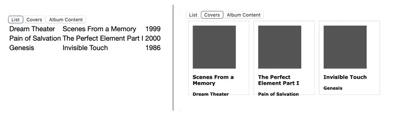
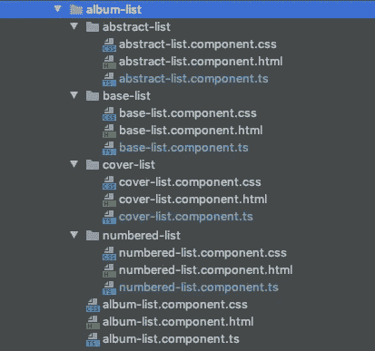
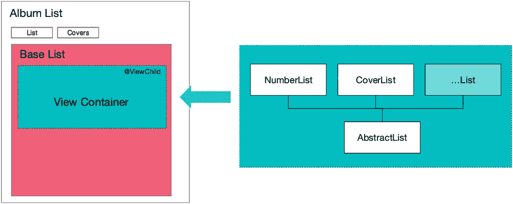

# 使用 Angular @ViewChild 实现数据集的多种可视化

> 原文：<https://levelup.gitconnected.com/using-angular-viewchild-to-implement-multiple-visualizations-of-data-sets-b626689938f7>

有时，数据的单一表示是不够的。

如果我们以一个音乐库应用程序为例，人们会希望以列表形式或专辑封面图片的漂亮列表来查看音乐收藏，同时保持 UI 的其余部分不变。两者都使用相同的底层数据集，理想情况下，表示方式的改变不需要每次都从服务器重新加载数据。

在 Angular 中，`@ViewChild`可以用来实现这个场景，在这篇文章中，我们将开发一个例子，用户可以在数据的多种不同表示之间切换，就像这样:



显示相同数据集的两种选择。

# 整体角形建筑

为了保持整洁，我们将在`AlbumListComponent`的文件夹`album-list`下的目录中组织不同列表表示的组件和视图。这是最终文件夹结构的图像，显示了我们将在此示例中创建和使用的所有文件:



此实现中使用的文件夹结构。

代码结构已经设置好，因此`AlbumListComponent`将负责加载数据，并为页面和 UI 提供入口点，除了这里没有呈现的实际列表。

视图切换的逻辑将由`BaseListComponent`完成，它将完成用户选择的视图之间的渲染和切换，并将任何数据传递给它们。

使用两个独立的组件巧妙地将页面在`AlbumListComponent`中的表示与位于`BaseListComponent`中管理不同的、选定的视图的呈现的业务逻辑分开。接下来，我们将在专门的列表呈现组件中创建列表呈现的实际实现，如下图所示的`NumberedListComponent`和`CoverListComponent`。



前面屏幕截图中显示的各个组件之间的关系。

让我们从最外面的`album-list.component.html`模板开始。

# 步骤 1:数据检索和 UI 设置

下面是我们在相册列表页面上使用的 HTML，允许用户在相册列表的不同表示之间切换。

```
<div class="albumlist-container">
  <div class="format-selector">
    <button type="button"
       (click)="onChangeAlbumDisplayClick('list')">List</button>
    <button type="button"
       (click)="onChangeAlbumDisplayClick('covers')">Covers</button>
  </div>
</div>
```

这里，我们使用组件的`onChangeAlbumDisplayClick()`函数，它将改变对象属性，决定哪个列表视图将被呈现。组件对应的 Typescript 代码看起来是这样的(不包括`@Component`装饰器):

```
export class AlbumListComponent { public currentStyle = 'covers';
  public albumList: Album[] = []; public onChangeAlbumDisplayClick($event) {
    this.currentStyle = $event;
  }
}
```

正如我们所看到的，该组件有两个属性，`currentStyle`和`albumList`，用于存储相册列表和显示它们的风格。两者都将传递给一个孩子`BaseListComponent`我们很快将开发。

基本的 UI 已经准备好了，所以我们可以将`BaseListComponent`嵌入到模板中，并传递两个数据属性，这样逻辑就可以对任何变化做出反应。有了这个添加，`album-list.component.html`看起来像这样:

```
<div class="albumlist-container">
  <div class="format-selector">
    <button type="button"
      (click)="onChangeAlbumDisplayClick('list')">List</button>
    <button type="button"
      (click)="onChangeAlbumDisplayClick('covers')">Covers</button>
    </div>
    <div>
        <base-list [showContentStyle]="currentStyle" 
                   [albumList]="albumList"></base-list>
    </div>
</div>
```

我们看到，在模板中，我们为`BaseListComponent`添加了一个标签`<base-list/>`。该组件将编排列表的实际显示组件的呈现，并包含动态交换数据的视图组件的代码。

下面是`AlbumListComponent`类的代码(同样没有`@Component`装饰器)

```
export class AlbumListComponent implements OnInit { // The two properties, which are passed to BaseListComponent via property binding 
  public currentStyle = 'covers';
  public albumList: Album[] = []; constructor(private albumService: AlbumService) { } // Loading the album data from the server
  ngOnInit() {
    this.albumService.getAllAlbums()
      .subscribe(
        (albumList: Album[]) => this.albumList = albumList;
      );
  } public onChangeAlbumDisplayClick($event) {
    this.currentStyle = $event;
  }
}
```

所添加的只是通过`AlbumService`对服务器的调用以及将检索到的数据存储在`albumList`属性中。出于这个例子的目的，我将跳过 API 调用中的错误处理。

# 步骤 2:列出组件和视图切换

到目前为止，我们所做的工作就是创建一个 UI，允许用户加载和选择如何显示数据。在我们开始创建以不同方式呈现数据的组件之前，我们将看一下`BaseListComponent`,它将使所选视图组件的动态呈现发生。

首先，让我们创建组件，并将其与从`AlbumListComponent`接收的输入连接起来:

```
@Component({
  selector: 'base-list',
  templateUrl: './base-list.component.html',
})
export class BaseListComponent implements OnInit { @Input() showContentStyle: string;
  @Input() albumList: Album[] = []; private contentStyles = {
    list: NumberedListComponent,
    covers: CoverListComponent,
  }; ngOnInit() {
    this.showContentStyle = 'covers';
    this.instantiateViewComponent(this.showContentStyle);
  } private instantiateViewComponent(componentName: string) {}
}
```

我们看到开头的两行`@Input()`允许组件接受`AlbumListComponent`的属性绑定。在`@Input()`之后，我们定义`contentStyles`，从标识组件的字符串(“list”或“covers”)到稍后呈现的相应组件类的映射。

这个设置之后是`ngOnInit()`函数，它设置默认视图并调用一个方法，该方法将呈现所选组件并将其插入到`BaseListComponent`的模板中。该组件的模板非常简短，只包含一个带有标识符的`<div />`元素，稍后我们将使用该标识符在模板的该位置插入呈现的组件(`#albumListStyle`):

```
<div>
  <div #albumListStyle></div>
</div>
```

有了这个基本的设置，我们就可以处理实现的核心了，即`instantiateViewComponent()`方法接收标识要实例化的组件的字符串。该方法需要完成以下任务:

1.  识别对应于给定字符串标识符的正确组件类。
2.  创建该组件的实例。
3.  将呈现所需的任何数据传递到新实例化的组件中。
4.  将渲染的组件放入父模板中。

以下代码完成这些任务:

```
@ViewChild('albumListStyle', {read: ViewContainerRef, static: true})
  albumListContainer: ViewContainerRef; constructor(
    private factoryResolver: ComponentFactoryResolver,
  ) { } private componentReference: ComponentRef<{}>; private instantiateViewComponent(componentName: string) {
    const componentType = this.provideListComponent(componentName);
    const factoryInstance =
        this.factoryResolver.resolveComponentFactory(componentType);
    this.componentReference =
        this.albumListContainer.createComponent(factoryInstance); const inst = this.componentReference.instance as AbstractList;
    inst.albumListToRender = this.albumList;
  } private provideListComponent(componentStyle: string) {
    return this.contentStyles[componentStyle] ||
           this.contentStyles.list;
  }
}
```

在前两行中，`@ViewChild` decorator 使用`#albumListStyle`注释创建了对该组件模板中 HTML 元素的引用，并将该引用存储在`albumListContainer`属性中。

在第 11 行中，`provideListComponent()`方法用于标识并返回对与所提供的字符串标识符`componentName`相关联的组件类的引用，或者返回默认值。第 12 行和第 13 行检索所选组件的工厂，并从中实例化组件。注意在第 9 行，我们如何通过`albumListContainer`属性引用 ViewChild 来创建和注入组件。对新实例化组件的引用保存在`componentReference`对象属性中，这样我们可以做两件事:

1.  将数据传递到组件中进行呈现
2.  稍后，当用户选择另一个数据视图进行显示时，销毁该组件。如果我们不破坏组件实例，我们将在视图的每个“开关”上添加一个新的对象实例。

为了将任何数据传递给子组件，我们获取对类实例的引用，并将加载的数据提供给呈现组件，如第 11 行和第 12 行所示。我们还没有看到组件进行实际的渲染，但是我们可以从这段代码中做出有根据的猜测，它们拥有一个`albumListToRender`属性。在我们进入组件进行实际渲染之前，让我们再次看看我们的概览图，看看我们到目前为止已经完成了什么:

1.  我们已经建立了一个组件，它构成了我们实现的基础，即`AlbumListComponent`。它的主要任务是设置页面，从服务器加载数据，并提供 UI 来更改整个页面的数据视图和样式。
2.  作为其子组件，我们实现了`BaseListComponent`，它通过实例化子组件并将数据传递给子组件来处理信息的选定视图的切换。

# 步骤 3:实现列表视图

在上一节中我们看到，我们将数据传递给负责列表呈现的组件。在最后一个清单的第 15 行，您可能已经注意到了对一个`AbstractList`的引用。这个(抽象)类是所有负责呈现列表的组件的基础。它提供了一个通用的数据参考，如下所示:

```
export abstract class AbstractList {
  public albumListToRender: Album[];
}
```

对于一个列表的实际实现，我们看一下以带有专辑封面、艺术家和专辑名称的卡片网格形式呈现专辑的组件。Typescript 类非常简单:

```
@Component({
  selector: 'app-cover-list',
  templateUrl: './cover-list.component.html',
  styleUrls: ['./cover-list.component.css']
})
export class CoverListComponent extends AbstractList {
  constructor() {
    super();
  }
}
```

它在其构造函数方法中扩展并实例化了`AbstractList`类，从而获得了对`albumListToRender`属性的访问。相应的模板是直接的角度模板:

```
<div>
  <div *ngFor="let album of albumListToRender" 
       class="albumcard-container">
    <div class="albumcard-cover"><!-- image tag here--></div>
    <div class="albumcard-data">
      <h3>{{ album.albumName }}</h3>
      <h4>{{ album.artist }}</h4>
    </div>
  </div>
</div>
```

渲染视图的每个组件都有非常相似的设置:

1.  实际的组件代码只包含一个构造函数，它调用`super()`方法来访问`AbstractList`变量`albumListToRender`
2.  视图模板使用`albumToRender`属性以不同格式显示相同的数据。

有了这些知识，设置新视图只需要创建一个新组件并实现 HTML 以所需的输出格式呈现相册数据。然后，将新组件添加到`BaseListComponent`中的`contentStyles`属性。

# 步骤 4:清理和处理视图更改

到目前为止，这个实现几乎是可行的。显示列表的组件的呈现仍然存在问题，并且当应该改变视图时，现有组件没有被移除。为了解决这两个问题，我们将使用`BaseListComponent`中的`ngOnChange`和`ngOnDestroy`方法:

```
export class BaseListComponent implements OnInit, OnDestroy, OnChanges { ... ngOnDestroy() {
    this.destroyChildComponent();
  } ngOnChanges() {
    this.destroyChildComponent();
    this.instantiateViewComponent(this.showContentStyle);
  } private destroyChildComponent() {
    if (this.componentReference) {
      this.componentReference.destroy();
      this.componentReference = null;
    }
  }
}
```

`ngOnDestroy()`方法卸载(销毁)动态呈现的组件，以避免该实现的内存泄漏。在每次改变`showContentStyle`属性时，都会调用`ngOnChanges()`方法，这表明用户请求了不同的视图。这个方法负责销毁已经存在的视图组件并呈现新的视图。

# 摘要

在本文中，我们探讨了如何在 Angular 中改变数据集的可视化表示，而无需为显示样式的每次改变重新加载数据。这种实现是通过 Angular 的`@ViewChild`特性实现的，该特性允许 TypeScript 主机组件实例动态替换呈现的模板，并将其数据传递给子组件。

该功能背后的原理可以用于许多其他方面，例如呈现具有共同属性但根据数据类型而有不同细节的实体。例如，显示图书馆项目详细信息的页面需要显示常见数据，如标题、作者/艺术家和杜威索引，但根据项目是书籍、杂志、音乐录音还是 DVD，会有不同的详细信息(例如页数、书籍版本与 CD 播放时间和曲目列表)。在这种情况下，不是用户点击按钮来改变显示，而是系统本身将基于要呈现的数据对象中的参数值来选择和实例化正确的子模板。