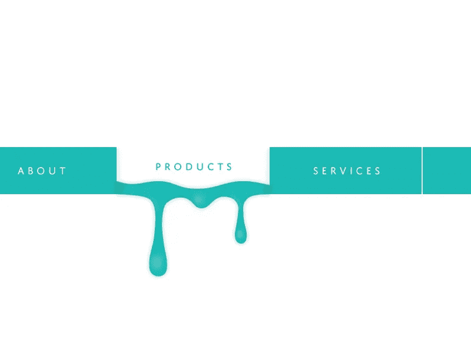

# 使用 ASP.NET 核心来指定导航栏中的哪个元素是活动的

> 原文：<https://levelup.gitconnected.com/using-asp-net-mvc-to-specify-which-element-in-a-navigation-bar-is-active-9c3dac154f9c>

## 如何使用 ASP.NET 核心设置引导菜单活动类？



由 Dribbble 上的 [CatherineWang](https://dribbble.com/CatherineWang) 拍摄的图像

# 介绍

在过去的几年里，我一直使用 Bootstrap 来定义我的网站布局。当创建响应性网站时，它会让你的生活变得容易得多，这在当今是必须的。bootstrap 提供的一个特性是，当你给它一个`active`类时，可以调整链接的外观。

许多前端框架——想想 VueJS、React 和 Angular——可以自动添加这个类。**问题** **是，**MVC 模板默认不将活动类添加到菜单中的`li`或`a`标签中。所以我们必须自己想办法把`class="active"`添加到标签中，以指示活动的菜单项。

# 添加活动类

将活动类添加到您的 ASP.NET 核心应用程序中可能比您最初想象的要容易。为了做到这一点，我们将需要一个`@HtmlHelper`扩展方法:

这个方法允许我们定义多个动作和控制器——以任何其他组合方式——将定义的类添加到我们选择的元素中。现在我们只需要在我们的视图中使用它。

如果你想在`li`元素上添加活动类，当你在" Home "控制器上执行" Index "动作时，你将需要下面的代码:

```
<li class="nav-item @Html.ActiveClass("Home", "Index")">
    <a class="nav-link" href="/Home/Index">Home</a>
</li>
```

但是让我们假设你想在“Home”或“Contact”控制器的“Index”动作上触发`selected`类。我们可以通过下一段代码做到这一点:

```
<li class="nav-item @Html.ActiveClass("Home,Contact", "Index", "selected")">
    <a class="nav-link" href="/Home/Index">Home</a>
</li>
```

**注意**:我强烈建议将`@using Your.Extension.NameSpace`添加到您的`_ViewImports.cshtml`文件中，这样您就不必将它添加到所有其他视图中。

# 结论

在你的 navbar 中应用活动类可能没有看起来那么难。通过使用扩展方法，我们可以用几行简单的代码实现这一点。我希望这能帮助你实现一个更具交互性的导航栏！

快乐编码😊

如果你也想更容易地生成你的链接，看看这个故事

[](/easy-link-generation-in-c-with-url-extensions-96183a4f2d84) [## 使用@Url 扩展在 C#中轻松生成链接

### 如何充分利用新的 C#源代码生成器

levelup.gitconnected.com](/easy-link-generation-in-c-with-url-extensions-96183a4f2d84) 

[https://ko-fi.com/koenvanzeijl](https://ko-fi.com/koenvanzeijl)