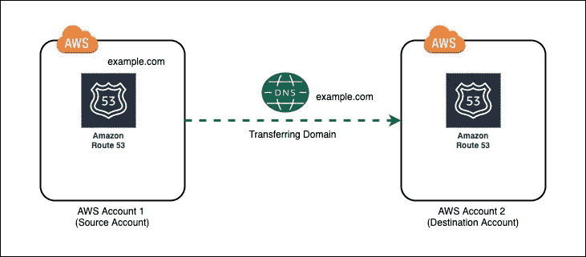

# 使用 AWS CLI 将域从一个 AWS 帐户转移到另一个帐户

> 原文：<https://levelup.gitconnected.com/using-aws-cli-to-transfer-a-domain-from-one-aws-account-to-another-one-2def405af101>

如果您想要将在 **AWS Route 53** 域名注册机构注册的现有域名转移到另一个 AWS(亚马逊网络服务)账户，您当然可以联系 AWS 客户支持团队并完成此事，但这需要花费大量时间，尤其是如果您使用的是自由层计划。

将一个域从一个 AWS 帐户转移到另一个帐户的最佳方法是通过 3 个简单的步骤使用 AWS CLI(或命令行界面)。


AWS 路线 53

AWS 控制台上没有在 AWS 帐户之间转移域的选项。你在控制台上唯一能做的域名转移是把它从 GoDaddy.com 的**或**谷歌域名**之类的外部域名注册商带入 AWS Route 53。**



AWS 路由器 53—AWS 帐户之间的域转移

在这篇博客中，我将向您展示如何使用 AWS CLI(命令行界面)选项转移域。为此，在继续下一步操作之前，您必须确保您的计算机中至少配置了版本 **aws-cli 2.09** 。如果是，请遵循以下步骤

**步骤 1:** 使用旧帐户 IAM CLI 凭据，通过执行以下命令检查是否可以看到您的域:-

```
aws route53domains list-domains
```

您会看到这样的输出

```
{
    "Domains": [
        {
            "DomainName": "example.com",
            "AutoRenew": true,
            "TransferLock": true,
            "Expiry": "2022-08-25T11:34:02+05:30"
        }
    ]
}
```

然后使用以下命令启动域转移:-

```
aws route53domains transfer-domain-to-another-aws-account — domain-name <your domain name> — account-id <destination AWS account id>
```

**步骤 2:** 从上面的步骤中，您将得到一个 JSON 格式的输出，带有 **OperationId** 和**密码**，比如:-

```
{
 “OperationId”: “c837dj8–5eae-29334-ah72-hs873ns8282”,
 “Password”: “ZKAHD\\WE.4LK\\US”
 }
```

将**操作 Id** 更改为**域名**，并将其存储在一个新的 JSON 文件(**acceptdomaintransfer . JSON**)中，同时自动生成相同的密码，如下所示:-

```
{
  “DomainName”: “example.com”
  “Password”: “ZKAHD\\WE.4LK\\US” 
}
```

**步骤 3:** 使用您的目的地/新 AWS 帐户的 IAM CLI **凭证或如下配置文件执行最后一个命令以接受该域:-**

```
aws route53domains accept-domain-transfer-from-another-aws-account — cli-input-json file://acceptDomainTransfer.json — profile gsp
```

**第 4 步:**酷，都完成了:)只需使用新帐户 CLI 凭证再次执行 **list-domains** 命令，您将看到您的域从旧帐户中移出，并开始出现在此处:-

```
aws route53domains list-domains{
    "Domains": [
        {
            "DomainName": "example.com",
            "AutoRenew": true,
            "TransferLock": true,
            "Expiry": "2022-08-25T11:34:02+05:30"
        }
    ]
}
```

希望你喜欢这篇文章:)

# 总结:

在这篇博客中，我们了解到使用 AWS CLI(命令行界面)将我们的域从一个 AWS 帐户转移到另一个帐户是多么容易，而无需为 AWS 客户支持团队创建任何支持票证。并且转移立即发生，没有任何延迟。