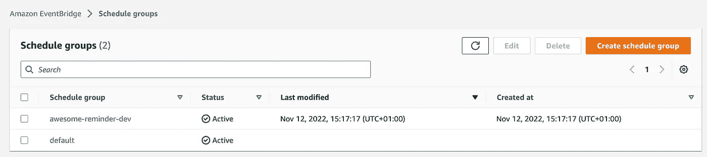

# 使用 Amazon Eventbridge Scheduler 构建无服务器提醒应用程序

> 原文：<https://levelup.gitconnected.com/using-aws-eventbridge-scheduler-to-build-a-serverless-reminder-application-ba3086cf8e>

在本帖中，我们将看到如何使用 [AWS Eventbridge 调度器](https://docs.aws.amazon.com/scheduler/latest/UserGuide/what-is-scheduler.html)。该服务类似于在调度运行的 [Eventbridge 规则，但是它提供了更好的定制和改进的可伸缩性。](https://docs.aws.amazon.com/eventbridge/latest/userguide/eb-create-rule-schedule.html)

除了重复性任务之外，Eventbridge Scheduler 还能够通过配置“一次性计划”来规划未来的单个任务。在本文中，我们将主要关注这个特性。

作为一个用例，我们将构建一个无服务器应用程序，我们可以在未来的指定时间定义提醒，并通过短信接收它们。

## TL；速度三角形定位法(dead reckoning)

您可以在这里找到包含完整 github action CI/CD 工作流的应用程序存储库👉[https://github . com/ziedbentahar/AWS-event bridge-scheduler-sample](https://github.com/ziedbentahar/aws-eventbridge-scheduler-sample)

## 我们要建造什么？

“令人敬畏的提醒”的参考架构

*   **Api 网关**公开集成了“注册提醒”lambda 的路由。这个路由处理来自客户端的请求:一个包含消息、到期时间和消息的提醒有效负载。
*   **注册提醒** lambda 负责通过在 Eventbridge 调度程序上创建“一次性时间表”来安排提醒。我们将为发送到调度器的每个输入定义一个**目标**和一个**目标角色**，它允许事件桥写入该目标。在我们的例子中，我们将定义一个 SQS 队列"**提醒队列**"作为目标。
*   在适当的时候， **Eventbridge 调度器**将提醒发送到**提醒队列。**我们将此队列配置为触发“发送提醒”lambda。
*   **发送提醒**通过 SNS 手机短信功能发布短信提醒。当提醒被成功发布到 SNS 时，这个 lambda 函数从 Eventbridge 调度器中移除已处理的提醒。

在这个例子中将使用 node 16 runtime 和 typescript 进行 Lambda 代码。我们还将使用 CloudFormation 部署基础设施。

⚠️ **注意:**默认情况下，当处理 SNS 短信时，AWS 账户会处于沙盒模式。有一些限制:只发送消息到验证的目的地电话号码，有限数量的验证目的地。在本文中，我不会详细描述向任何电话号码发送短信所需的配置。你可以在这里找到[关于这个话题的一个很好的指南](https://towardsaws.com/configuring-sns-for-sending-sms-to-any-mobile-numbers-14f860650848)。

## 让我们看看代码

**1-调度程序组**

默认情况下，Eventbridge 调度程序将在“默认”组上创建调度。我们可以用自定义名称定义一个自定义调度组，在其中创建提醒任务。下面是创建调度程序组的 CloudFormation 资源:

创建后，该组将出现在 Eventbridge 调度程序控制台的“调度组”面板中

**2-创建执行角色**

一个重要的步骤:我们将需要设置一个 EventBridge Scheduler 承担的执行角色，我们将把访问策略附加到该角色，以便为 EventBridge Scheduler 提供对调用目标的访问:在我们的例子中，将消息发送到" **Reminders queue** " SQS 目标。

您将在此处找到该角色[的完整模板](https://github.com/ziedbentahar/aws-eventbridge-scheduler-sample/blob/main/aws/cfn/components/register-reminder-lambda.yml)

**3-创建“注册提醒”λ**

这个 lambda 通过调用`scheduleReminder`为给定的提醒创建一个新的日程输入。每个提醒都会被分配一个 Id。

我们使用这个 Id 来标识 Eventbridge 调度器上的调度输入。

`scheduleReminder`使用 AWS SDK 在调度器上创建新的调度任务:

**相关零件:**

*   目标、目标角色和调度程序组名称被定义为 lambda 资源中定义的环境变量
*   目标:它由目标输入(我们的提醒的有效负载)、目标 Arn: " **提醒队列**"和 IAM 角色的角色 Arn 组成，当调度被调用时，EventBridge 调度程序将为该目标使用该角色。
*   时间表输入:我们将使用提醒的 Id 作为名称，设置目标并设置定义时间表何时运行的表达式，这里我们将使用`at`表达式因为我们正在创建一次性时间表，所以该表达式必须具有以下格式``at(yyyy-mm-ddThh:mm:ss)`。您可以在此找到有关一次性日程[的更多信息](https://docs.aws.amazon.com/scheduler/latest/UserGuide/schedule-types.html#one-time)

该 lambda 函数需要`allow` `scheduler:CreateSchedule`策略以及`allow` `iam:PassRole`用于 Eventbridge 要使用的执行角色:

你可以在这里找到完整的云信息模板

注册提醒后，它们会在 Eventbridge 计划程序控制台上显示为计划。如前所述，我们使用提醒 id 作为日程名称。

目标类型定义为 SQS 的“精彩提醒”计划

**4-创建“发送提醒”lambda**

这个 lambda 将“提醒队列”定义为一个事件源。当被调用时，这个 lambda 通过 SMS 发送接收到的提醒，然后一旦操作成功就通过提醒 Id 删除相关的日程安排。

`sendSms`功能使用 SNS 发送消息。以下是该功能的详细信息

“发送提醒”lambda 执行角色附加这些策略:

**注意:**为了能够发送消息，`send-sms`策略必须`allow` `sns:Publish`但是对于没有 arn 的资源，SNS 文本消息服务就是这种情况。

你会在这个链接后面找到这个 lambda [的完整云形成模板。](https://github.com/ziedbentahar/aws-eventbridge-scheduler-sample/blob/main/aws/cfn/components/register-reminder-lambda.yml)

## 包扎

Eventbridge Scheduler 是 Eventbridge 计划规则或 CloudWatch 事件的一个很好的替代方案。它的特别调度功能使它成为需要计划将来要处理的消息的应用程序的完美服务。

⚠️ **重要提示:**

*   在撰写本文时，您可以配置最小粒度为一分钟的计划。
*   该服务至少向目标提供一次交付

你可以在这里找到 github action CI/CD 管道的完整报告👉[https://github . com/ziedbentahar/AWS-scheduling-with event-bridge](https://github.com/ziedbentahar/aws-eventbridge-scheduler-sample)

## 进一步阅读

 [## EventBridge 调度程序入门

### EventBridge 调度程序入门- EventBridge 调度程序本主题介绍如何创建新的 EventBridge…

docs.aws.amazon.com](https://docs.aws.amazon.com/scheduler/latest/UserGuide/getting-started.html)  [## EventBridge 调度程序如何与 IAM 配合使用

### 在使用 IAM 管理对 EventBridge 调度程序的访问之前，请了解哪些 IAM 功能可用于…

docs.aws.amazon.com](https://docs.aws.amazon.com/scheduler/latest/UserGuide/security_iam_service-with-iam.html)  [## 模板化目标

### 模板化目标是跨一组核心 AWS 服务的一组公共 API 操作，如亚马逊 SQS、Lambda…

docs.aws.amazon.com](https://docs.aws.amazon.com/scheduler/latest/UserGuide/managing-targets-templated.html)  [## 配置 SNS 以便向任何手机号码发送短信

### 当我们开始使用社交网站时，默认情况下，我们的帐户将处于沙盒模式。开始就好。但是…

towardsaws.com](https://towardsaws.com/configuring-sns-for-sending-sms-to-any-mobile-numbers-14f860650848)