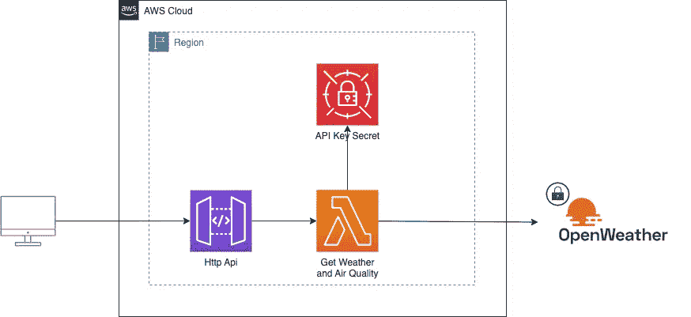

# 使用 AWS 参数和秘密 Lambda 扩展

> 原文：<https://levelup.gitconnected.com/using-aws-parameters-and-secrets-lambda-extension-e61dd6a41110>

在本文中，我们将了解如何使用" [AWS 参数和秘密λ](https://docs.aws.amazon.com/secretsmanager/latest/userguide/retrieving-secrets_lambda.html)"扩展。这个扩展允许在 Lambda 函数的生命周期中请求和缓存秘密和参数，而不需要使用 SDK，并允许我们自己处理缓存。

我们将构建一个引用并使用这个扩展的 Lambda 示例。在 IaC 端，我们将使用 CloudFormation 来使用这个扩展，作为 Lambda 的一个层添加。

## TL；速度三角形定位法(dead reckoning)

你可以在这里找到完整的回购协议👉[https://github . com/ziedbentahar/AWS-parameters-and-secrets-lambda-extension-sample](https://github.com/ziedbentahar/aws-parameters-and-secrets-lambda-extension-sample)

## 关于 Lambda 扩展

Lambda 扩展可以和 Lambda 函数一起运行支持工具。一般来说，这些扩展涵盖了安全性和可观察性等问题。

它们在内部作为 lambda 进程的一部分运行，或者在外部作为执行环境中的另一个进程运行，并且可以访问 lambda 生命周期事件，从而允许在功能执行的特定点执行动作(*例如*在 lambda 运行时初始化时检索秘密)。

作为一个[边车](https://learn.microsoft.com/en-us/azure/architecture/patterns/sidecar)，lambda 扩展不需要改变你的 lambda 功能代码。它们以λ层的形式提供。

## 使用扩展

AWS 参数和秘密扩展公开内部 HTTP 端点来检索秘密或参数值。

例如，要获得名为`some-third-party-api-key` 的秘密的值，我们需要:

*   直接在 lambda 代码中查询这个端点`GET: http://localhost:2773/secretsmanager/get?secretId=some-third-party-api-key`。`2773`是扩展本地 HTTP 服务器的默认端口，这可以通过定义扩展使用的环境变量`PARAMETERS_SECRETS_EXTENSION_HTTP_PORT`来更改。当查询这个端点时，我们需要将这个头`X-Aws-Parameters-Secrets-Token`设置为`AWS_SESSION_TOKEN`环境变量的值。
*   授予 lambda 执行角色对`some-third-party-api-key`机密的`secretsManager:GetSecretValue`权限

缓存机密值已经由该扩展处理。默认缓存 TTL 值为`300 seconds`。通过给`SECRECTS_MANAGER_TTL`环境变量设置一个值，可以定义一个自定义的 TTL。

您可以通过[这个链接](https://docs.aws.amazon.com/secretsmanager/latest/userguide/retrieving-secrets_lambda.html)获得该扩展支持的参数和环境变量的完整列表。

## 我们要建造什么？

为了演示扩展的用法，我们将构建一个 API，提供给定位置(城市名称和国家)的天气预报和空气质量。我们将使用 [OpenWeather](https://openweathermap.org/) Api 作为地理编码和天气提供者。

一个非常基本的架构:一个 AWS Lambda，一个 API 网关和一个包含 OpenWeather API 的 API 密钥的秘密。

我们将使用 Lambda 代码的节点运行时和类型脚本。

## 让我们看看代码

“获取天气和空气质量”lambda 非常简单。它从请求上下文中获取城市和国家，并调用`getWeatherAndAirQualityForCity`

`getWeatherAndAirQualityForCity`然后会调用 OpenWeather API。它需要秘密中存储的 API 密钥。

**这里我们如何在 Lambda 代码中使用 AWS 参数和秘密扩展**👇

你可以在这里找到完整的 lambda 代码

## 创建 Lambda 资源并使用扩展层

**相关位**:

为了在 Lambda 执行环境中使用扩展，我们需要在`Layers`列表中添加扩展的 ARN。

由于每个地区都有不同的 ARN，我们将扩展 ARNs 声明为地区地图:

**关于秘密**

我们将把秘密名称作为环境变量`OPEN_WEATHER_API_KEY_SECRET_NAME` 注入，这个 lambda 函数需要`allow` `secretsManager:GetSecretValue`策略才能读取秘密:

你可以在这里找到这个 lambda 函数的完整云模板

## 包扎

AWS parameters and secrets 扩展是 lambda 生态系统的一个很好的补充，但对于基本用例来说可能不需要它(*例如*在 Lambda 启动时简单地调用 SDK 在一些用例中可能就足够了)

⚠️ **重要提示:**在撰写本文时，该扩展在某些地区不支持 ARM 架构的 Lambda。

您可以在这里找到完整的 CI/CD Github 动作工作流程的完整应用程序👉[https://github . com/ziedbentahar/AWS-parameters-and-secrets-lambda-extension-sample](https://github.com/ziedbentahar/aws-parameters-and-secrets-lambda-extension-sample)

**更新:如果您正在寻找一个 dotnet 示例，我也创建了一个示例应用程序**:**[https://github . com/ziedbentahar/AWS-parameters-and-secrets-lambda-extension-dot net-sample](https://github.com/ziedbentahar/aws-parameters-and-secrets-lambda-extension-dotnet-sample)**

## **进一步阅读**

 **[## 在 AWS Lambda 函数中使用 AWS 机密管理器机密

### 您可以使用 AWS 参数和 Secrets Lambda 扩展在 Lambda 中检索和缓存 AWS Secrets Manager 机密…

docs.aws.amazon.com](https://docs.aws.amazon.com/secretsmanager/latest/userguide/retrieving-secrets_lambda.html)**  **[## 使用 Lambda 扩展

### 你可以使用 Lambda 扩展来扩充你的 Lambda 函数。例如，使用 Lambda 扩展来集成…

docs.aws.amazon.com](https://docs.aws.amazon.com/lambda/latest/dg/using-extensions.html)** ** [## Lambda 扩展 API

### Lambda 函数作者使用扩展将 Lambda 与他们首选的监控、可观察性…

docs.aws.amazon.com](https://docs.aws.amazon.com/lambda/latest/dg/runtimes-extensions-api.html)**