# 使用自动气象站 Prometheus (AMP)和自动气象站 Grafana (AMG)监控自动气象站 EKS 集群

> 原文：<https://levelup.gitconnected.com/using-aws-prometheus-amp-aws-grafana-amg-for-monitoring-aws-eks-cluster-b8dac49285f>

AWS Prometheu 是 Prometheu(或 AMP)的托管服务，具有高度可伸缩性、安全性，是监控所有容器化应用程序的统一方式。该服务可以与 AWS EKS、AWS ECS 和 AWS 发行版集成，用于 OpenTelemetry。

**另一方面，**AWS Grafana 是 Grafana(或 AMG)的完全托管服务，即高度可扩展的安全数据可视化工具，可用于监控和分析我们应用程序的指标、日志和跟踪。

在这篇博客中，我们将了解如何使用 Prometheus 和 Grafana 的 AWS 托管服务来监控我们的 Kubernetes 集群( **AWS 弹性 Kubernetes 服务**)。最终结果将是在 AWS Managed Service for Grafana(AMG)上的一个仪表板，其中将能够执行本机 **PromQL** **(Prometheus 查询语言)**来查询指标，以分析我们的 Kubernetes 集群的数据。

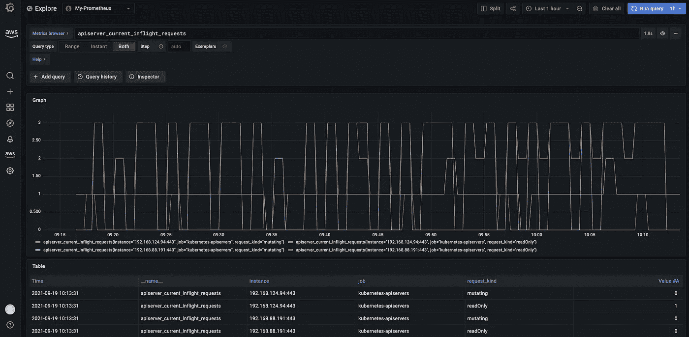

AWS Grafana

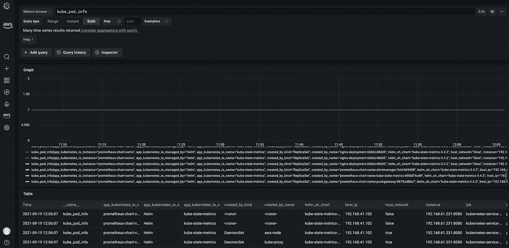

AWS Grafana

## **步骤 1:使用 AWS EKS 托管服务供应 Kubernetes 集群。**

在这里，我们将为 AWS EKS 配置受管节点组。

```
---apiVersion: eksctl.io/v1alpha5
kind: ClusterConfig
metadata:
  name: eks-amp-prometheus-grafana-demo
  region: us-east-1
  version: '1.21'
managedNodeGroups:
- name: ng
  instanceType: t3.medium
  minSize: 1
  maxSize: 2**eksctl create cluster -f 000-eks-cluster-ng-t3-medium.yaml**
```

输出:

```
 2021-09-18 21:10:12 [ℹ]  eksctl version 0.66.0
2021-09-18 21:10:12 [ℹ]  using region us-east-1
2021-09-18 21:10:14 [ℹ]  setting availability zones to [us-east-1c us-east-1f]
2021-09-18 21:10:14 [ℹ]  subnets for us-east-1c - public:192.168.0.0/19 private:192.168.64.0/19
2021-09-18 21:10:14 [ℹ]  subnets for us-east-1f - public:192.168.32.0/19 private:192.168.96.0/19
2021-09-18 21:10:14 [ℹ]  nodegroup "ng" will use "" [AmazonLinux2/1.21]
2021-09-18 21:10:14 [ℹ]  using Kubernetes version 1.21
2021-09-18 21:10:14 [ℹ]  creating EKS cluster "eks-amp-prometheus-grafana-demo" in "us-east-1" region with managed nodes
2021-09-18 21:10:14 [ℹ]  1 nodegroup (ng) was included (based on the include/exclude rules)
2021-09-18 21:10:14 [ℹ]  will create a CloudFormation stack for cluster itself and 0 nodegroup stack(s)
2021-09-18 21:10:14 [ℹ]  will create a CloudFormation stack for cluster itself and 1 managed nodegroup stack(s)
2021-09-18 21:10:14 [ℹ]  if you encounter any issues, check CloudFormation console or try 'eksctl utils describe-stacks --region=us-east-1 --cluster=eks-amp-prometheus-grafana-demo'
2021-09-18 21:10:14 [ℹ]  CloudWatch logging will not be enabled for cluster "eks-amp-prometheus-grafana-demo" in "us-east-1"
2021-09-18 21:10:14 [ℹ]  you can enable it with 'eksctl utils update-cluster-logging --enable-types={SPECIFY-YOUR-LOG-TYPES-HERE (e.g. all)} --region=us-east-1 --cluster=eks-amp-prometheus-grafana-demo'
2021-09-18 21:10:14 [ℹ]  Kubernetes API endpoint access will use default of {publicAccess=true, privateAccess=false} for cluster "eks-amp-prometheus-grafana-demo" in "us-east-1"
2021-09-18 21:10:14 [ℹ]  2 sequential tasks: { create cluster control plane "eks-amp-prometheus-grafana-demo", 3 sequential sub-tasks: { wait for control plane to become ready, 1 task: { create addons }, create managed nodegroup "ng" } }
2021-09-18 21:10:14 [ℹ]  building cluster stack "eksctl-eks-amp-prometheus-grafana-demo-cluster"
2021-09-18 21:10:17 [ℹ]  deploying stack "eksctl-eks-amp-prometheus-grafana-demo-cluster"
2021-09-18 21:10:47 [ℹ]  waiting for CloudFormation stack "eksctl-eks-amp-prometheus-grafana-demo-cluster"
2021-09-18 21:11:18 [ℹ]  waiting for CloudFormation stack "eksctl-eks-amp-prometheus-grafana-demo-cluster"
2021-09-18 21:12:20 [ℹ]  waiting for CloudFormation stack "eksctl-eks-amp-prometheus-grafana-demo-cluster"
2021-09-18 21:13:21 [ℹ]  waiting for CloudFormation stack "eksctl-eks-amp-prometheus-grafana-demo-cluster"
2021-09-18 21:14:23 [ℹ]  waiting for CloudFormation stack "eksctl-eks-amp-prometheus-grafana-demo-cluster"
2021-09-18 21:15:24 [ℹ]  waiting for CloudFormation stack "eksctl-eks-amp-prometheus-grafana-demo-cluster"
2021-09-18 21:16:26 [ℹ]  waiting for CloudFormation stack "eksctl-eks-amp-prometheus-grafana-demo-cluster"
2021-09-18 21:17:27 [ℹ]  waiting for CloudFormation stack "eksctl-eks-amp-prometheus-grafana-demo-cluster"
2021-09-18 21:18:29 [ℹ]  waiting for CloudFormation stack "eksctl-eks-amp-prometheus-grafana-demo-cluster"
2021-09-18 21:19:30 [ℹ]  waiting for CloudFormation stack "eksctl-eks-amp-prometheus-grafana-demo-cluster"
2021-09-18 21:20:32 [ℹ]  waiting for CloudFormation stack "eksctl-eks-amp-prometheus-grafana-demo-cluster"
2021-09-18 21:21:33 [ℹ]  waiting for CloudFormation stack "eksctl-eks-amp-prometheus-grafana-demo-cluster"
2021-09-18 21:22:35 [ℹ]  waiting for CloudFormation stack "eksctl-eks-amp-prometheus-grafana-demo-cluster"
2021-09-18 21:23:37 [ℹ]  waiting for CloudFormation stack "eksctl-eks-amp-prometheus-grafana-demo-cluster"
2021-09-18 21:27:51 [ℹ]  building managed nodegroup stack "eksctl-eks-amp-prometheus-grafana-demo-nodegroup-ng"
2021-09-18 21:27:53 [ℹ]  deploying stack "eksctl-eks-amp-prometheus-grafana-demo-nodegroup-ng"
2021-09-18 21:27:53 [ℹ]  waiting for CloudFormation stack "eksctl-eks-amp-prometheus-grafana-demo-nodegroup-ng"
2021-09-18 21:28:09 [ℹ]  waiting for CloudFormation stack "eksctl-eks-amp-prometheus-grafana-demo-nodegroup-ng"
2021-09-18 21:28:28 [ℹ]  waiting for CloudFormation stack "eksctl-eks-amp-prometheus-grafana-demo-nodegroup-ng"
2021-09-18 21:28:49 [ℹ]  waiting for CloudFormation stack "eksctl-eks-amp-prometheus-grafana-demo-nodegroup-ng"
2021-09-18 21:29:07 [ℹ]  waiting for CloudFormation stack "eksctl-eks-amp-prometheus-grafana-demo-nodegroup-ng"
2021-09-18 21:29:28 [ℹ]  waiting for CloudFormation stack "eksctl-eks-amp-prometheus-grafana-demo-nodegroup-ng"
2021-09-18 21:29:49 [ℹ]  waiting for CloudFormation stack "eksctl-eks-amp-prometheus-grafana-demo-nodegroup-ng"
2021-09-18 21:30:09 [ℹ]  waiting for CloudFormation stack "eksctl-eks-amp-prometheus-grafana-demo-nodegroup-ng"
2021-09-18 21:30:28 [ℹ]  waiting for CloudFormation stack "eksctl-eks-amp-prometheus-grafana-demo-nodegroup-ng"
2021-09-18 21:30:47 [ℹ]  waiting for CloudFormation stack "eksctl-eks-amp-prometheus-grafana-demo-nodegroup-ng"
2021-09-18 21:31:05 [ℹ]  waiting for CloudFormation stack "eksctl-eks-amp-prometheus-grafana-demo-nodegroup-ng"
2021-09-18 21:31:06 [ℹ]  waiting for the control plane availability...
2021-09-18 21:31:07 [✔]  saved kubeconfig as "/Users/vinod827/.kube/config"
2021-09-18 21:31:07 [ℹ]  no tasks
2021-09-18 21:31:07 [✔]  all EKS cluster resources for "eks-amp-prometheus-grafana-demo" have been created
2021-09-18 21:31:08 [ℹ]  nodegroup "ng" has 1 node(s)
2021-09-18 21:31:08 [ℹ]  node "ip-192-168-41-102.ec2.internal" is ready
2021-09-18 21:31:08 [ℹ]  waiting for at least 1 node(s) to become ready in "ng"
2021-09-18 21:31:08 [ℹ]  nodegroup "ng" has 1 node(s)
2021-09-18 21:31:08 [ℹ]  node "ip-192-168-41-102.ec2.internal" is ready
2021-09-18 21:33:16 [ℹ]  kubectl command should work with "/Users/vinod827/.kube/config", try 'kubectl get nodes'
2021-09-18 21:33:16 [✔]  EKS cluster "eks-amp-prometheus-grafana-demo" in "us-east-1" region is ready
```

## 步骤 2:在 AWS Prometheus(或 AMP)上创建工作区

您可以根据逻辑和隔离的 Prometheus server 创建任意多的工作区。工作区支持细粒度的访问控制，以授权其管理，如更新、列表、描述和删除，以及指标的获取和查询。您可以在帐户的每个区域拥有一个或多个工作区。

2.1)使用控制台创建工作空间

在控制台的搜索栏中输入 Prometheus，然后点击“ **Create** ”按钮创建工作区。为其提供一个名称，并点击“**创建工作空间**”按钮。

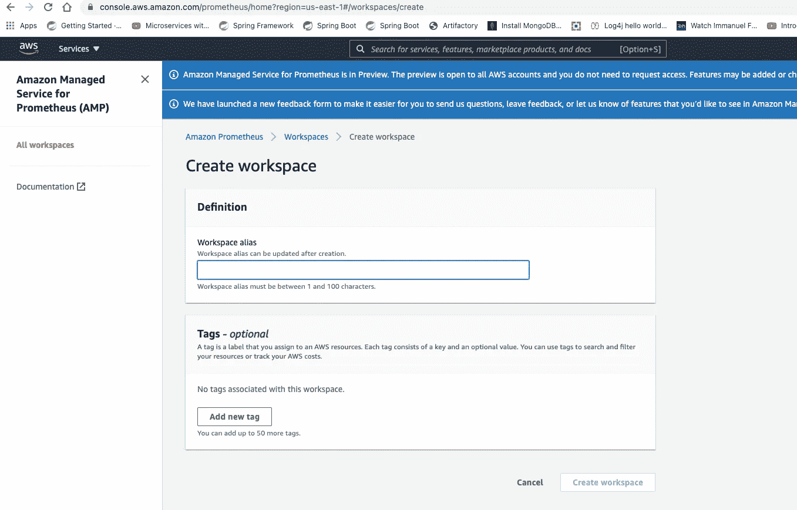

AWS 普罗米修斯(AMP)

记下工作区 id 和端点查询 URL，因为在后面的步骤中会用到它们。

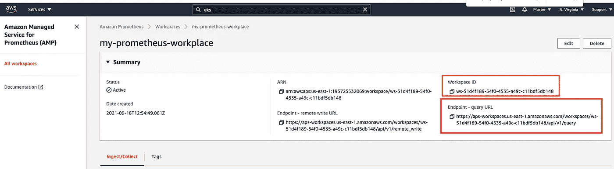

AWS 普罗米修斯(AMP)

## 步骤 3:在 Kubernetes 集群中设置 Prometheus 服务器

我们需要在我们的 EKS 集群中提供一个 Prometheus 服务器，该服务器的任务是收集所有集群指标，并将它们发送到 **AMP(或 Prometheus 的 AWS 托管服务)**

3.1) **使用 Helm** ，在您的终端上运行以下命令来添加图表:-

```
helm repo add prometheus-community [https://prometheus-community.github.io/helm-charts](https://prometheus-community.github.io/helm-charts)helm repo add kube-state-metrics [https://kubernetes.github.io/kube-state-metrics](https://kubernetes.github.io/kube-state-metrics)helm repo update
```

3.2)创建一个**命名空间**，用于运行所有与 Prometheus 服务器相关的 Kubernetes 对象。就我而言，我将只把它命名为**普罗米修斯**。

```
kubectl create namespace prometheus
```

3.3)为**摄取指标**和**查询指标**配置 **IRSA(服务账户的 IAM 角色)**。

为了在 Kubernetes 对象(如 Pod)和 AWS 服务(如 AWS Prometheus、AWS S3 等)之间建立信任，我们需要首先创建 IRSA，以便运行 Kubernetes 集群的 Pod 可以在附加到它的 Kubernetes 服务帐户(SA)的帮助下安全地调用某些 AWS 服务。这通常是在注释的帮助下完成的，比如在 SA 清单文件中

```
annotations:
   eks.amazonaws.com/role-arn: "arn:aws:iam::195725532069:role/my- example-role"
```

而这个信任，也就是用那个特定的 AWS IAM 角色 ARN (Amazon Resource Name)创建的，在我的例子中是 **my-example-role** (如上所示)。

为了配置 IRSA 从我们的 Kubernetes 集群(AWS EKS)获取指标，创建一个名为“ **createIRSA-AMPIngest.sh** 的文件，内容如下:-

```
#!/bin/bash -e
**CLUSTER_NAME**=eks-amp-prometheus-grafana-demo **#Replace this value by your Cluster name****SERVICE_ACCOUNT_NAMESPACE**=prometheus **#Replace this value by your prometheus namespace**AWS_ACCOUNT_ID=$(aws sts get-caller-identity --query "Account" --output text)OIDC_PROVIDER=$(aws eks describe-cluster --name $CLUSTER_NAME --query "cluster.identity.oidc.issuer" --output text | sed -e "s/^https:\/\///")SERVICE_ACCOUNT_AMP_INGEST_NAME=amp-iamproxy-ingest-service-accountSERVICE_ACCOUNT_IAM_AMP_INGEST_ROLE=amp-iamproxy-ingest-roleSERVICE_ACCOUNT_IAM_AMP_INGEST_POLICY=AMPIngestPolicy
#
# Set up a trust policy designed for a specific combination of K8s service account and namespace to sign in from a Kubernetes cluster which hosts the OIDC Idp.
#
cat <<EOF > TrustPolicy.json
{
  "Version": "2012-10-17",
  "Statement": [
    {
      "Effect": "Allow",
      "Principal": {
        "Federated": "arn:aws:iam::${AWS_ACCOUNT_ID}:oidc-provider/${OIDC_PROVIDER}"
      },
      "Action": "sts:AssumeRoleWithWebIdentity",
      "Condition": {
        "StringEquals": {
          "${OIDC_PROVIDER}:sub": "system:serviceaccount:${SERVICE_ACCOUNT_NAMESPACE}:${SERVICE_ACCOUNT_AMP_INGEST_NAME}"
        }
      }
    }
  ]
}
EOF
#
# Set up the permission policy that grants ingest (remote write) permissions for all AMP workspaces
#
cat <<EOF > PermissionPolicyIngest.json
{
  "Version": "2012-10-17",
   "Statement": [
       {"Effect": "Allow",
        "Action": [
           "aps:RemoteWrite", 
           "aps:GetSeries", 
           "aps:GetLabels",
           "aps:GetMetricMetadata"
        ], 
        "Resource": "*"
      }
   ]
}
EOFfunction getRoleArn() {
  OUTPUT=$(aws iam get-role --role-name $1 --query 'Role.Arn' --output text 2>&1)# Check for an expected exception
  if [[ $? -eq 0 ]]; then
    echo $OUTPUT
  elif [[ -n $(grep "NoSuchEntity" <<< $OUTPUT) ]]; then
    echo ""
  else
    >&2 echo $OUTPUT
    return 1
  fi
}#
# Create the IAM Role for ingest with the above trust policy
#
SERVICE_ACCOUNT_IAM_AMP_INGEST_ROLE_ARN=$(getRoleArn $SERVICE_ACCOUNT_IAM_AMP_INGEST_ROLE)
if [ "$SERVICE_ACCOUNT_IAM_AMP_INGEST_ROLE_ARN" = "" ]; 
then
  #
  # Create the IAM role for service account
  #
  SERVICE_ACCOUNT_IAM_AMP_INGEST_ROLE_ARN=$(aws iam create-role \
  --role-name $SERVICE_ACCOUNT_IAM_AMP_INGEST_ROLE \
  --assume-role-policy-document file://TrustPolicy.json \
  --query "Role.Arn" --output text)
  #
  # Create an IAM permission policy
  #
  SERVICE_ACCOUNT_IAM_AMP_INGEST_ARN=$(aws iam create-policy --policy-name $SERVICE_ACCOUNT_IAM_AMP_INGEST_POLICY \
  --policy-document file://PermissionPolicyIngest.json \
  --query 'Policy.Arn' --output text)
  #
  # Attach the required IAM policies to the IAM role created above
  #
  aws iam attach-role-policy \
  --role-name $SERVICE_ACCOUNT_IAM_AMP_INGEST_ROLE \
  --policy-arn $SERVICE_ACCOUNT_IAM_AMP_INGEST_ARN  
else
    echo "$SERVICE_ACCOUNT_IAM_AMP_INGEST_ROLE_ARN IAM role for ingest already exists"
fi
echo $SERVICE_ACCOUNT_IAM_AMP_INGEST_ROLE_ARN
#
# EKS cluster hosts an OIDC provider with a public discovery endpoint.
# Associate this IdP with AWS IAM so that the latter can validate and accept the OIDC tokens issued by Kubernetes to service accounts.
# Doing this with eksctl is the easier and best approach.
#**eksctl utils associate-iam-oidc-provider --cluster $CLUSTER_NAME --approve**
```

*(输入上面脚本中 Prometheus 正在运行的 Kubernetes 集群名称和 Kubernetes 名称空间，分别对应关键字 CLUSTER_NAME 和 SERVICE _ ACCOUNT _ NAMESPACE】*

完成后，提供对该文件的可执行权限(在 Linux 或 macOS 终端上)并执行它:-

```
» chmod +x createIRSA-AMPIngest.sh» ./createIRSA-AMPIngest.sh
```

这将创建 IAM 策略、IAM 角色(与 k8s 服务帐户的可信关系)

要配置 IRSA 用于指标的**查询，创建另一个名为“ **createIRSA-AMPQuery.sh** 的文件，其内容如下:-**

```
#!/bin/bash -e
**CLUSTER_NAME**=eks-amp-prometheus-grafana-demo #Replace this value by your Cluster name**SERVICE_ACCOUNT_NAMESPACE**=prometheus #Replace this value by your prometheus namespaceAWS_ACCOUNT_ID=$(aws sts get-caller-identity --query "Account" --output text)
OIDC_PROVIDER=$(aws eks describe-cluster --name $CLUSTER_NAME --query "cluster.identity.oidc.issuer" --output text | sed -e "s/^https:\/\///")
SERVICE_ACCOUNT_AMP_QUERY_NAME=amp-iamproxy-query-service-account
SERVICE_ACCOUNT_IAM_AMP_QUERY_ROLE=amp-iamproxy-query-role
SERVICE_ACCOUNT_IAM_AMP_QUERY_POLICY=AMPQueryPolicy
#
# Setup a trust policy designed for a specific combination of K8s service account and namespace to sign in from a Kubernetes cluster which hosts the OIDC Idp.
#
cat <<EOF > TrustPolicy.json
{
  "Version": "2012-10-17",
  "Statement": [
    {
      "Effect": "Allow",
      "Principal": {
        "Federated": "arn:aws:iam::${AWS_ACCOUNT_ID}:oidc-provider/${OIDC_PROVIDER}"
      },
      "Action": "sts:AssumeRoleWithWebIdentity",
      "Condition": {
        "StringEquals": {
          "${OIDC_PROVIDER}:sub": "system:serviceaccount:${SERVICE_ACCOUNT_NAMESPACE}:${SERVICE_ACCOUNT_AMP_QUERY_NAME}"
        }
      }
    }
  ]
}
EOF
#
# Set up the permission policy that grants query permissions for all AMP workspaces
#
cat <<EOF > PermissionPolicyQuery.json
{
  "Version": "2012-10-17",
   "Statement": [
       {"Effect": "Allow",
        "Action": [
           "aps:QueryMetrics",
           "aps:GetSeries", 
           "aps:GetLabels",
           "aps:GetMetricMetadata"
        ], 
        "Resource": "*"
      }
   ]
}
EOFfunction getRoleArn() {
  OUTPUT=$(aws iam get-role --role-name $1 --query 'Role.Arn' --output text 2>&1)# Check for an expected exception
  if [[ $? -eq 0 ]]; then
    echo $OUTPUT
  elif [[ -n $(grep "NoSuchEntity" <<< $OUTPUT) ]]; then
    echo ""
  else
    >&2 echo $OUTPUT
    return 1
  fi
}#
# Create the IAM Role for query with the above trust policy
#
SERVICE_ACCOUNT_IAM_AMP_QUERY_ROLE_ARN=$(getRoleArn $SERVICE_ACCOUNT_IAM_AMP_QUERY_ROLE)
if [ "$SERVICE_ACCOUNT_IAM_AMP_QUERY_ROLE_ARN" = "" ]; 
then
  #
  # Create the IAM role for service account
  #
  SERVICE_ACCOUNT_IAM_AMP_QUERY_ROLE_ARN=$(aws iam create-role \
  --role-name $SERVICE_ACCOUNT_IAM_AMP_QUERY_ROLE \
  --assume-role-policy-document file://TrustPolicy.json \
  --query "Role.Arn" --output text)
  #
  # Create an IAM permission policy
  #
  SERVICE_ACCOUNT_IAM_AMP_QUERY_ARN=$(aws iam create-policy --policy-name $SERVICE_ACCOUNT_IAM_AMP_QUERY_POLICY \
  --policy-document file://PermissionPolicyQuery.json \
  --query 'Policy.Arn' --output text)
  #
  # Attach the required IAM policies to the IAM role create above
  #
  aws iam attach-role-policy \
  --role-name $SERVICE_ACCOUNT_IAM_AMP_QUERY_ROLE \
  --policy-arn $SERVICE_ACCOUNT_IAM_AMP_QUERY_ARN  
else
    echo "$SERVICE_ACCOUNT_IAM_AMP_QUERY_ROLE_ARN IAM role for query already exists"
fi
echo $SERVICE_ACCOUNT_IAM_AMP_QUERY_ROLE_ARN
#
# EKS cluster hosts an OIDC provider with a public discovery endpoint.
# Associate this IdP with AWS IAM so that the latter can validate and accept the OIDC tokens issued by Kubernetes to service accounts.
# Doing this with eksctl is the easier and best approach.
#**eksctl utils associate-iam-oidc-provider --cluster $CLUSTER_NAME --approve**
```

*(再次输入上面脚本中 Prometheus 正在运行的 Kubernetes 集群名称和 Kubernetes 名称空间，分别对应关键字 CLUSTER_NAME 和 SERVICE _ ACCOUNT _ Namespace)*

完成后，授予该文件的可执行权限(在 Linux 或 macOS 上)并执行它:-

```
» chmod +x createIRSA-AMPQuery.sh» ./createIRSA-AMPQuery.sh
```

3.4)使用以下内容创建一个名为'**my _ prometheus _ values _ YAML**的新文件，以设置 Prometheus 服务器并启动摄取指标，该指标将收集所有指标数据并将其发送给 AWS Prometheus (AMP)

```
serviceAccounts:
  server:
    name: amp-iamproxy-ingest-service-account
    annotations: 
      eks.amazonaws.com/role-arn: ${IAM_PROXY_PROMETHEUS_ROLE_ARN}
server:
  remoteWrite:
    - url: [https://aps-workspaces.${AWS_REGION}.amazonaws.com/workspaces/${WORKSPACE_ID}/api/v1/remote_write](https://aps-workspaces.${AWS_REGION}.amazonaws.com/workspaces/${WORKSPACE_ID}/api/v1/remote_write)
      sigv4:
        region: ${AWS_REGION}
      queue_config:
        max_samples_per_send: 1000
        max_shards: 200
        capacity: 2500
```

请注意适当替换上述文件中的以下键:-

```
**IAM_PROXY_PROMETHEUS_ROLE_ARN** => IAM Role ARN of amp-iamproxy-ingest-role**AWS_REGION** => Region where the Cluster is running**WORKSPACE_ID** => AWS Prometheus workspace id (refer Step 2 above for this)
```

在我的例子中，该文件将如下所示

```
serviceAccounts:
  server:
    name: amp-iamproxy-ingest-service-account
    annotations: 
      eks.amazonaws.com/role-arn: arn:aws:iam::195725532069:role/amp-iamproxy-ingest-role
server:
  remoteWrite:
    - url: [https://aps-workspaces.us-east-1.amazonaws.com/workspaces/ws-51d4f189-54f0-4535-a49c-c11bdf5db148/api/v1/remote_write](https://aps-workspaces.us-east-1.amazonaws.com/workspaces/ws-51d4f189-54f0-4535-a49c-c11bdf5db148/api/v1/remote_write)
      sigv4:
        region: us-east-1
      queue_config:
        max_samples_per_send: 1000
        max_shards: 200
        capacity: 2500
```

使用 Helm 在终端上执行以下命令

```
helm install prometheus-chart-name prometheus-community/prometheus -n prometheus -f my_prometheus_values_yaml
```

通过以下命令检查 Prometheus 服务器是否运行在 **prometheus** 名称空间中或者不在 AWS EKS 中:-

```
» kubectl get pod -n prometheus 

NAME                                                        READY   STATUS    RESTARTS   AGE
prometheus-chart-name-alertmanager-5dcf469498-vq485         2/2     Running   0          16h
prometheus-chart-name-kube-state-metrics-6ffdd74cd9-wrkt2   1/1     Running   0          16h
prometheus-chart-name-node-exporter-w27j5                   1/1     Running   0          16h
prometheus-chart-name-pushgateway-8675cd8bcf-x9nhw          1/1     Running   0          16h
prometheus-chart-name-server-0                              3/3     Running   0          16h
```

## **步骤 4:在 AWS Grafana 上创建工作区**

4.1)在控制台上搜索 Grafana，点击“**创建工作空间**”按钮，按照屏幕指示创建工作空间。

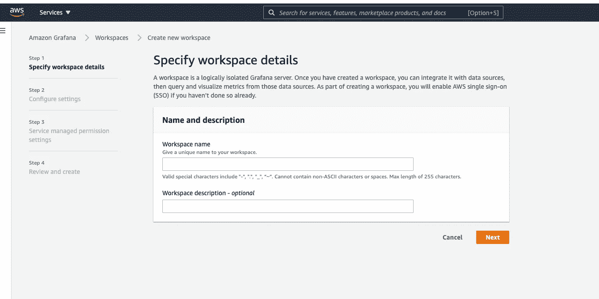

AWS Grafana

4.2)对于 Grafana 服务器的认证，选择 AWS SSO 复选框(*注意，如果还没有可用的用户*，您需要在 AWS SSO 中创建一个用户)，并将权限类型保持为“服务管理”。

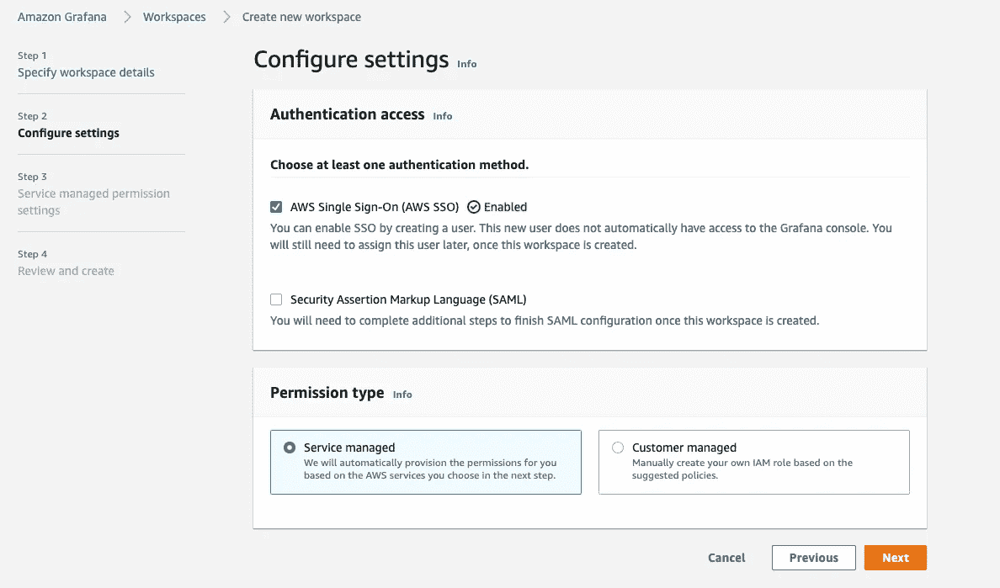

AWS Grafana (AMG)

4.3) Grafana 支持多种数据源，如 **AWS X-Ray、CloudWatch** 等。在我们的例子中，它将**普罗米修斯**作为真理的来源。因此，选择复选框“**亚马逊为普罗米修斯**提供的托管服务”。将剩余选项保留为默认选项。此外，如果您希望在异常情况下发送通知警报，那么您可以将它们与 **Amazon SNS** 集成，如下所示:-

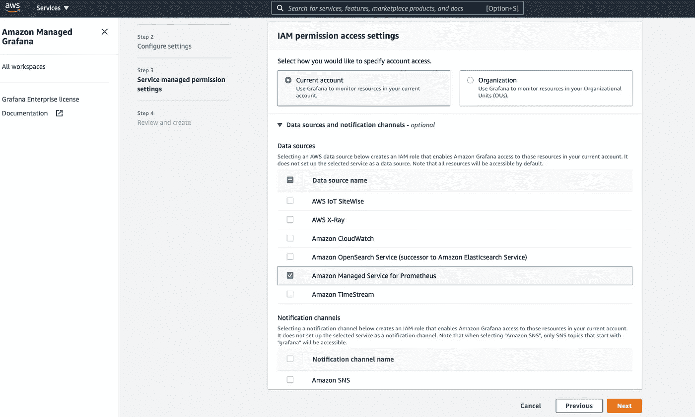

AWS Grafana (AMG)

最后，检查所有细节并提交它们以创建 Grafana 工作区。

记下 Grafana 工作区的 URL，因为这将是我们访问仪表板的终点。

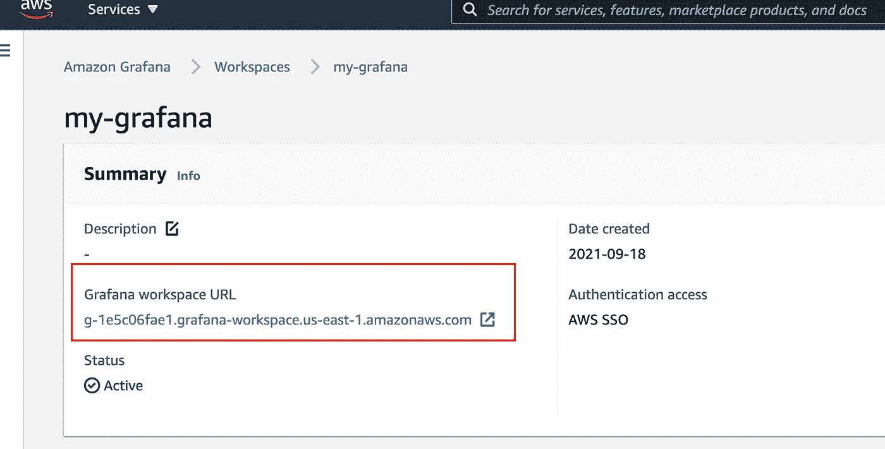

## 步骤 5:在 Grafana 上访问仪表板并查询 AWS EKS 的指标

5.1)导航到 Grafana workspace 链接(在我的例子中是[g-1e5c06fae1.grafana-workspace.us-east-1.amazonaws.com](https://g-1e5c06fae1.grafana-workspace.us-east-1.amazonaws.com/))并通过 SSO 用户的身份验证。

完成后，点击'**添加您的第一个数据源**卡，然后选择'**普罗米修斯**

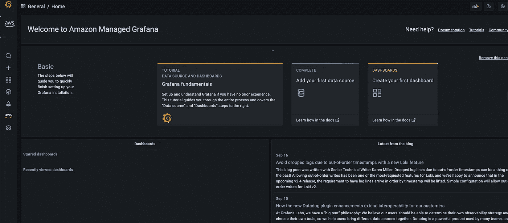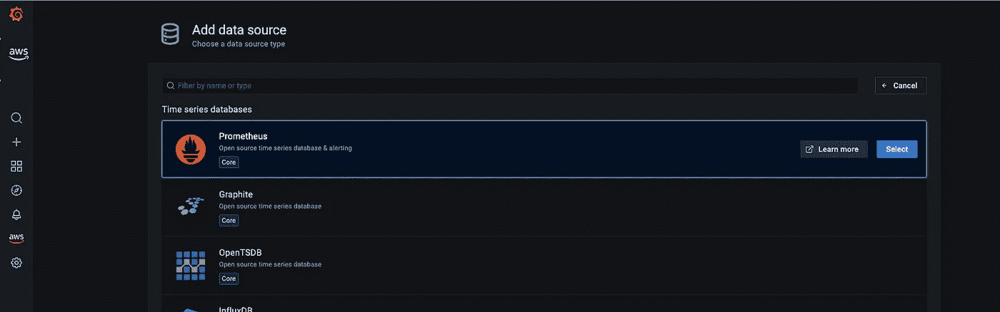

提供以下详细信息，如

```
URL -> Copy the Prometheus 'Endpoint - query URL' till workspace id and ignore the remaining /api/v1/query and put it here. In my case, this is the value [**https://aps-workspaces.us-east-1.amazonaws.com/workspaces/ws-51d4f189-54f0-4535-a49c-c11bdf5db148**](https://aps-workspaces.us-east-1.amazonaws.com/workspaces/ws-51d4f189-54f0-4535-a49c-c11bdf5db148)SigV4 auth -> **Toggle to enable it**Default region -> us-east-1 (Region for your AWS Prometheus)
```

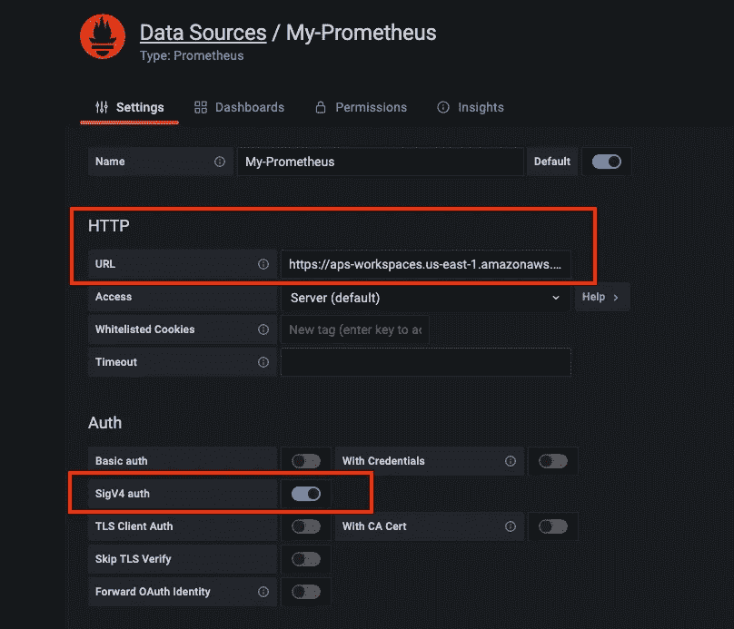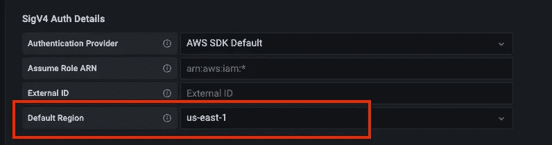

最后，点击'**保存&测试**按钮。

5.2)在 Grafana 上，点击“**探索**”并导航至您的仪表盘。确保从下拉选项中选择了您最近创建的 Prothemeus dashboard，并启动类似于**API server _ current _ inflight _ requests**或的 PromQL 查询，然后点击“Run query”按钮(右上角)查看您的 Kubernetes 集群的指标数据的可视化。

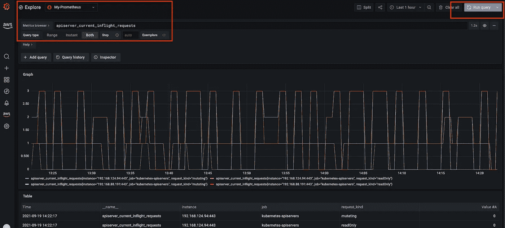

Grafana 仪表板

# **概要:**

在这篇博客中，我们看到了如何在 AWS EKS 集群中使用 Helm 轻松设置 Prometheus 服务器，然后创建 IRSA(服务帐户的 IAM 角色)来接收和查询指标。我们还了解了如何在 AWS Prometheus (AMP)中建立一个工作区来接收这些指标，然后将这些指标转发到 AWS Grafana (AMG)的工作区进行数据可视化。

像往常一样，您将在 GitHub 资源库中找到该演示的完整源代码:-

[https://github . com/vinod 827/k8s-nest/tree/main/IAC/AWS/eks/amp](https://github.com/vinod827/k8s-nest/tree/main/iac/aws/eks/amp)

请随意为社区贡献更多 IaC(基础设施代码)。