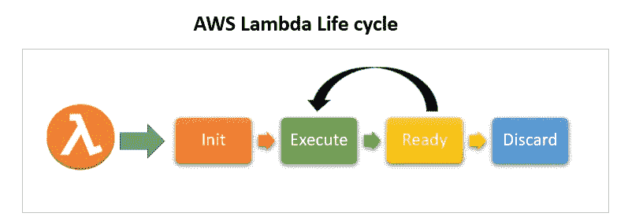

# 通过共享连接池在 Lambda 上使用 AWS RDS 代理

> 原文：<https://levelup.gitconnected.com/using-aws-rds-proxy-with-lambda-with-a-shared-connection-pool-88407be71425>

本杰明·雷曼在 [Unsplash](https://unsplash.com/s/photos/database?utm_source=unsplash&utm_medium=referral&utm_content=creditCopyText) 上的照片

当我们考虑 AWS 中的数据库时，首先想到的解决方案是 AWS RDS，尽管现在 AWS 提供了多个其他解决方案。但是由于这些新解决方案的许多限制，许多开发人员仍然选择 RDS 而不是其他解决方案，如 Aurora 和 DynamoDB 等。将这些解决方案相互比较需要自己的帖子，所以我现在不会这样做。

RDS 目前提供下列数据库引擎。

*   关系型数据库
*   一种数据库系统
*   MariaDB
*   神谕
*   SQL Server

当我们开发连接到任何这些数据库引擎的应用程序时，最佳实践是使用连接池，而不是每次我们想要从数据库查询时都创建一个新的连接。许多 ORM 库默认这样做，以减少开发人员的开销。但是对于无服务器架构(AWS Lambda，Azure Functions 等等)，这引入了一个新问题，**我们不能使用无服务器架构的连接池**。

## 为什么不能用 Lambda 的连接池？

为了回答这个问题，我们需要深入了解 Lambda 在幕后是如何工作的。Lambda 是一个小的应用程序代码，我们可以在没有任何服务器的情况下运行它。对于开发者来说，没有任何服务器是正确的，但是对于 AWS 来说，它们是在服务器上运行的。但这是从开发人员那里抽象出来的，所以我们不需要担心任何服务器，这是无服务器架构的主要吸引力。但是 AWS 是怎么做到的呢？下面是 Lambda 的生命周期。

[https://www . LinkedIn . com/pulse/AWS-lambda-constraint-shanmuga-ks/](https://www.linkedin.com/pulse/aws-lambda-constraint-shanmuga-ks/)

当我们创建一个 Lambda 函数时，我们首先打包代码(zip ),然后上传到 AWS(S3)。一旦我们的 Lambda 代码需要执行，下面的步骤将按以下顺序完成。

*   **初始化函数** —下载打包代码，添加依赖项，找到合适的服务器并初始化。
*   **执行**—lambda(我们编写的)内部的代码将被执行。
*   **就绪** —一旦执行完成，它将进入就绪状态，等待下一次执行。
*   **丢弃** — AWS 将释放与 Lambda 函数相关的资源。如果该功能处于就绪状态大约 15 分钟没有任何执行，就会发生这种情况。

现在你应该有的问题是为什么 AWS 需要这个**丢弃**步骤。这就是 AWS 对 Lambda 收费的原因。AWS 只对 Lambda 的执行时间收费，所以当我们的 Lambda 没有被调用时，将不收费。但是当我们的代码使用服务器资源时，AWS 会产生费用。因此，每当 AWS 发现我们的 Lambda 不再被调用时，它就会执行这个**丢弃**步骤来释放服务器资源。

现在我们知道了 lambda 生命周期是如何工作的，让我们看看我们最初的问题，为什么我们不能将连接池用于 Lambda？这有两个原因。

*   首先是因为这个**丢弃**步骤。假设当 lambda 函数被调用时，我们初始化了一个新的连接池。如果 Lambda 在被丢弃之前被调用，我们可以重用相同的连接。一旦**丢弃**步骤完成，我们的连接池也将丢失。
*   第二个是为每个 lambda 函数生成一个新的连接池。因此，当多个 lambda 函数并行执行时，我们将拥有多个连接池，这违背了使用连接池本身的目的。

由于上述原因，我们不能在 Lambda 函数中使用连接池。这意味着我们不能在 Lambda 函数中使用 RDS？幸运的是，答案是否定的，我们可以通过 RDS 代理将 RDS 与 Lambda 函数一起使用。

## RDS 代理

[https://aws.amazon.com/rds/proxy/](https://aws.amazon.com/rds/proxy/)

RDS 代理是 AWS 提供的一个解决方案，用于解决我们上面刚刚描述的场景，即如何在无服务器架构环境中管理数据库连接。它还有其他用途，但在这篇文章中，我们只讨论它如何解决我们的问题。在我们的问题中，将根据调用的 Lambda 函数的数量创建大量的数据库连接。RDS 代理通过共享数据库连接解决了这个问题。下面是我们用 Lambda 函数配置 RDS 代理时的流程。

*   Lambda 将调用 RDS 代理，而不是直接调用 RDS 实例来获取数据库连接。
*   基于连接池的可用性，一个连接将被返回给我们的 Lambda 函数。
*   Lambda 函数将使用此连接来连接到数据库。
*   一旦函数调用完成，此连接将被删除并返回连接池。

现在，不是每个 Lambda 都有自己的连接，而是在 RDS 代理中有一个共享的连接池，它将管理到 RDS 实例的连接。因此，RDS 和无服务器应用程序的问题现在有了适当的解决方案。

现在，既然我们已经知道了为什么需要使用 RDS 代理，那么让我们在下一节开始实现。

## 设置 VPC

首先，我们需要设置一个 VPC，以便创建一个 RDS 实例。(因为我们需要两个私有子网)

通过使用上述云形成模板，它将生成

*   两个公共子网
*   两个专用子网(将在其中创建 RDS 实例)
*   两个互联网网关，因此私有子网资源可以与互联网通信

这个 cloudformation 模板将有许多输出，但是我们接下来想要的是

*   子网导出导出
*   子网扩展

确保记住创建堆栈时提供的名称，因为下一步将会用到它。

## 设置 RDS 实例

现在，我们已经有了带有两个私有子网的 VPC，我们可以继续在创建的 VPC 中创建一个 RDS 实例。

在上面的模板中，有大量的输入参数。但是我们只需要用创建 VPC 堆栈时提供的名称填充 **ParentVPCStack** 参数。

上面的模板是用于创建 MySQL 实例的，但是你可以通过改变**引擎版本**参数**将它用于 RDS 支持的任何数据库引擎。**

一旦该模板成功运行，它将生成以下资源

*   专用子网中的 RDS 实例

## 设置 RDS 代理

现在我们可以继续创建我们的 RDS 代理。为了创建 RDS 代理，我们需要首先使用 AWS secret manager 创建一个秘密，在这里我们将 RDS 实例中使用的凭证传递给 RDS 代理。

转到 AWS Secrets 并点击存储新的秘密

接下来，为 Amazon RDS 数据库选择凭证，然后提供凭证。

在数据库部分，选择正确的数据库。

接下来，提供机密名称和描述。确保记住下一步的秘密名称。

存储秘密后，我们可以运行下面的 cloudformation 模板来创建 RDS 代理。

对于输入参数，提供以下内容

*   **ParentVPCStack**—VPC 堆栈的名称
*   **ParentRDSStack**—RDS 堆栈的名称
*   **SecretsManagerName** —我们创建的秘密的名称

运行模板后，下一步是将目标组与我们创建的 RDS 代理相关联。为此，请转到 RDS ->代理并选择目标组。

点击编辑并选择正确的数据库。

现在我们必须使用 RDS 代理端点，而不是 RDS 实例端点。确保之后在 Lambda 代码中也进行更改。