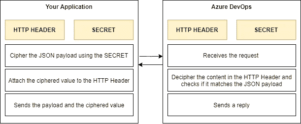

# 使用 Azure DevOps webhooks 构建 JAMStack 网站

> 原文：<https://levelup.gitconnected.com/using-azure-devops-webhooks-to-build-jamstack-websites-76e8daf17d75>

2020 年， [Azure DevOps](https://azure.microsoft.com/pt-br/services/devops/) 开始[支持通用 webhooks](https://docs.microsoft.com/en-us/azure/devops/release-notes/2020/pipelines/sprint-172-update?WT.mc_id=DOP-MVP-21138#generic-webhook-based-triggers-for-yaml-pipelines) ，允许其他应用程序在你的存储库上自动启动管道。在本文中，我们将看看如何实现这一点。

想象一下，你需要一种安全可靠的方式来托管你的应用程序，而一个静态应用程序将是完美的。来了 [JAMStack](https://jamstack.org/) 。JAMStack 是一种架构模型，它通过 API 调用和网站的静态预构建将内容管理从前端拆分出来。

你用一个静态生成器来建立你的网站，就像[盖茨比](https://www.gatsbyjs.com/)， [Next。JS](https://nextjs.org/) ，甚至 [Jekyll](https://jekyllrb.com/) (查看完整列表[此处](https://jamstack.org/generators/))。您的内容可以通过 web API 调用 headless CMS 服务(完整列表[此处](https://jamstack.org/headless-cms/))或其他来源从本地文件中获取。然后，静态站点生成器合并内容并创建所有静态文件(js、html、css、json 和其他文件),这些文件可以由 web 服务器或存储桶(如 AWS 3S Bucket 或 Azure Blob)提供服务。

所有这些都很酷，很有趣，但是我们如何让最终用户在 headless CMS 上编辑内容时，Azure DevOps 上可以触发构建和部署管道呢？Webhooks 来救援了！使用 *webhooks* ，我们可以在 Azure Devops 上创建一个监听器，当需要构建和部署我们网站的新版本时，我们的 headless CMS 将调用这个监听器。

因此，主要目标是建立一个工作流，允许最终用户控制何时建立一个新版本的网站，基于新的内容，应该创建和部署，没有任何技术知识。

# 创建 webhook 侦听器(Azure DevOps 端)

你可以点击在 Azure DevOps [上按照步骤设置 *webhook* 。这份材料总结了你在 Azure DevOps 需要做的一切，所以没有必要在这里重复。](https://docs.microsoft.com/en-us/azure/devops/release-notes/2020/pipelines/sprint-172-update?WT.mc_id=DOP-MVP-21138#generic-webhook-based-triggers-for-yaml-pipelines)

# **创建一个 webhook“呼叫者”(您的应用程序)**

在 Azure DevOps 上创建了你的 *webhook* 之后，你会想“我需要使用 HTTP 头和密码吗，或者我可以不使用它就启用它吗？”，简短的回答是“是的，你需要它”。否则，互联网上的任何人都能够 ping 通您的 *webhook* 端点，无数的构建可能会被触发。了解了这一点，让我们用 C#实现一个安全的请求方法。

交易很简单。您使用 HMACSHA1 算法(Azure DevOps 使用该算法来解密和验证内容)对 JSON 内容进行加密，将加密的内容添加到 HTTP 头中，并将其发送到请求中。Azure DevOps 服务将接收请求，解密它并检查它是否有效。因为只有接收者和发送者知道 HTTP 头和秘密，所以只有授权的应用程序和请求会触发钩子。

对这一过程如何运作的浅显表述。

下面是一个简单的方法实现。

# 收尾

在此之后，在 Azure DevOps 中设置 CI/CD 流程，允许将新的构建部署到您的环境中，您应该会做得很好。每当用户需要更新 JAMStack 网站中的内容时，他们可以触发一个新的构建，几分钟后，您的静态内容就会发布。

一些资源可能有助于在 Azure DevOps 中设置 CI/CD 流程:

*   [创建你的第一个管道——Azure 管道|微软文档](https://docs.microsoft.com/en-us/azure/devops/pipelines/create-first-pipeline?view=azure-devops&tabs=java%2Ctfs-2018-2%2Cbrowser)
*   [定制您的管道— Azure 管道|微软文档](https://docs.microsoft.com/en-us/azure/devops/pipelines/customize-pipeline?view=azure-devops)
*   [使用 YAML 模板的 Azure DevOps 构建&版本🚀|作者:凯勒·明塔|农牧之神出版社](https://faun.pub/azure-devops-build-release-with-yaml-templates-d55f25a4928c)
*   [Azure DevOps —如何进行全自动发布(第三部分)—欧洲 SharePoint，Office 365&2021 年 Azure 大会(sharepointeurope.com)](https://www.sharepointeurope.com/azure-devops-fully-automated-release-part-3/)