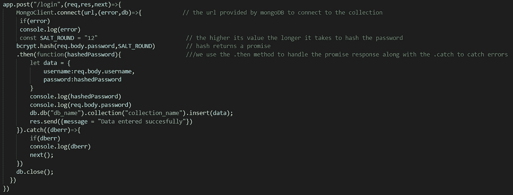
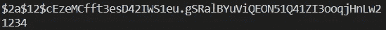
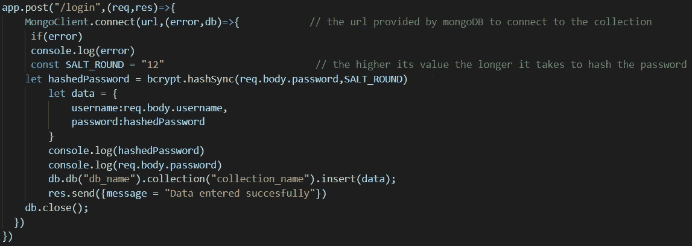
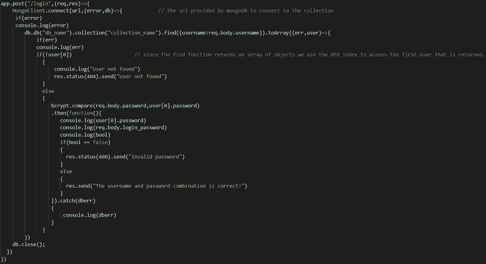
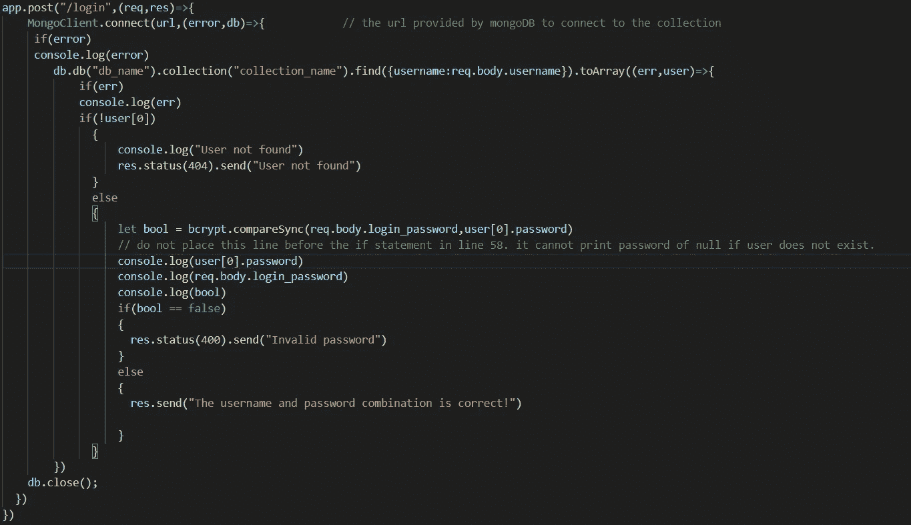
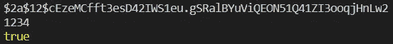

# 用 bcrypt 散列和比较 Nodejs 和 MongoDB 的密码。

> 原文：<https://levelup.gitconnected.com/using-bcrypt-to-hash-and-compare-passwords-with-nodejs-and-mongodb-366ff80138b7>

毫无疑问，散列是任何存储敏感用户信息(如密码)的 web 应用程序的重要组成部分。那么，哈希是什么？哈希是将某个值转换成其他值的过程。散列函数是执行散列的函数。好的散列算法是其散列不能被解码或转换回其原始值的算法。

这里我将使用 npm 的 bcrypt 库。如需详细解释，请访问[此处](https://www.npmjs.com/package/bcrypt)。

首先，我们必须安装 bcrypt，以便打开您的首选终端并键入:

```
npm install bcrypt
```

一旦安装了 bcrypt，它就必须是必需的，如下所示:

```
var bcrypt = require(“bcrypt”)
```

接下来，让我们继续把我们的密码转换成散列。假设从一个表单中提取数据，密码需要散列，有两个不同的函数可以使用:

第一个是 ***hash()*** 函数，这个函数有两个参数。第一个是要散列的数据，第二个是 salt 或 saltrounds。

我们来分析一下。

salt 是一个额外的安全层，它被添加在哈希的开始，以在预先计算的哈希攻击的情况下保持密码的安全。salt 是一个表示散列复杂度的数字。其值越高，密码被散列化的时间就越长。

***hash()*** 方法也有一个回调函数(回调函数将有 error 和 result 之类的参数)，它返回一个需要处理的承诺。下面是使用哈希函数的代码。它从表单中获取数据。启动服务器并运行这段代码。我的数据库使用 Nodejs 和 MongoDb。



哈希密码看起来有点像这样。



第一个是散列密码。第二个是原密码。前 7 个字符是由***salt _ ROUND****生成的 SALT。*这里它的值是 12。

第二种方法是 ***hashSync()*** 方法，这相当简单，因为它只需要两个参数。第一个是要散列的数据或字符串，第二个是 saltround。与 ***hash()*** 不同，该函数不返回承诺，而是返回散列输出。我更喜欢这种方法，因为它不涉及承诺，而且更简单。如果你想了解更多关于承诺的信息，请点击[这里](https://developer.mozilla.org/en-US/docs/Web/JavaScript/Reference/Global_Objects/Promise)。

下面是 ***hashSync()*** 函数的代码。启动服务器并运行代码。



这里，**散列密码**的值是散列输出。输出的格式与上面的输出相同。

很好，现在我们已经散列了我们的密码，让我们继续比较它们。

必须进行密码比较，以验证进入您的 web 应用程序的用户，分配令牌等。

和前面的例子一样，有两种方法可以比较数据库中的密码和登录表单中输入的密码。

第一个是 ***compare()*** 方法，它与 ***hash()*** 函数一样返回一个承诺。它的第一个参数是手动输入或通过登录表单输入的未散列密码。第二个参数是一个字符串，或者说是数据库中存储的密码。它返回一个承诺，可以使用。然后()和。catch()方法。代码如下。



输出将被发送到提交表单的 html 页面或/login URL。

第二个方法是 ***compareSync*** ()方法，它与 ***compare()*** 函数不同，返回一个布尔值(真/假)。它的第一个参数是用户在登录表单中输入的**未散列的**密码，第二个参数是存储在数据库中的散列密码或字符串。下面给出了***compare sync()***函数的代码。



它向提交表单的 html 页面或/login URL 返回一条消息。与其他方法相比，使用同步方法的优势在于您不必处理承诺。如果你是 web 开发的新手，只是想要一个快速的表单验证方法。我会建议你使用上面的 ***hashSync()*** 和***compare sync()***的方法。

同样，如果您要控制台记录 bool 和其他变量，如***compare sync()***cod 所示，输出将如下所示。

