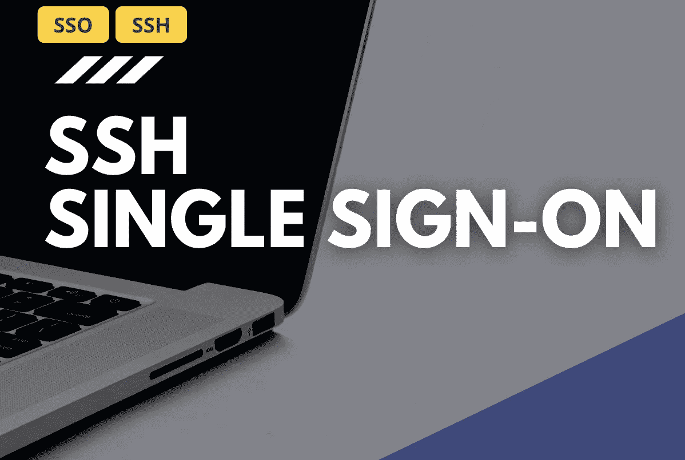
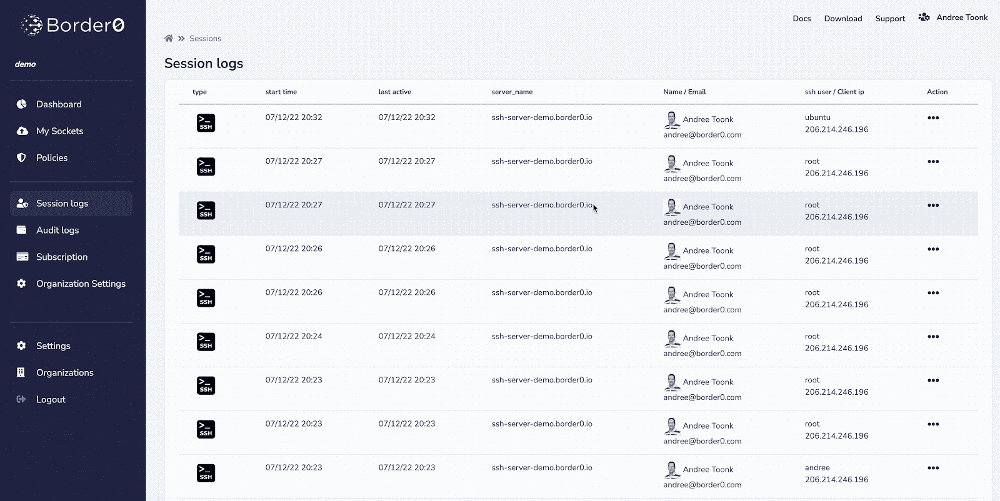

# 使用 GitHub 或 Google SSO 凭证访问您的 SSH 服务

> 原文：<https://levelup.gitconnected.com/using-border0-to-access-ssh-services-with-your-sso-credentials-19ed2922b27a>

这篇文章最初发表在[Border0.com 的博客上。](https://www.border0.com/blogs/ssh-single-sign-on)



在这篇博文中，我们将看看如何使用 [Border0](https://border0.com) 通过单点登录(SSO)凭证访问 SSH 服务。这意味着不需要管理、发送和轮换 SSH 密钥，以及灵活的策略来控制谁可以在何时何地访问您的 SSH 服务器。最重要的是，您的服务器可以运行在一个专用网络中，例如在 NAT 或专用 VPC 之后，您的用户将能够访问它们，而不需要 VPN！

随着威胁形势的不断发展以及向云的迁移变得越来越流行，越来越多的组织正在放弃传统的远程访问 VPN，而采用零信任私有访问解决方案。这是因为需要对基于时间、身份和策略的资源进行更细粒度的访问，而不是仅仅基于 IP 范围的信任。‍

SSH 是一项流行且关键的技术，用于提供对关键系统(如服务器、IOT 设备，甚至是容器和网络设备，如路由器和交换机)的安全可靠的访问。从 Telnet 的旧时代到今天 SSH 的普遍使用，我们已经走过了漫长的道路。通过这一举措，所有连接现在都进行了端到端加密，并且我们现在能够使用基于密钥的身份认证。然而，仍然存在一些挑战。例如，大多数 SSH 部署使用静态密码或 SSH 密钥进行身份验证，这些密码或密钥可能会被窃取或泄露。SSH 本身并没有提供一种简单的机制来实施安全策略或监控对系统的访问。它也不容易支持单点登录(SSO)，这使得组织很难将 SSH 与他们现有的身份管理系统集成。‍

# 我们真正想要的是什么？

在当今世界，您的许多资源通常托管在私有或受到良好保护的网络中，如私有 VPC。因此，从设计上来说，它很难直接从互联网上访问。我们不希望坏人进入我们的服务器！但这也让你的工程师更难接触到它。我们真正想要的是通过 SSH 访问这些服务器，就好像它们就在同一个网络中，就在您的旁边。没有 VPN，不用担心防火墙规则，然而，除了你的团队之外，没有人能够与你的 SSH 端口通信。最后，理想情况下，您可以只使用您的单点登录凭证，因此没有必要到处传递 SSH 密钥，当然也没有本地密码！‍

# Border0 和 SSH 访问

使用 Border0' anycasted 应用程序和身份感知代理，提供零信任 SSH 访问并提供用户友好的体验是非常容易的。使用户无论身在何处，都能在需要时更轻松地访问他们需要的系统，同时仍然保持高度的安全性。‍

使用 Border0，我们可以在几分钟内解决上述挑战以及更多问题。让我们想象一个场景，我们在一个私有网络中有一个虚拟机，我们希望少数人能够访问它。在下面的例子中，我们将向您展示如何使用 Border0 使您的 SSH 服务可用；只需要一分钟！‍

**来看看演示吧！**

‍The:最简单的开始方式是让这个脚本为你工作。

```
curl -s https://download.border0.com/install.sh | sudo bash‍
```

您可能会问，这个安装脚本是做什么的？它将下载 Border0 CLI 客户端并安装一些依赖项来帮助您运行。然后，脚本会要求您使用管理员凭据登录 Border0 门户。这是一次性的任务，因为安装脚本接下来要做的事情是创建一个 Border0 API 令牌，它将在以后使用这个令牌。接下来，它将在 Border0 平台中创建 SSH 服务，并将这台机器连接到 Border0 云。最后，该脚本将安装一个 systemd 单元并启动新服务。搞定了。‍

现在，您已经通过 Border0 平台在 SSH 上使用了这个服务器。这意味着你得到了很多额外的东西！

‣这台机器可以在专用网络(vpc)中运行。它所需要的只是出站网络访问，比如通过 NAT 网关。或者只是阻止传入的 SSH 流量。
‣它运行自己的 SSH 守护程序，只能通过 Border0 隧道访问。即。没有可从互联网访问的 SSH 端口
‣您可以使用您现有的 SSO 帐户登录这台机器，例如，使用您的 Gmail 或 GitHub 帐户！

‣你现在可以使用一个策略来定义谁在什么条件下(谁，什么时候，从哪里，等等)可以访问这台机器。).默认情况下，我们会附加默认的组织范围策略，但是您可以根据自己的需要进行自定义。

‍Ok，让我们试着用下面的代码登录:

```
border0 client ssh‍
```


SSH 登录

‍In 在上面的例子中，我使用了 border0 CLI 客户端。这使我能够快速发现我可以访问的所有服务。我也可以使用 Border0 桌面应用程序，或者如果你喜欢使用常规的 OpenSSH 客户端，查看这里的[说明](https://docs.border0.com/docs/securing-access-to-an-ssh-server#bonus---connecting-using-your-existing-openssh-client)。


# ‍Session 日志和会话重放

我们看到了管理员让 SSH 服务对您的团队和同事可用是多么容易。仅仅使用您的 SSO 凭证访问 SSH 服务器有点像魔术，对吗？！一个额外的好处是，我们现在确切地知道谁(什么单点登录身份)访问了您的服务。

‍It 变得更好；您现在可以轻松地控制和查看谁访问了什么 SSH 服务，并且还可以重放实际的 SSH 会话！

下面的‍The 图像显示了管理员视图。首先，我们看到该组织中 SSH 服务的所有会话。选择一个特定的 SSH 会话后，我们现在可以重放该会话，并看到用户会话的重放。就像看电影一样！这使我们能够准确地跟踪会话期间发生的事情，这是一个强大的工具！‍



SSH 会话日志和会话记录

# ‍Wrap 起来了

在这篇博文中，我们看到了如何在不需要 VPN 的情况下轻松使用 SSH 服务，并使用我们现有的单点登录凭据(如您的 Google 或 GitHub 帐户)登录到这些服务器。‍

虽然 SSH 客户端(如工程团队)的工作流基本保持不变。管理员可以使用各种新的强大功能。使用 Border0 策略，很容易提供基于 SSO 身份、时间、日期、IP 地址和地理位置的授权规则。最后，管理员现在可以在一个地方查看服务的所有会话，并能够重放 SSH 会话。‍

我们相信，对于寻求增强安全性和防范日益复杂的威胁的团队来说，这是一组强大的功能。通过提供持续监控、持续执行安全策略和更友好的用户体验，使用 Border0 的 SSH 访问是安全访问的下一次发展！‍

希望这展示了 Border0 的入门是多么容易。我们邀请您亲自体验一下，并在此注册我们免费的全功能[社区版](https://portal.border0.com/register)！最后，不要忘记查看我们的文档以获得更多的例子和信息。