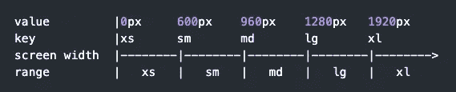
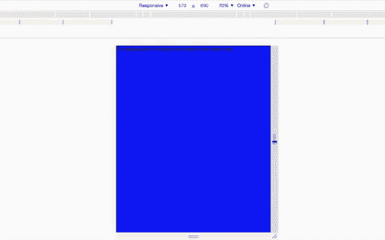
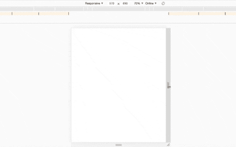

# 在 Material-UI 中使用断点和媒体查询

> 原文：<https://levelup.gitconnected.com/using-breakpoints-and-media-queries-in-material-ui-47470d3c43d9>

## 如何使用 Material-UI 使您的应用程序响应迅速


由[丹尼尔·罗梅罗](https://unsplash.com/@rmrdnl?utm_source=medium&utm_medium=referral)在 [Unsplash](https://unsplash.com?utm_source=medium&utm_medium=referral) 上拍摄

Material-UI 是最流行的 React UI 组件库之一。它采用了谷歌的材质设计。

我在最近的项目中使用 Material-UI 获得了很多乐趣。它现在是我设计 React 应用程序的首选。我花了一段时间才理解编写媒体查询的最佳方式，所以我写了这篇文章，以便在将来帮助他人。

使用 Material-UI 有几种不同的方法可以创建一个响应式应用程序。在本文中，我们将通过使用`makeStyles`和`useMediaQuery`钩子来看看如何使用断点来编写媒体查询。

# 了解断点

在我们开始在 Material-UI 中编写媒体查询之前，让我们先了解一下[断点](https://material-ui.com/customization/breakpoints/)的用法。

> “为了获得最佳的用户体验，材料设计界面需要能够在不同的断点处调整布局。Material-UI 使用原始[规范](https://material.io/design/layout/responsive-layout-grid.html#breakpoints)的简化实现。

Material-UI 带有一个默认主题，包括断点。默认断点如下。

*   **xs，**超小型:0px
*   **sm，**小:600 像素
*   **md，**介质:960 像素
*   **lg，**大:1280 像素
*   **xl，**特大号:1920 像素



主题提供者为我们编写媒体查询提供了四个样式助手。你可以在下面的链接中读到更多关于如何实现每一个的信息。

*   [主题.断点. up(关键)](https://material-ui.com/customization/breakpoints/#theme-breakpoints-up-key-media-query)
*   [theme.breakpoints.down(按键)](https://material-ui.com/customization/breakpoints/#theme-breakpoints-down-key-media-query)
*   [theme.breakpoints.only(关键)](https://material-ui.com/customization/breakpoints/#theme-breakpoints-only-key-media-query)
*   [theme.breakpoints.between(开始，结束)](https://material-ui.com/customization/breakpoints/#theme-breakpoints-between-start-end-media-query)

基本上，我们将传入一个断点作为参数，这将为我们返回一个媒体查询。

比如我们可以用`theme.breakpoints.up('sm')`。这意味着我们希望匹配大于或等于小屏幕尺寸(600 像素)的屏幕宽度。

您也可以[定制](https://material-ui.com/customization/breakpoints/#custom-breakpoints)断点以满足您的需求。为此，您需要用`createMuiTheme`函数覆盖默认值。

# 带有 makeStyles 的断点

现在我们已经了解了断点，让我们使用它们。使用它们的第一种方法是使用`makeStyles`编写媒体查询。你可以点击查看文档[。](https://material-ui.com/styles/basics/)

首先，我们需要从 Material-UI 导入`makeStyles`。

```
import { makeStyles } from '@material-ui/core';
```

`makeStyles`钩子要么接受一个函数，要么接受一个对象。为了让我们使用主题和断点，我们将提供一个以主题为道具的函数。在这个函数中，我们将传递一个带有类的对象。每个类都有我们想要应用到项目中的样式。

`makeStyles`函数返回一个钩子。这种挂钩通常被称为`useStyles`。

在下面的例子中，我们创建了一个高度为 100vh，背景颜色为蓝色的根类。我们可以使用默认的主题断点来编写媒体查询。

我们是说，每当屏幕尺寸是小尺寸(600 像素)或以上，背景颜色将是红色。当它是中等大小(960px)或以上时，背景颜色将是绿色。当它是大尺寸(1280px)或以上时，背景颜色将是橙色。而当它是超大尺寸(1920px)以上时，背景颜色会是青色。

```
const useStyles = makeStyles(*theme* => ({
  root: {
    height: '100vh',
    backgroundColor: 'blue',
    [theme.breakpoints.up('sm')]: {
      backgroundColor: 'red',
    },
    [theme.breakpoints.up('md')]: {
      backgroundColor: 'green',
    },
    [theme.breakpoints.up('lg')]: {
      backgroundColor: 'orange',
    },
    [theme.breakpoints.up('xl')]: {
      backgroundColor: 'cyan',
    },
  },
}));
```

为了使用`useStyles`钩子，我们将在我们的应用程序中调用它，然后`makeStyles`将为我们生成所有的样式并将其存储在一个对象中。一般这个对象会被称为`classes`。

然后我们可以将`classNames`添加到元素中，并添加类名`classes.root`来应用样式和媒体查询。

```
const App = () => {
  const classes = useStyles();

  return (
    <div className={classes.root}>
      <Typography>
        The background will change color based on the screen size.
      </Typography>
    </div>
  );
};
```

现在，背景颜色会根据屏幕大小而变化。



# 使用 useMediaQuery 挂钩

在某些情况下，将媒体查询添加到样式中是不够的。例如，如果您希望有条件地在页面上呈现某些内容，这可能会变得复杂。在这种情况下，您可以使用`useMediaQuery`挂钩。

根据[文档](https://material-ui.com/components/use-media-query/)，

> 这是 React 的 CSS 媒体查询钩子。它监听 CSS 媒体查询的匹配。它允许根据查询是否匹配来呈现组件。

要使用`useMediaQuery`钩子，首先从 Material-UI 导入它。

```
import { useMediaQuery } from '@material-ui/core';
```

在该组件中，调用`useMediaQuery`钩子并传入一个媒体查询作为参数。这将返回 true 或 false 值。

```
const showText = useMediaQuery('(min-width:600px)');
```

我们也可以像前面的例子一样使用断点。为此，我们还需要导入`useTheme`钩子，并在组件中调用它。

```
import { useTheme, useMediaQuery } from '@material-ui/core';
```

当我们调用`useTheme`钩子时，它将返回一个包含所有主题属性的对象，包括断点。现在，我们可以像以前一样使用样式助手。

```
const theme = useTheme();
const showText = useMediaQuery(theme.breakpoints.up('sm'));
```

接下来，我们可以使用`showText`变量根据屏幕大小有条件地呈现一个元素。如果屏幕小于 600px(默认小尺寸)，那么`showText`为假。如果是 600px 或者更大，那就是真的。

```
const App = () => {
  const theme = useTheme();
  const showText = useMediaQuery(theme.breakpoints.up('sm')); return (
    <div>
      {showText && <Typography variant="h1">Appear when 600px and above</Typography>}
    </div>
  );
};
```

现在，当屏幕尺寸低于 600 像素时，`showText`将为假，测试将不会呈现。当屏幕尺寸为 600px 及以上时，会显示。



你可以在下面的例子中看到使用`makeStyles`和`useMediaQuery`的完整代码。

# 结论

感谢阅读！我希望这篇文章有助于你理解如何在 Material-UI 中使用断点和媒体查询。

您可以使用`makeStyles`轻松添加媒体查询。如果您需要有条件地在页面上呈现某些内容，请使用`useMediaQuery`钩子。

如果你想了解更多关于 Material-UI 的知识，可以看看下面的两篇文章。

[](https://medium.com/swlh/create-a-customized-color-theme-in-material-ui-7205163e541f) [## 在材质界面中创建自定义的颜色主题

### 为下一个 React 项目定制颜色主题很容易

medium.com](https://medium.com/swlh/create-a-customized-color-theme-in-material-ui-7205163e541f) [](https://medium.com/dev-genius/how-to-apply-dark-mode-using-material-ui-18de9d095d9a) [## 如何使用 Material-UI 应用黑暗模式

### 只需一个开关，即可将 React 应用程序从亮模式切换到暗模式

medium.com](https://medium.com/dev-genius/how-to-apply-dark-mode-using-material-ui-18de9d095d9a)