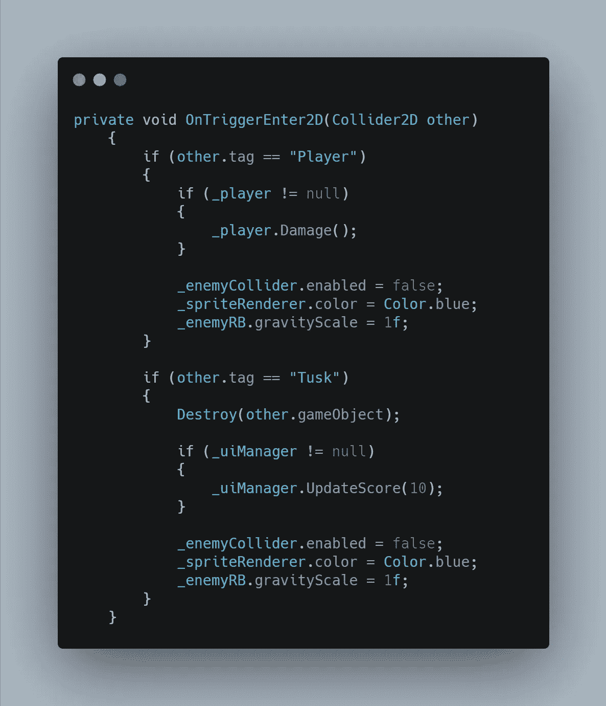

# 在 Unity 中使用 C#创建一个死亡行为的敌人

> 原文：<https://levelup.gitconnected.com/using-c-in-unity-to-create-an-enemy-on-death-behavior-a595f76d9f07>

视频游戏在展示各种死亡行为方面有着丰富的历史。如果我正在处理机械的和潜在易燃的游戏物体，比如汽车或飞机，我可能想在敌人死亡时制造一次爆炸。我可以通过给敌人**游戏对象**附加一个爆炸**动画**，然后使用**动画器**中的**触发参数**来播放当敌人**与**玩家**或**抛射体**碰撞**时的爆炸动画。敌方游戏对象本身也可以持有任何可能想玩的爆炸**音效 FX** 。由此可能产生的一个潜在问题是，如果你的敌人有**碰撞器**和/或**发射**武器。敌人游戏对象将需要保持**活动**与**一样长**，因为它需要**爆炸动画**和**音效**到**播放**出来。如果敌人应该在那一点上死亡，那么**碰撞器**应该被**禁用**，以及任何**发射**机制，除非你潜在地想要爆炸动画引起碰撞或发射射弹。

另一个选择是从动画精灵爆炸序列中制作一个**预设**游戏对象，并且**在**敌人**的**位置**处实例化**它，就在它到期之前。同样的爆炸预设也可以包含当爆炸发生时触发的声音特效，并且没有碰撞器或火力对物体造成意外的行为。

在这篇文章中，我没有使用宇宙飞船、火箭甚至动画。只有我，我的海洋朋友，Unity 和 Visual Studio。我将向你展示我如何使用**代码**和 Unity 内置的**物理**引擎来制作一个简单的死亡行为。

在我的**敌人脚本**中，我需要一些**变量**给我想要访问的**组件**。

在 **void Start** 中，我使用 **GetComponent** 抓取我想要的组件。

我的 **OnTriggerEnter2D** 方法是敌人**对撞机**与**玩家**和**抛射体**游戏物体交互的地方，所以那是我需要做一些调整的地方。由于**玩家和投射物都在杀死敌人，所以**镜像**两个碰撞的命令。我首先**禁用**碰撞器**碰撞器**，这样它就不会撞上并伤害应该已经死亡的玩家。然后我访问**精灵渲染器**并将精灵**颜色**从默认改为**蓝色**。这使得精灵变成了深蓝色，表明敌人不再是威胁。然后我将 **Rigidbody2D** 上的**重力刻度**设置为 **1** (从零开始)，所以之前的零重力物体现在**随着 Unity 的物理系统自由下落**。**

下落的速度非常快，正如你对重力的预期。我可以使用我的 **Rigidbody2D** 组件上的**线性拖曳**对话框，给**添加拖曳**，这将**减缓**物体下落时的**下降**。我知道现实生活中用独角兽射鱼是不会这样掉在海里的…我是说独角鲸的獠牙，但这毕竟是游戏。在这里，我制定规则！

最后，我**翻转**在 **Y 轴**上的死敌鱼，这样它被杀死时会上下颠倒。可怜的小家伙。

在我的下一篇文章中，我会给我的玩家一些受到伤害的动画，并展示如何通过动画师触发它。感谢阅读！