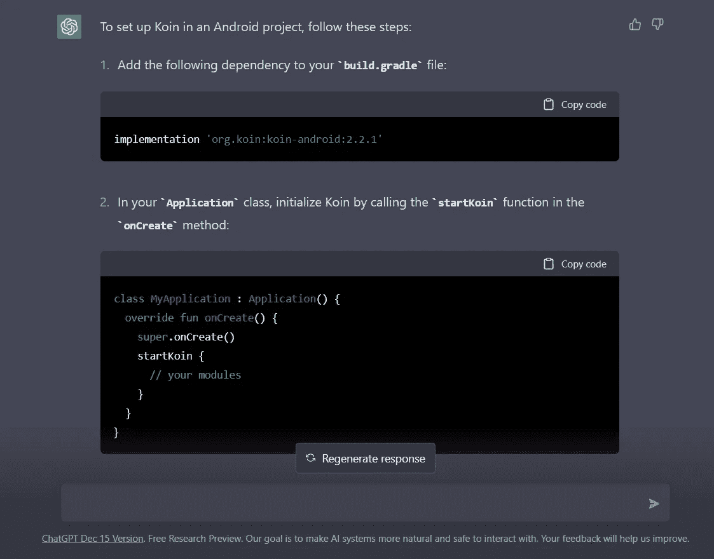
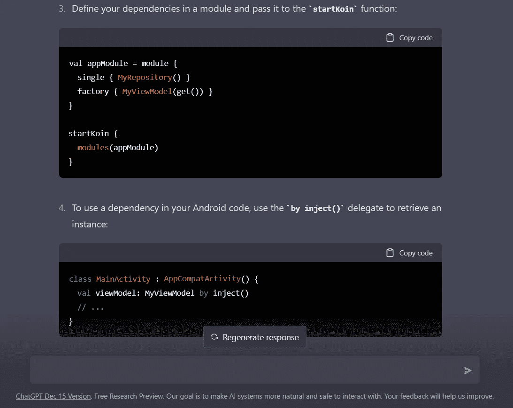
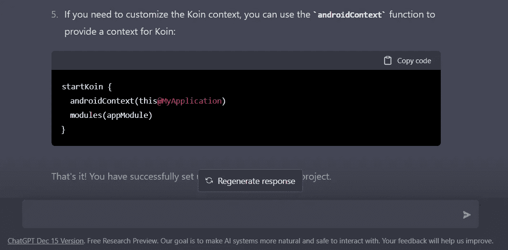
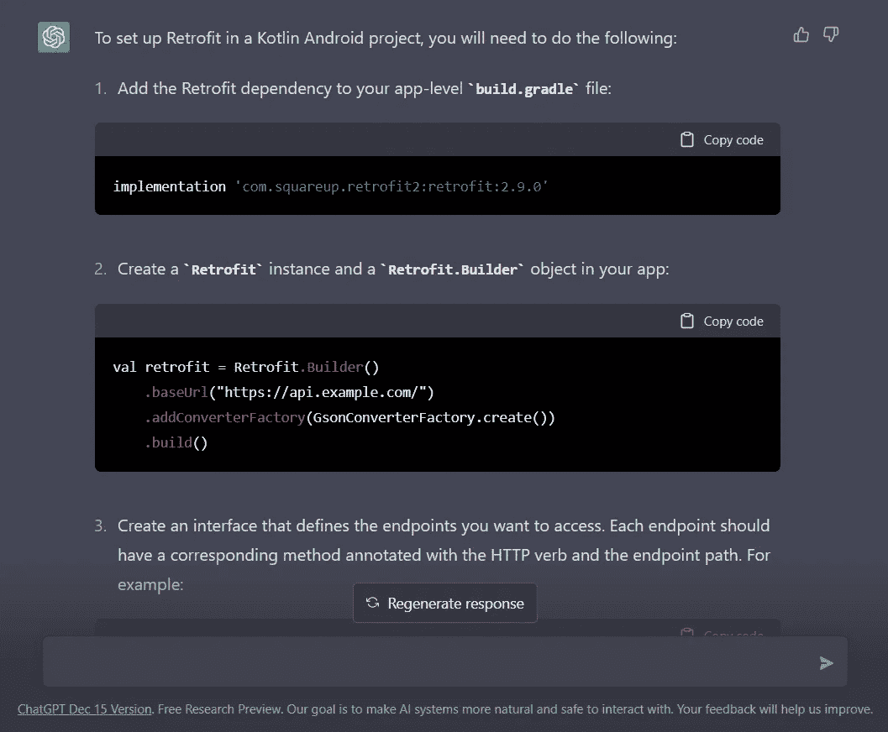
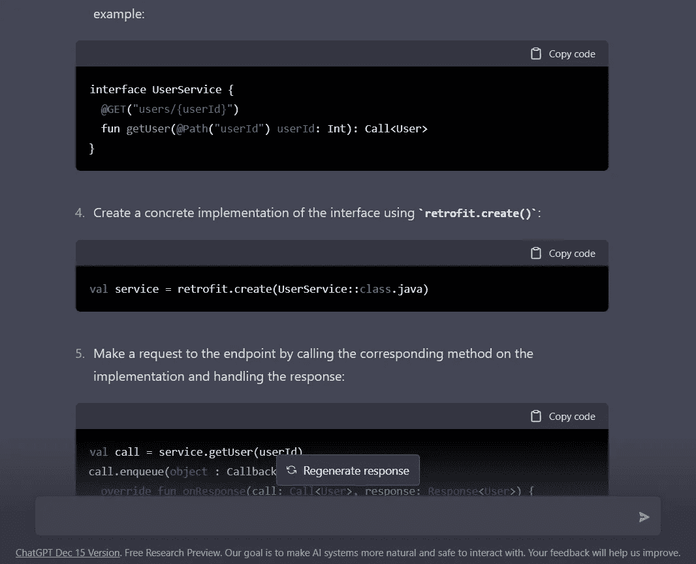
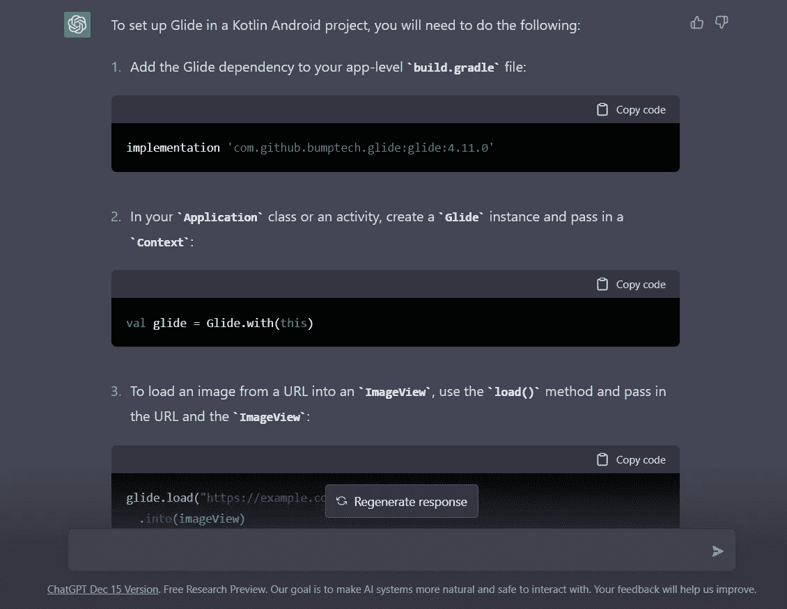
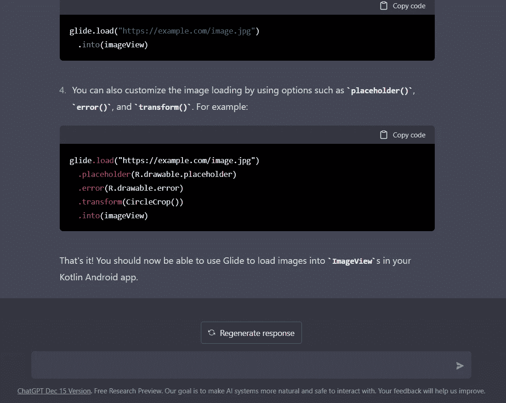

# 使用 ChatGPT 设置 Android 应用程序

> 原文：<https://levelup.gitconnected.com/using-chatgpt-to-set-up-an-android-app-82d65c82cb7b>

## 使用 ChatGPT 生成样板代码并提高生产率

除非你一直生活在岩石下，否则你一定听说过这个由 [OpenAI](https://en.wikipedia.org/wiki/OpenAI) 开发的新聊天工具 ChatGPT。ChatGPT 是 GPT(预训练生成转换器)语言模型的一种变体，专门用于支持自然语言对话。它能够根据对话的上下文产生类似人类的反应。你可以在这里使用 ChatGPT:【https://chat.openai.com/chat 


照片由[亚历山大·奈特](https://unsplash.com/@agk42?utm_source=medium&utm_medium=referral)在 [Unsplash](https://unsplash.com?utm_source=medium&utm_medium=referral) 上拍摄

在本文中，我们将使用 ChatGPT 来设置我们在 Android 项目中通常需要的库依赖。我们还将使用 ChatGPT 为我们生成样板代码，这将帮助我们提高整体开发效率。

由于我们是从零开始我们的 Android 项目，我在下面列出了我们在 Android 项目中通常需要的三个基本的第三方依赖。因此，我们将请求 ChatGPT 帮助我们建立下面提到的依赖关系:

1.  设置任何 DI (Dagger 或 Koin)框架(我们将使用 Koin)
2.  为拨打网络电话设置改装
3.  设置图像加载器框架。我们将设置滑翔

## 1.在 Android 中设置 Koin 框架

K oin 是一个实用的轻量级依赖注入框架。仅使用函数解析用纯 Kotlin 编写。

这是我问的问题:

**查询到 ChatGPT:**

> 在 Android 项目中设置 Koin

**响应:**

它列出了在 Android 项目中设置 Koin 所需的所有必要步骤。这包括添加对 build.gradle 的依赖、创建虚拟模块、在活动中注入 ViewModel 以及从应用程序类启动 Koin 框架的示例代码。

以下是我们从 ChatGPT 收到的回复截图:



ChatGPT 对查询的回复:如何在 Android 项目中设置 Koin



ChatGPT 对查询的回复:如何在 Android 项目中设置 Koin



ChatGPT 对查询的回复:如何在 Android 项目中设置 Koin

显然，代码必须更新以适应单个项目的需求。但是，当您编写基本的样板代码时，这肯定会加速开发过程

## 2.为拨打网络电话设置改装

我们将尝试在 Android 应用程序中设置更新。Retrofit 是一个流行的 Android that 客户端库，它允许您发出网络请求并解析来自 web 服务器的响应。它简化了在 Android 应用中处理 HTTP 请求和响应的过程，并使消费 RESTful web 服务变得容易。

**查询到 ChatGPT:**

> 在 Kotlin Android 项目中设置改造

**回应:**

在回复我们的查询，我们已经得到了依赖，我们将不得不添加在 Android 项目中添加翻新。然后，我们得到了一些样例代码来设置改型中的基本 URL、虚拟 API 请求和一个用于发出网络请求的代码片段。

以下是我们从 ChatGPT 收到的回复截图:



当被问及 Kotlin Android 项目的改装设置时，ChatGPT 的回答



当被问及 Kotlin Android 项目的改装设置时，ChatGPT 的回答

当开发人员在新项目中第一次设置这些依赖项时，这些响应通常会很有帮助。但是开发人员在参考这些指南时必须小心，因为这里提到的步骤可能已经过时，或者可能使用了一些不应该使用的过时的 API

## 3.设置图像加载器框架(Glide)

lide 是一个用于 Android 的图像加载库，允许你有效地加载、缓存和显示图像。它是由 Google 开发的开源库，广泛用于 Android 应用程序中，以显示来自各种来源的图像，如本地存储、网络或文件系统。

**查询到 ChatGPT:**

> 在 Kotlin Android 项目中设置 Glide

**响应:**

为了响应我们的查询，我们获得了需要添加到 build.gradle 文件中的依赖项，以便包含 Glide。我们还获得了一些示例代码来开始实现

以下是我们从 ChatGPT 收到的回复截图:



当被要求在 Kotlin Android 项目中设置 Glide 时，ChatGPT 的回应



当被要求在 Kotlin Android 项目中设置 Glide 时，ChatGPT 的回应

这是简单明了的。它总结了 Glide 集成的四个步骤，这足以启动集成

## 结论

现在你自己试试吧。询问稍微复杂一点的问题，例如:

> 实现 recyclerview 以下载和显示 unsplash.com 的图像

我尝试了上面的查询，结果令人印象深刻。它能够自己编写大量的代码。

我希望你觉得这篇文章有趣。既然你已经在这篇文章中读到这里，不要忘记点击**拍手**图标，并关注更多这样的内容

```
Want to connect?
My [LinkedIn](http://linkedin.com/in/ninad-madhav-247a8b14) profile.
```

# 分级编码

感谢您成为我们社区的一员！在你离开之前:

*   👏为故事鼓掌，跟着作者走👉
*   📰查看[级编码出版物](https://levelup.gitconnected.com/?utm_source=pub&utm_medium=post)中的更多内容
*   🔔关注我们:[推特](https://twitter.com/gitconnected) | [LinkedIn](https://www.linkedin.com/company/gitconnected) | [时事通讯](https://newsletter.levelup.dev/)

🚀👉 [**加入升级人才集体，找到一份惊艳的工作**](https://jobs.levelup.dev/talent/welcome?referral=true)