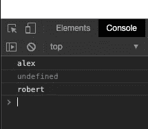

# 如何在 JavaScript 中使用闭包

> 原文：<https://levelup.gitconnected.com/using-closures-in-javascript-to-create-private-variables-c0b358757fe0>


照片由[戴恩·托普金](https://unsplash.com/@dtopkin1?utm_source=medium&utm_medium=referral)在 [Unsplash](https://unsplash.com?utm_source=medium&utm_medium=referral) 上拍摄

# 问题陈述

JavaScript 对象只是属性的集合。使用 object literal 语法或构造函数，可以轻松地创建对象和添加属性。下面是一个代码示例:

```
//object literal syntax 
var person1 = { 
  firstName: 'alex', 
  lastName: 'ritzcovan' 
}//constructor syntax 
function Person(first, last) { 
  this.firstName = first; 
  this.lastName = last); 
}//create a new person using our constructor 
var person2 = new Person('alex', 'ritzcovan');
```

这些方法中的每一种都给我们相同的结果。我们有一个新的对象，它有名字和姓氏属性。这很好，当然也很容易，但这种容易是有代价的。

如果我做了以下事情会怎么样？

```
delete person.firstName;
```

执行这段代码会做您可能会想到的事情。它从对象中删除 firstName 属性。虽然这在某些情况下可能很方便，但更多的时候，您希望在 JavaScript 对象上定义的属性是私有的。

*外部世界的直接进入剥夺了你控制财产价值的能力。*

这就是为什么这么多流行的面向对象语言提供了 *private* 关键字。一旦一个变量在这些语言中被声明为私有，程序员就创建 *get* 和 *set* 函数来获取和设置值。它让程序员可以控制被赋值的值，并允许其他特性，比如当值被获取或设置时进行日志记录。

不幸的是，JavaScript 没有为我们提供任何模拟 private 关键字的语法特性。然而，它确实为我们提供了闭包。使用闭包，我们可以模拟私有属性。在我们看如何做到这一点之前，让我们确保理解了闭包。

# 定义的闭包

MDN 文档对闭包的定义如下:

> *一个* ***闭包*** *是用对其周围状态的引用捆绑在一起(括起来)的一个函数的组合(这个* ***词法环境*** *)。换句话说，闭包允许您从内部函数访问外部函数的范围。在 JavaScript 中，闭包是在每次创建函数时创建的。*
> 
> MDN

我不知道你怎么想，但是当我学习闭包的时候，这个定义让我感觉有点像这样:


迷失在酱汁中

我喜欢这样想:

每次调用函数时都会创建一个闭包。它包含函数定义以及周围的状态。代码中定义*功能的位置*决定了闭包中包含的内容。

让我们看一些代码

```
//GLOBAL SCOPE var ten = 10;function makeAdder(num) { 
  // OUTER SCOPE 
  function add(num2) {  
    // INNER SCOPE 
    console.log(ten); //<-- we can still see ten here 
    return num + num2; 
  } 
  return add; 
}var adder1 = makeAdder(10); 
var adder2 = makeAdder(20); 
console.log(adder1(10)); 
console.log(adder2(500));
```

让我们把这段代码拆开。

首先，我们在全局范围内声明一个名为 ten 的变量。

接下来，我们有 makeAdder()函数，它接受一个数字作为参数。在 makeAdder()中，我们定义了另一个名为 add()的函数。

在 add()中，我们只打印十的值(只是为了表明我们仍然可以看到它)，并返回简单加法的结果。

在下一行，*我们返回 add 函数*，makeAdder()函数退出。

刚才我们说过*你可以通过查看定义它的地方来确定闭包里会有什么。嗯，通过查看 add 方法，我们可以看到我们将要访问:*

1.  在全局范围内定义的全局变量 ten
2.  即使在 makeAdder()退出之后，num 参数也被传递到 makeAdder() — *中。在外部范围中定义*

***这是一些神奇的闭包。在定义这些值的函数执行完毕后，您就可以访问这些值了。***

接下来，我们创建 2 个新的加法器，通过调用 makeAdder(10)和 makeAdder(20)传递我们希望保存在 num 参数中的值。

返回的*函数分别保存到 adder1 和 adder2* 变量中。接下来，我们*执行 adder1 和 adder2* (它们是对函数的引用)，传递我们想要添加的值。查看控制台，我们看到以下输出。


使用闭包的函数的输出

首先，我们看到 10。当 add 函数打印出*全局变量 ten* 的值时，就会打印出来。实际上你不会这么做。这只是为了表明我们仍然可以在闭包中访问它。

然后我们看到通过 adder1 引用对 add()的第一次调用。

```
console.log(adder1(10));
```

闭包*记住了*作为 num 传递的值，我们在控制台中得到 20。相当酷。对于 adder2 和 520 打印到控制台，同样的过程再次发生。

通过调用 makeAdder()，我们已经有效地创建了一个私有变量 *num* 。我们不能改变 num 中的值，但我们知道它在那里，因为我们的加法是正确的。我们可以用这些知识来模拟一个私有变量。

# 解决方案:创建我们的私有变量

现在我们知道了什么是闭包以及它是如何工作的，让我们将它付诸实践。看一下这段代码:

```
let myTest = (function () { 
  let _name = ''; 
  getName = function () { 
    return _name; 
  } 
  setName = function (newName) { 
    newName === 'bob' ? 
      _name = 'robert' : 
      _name = newName; 
  } 
  return { 
    getName: getName, 
    setName: setName 
  } 
}()); //this function is invoked as soon as the page loads
```

我们这里用的叫做 [*揭示模块模式*](https://addyosmani.com/resources/essentialjsdesignpatterns/book/#revealingmodulepatternjavascript) 。它是流行的 [*模块模式*](https://addyosmani.com/resources/essentialjsdesignpatterns/book/#modulepatternjavascript) 的略微修改版。

让我们分析一下发生了什么。

首先，我们定义我们希望我们的模块被称为什么。在这种情况下，我们称之为 myTest。我们将 myTest 设置为等于立即调用的函数表达式或 IIFE(读作 if-e)的结果。在函数定义中，我们有 private _name 变量、getName 函数和 setName 函数。最后，我们返回一个对象文字，它本质上包含指向我们函数的指针。

您可能会问“我怎么知道 _name 是私有的？”我们知道它是私人的，因为它藏在我们用生命创造的封闭空间里。

返回的对象文字本质上是面向公众的 API。无论你在这里返回什么，都是外部可访问的。因为我们没有公开 _name 变量，所以我们可以确信它是私有的。让我们来测试一下！

```
myTest.setName('alex'); 
console.log(myTest.getName());console.log(myTest._name);myTest.setName('bob'); 
console.log(myTest.getName());
```

紧接着上面的代码，我们在 myTest 上调用 setName。以下是我们在控制台中得到的结果:



您可以在输出中看到，我们成功地将名称设置为 alex 并检索了它。

然后我们试图直接访问 _name 变量，结果没有定义。我们的私有变量起作用了！！

然后，我们再次将名称设置为 bob。在我们的 setName 函数中，我们检查该值，如果传递的值是 bob，则将其更新为 robert。如果您希望 setter 中有某种类型的值，您可以想象这样进行检查。

我们已经成功地使用 closure 模拟了一个私有变量。此外，我们引入全局空间的唯一变量是 myTest。使用这种方法很容易避免全局空间中的命名冲突。

要阅读更多关于闭包、JavaScript 模式和其他优秀 JS 的内容，请查看以下链接:

[足够好](http://www.adequatelygood.com/JavaScript-Module-Pattern-In-Depth.html) —自由

[艾迪·奥斯马尼的伟大著作](https://addyosmani.com/resources/essentialjsdesignpatterns/book/)-免费

[JavaScript 中的函数式编程](https://www.manning.com/books/functional-programming-in-javascript) —付费

[JavaScript 忍者的秘密](https://www.manning.com/books/secrets-of-the-javascript-ninja-second-edition) —付费

不久前，我还在 youtube 上做了一个视频，介绍了揭示性的模块模式。[如果你感兴趣，请点击这里查看](https://youtu.be/1U9e5Eg_rfs)

感谢阅读！

*原载于*[*http://ritzcovan.com*](http://ritzcovan.com/index.php/2019/12/19/using-closure-in-javascript-to-create-private-variables/)*。*