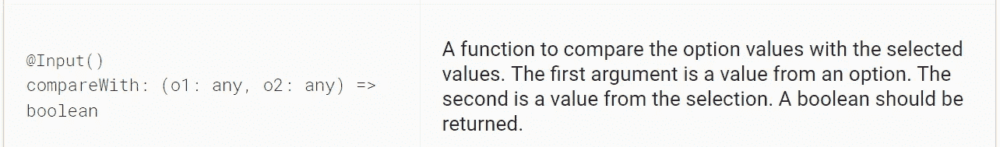

# 在角度材料 2 多选选项中使用 compareWith。

> 原文：<https://levelup.gitconnected.com/using-comparewith-in-angular-material-2-multiple-select-options-a6f44e565f90>



由 Google 2010–2018 提供支持。

最近，我需要在`mat-select`多选输入选项中设置一些默认选中的对象。数据保存后，用户在返回表单时应该会看到带有预填复选框的选项。简单地将`ng-model`绑定到选项并不能解决问题，因为选项中的对象和从先前保存的数据**中选择的子集中的对象具有不同的身份**，或者说**改变了对象引用**(在本故事中由[角度官方文档](https://medium.com/u/b889ae02aa26#caveat-option-selection)中的函数返回`true` :

```
compareFn(user1: User, user2: User) {
    return user1 && user2 ? user1.id === user2.id : user1 === user2;
}
```

一旦完成，只要数据中的用户模型和选项**中的用户模型具有相同的 id，任何先前保存在…(无论您保存数据的位置)的用户对象都会在`mat-select`的选项中被选中并返回表单🎉。**


震惊了。

最后，在 Angular/Material 的 demo-app 库中，他们有一个带有两个实现的`compareWith`的例子:一个在给定值上比较对象，另一个只有在两个对象有相同的引用时才返回`true`。你可以在这里找到例子[。](https://github.com/angular/material2/blob/1616f2fe90949b9ad76ac3389519fd49f3a1853c/src/demo-app/select/select-demo.html#L124)

[](https://levelup.gitconnected.com)[](https://gitconnected.com/learn/angular) [## 学习角度-最佳角度教程(2019) | gitconnected

### 47 大角度教程。课程由开发人员提交并投票，使您能够找到最佳角度…

gitconnected.com](https://gitconnected.com/learn/angular)