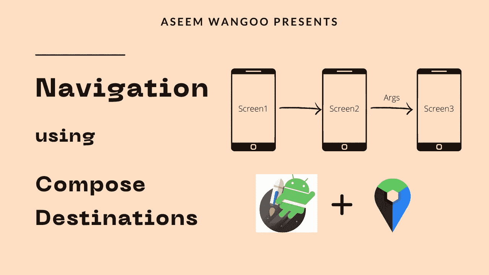
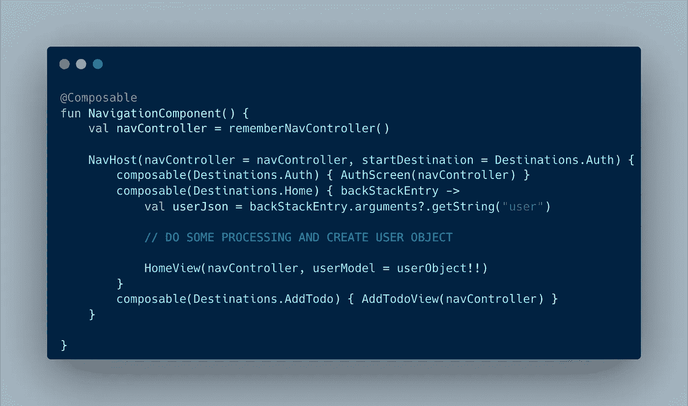
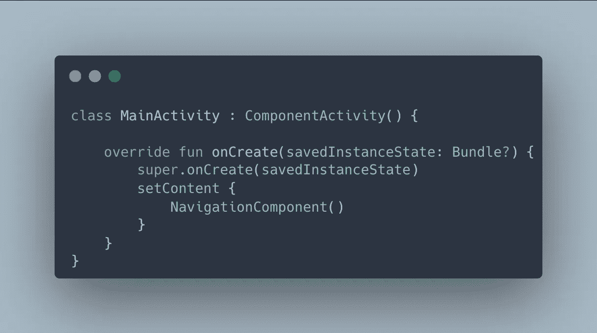
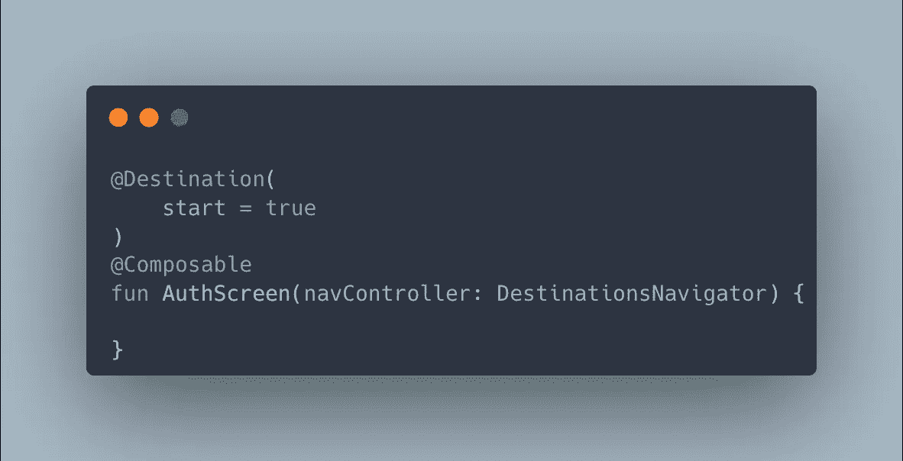
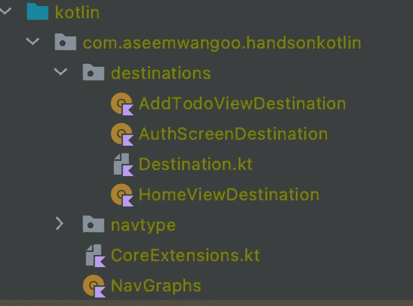
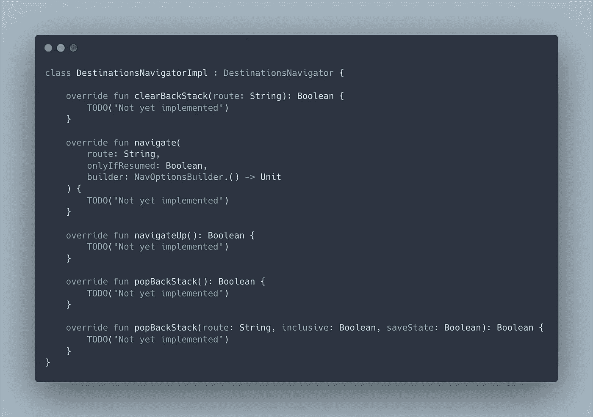

# 使用撰写目的地

> 原文：<https://levelup.gitconnected.com/using-compose-destinations-67aa2c0be7fc>

*使用合成目的地*

*文章在此:*[*https://flattered with flutter . com/using-compose-destinations/*](https://flatteredwithflutter.com/using-compose-destinations%ef%bf%bc/)

使用撰写目的地

我们将简要介绍:

1.  撰写中的当前导航
2.  使用撰写目的地
3.  (可选)修改现有的测试用例

> 注意:本文假设读者了解 Jetpack Compose



使用撰写目的地

# 撰写中的当前导航

我们从 Jetpack 组合中获得[组合导航](https://developer.android.com/jetpack/compose/navigation)。它提供了一个[导航组件](https://developer.android.com/guide/navigation)，允许您在不同的可组合组件之间导航。

让我们使用代码示例来看看它的运行情况。



导航组件

*   我们有可组合的`NavigationComponent`。您可以假设这个文件包含我们应用程序中的所有路线。我们可以看到，这里有三条路线，分别是:`Auth` `Home`和`AddTodo`
*   起始或第一条路线是`Auth`，基于某种逻辑(在我们的例子中是中的[符号)，它在经过一个对象`user`时重定向到`Home`](https://proandroiddev.com/google-signin-compose-a9afa67b7519)
*   我们所有的路线都需要一个导航控制器。`NavController`是导航组件的核心 API。它会跟踪应用程序中屏幕的堆栈以及每个屏幕的状态。
*   我们通过使用`rememberNavController()`方法创建一个`NavController`，并在我们的视图中传递它

```
val navController = rememberNavController()
```

## 正在创建 NavHost

*   每个`NavController`必须与一个`NavHost`可组合相关联。`NavHost`将`NavController`与一个导航图链接起来，该导航图指定了您应该能够在其中导航的可组合目的地。
*   为了将这一切联系起来，我们将上面的`NavigationComponent`放在我们的主活动中



主要活动

*   对于导航路线，我们使用`navigate()`方法。`navigate()`接受代表目的地路线的单个`String`参数。

```
// Navigate to some screen
navController.navigate("screen_route")// Pop everything up to the "home" destination off the back stack before
// navigating to the "friendslist" destination
navController.navigate("friendslist") {
    popUpTo("home")
}

// Pop everything up to and including the "home" destination off
// the back stack before navigating to the "friendslist" destination
navController.navigate("friendslist") {
    popUpTo("home") { inclusive = true }
}
```

## 传递自定义参数

*   为了做到这一点，您将参数占位符添加到您的路线，类似于您如何[将参数添加到深层链接](https://developer.android.com/guide/navigation/navigation-deep-link#implicit)

```
navController.navigate(Destinations.Home.replace("{user}",userJson))
```

默认情况下，所有参数都被解析为字符串。接下来，您应该从`composable()`函数的 lambda 中可用的`NavBackStackEntry`中提取`NavArguments`。

```
composable(Destinations.Home) { backStackEntry ->
    val userJson = backStackEntry.arguments?.getString("user") // DO YOUR PROCESSING AND CONVERT TO USER OBJECT
    HomeView(navController, userModel = userObject!!)
}
```

如果你还在读书，你可能已经意识到这是不是工作量太大了？我同意你的观点。有一些样板代码，特别是在传递自定义参数的情况下。*嗯，这个可以改进吗？是啊！！！*

# 使用撰写目的地

忘掉前一部分，重新开始。假设您需要在应用程序中实现导航。

> 介绍[合成目的地](https://github.com/raamcosta/compose-destinations)。根据文件

**Compose Destination**:KSP 的一个库，处理注释并生成代码，使用官方的 Jetpack Compose 导航。它隐藏了复杂的、非类型安全的样板代码，否则您将不得不编写这些代码。大多数 API 要么与 Jetpack 组件相同，要么受其启发。


撰写目的地

## 设置

*   在您的应用程序的`build.gradle`中安装依赖项

```
ksp 'io.github.raamcosta.compose-destinations:ksp:1.4.2-beta'implementation 'io.github.raamcosta.compose-destinations:core:1.4.2-beta'
```

*   在`build.gradle`的插件中添加以下内容

```
plugins {
    id 'com.google.devtools.ksp' version '1.6.10-1.0.2'
}
```

> 注意:撰写目的地利用注释处理(使用 KSP)来提高撰写导航的可用性。

*   包含一个 kotlin 块，它为您的`build.gradle`中生成的代码定义了`sourceSets`

```
kotlin {
    sourceSets {
        debug {
            kotlin.srcDir("build/generated/ksp/debug/kotlin")
        }
        release {
            kotlin.srcDir("build/generated/ksp/release/kotlin")
        }
    }
}
```

## 实施导航

所以您仍然有路线:`Auth` `Home`和`AddTodo`现在让我们看看如何实现导航。您有现有的组件。让我们注释它们



撰写目标批注

*   我们使用来自[合成目的地](https://github.com/raamcosta/compose-destinations)的`Destination`注释
*   我们用`start = True`标记我们的 AuthScreen，这意味着这个目的地是导航图的起始目的地
*   接下来，我们将`navController`的类型改为`DestinationsNavigator`

> DestinationsNavigator 是 NavController 的包装接口。

*   对于其他屏幕，比如说 AddTodo，我们简单地注释它。

```
@Destination
@Composable
fun AddTodoView(navController: DestinationsNavigator) {}
```

*   让我们运行下面生成所有目的地的命令

```
./gradlew clean build
```

如果结果是成功的，您应该在`build/generated/ksp/debug/kotlin`中看到生成的代码



使用撰写目标生成的目标

## 使用 NavHost

如果你意识到了，我们不再需要`NavigationComponent`类。

*   剩下的最后一件事是在我们的`MainActivity`中添加`NavHost`

```
class MainActivity : ComponentActivity() {override fun onCreate(savedInstanceState: Bundle?) {
  super.onCreate(savedInstanceState)
  setContent {
      AppTheme {
          DestinationsNavHost(navGraph = NavGraphs.root)
      }
  }
 }
}
```

*   我们的`DestinationsNavHost`包括 navGraph 的目的地。它包括导航图生成文件中所有用`Destination`标注的组件。
*   `NavGraphs`是一个生成的文件，描述您的导航图及其目的地。默认情况下，所有目的地都属于`NavGraphs.root`
*   最后，对于导航到屏幕，我们仍然遵循相同的约定，但是现在我们将目的地(如`AddTodoViewDestination`等)映射到每个视图。

```
// Navigate to add view screen
navController.navigate(AddTodoViewDestination)

// Pop everything up to and including the "auth" destination off
// the back stack before navigating to the "Home" destination
navController.navigate(HomeViewDestination) {
    popUpTo(AuthScreenDestination.routeId) { inclusive = true }
}
```

## 传递自定义参数

这就是这变得有趣的原因。让我们看一个例子，例如，我们有一个 Auth 屏幕，我们需要将用户对象传递到我们的主屏幕。

*   让我们创建一个 [Parcelable](https://developer.android.com/guide/navigation/navigation-kotlin-dsl#custom-types) 类`GoogleUserModel`这个类基本上包含用户从 google 登录后的用户名和电子邮件。

```
@Parcelize
data class GoogleUserModel(
    val name: String?,
    val email: String?
) : Parcelable
```

*   我们修改我们的`Home`组件如下

```
@Destination
@Composable
fun HomeView(
    navController: DestinationsNavigator,
    userModel: GoogleUserModel,
) {}
```

我们将 parcelable 类`GoogleUserModel`添加到参数中，接下来，我们再次需要运行我们的 build 命令来更新为`HomeView`生成的目的地

*   在我们的`AuthView`中，一旦我们从 API 获得所需的数据，我们就创建`GoogleUserModel`并将其传递给`HomeViewDestination`

```
navController.navigate(
    HomeViewDestination(
        GoogleUserModel(
            email = user.email,
            name = user.name,
        )
    )
) {
    popUpTo(route = AuthScreenDestination.routeId) {
        inclusive = true
    }
}
```

在我们导航到`HomeView`之后，我们弹出路线，包括通过在弹出菜单中指定`AuthScreenDestination`弹出的`AuthView`。

# 修改现有的测试用例

我们基于`NavigationComponent`(当我们使用它的时候)创建了一些测试，但是因为我们不再拥有它，我们使用了`DestinationsNavigator`

*   由于`DestinationsNavigator`是一个接口，我们创建了自己的`DestinationsNavigatorImpl`类。
*   我们的**destinations navigator impl**只是从 **DestinationsNavigator** 类扩展而来，我们覆盖了`DestinationsNavigator`的所有方法



目的地导航入口

*   接下来，我们简单地用现有测试中的`DestinationsNavigatorImpl`替换`[TestNavHostController](https://developer.android.com/reference/kotlin/androidx/navigation/testing/TestNavHostController)`，

```
// PREVIOUS
private lateinit var navController: TestNavHostController// NOW
private var navController = DestinationsNavigatorImpl()
```

*   我们在测试中用`DestinationsNavHost`代替了`NavigationComponent`

```
composeTestRule.setContent {

     // PREVIOUS 
     NavigationComponent()

     // NOW
     DestinationsNavHost(navGraph = NavGraphs.root)
 }
```

就这样…..


```
[Source code](https://github.com/AseemWangoo/hands_on_kotlin)
```