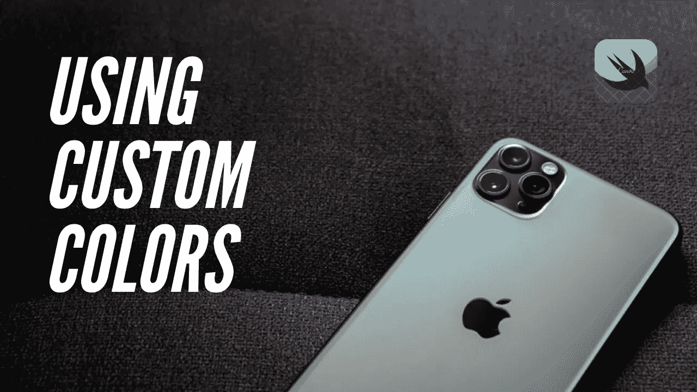
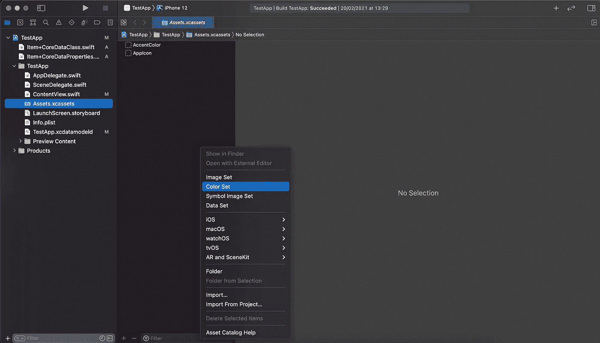
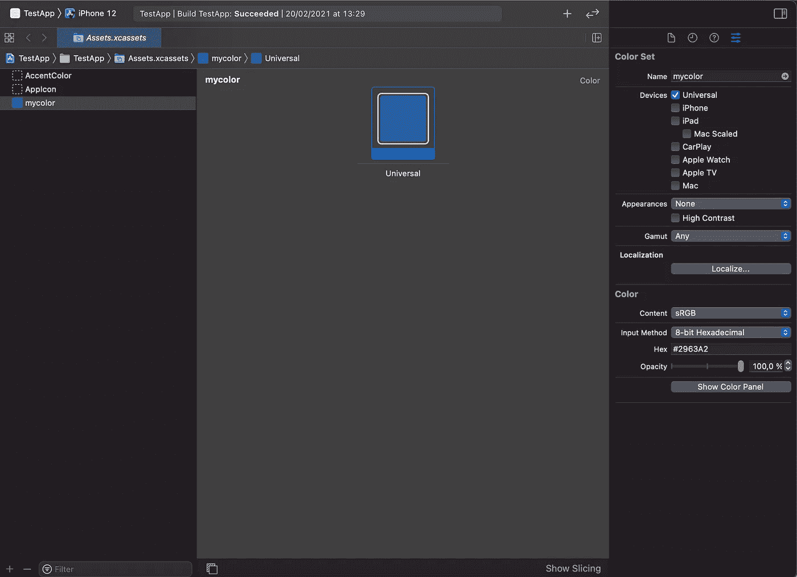

# 在 SwiftUI 中使用自定义颜色

> 原文：<https://levelup.gitconnected.com/using-custom-colors-in-swiftui-d16f07d6a71e>

由 Luis Alessandro Vitte Soto 制作

这是我第一篇关于 SwiftUI 语言的文章，我会把我所知道的一切都放到我的页面上，所以如果你是 SwiftUI 初学者或者你想学习一些新的东西，请留下来。

所有代码都在下面，只要按照步骤，你应该不会有任何问题。

你的应用程序的设计应该是独一无二的，所以当你可以选择自己的风格时，为什么要限制自己使用 SwiftUI 提供的几种颜色呢？添加自定义颜色其实很简单，你把颜色添加到*资产*文件夹，然后你写几行代码在你的项目中任何你想要的地方使用它。

让我们看看我们是如何做到这一点的…

**第一步。将颜色添加到*资产*文件夹**

在项目中搜索 assets 文件夹，一旦进入，您将看到添加到该文件夹的所有内容，如图像、您的应用程序图标等。你需要创建一个新的颜色，右击列表中的任何地方，打开一个菜单，只需点击颜色设置，你可以随意命名颜色。

第一步。将颜色添加到资产文件夹

**第二步。改变颜色**

现在打开屏幕右上角的**检查器** **标签**，您将看到允许您修改该颜色设置的选项。

例如:如果您只是想要相同的颜色而不管配色方案如何，您可以将外观更改为 ***无*** ，或者如果用户更改为深色模式，您可以将外观更改为 ***任何、深色*** 以使用不同的颜色。

现在是时候选择你想要改变的颜色了，只需点击它，更多的选项将出现在检查器标签中，使用那里的工具改变你适合的颜色，你也可以选择使用**十六进制**通过改变输入法到 8 位十六进制来找到你的颜色。

这是一个选择十六进制颜色的美丽网站。

[代码库勒 HTML](https://htmlcolorcodes.com/fr/)

第二步。改变颜色

**第三步。创建一个结构以在项目中使用该颜色。**

下一步是告诉 SwiftUI 使用我们刚刚创建的颜色，创建一个结构来帮助 swift 识别颜色并保存它以供使用。你可以在这里找到代码，我的颜色集名称是 my color，就像之前的图片一样，你可以随意命名静态 letfunction，但是我建议尽量简单。

第三步。创建一个结构以在项目中使用该颜色

**步骤四。如何使用**

使用它很简单，你只需要调用保存颜色的结构，然后调用你想要的颜色。可以用在一个`.background()`或者一个`.foreground()`里做个例子。

第四步。如何使用它

这就是如何在 SwiftUI 中使用自定义颜色！

感谢您的阅读，如果您想了解 SwiftUI 的更多信息，请关注我。回头见！