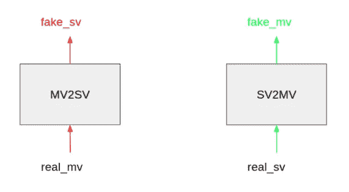
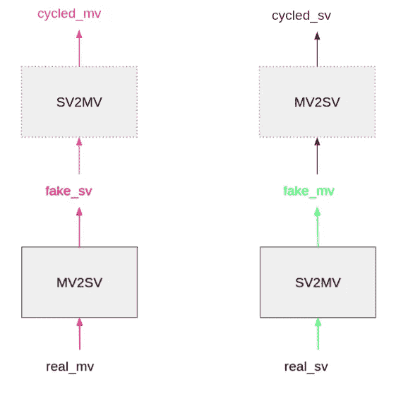
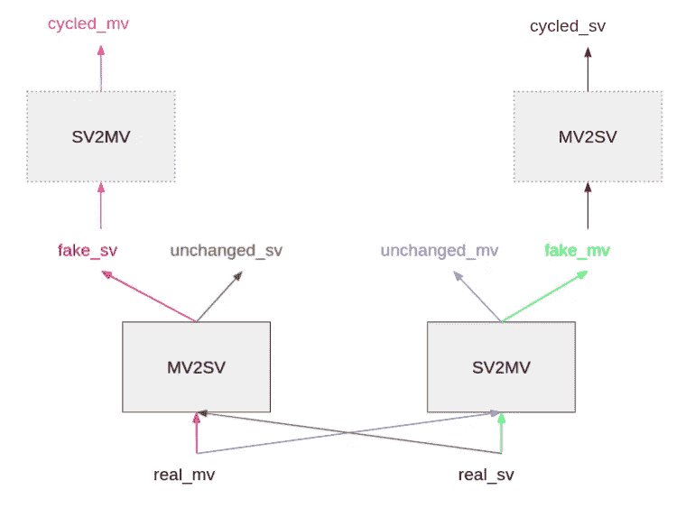
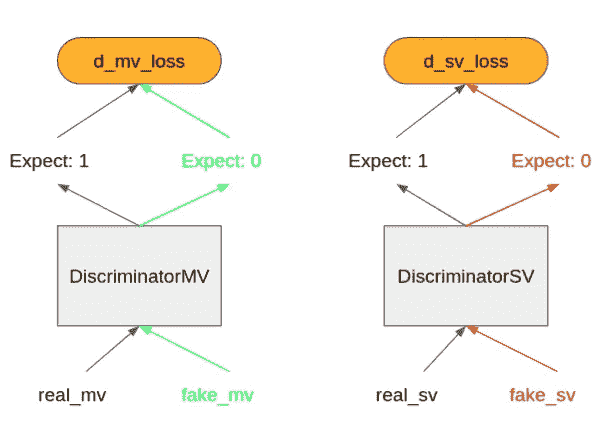
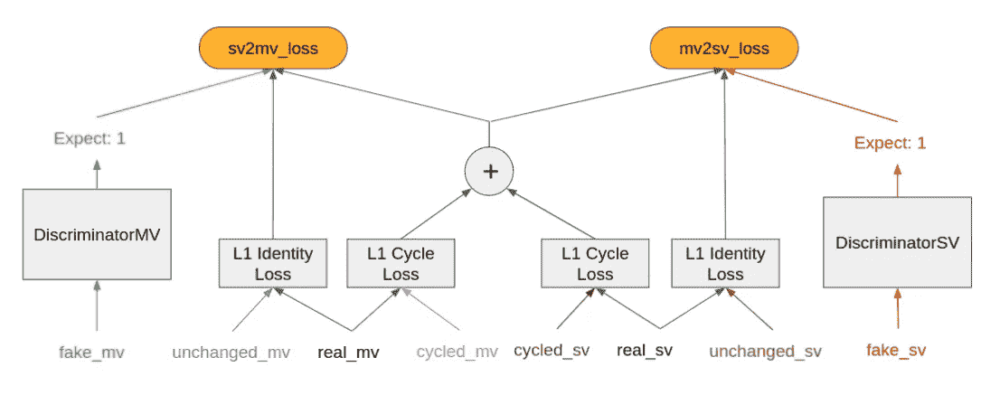
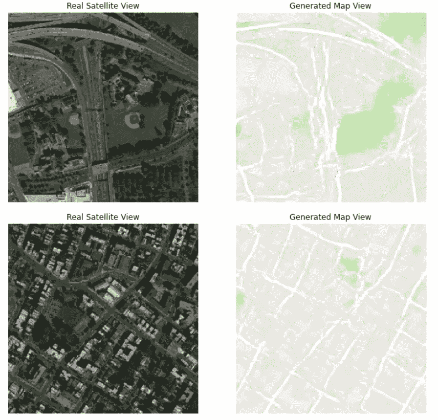
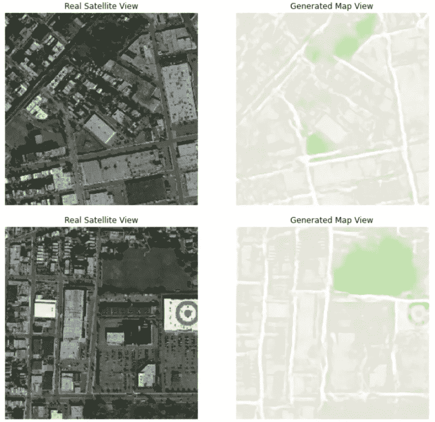
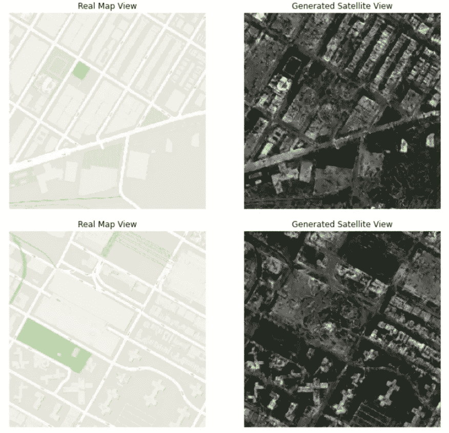
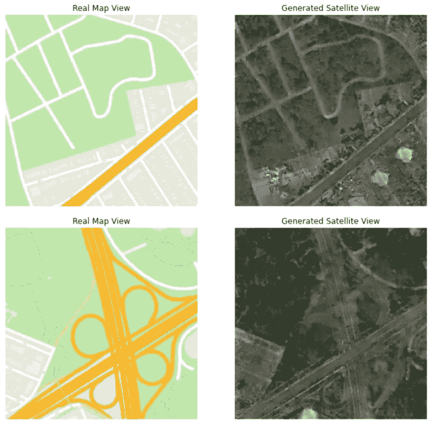

# 使用循环生成对抗网络在地图视图和卫星视图之间转换

> 原文：<https://levelup.gitconnected.com/using-cycle-generative-adversarial-network-to-convert-between-map-views-and-satellite-views-a75724068b6e>

**及其核心架构的逐步介绍**

> **背景**

这是一个基于 tensorflow [循环感知对抗网络(CycleGAN)教程](https://www.tensorflow.org/tutorials/generative/cyclegan)的简单实验。该教程在马和斑马图像之间进行转换。我试图复制它，以便在地图视图和卫星视图之间进行转换。方便的是，在 tensorflow 数据集目录下已经有一个准备好的数据集 [cycle_gan/maps](https://www.tensorflow.org/datasets/catalog/cycle_gan#cycle_ganmaps) 。我们需要对 tensorflow CycleGAN 教程进行的唯一值得注意的代码更改是切换到加载 cycle_gan/maps 数据集。

> **CycleGAN 核心架构**

深入探究 CycleGAN 背后的核心思想是值得的，因为我认为对它如何工作有更深的理解比制作一堆花哨的图像更令人满意。

CycleGAN 可以学习映射来转换两个域的图像。与其他基于生成对抗网络的方法相比，它最显著的特点是 CycleGAN 不需要成对的图像。在 CycleGAN 之前，如果我们要将图像从一个域转换到另一个域，我们需要为域的图像收集成对的示例。然后，我们将通过一个生成器网络馈送源图像(带有噪声),并让一个鉴别器网络尝试区分真实的目标图像和生成的目标图像。更多细节请参考 tensorflow [Pix2Pix 教程](https://www.tensorflow.org/tutorials/generative/pix2pix)为例。

CycleGAN 如何克服配对样本的缺乏，主要取决于它设计损失的方式。我们都知道，在机器学习中，如果我们通过一个可微的过程构造一个损失函数，我们可以使用梯度下降来反向传播参数更新。下面是 CycleGAN 损失的定义。顺便说一下，我省略了一些超参数系数，这简化了图形演示。此外，我还故意忽略了一些情况下公式中张量的形状，也是为了简单。

**前进路径**

有两个生成器:地图到卫星视图(`MV2SV`)和卫星到地图视图(`SV2MV`)。还有两个鉴别器:一个鉴别真实与虚假的地图视图(`DiscriminatorMV`)，另一个鉴别真实与虚假的卫星视图(`DiscriminatorSV`)。输入包括一幅地图视图的实像(`real_mv`)和一幅卫星视图的实像(`real_sv`)。输入是从训练数据集中采样的。视图之间没有预定义的配对。

我们首先通过生成器传递真实图像以获得假(生成的)图像。参见图 1 中的图解。

```
fake_sv = MV2SV(real_mv)
fake_mv = SV2MV(real_sv)
```



图一

接下来，我们将生成的假图像分别通过另一个生成器来创建循环图像。这里的想法是，当我们通过地图到卫星生成器传递地图视图时，我们会得到一个假的卫星视图，然后如果我们通过卫星到地图生成器传递假的卫星视图，我们应该会得到一个地图视图。它被称为循环图像，因为图像要经过往返转换。如果两个发生器都足够好，循环贴图视图应该看起来像原始贴图视图。对称路径也是如此。参见图 2 中的图解。

```
cycled_sv = MV2SV(fake_mv)
cycled_mv = SV2MV(fake_sv)
```



图 2

然后，我们将原始实像分别传递给位于同一图像域的生成器。这里的想法是，如果地图到卫星生成器足够好，它对已经是卫星的图像没有影响。对称路径也是如此。参见图 3 中的图解。

```
unchanged_mv = SV2MV(real_mv)
unchanged_sv = MV2SV(real_sv)
```



图 3

**亏损**

现在，我们准备计算损失。对于鉴别者来说，他们的损失是对真实和虚假图像的错误分类。参见图 4 中的图解。

```
d_real_sv = DiscriminatorSV(real_sv)
d_real_mv = DiscriminatorMV(real_mv)
d_fake_sv = DiscriminatorSV(faked_sv)
d_fake_mv = DiscriminatorMV(faked_mv)d_mv_loss = BinaryCrossEntropyLoss(d_real_mv, 1) + 
    BinaryCrossEntropyLoss(d_fake_mv, 0)d_sv_loss = BinaryCrossEntropyLoss(d_real_sv, 1) + 
    BinaryCrossEntropyLoss(d_fake_sv, 0)
```



图 4

对于发电机来说，就有点复杂了。发电机的损耗有三个部分。

1.  首先，生成器生成假图像，希望欺骗鉴别器。所以对于假图像，鉴别器的增益就是发生器的损耗。
2.  其次，回想一下，我们通过将原始图像传递给各自的生成器来生成未改变的图像，这些生成器被认为是没有效果的。因此，未改变的图像和真实图像之间的差值的范数是发电机损耗的一部分。
3.  最后，回想一下我们通过往返转换生成的循环图像。循环图像应该看起来像原始图像。因此，循环图像和真实图像之间的差值的范数也是发生器损耗的一部分。请注意，我们使用了两个生成器来生成循环图像。所以两台发电机分担这个损耗。

参见图 5 中的图解。

```
cycle_loss = tf.reduce_mean(tf.abs(real_mv - cycled_mv)) + 
    tf.reduce_mean(tf.abs(real_sv - cycled_sv))mv2sv_loss = Loss(d_fake_sv, 1) + cycle_loss + 
    tf.reduce_mean(tf.abs(real_sv - unchanged_sv))sv2mv_loss = Loss(d_fake_mv, 1) + cycle_loss +    
    tf.reduce_mean(tf.abs(real_mv - unchanged_mv))
```



图 5

就是这样。我们现在可以开始训练了。

> **实验**

该数据集包含 2192 个示例，地图视图和卫星视图各占一半。我训练了与 tensorflow CycleGAN 教程中相同的模型。为了加快训练速度，我使用了批量大小 8 而不是 1(就像在教程中一样)。我在 V100 GPU 上运行训练，训练了 200 个 epochss，每个 epoch 用时 1 分钟左右。我还尝试在 2 个 GPU 上使用 MirrorStrategy。这导致了明显的加速，但跨副本聚合逻辑有点复杂，我没有时间来验证这一点，所以下面给出的最终结果来自单个 GPU 运行。以下是结果示例:



示例图像:卫星视图到地图视图 1



示例图像:卫星视图到地图视图 2



示例图像:地图视图到卫星视图 1



示例图像:地图视图到卫星视图 2

不完美，但也不差。再见，下次见…