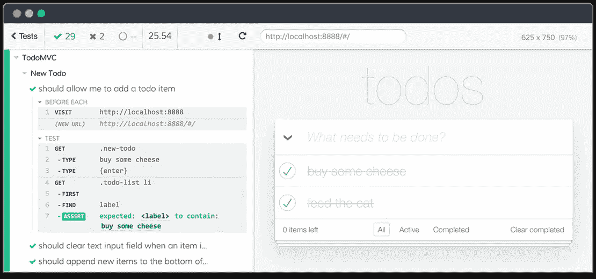
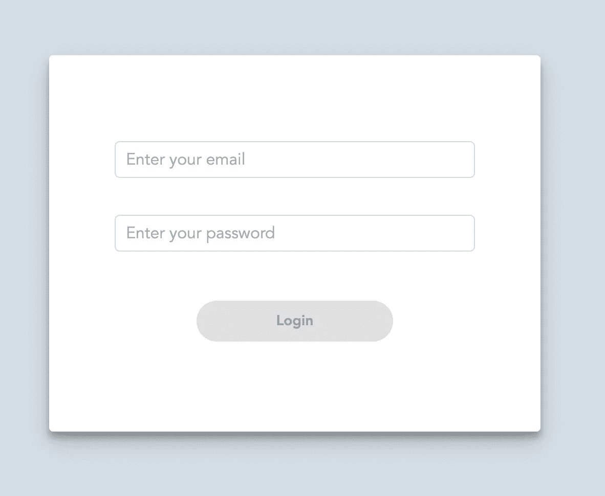
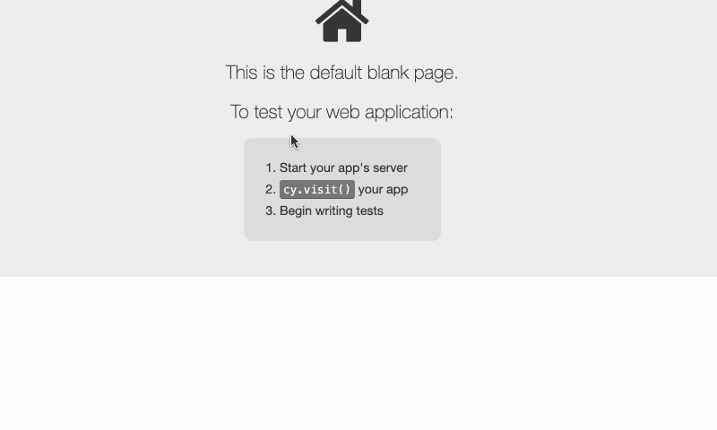
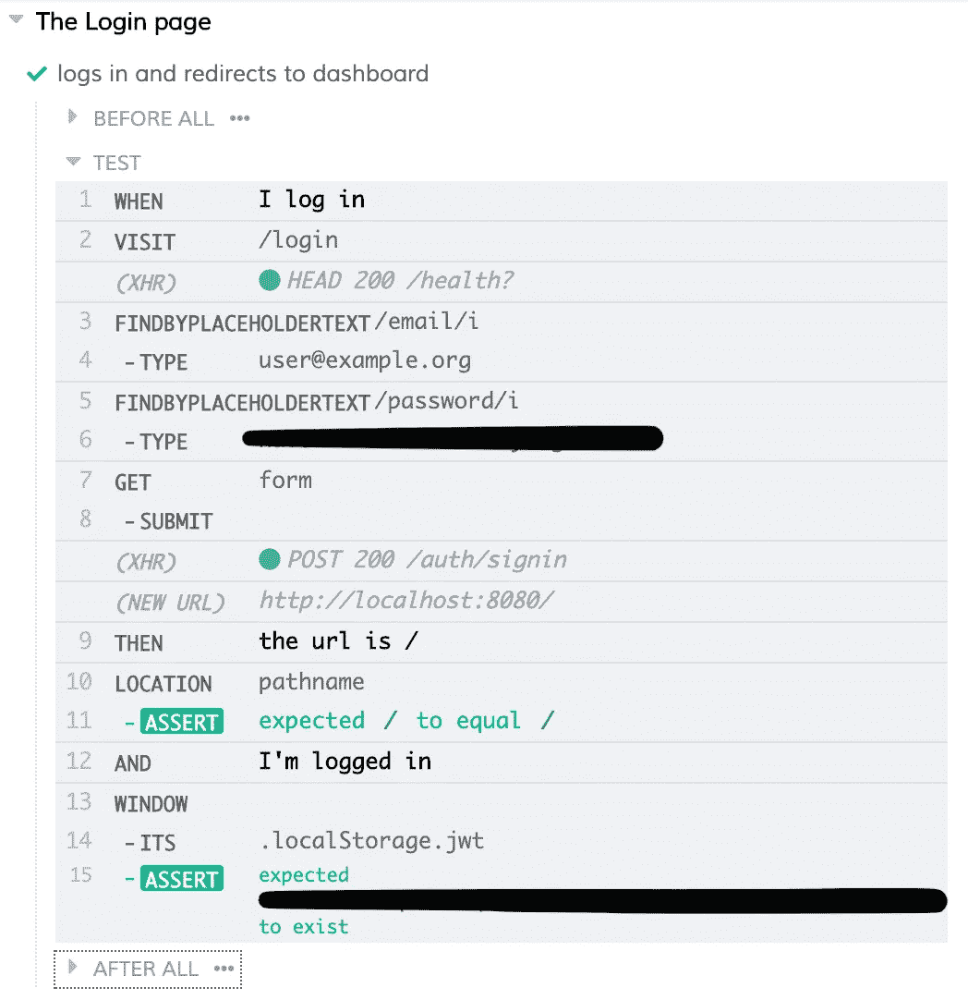

# 使用 Cypress 和 cumber 来测试你的应用程序，就像你是一个用户一样

> 原文：<https://levelup.gitconnected.com/using-cypress-with-cucumber-to-test-your-app-as-if-you-were-a-user-15288900a1a6>

## 如何编写自动化的端到端测试，类似于用户导航应用程序的方式

如果你可以只写 ***“假设我登录应用程序，当我点击设置图标时，我会看到设置菜单，我会在上面看到我的名字”*** ，那不是很好吗？在这篇文章中，我将指导你使用你需要的工具和你应该遵循的步骤来完成这种测试。

# 遇见赛普拉斯



截图来自 cypress 网站

如果你没听说过[柏树](https://www.cypress.io/)，那么写端到端测试就是当前的*热门事*。它取代了 Selenium，极大地改善了开发人员编写测试的体验。您将它作为一个简单的 npm 包(`npm install -D cypress`)安装，并使用一个简单的命令(`npx cypress open`)运行它。它还作为 Docker 映像分发，因此您甚至可以在容器中测试您的应用程序，以获得更好的一致性。

# 那么，黄瓜是什么？

不，不是这个🥒。

[Cucumber](https://cucumber.io) 是 [BDD](https://en.wikipedia.org/wiki/Behavior-driven_development) 的测试框架。通过使用[小黄瓜](https://cucumber.io/docs/gherkin/reference/)语言，它允许你编写看起来像[自然语言](https://en.wikipedia.org/wiki/Natural_language)的测试。这并不神奇，它依赖于你为你声明的每个新步骤编写步骤定义。步骤定义是将普通英语(“我按下提交按钮”)翻译成 JavaScript ( `cy.find("Submit").click()`)的方式。

你甚至可以用你自己的口语写测试[！](https://cucumber.io/docs/gherkin/reference/#spoken-languages)

## 优势

*   您可以轻松地与非技术团队成员、客户、利益相关者分享您的测试，以展示应用程序在特定条件下的表现。
*   当特性请求到达时，您几乎可以立即无缝地将它们转换成黄瓜测试，并开始开发！

# 设置您的测试环境

首先，你需要安装 Cypress 和[黄瓜预处理器](https://github.com/TheBrainFamily/cypress-cucumber-preprocessor):

```
npm i -D cypress cypress-cucumber-preprocessor
```

然后你需要设置 Cypress 来开始读取你的`feature`文件。在`cypress.json`中，添加:

```
{
  "baseUrl": "http://localhost:8080",
  **"testFiles": "**/*.{feature,features}"**
}
```

(`baseUrl`应该设置为无论您的应用程序在哪里运行)

一旦你得到了这些，你还需要配置 cypress-cucumber-preprocessor 来停止使用全局步骤定义(他们承诺这将是未来的默认设置)。在您的`package.json`中，您需要添加:

```
"cypress-cucumber-preprocessor": {
  "nonGlobalStepDefinitions": true
}
```

就是这样！让我们开始测试。

# 编写您的第一个测试

要开始使用 Cypress 和 cumber 的组合编写测试，您需要理解几个东西。我将尝试引导您完成第一个测试，向您介绍新概念(Cypress 命令、步骤定义、黄瓜表达式等)。

假设您的应用程序中有一个登录页面，看起来像这样:



我们还假设您已经有了一个开发环境，它有一个种子数据库，现有用户`user@example.org`有一个已知的密码。

我们想测试应用程序是否可以正常登录。让我们首先编写这个测试，假设我们只使用 Cypress:

```
cy.visit('/login')
  .findByPlaceholder(/email/)
  .type('user@example.org')
  .findByPlaceholder(/password/)
  .type('this is my password')
  .findByText('Log in')
  .click()
  .url()
  .should('eq', '/')
  .window()**.**its('localStorage.email')
  .should('eq', 'user@example.org')
```

(注意:我正在使用[cypress-testing-library](https://github.com/testing-library/cypress-testing-library)编写 DOM 查询，我建议您也这样做，以加强更好的实践)

这个测试非常简单:它导航到`/login`(使用您在`cypress.json`中设置的`baseUrl`)，它填写用户名和密码并点击“登录”按钮。然后，它检查 url 是否是应用程序`/` 的根，并且登录用户的电子邮件是否在`localStorage`中。

在 Cypress 中，您可以将多个命令组合成一个单独的定制命令，以便于重用和更整洁的测试。为此，我们需要创建一个名为`cypress/support/commands.js`的文件，并添加:

```
Cypress.Commands.add('loginWith', ({ email, password }) =>
  cy.visit('/login')
    .findByPlaceholderText(/email/)
    .type(email)
    .findByPlaceholderText(/password/)
    .type(password)
    .findByText('Log in')
    .click()
)
```

然后打开`cypress/support/index.js`并添加:

```
import './commands'
```

一旦您这样做了，您就可以在测试中使用定制命令:

```
cy.loginWith({
  email: 'user@example.org',
  password: 'this is my password'
})
  .url()
  .should('eq', '/')
  .window()**.**its('localStorage.email')
  .should('eq', 'user@example.org')
```

## 翻译成小黄瓜

记住这个测试，我们需要弄清楚如何用黄瓜语言，小黄瓜，来写它。我建议尝试一下如何感觉更自然，而不要考虑它如何转化为底层代码。创建一个`cypress/integration/login.feature`文件并写入:

```
Feature: LoginScenario:
  When I login
  Then the url is /
  And I'm logged
```

在这个特殊的测试中，我跳过了`Given`阶段，因为它没有用(`Given I open the app`？).

注意，我们定义了 3 个步骤:“我登录”、“url 是{word}”和“我已登录”。因此，我们需要创建 3 个步骤定义。为此，在名为特征文件 ( `login/login.js`)的目录**中创建一个 js 文件，并编写:**

```
import { When, Then } from 'cypress-cucumber-preprocessor/steps'When('I login', () => {
  cy.loginWith({ email: 'user@example.org', password: 'this is my password'})
})Then('the url is {word}', (url) => {
  cy.url()
    .should('eq', `${Cypress**.**config()**.**baseUrl}${url}`)
})Then('I\'m logged', () => {
  cy.window()**.**its('localStorage.email')
    .should('eq', 'user@example.org')
})
```

原来如此！现在 Cucumber 知道如何将这三个步骤翻译成 Cypress 命令。

你运行测试，它是这样的:



你的机器人正在进行测试

运行测试时，命令日志显示:



Cypress 命令日志显示了我们的特征文件中定义的 3 个步骤

您可以选择每个命令，并在那时看到应用程序的快照，这对调试非常有用。

# 一些最后的笔记

## 首先编写您的测试

测试驱动开发(test-driven development)的一般实践是首先编写你的测试，然后实现这些东西来通过这些测试。

然而，我的经验是，对于前端开发和大多数创造性类型的开发，很难预见在实现之前你将需要什么样的**单元测试**。

但事实证明，这不是我对**端到端**测试的体验！作为前端开发人员，我们通常会处理复杂的屏幕流和许多变化的状态，我们需要将应用程序设置在某个状态，以开始开发新功能(例如，我们正在设置部分创建一个新的下拉菜单:为此，您需要登录，单击设置菜单，导航到特定部分，等等。以便查看我们需要的应用程序部分)。当然，热重装很有帮助。但它也失败了很多。有时，我们所做的更改会以一种不“可热加载”的方式影响应用程序的状态。

这就是 Cypress 真正派上用场的地方:你可以在开始开发之前在测试中编写前提条件，然后在 Cypress 本身中进行实际的开发(毕竟，它是 Chrome！).将特性请求/错误报告转换成黄瓜测试真的很容易，所以你可以在实现整个测试之前编写整个测试。然后你只要瞄准绿灯提交你的代码。

## 打破既定/何时/然后规则

据我理解， **BDD** 的核心是你应该通过设置前提条件(给定部分的**)、指定动作(当**语句时的**)然后断言结果(然后是**部分的**)来编写你的测试。**

但是，正如 Cypress 最佳实践所述，[您不应该像编写单元测试一样编写端到端测试](https://docs.cypress.io/guides/references/best-practices.html#Creating-%E2%80%9Ctiny%E2%80%9D-tests-with-a-single-assertion)，因为设置每个场景都会有性能损失。

所以我所做的(我认为这不会损害测试的质量)是编写一系列的步骤和断言，例如:

```
Given I login
**Then the url is /**
When I click on Settings
**Then the url is /settings**
**And the auto-save toggle is set to false**
When I click on the auto-save toggle
Then the auto-save toggle is set to true
```

即使我可以省略中间断言(用粗体标记)，我认为这可以更好地理解失败，以防测试在中间步骤失败(在这个例子中，如果它在设置导航部分失败，我将在`Then the url is /settings`断言中而不是在`I click on the auto-save toggle`步骤中有一个更好的错误。)

所以，就这样，我希望这篇文章向你介绍使用自然语言的端到端测试的奇妙世界。

我打算以后多写一些这方面的文章，敬请关注！