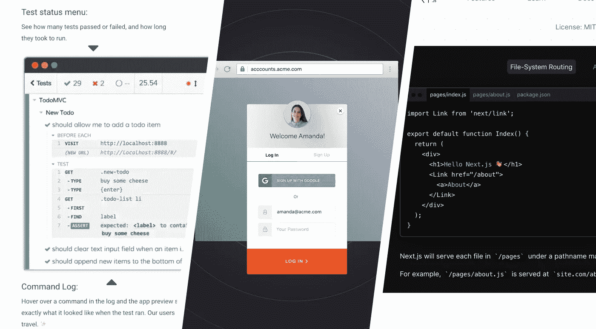

# 将 Cypress 与 Next.js 和 Auth0 一起使用

> 原文：<https://levelup.gitconnected.com/using-cypress-with-next-js-and-auth0-2dbe7282dcf>



我花了三天时间试图配置 [Cypress 不允许你在测试期间访问外部站点](https://medium.com/u/47c842e55929#Visiting-external-sites)。请这样想:

1.  测试用户加载您的应用程序
2.  测试用户点击“登录”
3.  测试用户被带到 Auth0 锁定屏幕——但是哦，等等！我们现在在一个不同的域(或子域)上，所以 Cypress 阻止了我们的请求。

但是不要害怕！通过阅读[next js-auth 0 库](https://github.com/auth0/nextjs-auth0/blob/master/src/handlers/login.ts#L70)的源代码，我们可以学习如何在 Cypress 测试套件中进行认证。

相反，我们必须使用`Password`授权登录测试用户。

# 正在设置 Auth0

首先，将 Auth0 Javascript 库添加到我们的项目中:

```
yarn add auth0-js --dev
```

其次，在你的 Auth0 仪表板中创建一个**真实用户**。记下他们的电子邮件和密码，因为你马上会需要这些信息。

第三，[按照这些说明](https://auth0.com/docs/api-auth/tutorials/password-grant)在您的 Auth0 租户中启用资源所有者密码授权。

这些是您需要在 Auth0 中进行的唯一更改，以支持来自 Cypress 测试的身份验证。

## 关于安全性的说明

本演练跳过了访问令牌验证并揭示了秘密，但我假设您能够降低测试环境中的安全性。Auth0 建议您为开发、测试和生产使用单独的租户，这进一步降低了将测试用户凭证放入`cypress.env.json`的风险。

# 验证测试用户

接下来，让我们为 Cypress 创建我们的`login()`助手(助手通常用`cypress/support/index.js`编写):

注意，我们使用的是 [Cypress 环境变量](https://docs.cypress.io/api/cypress-api/env.html#Syntax)，它是我们在`cypress.env.json`中设置的:

假设您用自己的值替换`cypress.env.json`中的信息(注意`auth0CookieSecret`是您选择的随机字符串)，您的用户测试将能够登录到 Cypress 测试中。

好的，我们在这里取得了一些进展…

但是使用这个助手运行一个测试，您将看到您的 Next.js 应用程序代码不会对测试用户进行身份验证。例如，如果您有一个受 auth0/nextjs-auth0 包保护的 API 路由，测试用户将无法访问该路由:

因此，我们不仅需要验证测试用户，还需要创建一个用户会话…

# 创建用户会话

我们需要模仿 nextjs-auth0 库的行为。

通过阅读[next js-auth 0 库的源代码](https://github.com/auth0/nextjs-auth0/blob/master/src/handlers/login.ts#L70)，我们了解到在 Next.js 应用中创建用户会话至少有五个步骤:

1.  创建一个名为`a0:state`的 cookie 来跟踪正在进行的登录
2.  验证用户身份，检索访问令牌
3.  验证访问令牌(我跳过这一步，因为这超出了本演练的范围)
4.  使用访问令牌获取用户信息
5.  加密用户信息以创建会话对象
6.  将加密的用户会话存储在名为`a0:session`的会话 cookie 中

nextjs-auth0 使用 Iron 来加密会话，所以让我们将它添加到我们的依赖项中:

```
yarn add @hapi/iron --dev
```

现在，我们不需要直接调用我们的身份验证助手，而是需要调用一个助手来执行我们刚才提到的步骤(例如，存储一个加密的用户会话)。我个人的偏好是把我们现有的`login()` helper 做成私有 helper，`_login()`，写一个新的`login()` helper，在某个时候会调用`_login()`。

以下是我们更新的助手:

注意，我在这里跳过了令牌验证。如果您想验证访问令牌，那么我建议您看看 [openid-client-node](https://github.com/panva/node-openid-client/) 和类似的库如何验证令牌。对于我的用例，我认为在我的测试环境中验证访问令牌是不必要的。

# 尝试一下

好吧…这应该行得通！

让我们在测试中使用新的`login()`助手:

或者，您可以使用 Cypress 的`before()`钩子中的`login()`助手:

[https://gist . github . com/sir-dunxalot/05133 f 7143d 98 BD 63 BCB 57 c 8e 2 bcba 59](https://gist.github.com/sir-dunxalot/05133f7143d98bd63bcb57c8e2bcba59)

# 缓存测试用户

最后，我们希望通过缓存测试用户来避免对 Auth0 的不必要调用。您将很快发现您的测试套件由于授权率限制而失败。

这听起来可能有点奇怪，因为我们已经在使用 cookies 来实现持久性。然而，您可能会注意到，每次我们调用`login()`时，我们的助手都会创建会话 cookie。让我们只在会话 cookie 不存在的情况下创建它…

# 瞧啊！

我们的工作完成了。

[本要点](https://gist.github.com/sir-dunxalot/8b8539a0baf4e76490991c3cd4c4401d)中提供了简化的源代码。

您可以通过向`login()`助手传递凭证来支持多个测试用户(假设您已经在 Auth0 仪表板中创建了用户)。类似下面这样的内容会有所帮助:

# 解决纷争

如果您仍然无法完成这项工作，请记住以下几点:

*   您可能需要将`"chromeWebSecurity": false`添加到您的`cypress.json`配置文件中。这在某些情况下似乎是必要的，但我不知道为什么。
*   您需要在 Auth0 应用程序的设置中启用`password`授权类型。
*   您需要将默认目录(在您的 Auth0 租户设置中)设置为`Username-Password-Authentication`，这通常是您想要用于`password`授权认证的数据库连接的名称(该名称将显示在 Auth0 仪表板- >连接- >数据库中)。
*   用户名和密码组合应该是您在 Auth0 dashboard 中创建的真实帐户(尽管您创建该帐户只是为了测试)。