# 使用 D3 呈现调查结果。

> 原文：<https://levelup.gitconnected.com/using-d3-to-present-survey-results-a231733d3ddb>

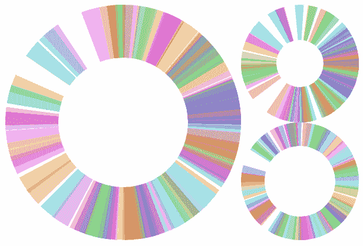

D3(以防你错过)在 D3 制造

我最近用 D3 为 TokyoDev 的[开发者调查](https://www.tokyodev.com/insights/2020-developer-survey/)做了数据可视化。下面是故事的*制作。*

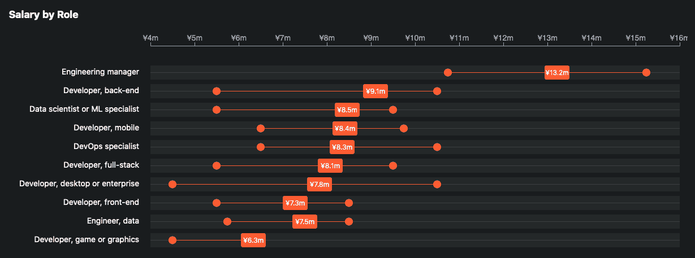

这项调查是在谷歌表单上完成的。共有 23 个问题，362 名受访者。

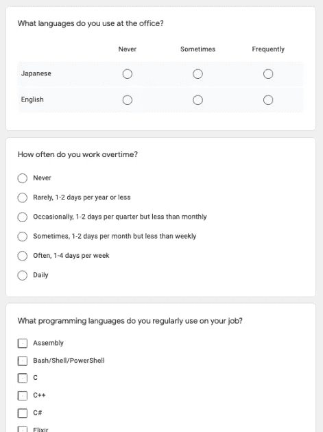

唯一的表达限制是关于个人数据的隐私，比如薪水。无论如何，这都是匿名的，但猜测数据背后的人可能很容易。例如，只有一个来自新泻县的回复，我们不想在这个冬天增加他们的问题。


这限制了我们在表示层可以做的事情:我们不能提供太多的*下钻*交互。在 javascript 中，我们不能使用一个完整的数据集，即使我们想这样做。

# **熊猫&海熊**

本文的大部分内容都是关于 D3 的，但是最初的分析是用 Python、 [Pandas](https://pandas.pydata.org/) 、[Seaborn](https://seaborn.pydata.org/)&[Jupyter](https://jupyter.org/)完成的，所以下面是对那些不熟悉的人的一个小小的窥视。

## 熊猫

熊猫有点像“Python 的 Excel”。数据存在于“数据框架”中。

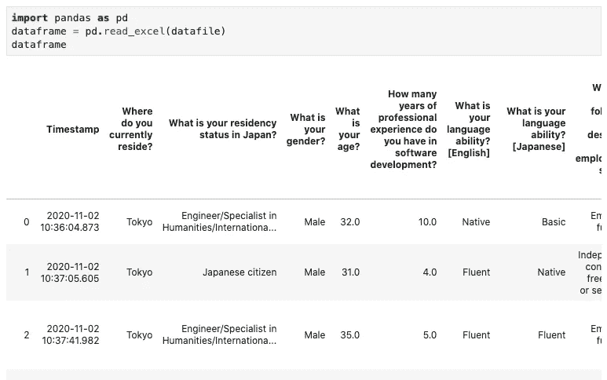

熊猫——“Python 的 Excel”

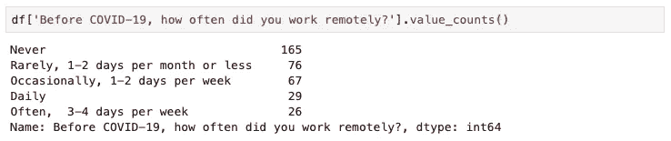

熊猫

## 海生的

Seaborn 是 MatPlotLib 更漂亮的表亲。这使得探索数据变得非常容易。

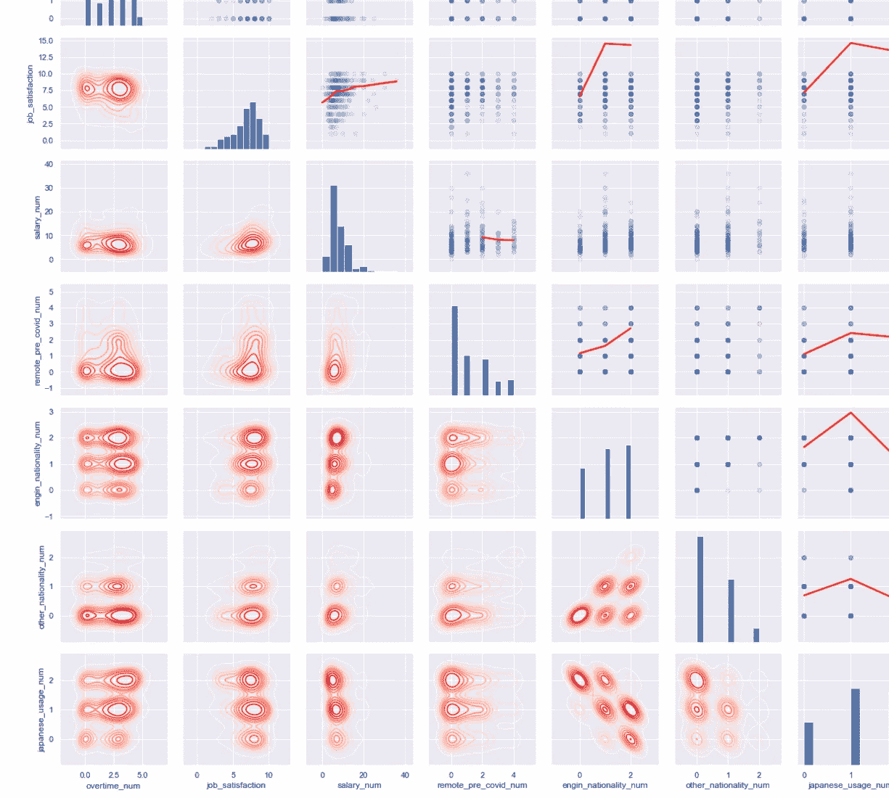

在 D3 上…

# D3 刻度和轴

刻度和轴是 D3 的核心特性。

D3 Scale 是一个不可见的元素，它将一个值(如以日元表示的工资)转换为另一个值(如像素位置或颜色)。只有当你从它创建一个轴并在 SVG 上渲染时，它才是可见的(有刻度线等)。

```
var xScale = d3.scaleLinear()
               .rangeRound([0, 22000000])  // Salary range in JPY
               .domain([0, 600])           // Size of the SVG
```

因此，对于 1，100 万日元标记处的一个圆(即 x=300)，您会做…

```
svg.append("circle")
   .attr("cx", xScale(11000000))
   .attr("cy", 10)
   .attr("r", 10)
```

下一个图表使用了两个 X 刻度。首先，一个“波段”标度(此处的交互[为](https://observablehq.com/@d3/d3-scaleband))创建波段(阴影下方)，然后将数据值“男性”和“女性”映射到这些波段。第二，0–86“线性”标度用于确定条形的大小。它画在这里，但实际上并没有画，它没有位置，方向或任何东西。

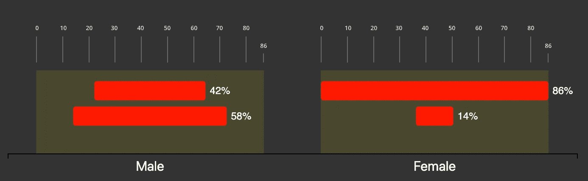

该比例将 Y 值映射到一种颜色。

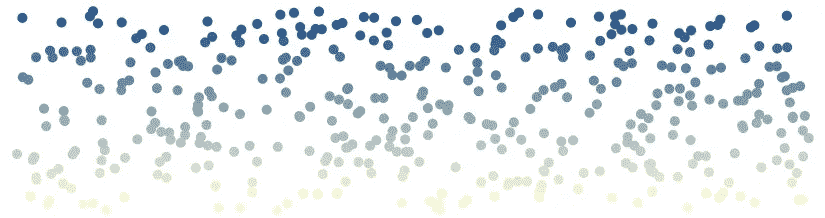

D3 色标用于根据 Y 值着色

在[代码笔](https://codepen.io/teesee/pen/PoGrbVa)上试试这个

关于颜色的话题，我强烈推荐数据故事播客第 18 集《卡伦·施洛斯的颜色》。对于播客来说，这听起来是一个可怕的话题，但它非常聪明。

# 响应性

此图表的原始版本将标签放在每个弧段的中点。它的锚定图表在桌面上很好，但在移动设备上标签被切断。我们探索了几种选择。

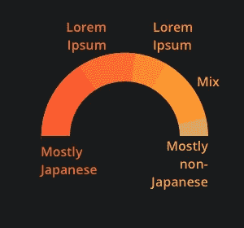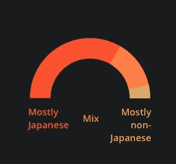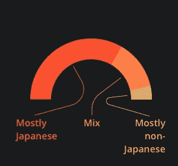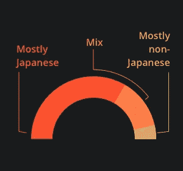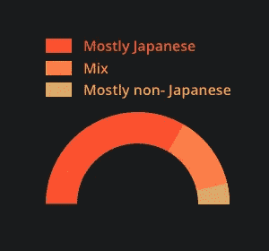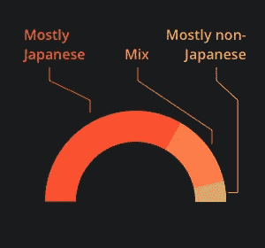

图表通过进行或多或少的完全重建来响应较小的屏幕。首先，它重新计算所有截面尺寸和轴比例。

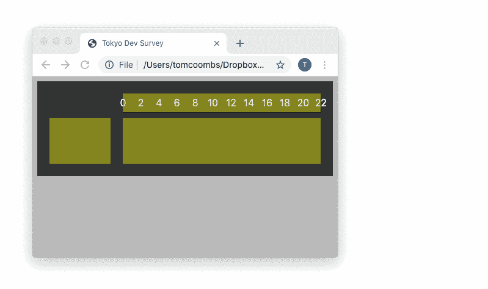

SVG 高度也会重新计算，以适应堆叠在条形上方的标签，或者当数据发生变化时。[实际上，没有一个数据更改图表出现在最后一页。]

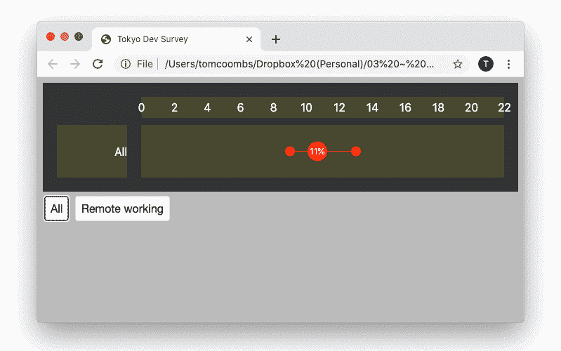

# 动画

D3 处理动画非常容易。链接动画也很简单。

```
.attr('width', 0)
.transition()
.duration(200)
.attr('width', bar_width)
```

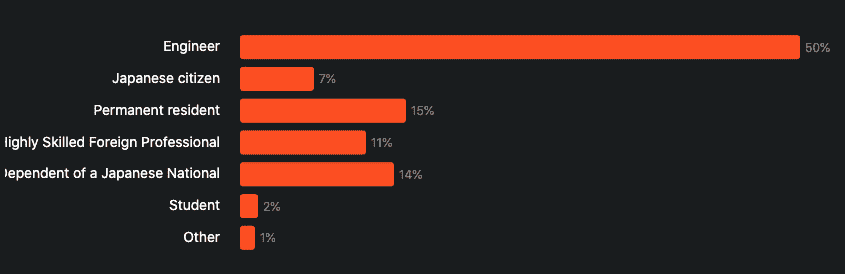

# 制作弧线动画

与制作圆环图相比，制作上面条形宽度的动画简直是小菜一碟。

首先，看看用于制作饼图/圆环图的关键 D3 组件:d3.pie 和 d3.arc。

## d3 .馅饼

将数据转换为角度(弧度)。

```
data = [50,10]
pie_data = d3.pie()(data)->   [ {value: 50, startAngle: 0.00, endAngle: 5.24},
       {value: 10, startAngle: 5.24, endAngle: 6.28} ]
```

## d3 .电弧

将角度转换成可以在 SVG 上呈现的路径。


```
var arc = d3.arc()({
  innerRadius: 50,
  outerRadius: 100,
  startAngle:  0,
  endAngle:    3.14
})
```

要制作动画，你需要在 0 和最终角度之间补间一个角度，然后为每一帧创建一个 d3.arc。

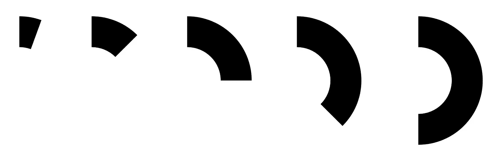

一种方便的处理方法是在 pie_data 中添加一个插值器。这将从 0 到最终角度逐步补间角度。然后你把每个角度发给 d3.arc，得到一个弧形路径。

```
{
  value: 50,
  startAngle: 5.24,
  endAngle: 6.28
} Add:
  midAngle: 5.76,  // used to align labels at the mid-point
  angleSize: 1.04And:
  interpolatorZeroToAngleSize: d3.interpolate(0, 1.04)
```

为了得到满意的动画，需要另一个插值器来跟踪前一个圆弧的终点。但首先让我们看看一些不尽人意的动画…

## 制作动画的各种方法

如果你只是简单的动画每个弧，它们都是同时开始的，看起来并不好。


应用于每个弧的动画

对它们进行排序很有帮助，但是默认情况下它们的持续时间是相同的，所以大的移动得更快。


有序但持续时间相等

所有电弧尺寸的速度都是相同的…


同等速度

…但是如果你加上放松，又会变得很奇怪…


## 令人满意的动画

我选择的解决方案是将每个弧的起点连接到前一个弧的终点。现在它们一起制作动画，并且都在相同的时间遵循相同的缓动。


最终版本

你可以在这里试试… [Codepen](https://codepen.io/teesee/pen/abmgpNJ) 。

# 互动

D3 对于创建交互式图表也很强大。这里有一个击中了剪辑室的地板。

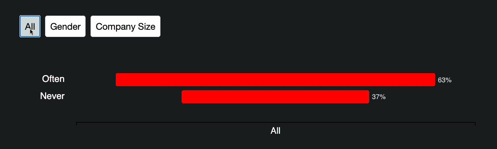

我将把那件事留到以后再说。

# 谢谢

感谢阅读。

对于开发者工作或获得明年的调查:加入 [TokyoDev 名单](https://www.tokyodev.com/)。

东京的 UX 活动:点击这里，加入我的 meetup 群组 UX 对话东京[。](https://uxtalktokyo.doorkeeper.jp/)

对于 UX 的工作:加入 [UX 工作日本](https://www.uxjobsjapan.com/)名单。

并与我联系有关数据可视化或任何东西(在合理范围内)…说[你好](mailto:hello@manwomanandchild.com)。