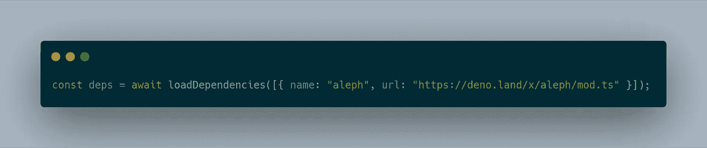

# 在 Deno 中使用数据 URL 加载依赖项

> 原文：<https://levelup.gitconnected.com/using-data-urls-to-load-dependencies-in-deno-18461713ec1e>



这是一个你可以用它做什么的代码示例

最近 [Deno 发布了 v1.7.0](https://deno.land/posts/v1.7) ，其中有[对数据 URL](https://deno.land/posts/v1.7#support-for-importing-data-urls)的支持。我认为这是一个非常酷的动态创建模块的方法。这可以用来动态地一次加载我们想要在文件中使用的所有依赖项。

# 数据 URL

数据 URL 基本上是 URL，但数据以某种形式编码，因此它不是指向数据的链接，而是将数据保存在自身内部。数据 URL 首先需要以`data:`开头。然后我们需要添加正在加载的文件的 MIME 类型，在这个例子中是`application/typescript`，但是我们也可以使用`application/javascript`。在我们添加了文件的编码格式后，在本教程中我们将只使用`base64`，然后你也可以添加一个`,`，后跟文件的实际编码。

## 一个例子

假设我们有这个文件:

```
export const add = (a: number, b: number) => a + b;
```

我们想从数据 URL 导入它。然后我们会首先得到样板文件。

```
const { add } = await import("data:application/typescript;base64,");
```

然后我们需要添加 base64 编码。为此它

```
ZXhwb3J0IGNvbnN0IGFkZCA9IChhOiBudW1iZXIsIGI6IG51bWJlcikgPT4gYSArIGI7
```

所以最后的代码是:

```
const { add } = await import("data:application/typescript;base64,ZXhwb3J0IGNvbnN0IGFkZCA9IChhOiBudW1iZXIsIGI6IG51bWJlcikgPT4gYSArIGI7");
```

它将正确地导出`add`函数。

# 加载依赖项

现在我们知道了如何使用它们，让我们创建一个助手函数来加载依赖项。让我们首先创建类型定义。

```
interface Dependency {
 url: string;
 name: string;
}function loadDependencies(deps: Dependency[]) {}
```

我们希望为要导入的数据 URL 创建一个变量，并为导入的源代码创建一个变量。我们还想对`deps`数组进行循环。

```
function loadDependencies(deps: Dependency[]) {
 let code = "";
 let dataURL = "data:application/typescript;base64,";
 deps.forEach({ url, name} => {

 });
}
```

现在让我们为每个依赖项将导出追加到`code`中。

```
function loadDependencies(deps: Dependency[]) {
 let code = "";
 let dataURL = "data:application/typescript;base64,";
 deps.forEach(({ url, name }) => {
  code += `export * as ${name} from "${url}"`;
 });
}
```

现在我们来编码一下。我们还必须向标准库添加一个依赖项。

```
import { encode } from "[https://deno.land/std@0.84.0/encoding/base64.ts](https://deno.land/std@0.84.0/encoding/base64.ts)";
```

现在让我们做最后的部分。

```
function loadDependencies(deps: Dependency[]) {
 let code = "";
 let dataURL = "data:application/typescript;base64,";
 deps.forEach(({ url, name }) => {
  code += `export * as ${name} from "${url}"`;
 });
 dataURL += encode(code);
 return import(dataURL);
}
```

和🎉可以用它导入依赖项！

```
const deps = await loadDependencies([{ name: "aleph", url: "[https://deno.land/x/aleph/mod.ts](https://deno.land/x/aleph/mod.ts)" }]);
```

*如果你喜欢这篇文章，我建议你在我的博客* [*上查看我的其他文章*](https://h.shadowtime2000.com) *。*