# 使用 Docker 和 PySpark

> 原文：<https://levelup.gitconnected.com/using-docker-and-pyspark-134cd4cab867>

最近，我玩了一下 PySpark，决定写一篇关于使用 PySpark 和 Spark SQL 的博文。Spark 是一个伟大的开源工具，用于跨分布式计算集群管理数据和机器学习。PySpark 是 python API to Spark。

在您的机器上启动并运行 PySpark 可能有点困难。Docker 是让 Spark 环境在您的本地机器上工作的一种快速简单的方法，这也是我在本地机器上运行 PySpark 的方式。

# Docker 是什么？

我先介绍一下 Docker。根据[维基百科](https://en.wikipedia.org/wiki/Docker_(software))“Docker 是一个[计算机程序](https://en.wikipedia.org/wiki/Computer_program)，执行[操作系统级虚拟化](https://en.wikipedia.org/wiki/Operating-system-level_virtualization)，也被称为‘容器化’”。为了大大简化，Docker 创建了一个隔离的 linux 操作系统，在你机器的操作系统之上运行软件，称为容器。对于熟悉虚拟机的人来说，容器基本上就是一个没有虚拟机管理程序的虚拟机。这些容器可以用脚本预先配置，以安装特定的软件并提供定制的功能。Dockerhub 是一个网站，包含各种预配置的 docker 容器，可以在您的计算机上快速运行。其中之一就是 [jupyter/pysparknotebook。](https://hub.docker.com/r/jupyter/pyspark-notebook)这是我们今天将使用的 docker 图像。

# 启动 Docker 容器:

在本地机器上设置 Docker 容器非常简单。只需从 [docker 网站](https://www.docker.com/get-started)下载 docker，并在终端中运行以下命令:

```
docker run -it -p 8888:8888 jupyter/pyspark-notebook
```

在浏览器中导航至 [http://localhost:8888](http://localhost:8888) ，您将看到以下屏幕:

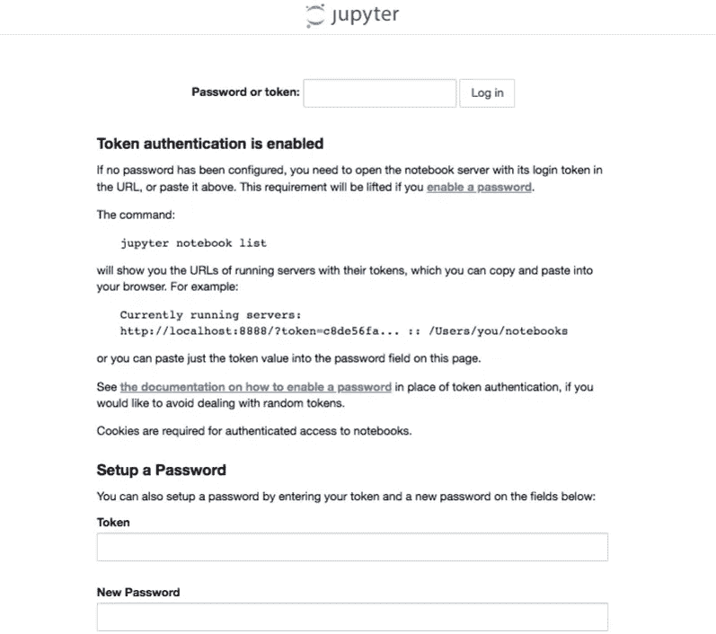

在您的终端中，您应该会看到一个令牌:

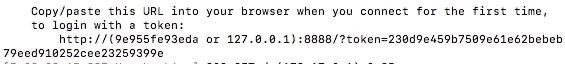

复制并粘贴这个令牌，数字跟在“/？token= "，进入 token textbook，并在新密码框中为 Jupyter 笔记本服务器设置密码。

完成后，您就可以开始了！Spark 已经安装在容器中。您已经准备好打开笔记本，开始编写一些 Spark 代码。我将包括笔记本的副本，但是我建议将本文中的代码输入到您本地计算机上的新 Jupyter 笔记本中。这有助于你学习。

要停止 docker 容器和 Jupyter 笔记本服务器，只需在运行它的终端中输入 control + c。

# PySpark 基础

Spark 是一个开源的集群计算框架，主要用 scala 编写，API 有 R、python、scala 和 java。它主要是为大规模数据分析和机器学习而设计的，因为它们不适合本地内存。在这个简短的教程中，我不会使用太大而不适合内存的数据集。本教程借用官方入门指南:[https://spark . Apache . org/docs/latest/SQL-getting-started . html](https://spark.apache.org/docs/latest/sql-getting-started.html)。

# 火花数据类型:

spark 生态系统中有两种主要的数据类型，弹性分布式数据集或 rdd(有点像 python 列表和字典的混合体)和数据帧(数据帧很像 R 和 python 中的数据帧)。spark 中的两种数据类型都是分区的和不可变的(这意味着您不能更改对象，而是返回一个新的对象)。在本教程中，我将重点介绍 dataframe 数据类型。

# 数据集:

我将使用的数据集是来自[佛蒙特州开放数据社会门户的一个有点大的佛蒙特州供应商数据集。](https://data.vermont.gov/Finance/Vermont-Vendor-Payments/786x-sbp3)点击链接即可轻松下载。

# 设置 Spark 会话:

这段代码在 docker 容器中启动 PySpark 环境，并导入数值计算的基本库。

```
# import necessary libraries
import pandas as pd 
import numpy
import matplotlib.pyplot as plt 
from pyspark.sql import SparkSession# create sparksession
spark = SparkSession \
    .builder \
    .appName("Pysparkexample") \
    .config("spark.some.config.option", "some-value") \
    .getOrCreate()
```

# 在 CSV 中阅读:

我想从比较熊猫和 Spark 在 CSV 中的阅读开始。Spark 在 CSV 中的阅读速度比熊猫快得多。这证明了 Spark 数据帧与熊猫数据帧相比要快得多。

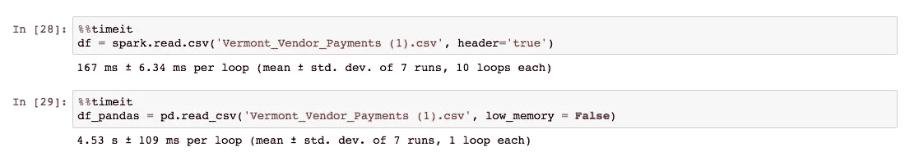

对于这个分析，我将使用 inferSchema 选项读入数据，并将 Amount 列转换为 double。

```
df = spark.read.csv('Vermont_Vendor_Payments (1).csv', header='true', inferSchema = True)
df = df.withColumn("Amount", df["Amount"].cast("double"))
```

# 基本火花方法:

像熊猫一样，我们用。dataframe 的列属性。

```
#we can use the columns attribute just like with pandas
columns = df.columns
print('The column Names are:')
for i in columns:
    print(i)
```

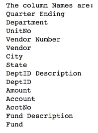

我们可以使用。count()方法，我们可以通过获取列名的长度来获得列数。

```
print('The total number of rows is:', df.count(), '\nThe total number of columns is:', len(df.columns))
```

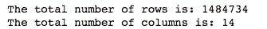

的。show()方法默认打印 dataframe 的前 20 行。我选择在本文中只打印 5。

```
#show first 5 rows
df.show(5)
```

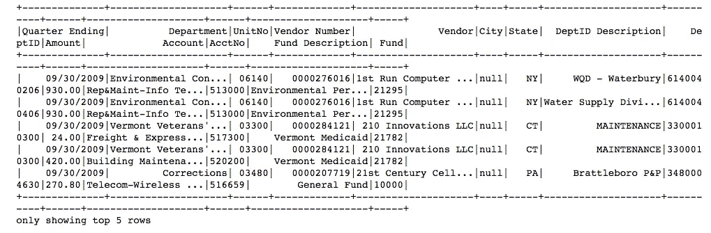

的。head()方法也可以用来显示第一行。这个印在笔记本上好看多了。

```
#show first row
df.head()
```

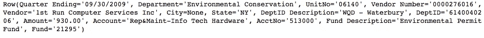

像在 pandas 中一样，我们可以调用 describe 方法来获得数据的基本数字摘要。我们需要使用 show 方法将其打印到笔记本上。这在笔记本上打印得不太好。

```
df.describe().show()
```

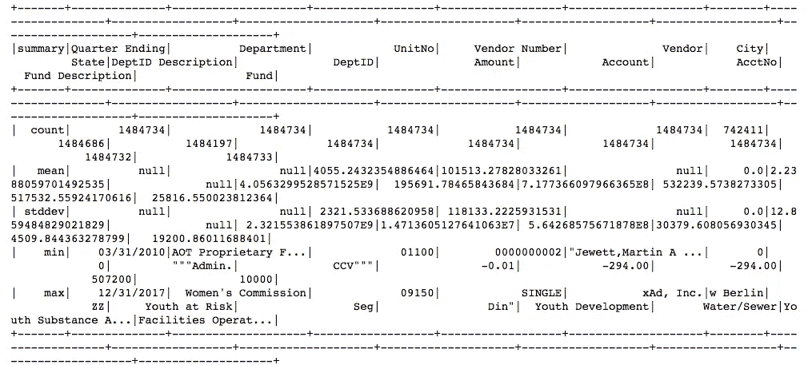

# 查询数据:

Spark 的优势之一是可以使用每种语言各自的 Spark 库或 Spark SQL 进行查询。我将使用 pythonic 和 SQL 选项演示几个查询。

以下代码注册临时表，并使用 SQL 语法选择一些列:

```
# I will start by creating a temporary table query with SQL
df.createOrReplaceTempView('VermontVendor')
spark.sql(
'''
SELECT `Quarter Ending`, Department, Amount, State FROM VermontVendor
LIMIT 10
'''
).show()
```


这段代码使用 pythonic 语法执行几乎相同的操作:

```
df.select('Quarter Ending', 'Department', 'Amount', 'State').show(10)
```

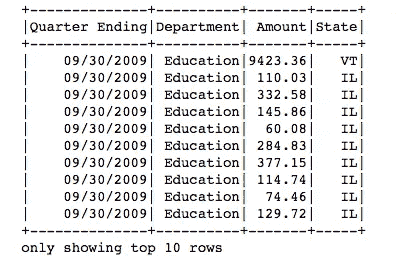

需要注意的一点是 pythonic 解决方案的代码非常少。我喜欢 SQL 和它的语法，所以比起 pythonic，我更喜欢 SQL 接口。

我可以使用 SQL WHERE 子句过滤查询中选择的列

```
spark.sql(
'''SELECT `Quarter Ending`, Department, Amount, State FROM VermontVendor 
WHERE Department = 'Education'
LIMIT 10'''
).show()
```

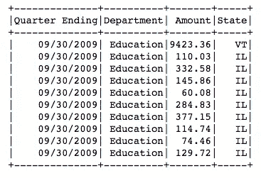

类似的结果可以通过。python API 中的 filter()方法。

```
df.select('Quarter Ending', 'Department', 'Amount', 'State').filter(df['Department'] == 'Education').show(10)
```

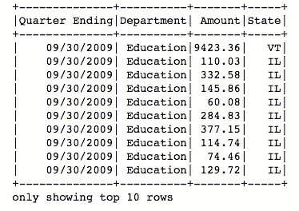

# 测绘

不幸的是，人们不能用 Spark 数据框直接绘制图表。最简单的解决方案是简单地使用。toPandas()方法将 Spark 计算的结果转换成 Pandas 数据帧。下面我举几个例子。

```
plot_df = spark.sql(
'''SELECT Department, SUM(Amount) as Total FROM VermontVendor 
GROUP BY Department
ORDER BY Total DESC
LIMIT 10'''
).toPandas() fig,ax = plt.subplots(1,1,figsize=(10,6))
plot_df.plot(x = 'Department', y = 'Total', kind = 'barh', color = 'C0', ax = ax, legend = False)
ax.set_xlabel('Department', size = 16)
ax.set_ylabel('Total', size = 16)
plt.savefig('barplot.png')
plt.show()
```

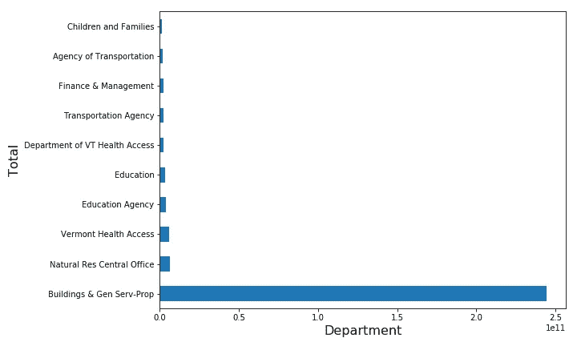

```
import numpy as np
import seaborn as sns
plot_df2 = spark.sql(
'''
SELECT Department, SUM(Amount) as Total FROM VermontVendor 
GROUP BY Department
'''
).toPandas()
plt.figure(figsize = (10,6))
sns.distplot(np.log(plot_df2['Total']))
plt.title('Histogram of Log Totals for all Departments in Dataset', size = 16)
plt.ylabel('Density', size = 16)
plt.xlabel('Log Total', size = 16)
plt.savefig('distplot.png')
plt.show()
```

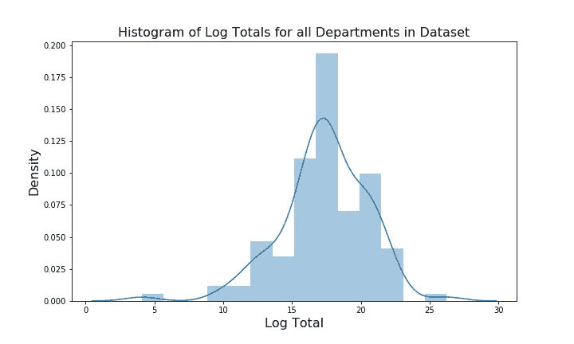

# 再次启动 docker 容器:

一旦您第一次启动并退出 docker 容器，您将为将来的使用以不同的方式启动它，因为容器已经运行过了。

传递以下命令以返回所有容器名称:

```
docker ps -a
```

从终端获取容器 id:

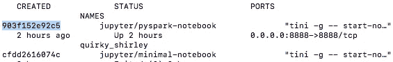

然后使用容器 id 运行 docker start 来启动容器:

```
docker start 903f152e92c5
```

然后，您的 Jupyter 笔记本服务器将再次运行在 [http://localhost:8888](http://localhost:8888) 上。

带有更多示例的完整代码可以在我的 github 上找到:

https://github.com/crocker456/PlayingWithPyspark

# 来源:

[](https://stackoverflow.com/questions/39652767/pyspark-2-0-the-size-or-shape-of-a-dataframe) [## PySpark 2.0 数据帧的大小或形状

### 感谢贡献一个堆栈溢出的答案！你过去的一些回答不太受欢迎，你…

stackoverflow.com](https://stackoverflow.com/questions/39652767/pyspark-2-0-the-size-or-shape-of-a-dataframe) [](https://spark.apache.org/docs/latest/sql-getting-started.html) [## 入门- Spark 2.4.0 文档

### 编辑描述

spark.apache.org](https://spark.apache.org/docs/latest/sql-getting-started.html) [](https://levelup.gitconnected.com/)[](https://gitconnected.com/learn/python) [## 学习 Python -最佳 Python 教程(2019) | gitconnected

### 77 大 Python 教程。课程由开发者提交并投票，让你找到最好的 Python…

gitconnected.com](https://gitconnected.com/learn/python)