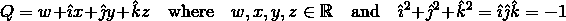

# 如何使用 __dunder__ 方法来优化您的数据模型

> 原文：<https://levelup.gitconnected.com/using-dunder-methods-to-refine-data-model-c58ee41102e9>


我们决定叫醒所有人。波兰，2019。私图。

## 通过使用*四元数*理解 __init__ 和其他特殊的 Python 函数

# 介绍

几乎每个使用过 Python 的人都会遇到至少一种所谓的 Python *魔法*方法。Dunder 方法是 Python 的特殊函数，允许用户**挂钩到**一些正在执行的特定动作。大概最常遇到的就是`__init__`法了。当从一个类实例化一个新对象时调用它，通过覆盖它，我们可以获得对该过程的控制。

然而，这篇文章**不会**带你浏览这些的[完整列表](https://docs.python.org/3/reference/datamodel.html)。

相反，我们将通过讲述一个简短的*故事*来展示如何有效地使用这个伟大的 Python 特性。我们将使用*四元数*作为例子来解释创建我们的**数据模型**的过程，这对于其他开发人员来说很容易处理，尤其是那些对高等代数不太感兴趣的人。最重要的是，我们将解释**决策过程**,并论证为什么**甚至费神也是有意义的。**

# 简单对象

一个[四元数](https://en.wikipedia.org/wiki/Quaternion)是一个代数概念，常用于描述*旋转*，广泛应用于 3D 建模和游戏中。从概念上讲，四元数可以被认为是复数体的延伸，有三个虚部，而不是一个。根据应用的不同，它们也可以理解为三维向量或四维对象或标量向量对的商。



好吧，但是我们怎么编码呢？

# 实例化

从编程的角度来看，我们不需要如此深入地关注数学。在这个阶段，我们只需要知道一个四元数是由*四个实数*定义的。

## __init__

```
class Quaternion:
    def __init__(self, w, x, y, z):
        self.w = w
        self.x = x
        self.y = y
        self.z = z
```

我们将我们的数学“存在”建模为一个对象，我们有了第一个邓德方法。这段代码所做的就是告诉 Python:“看，当你创建一个新的类*四元数*的对象时，我需要你提供四个数字来实例化它。因为每个四元数都是不同的，所以将`w`、`x`、`y`和`z`定义为对象属性而不是类属性是有意义的。

# 表现

让我们创建第一个四元数。

```
>>> q1 = Quaternion(1, 2, 3, 4)
>>> q1
<__main__.Quaternion at 0x7f4210f483c8>
```

`>>> q1 <__main__.Quaternion at 0x7f4210f483c8>`

我们的四元数是一个对象，但它看起来很丑。默认情况下，我们看到的是该对象在内存中的地址，但是这个描述没有告诉我们任何我们感兴趣的属性。

## __repr__，__str__

```
def __repr__(self):
    return "Quaternion({}, {}, {}, {})".format(
        self.w, self.x, self.y, self.z)

def __str__(self):
    return "Q = {:.2f} + {:.2f}i + {:.2f}j + {:.2f}k".format(
        self.w, self.x, self.y, self.z)
```

这里，我们又定义了两个方法。这个`__repr__`方法是对象的一个“官方”表示，这里用这个质量表示`eval(repr(obj)) == obj`。

很好。`__repr__`方法返回一个足够描述性的字符串。然而，我们可以通过`__str__`进一步提高我们的代表性。输出如下所示:

```
>>> q1            # calls q1.__repr__
Quaternion(1, 2, 3, 4)>>> print(q1)     # calls q1.__str__
Q = 1.00 + 2.00i + 3.00j + 4.00k
```

# 执行代数运算

在这一点上，你可能想知道为什么不使用*列表*或*字典*？这当然是更少的代码，我们可以很容易地看到元素。

嗯，我们确实需要比“一袋数字”更多的东西。有两个主要的反对理由:

1.  我们不想**依赖惯例**。`w`是不是总要被命名为“w”并作为第一个自变量？万一有人弄坏了呢？
2.  我们定义这个对象来**反映它被设计来表示的数学属性。**

很艰难，对吧？除了 1。，四元数是*加法*。试着把字典或者列表加在一起…会产生`TypeError`，而另一个会扩展元素的数量，从而打破我们的定义。还有一个办法。

# 添加

## __ 添加 _ _

```
def __add__(self, other):
    w = self.w + other.w
    x = self.x + other.x
    y = self.y + other.y
    z = self.z + other.z
    return Quaternion(w, x, y, z)
```

我们找到了。我们刚刚覆盖了`+`操作符，定义了四元数的加法。

```
>>> q1 = Quaternion(1, 2, 3, 4)
>>> q2 = Quaternion(0, 1, 3, 5)
>>> q1 + q2
Quaternion(1, 3, 6, 9)
```

# 减法

## __sub__

同样，我们也可以做减法。这一次我们将用一行代码来完成它。

```
def __sub__(self, other):
    return Quaternion(*list(map(lambda i, j: i - j,
        self.__dict__.values(), other.__dict__.values())))
```

虽然这是不必要的，但它也展示了另一个方便的 dunder 方法。`__dict__`方法收集一个对象的所有属性，并将它们作为一个字典返回。

# 增加

如果你还觉得操作的 overriding 很无聊，现在是时候找乐子了。

## __matmul__

最简单的是*点积*。用`@`表示，从 Python 3.5 开始，它调用`__matmul__`方法，对于四元数，它被定义为简单的元素级乘法。

尽管“普通”乘法更难。首先，代数区分了四元数乘以四元数乘法。其次，乘法是**不可换的**，意思是说`q1 * q2 != q2 * q1`。

## __mul__

```
def __mul__(self, other):
    if isinstance(other, Quaternion):
        w = self.w * other.w - self.x * other.x \
          - self.y * other.y - self.z * other.z
        x = self.w * other.x + self.x * other.w \
          + self.y * other.z - self.z * other.y
        y = self.w * other.y + self.y * other.w \
          + self.z * other.x - self.x * other.z
        z = self.w * other.z + self.z * other.w \
          + self.x * other.y - self.y * other.x
        return Quaternion(w, x, y, z)
    elif isinstance(other, (int, float)):
        return Quaternion(*[other*i for i inself.__dict__.values()])
    else:
        raise TypeError("Operation undefined.")
```

这里，如果`other`是一个四元数，我们计算所谓的哈密尔顿积，返回一个新的对象。如果`other`是一个标量(一个数字)，我们用这个数字乘以四元数的每个坐标。最后，任何其他东西都会引发异常。

如前所述，四元数的乘法是不可交换的。然而，这只是在四元数相乘的时候。根据目前的定义，如果我们执行`2 * q1`，我们将得到一个错误。要解决这个问题，我们可以使用`__rmul__`，它涵盖了我们的案例:

## __rmul__

```
def __rmul__(self, other):
    if isinstance(other, (int, float)):
        return self.__mul__(other)
    else:
        raise TypeError("Operation undefined.")
```

现在，我们可以将一个四元数乘以两边的标量，而四元数*可以按照严格定义的顺序乘以另一个四元数*。

# 平等

我们将跳过*部分*，因为它遵循相同的模式。取而代之的是另一个好奇心:平等。

两个四元数其实相等是什么意思？是当所有成分成对相等时，还是当两个物体代表相同的真理时？

我们可以使用这些定义中的任何一个……然而，我们**问自己这个问题的事实证明了重写一个方法是正确的。**

## __eq__

```
def __eq__(self, other):
    r = list(map(lambda i, j: abs(i) == abs(j), 
        self.__dict__.values(), other.__dict__.values()))
    return sum(r) == len(r)
```

这里我们将`==`定义为所有坐标的绝对值必须匹配的情况。

# 其他操作

Python 定义了一个可以被覆盖的操作符列表。然而，并不是每一个数学运算都在邓德方法中得到体现。在这些情况下，最好坚持“正常”的方法，因为其他符号的使用会违反直觉。

例如:

```
from math import sqrt

def norm(self):
    return sqrt(sum([i**2 for i in self.__dict__.values()))

def conjugate(self):
    x, y, z = -self.x, -self.y, -self.z
    return Quaterion(self.w, x, y, z)

def normalize(self):
    norm = self.norm()
    return Quaternion(*[i / norm for in self.__dict__.values()])

def inverse(self):
    qconj = self.conjugate()
    norm  = self.norm()
    return Quaternion(*[i / norm for i in qconj.__dict__.values()])
```

# 覆盖还是重载？

在这篇文章中，我们小心翼翼地注意我们的语言。我们“改写”了一些邓德方法，理由很充分。然而，我们没有对操作符执行任何*重载*。严格意义上的运算符重载在 Python 中是不存在的。一个方法只能有一个接口，尽管 Python 允许可变数量的参数。

你还记得我们如何实例化我们的对象吗？我们使用四个数字`w`、`x`、`y`和`z`作为参数。然而，在处理四元数时，通常从*偏航、俯仰*和*滚转*T21 角度导出四元数，这些角度与[欧拉角](https://en.wikipedia.org/wiki/Euler_angles)密切相关。

问题来了，我们如何通过编程来实现它们？我们扩展我们的`__init__`方法的接口来接受七个数字吗？是不是最好让其中一些可选？如果是，那么我们如何保证对象的完整性呢？就代码质量而言，我们需要付出什么代价？

说到四元数，我们确实有机会实现一些*接近重载*的东西，让我们的代码更加整洁。

# Pythonic 式的“重载”

因为所有的操作，正如我们看到的，都涉及到`w, z, y, z`变量，所以在我们的类中添加更多的属性是没有意义的。然而，我们必须做的是选择*绕过*构造函数的接口，用`yaw`、`pitch`和`roll`将它们转换成`(w, x, y, z)`并实例化一个新的对象。

首先，让我们创建重新计算方法:

```
from math import sin, cos

def _ypr_to_coords(yaw, pitch, roll):
    y = 0.5 * yaw
    p = 0.5 * pitch
    r = 0.5 * roll

    w = cos(y) * cos(p) * cos(r) + sin(y) * sin(p) * sin(r)
    x = cos(y) * cos(p) * sin(r) - sin(y) * sin(p) * cos(r)
    y = sin(y) * cos(p) * sin(r) + cos(y) * sin(p) * cos(r)
    z = sin(y) * cos(p) * cos(r) - cos(y) * sin(p) * sin(r)
    return w, z, y, z
```

该方法是*受保护的*，因为它是类的“内部”方法。它也不对对象执行任何操作。它只重新计算角度，返回坐标。

接下来，我们将它作为第二张脸的一部分。

```
class Quaternion:
    def __init__(self, w, x, y, z):
        self.w = w
        self.x = x
        self.y = y
        self.z = z

    @classmethod
    def create_from_ypr(cls, yaw, pitch, roll):
        r = cls._ypr_to_coords(yaw, pitch, roll)
        return cls(*r)
```

在不影响`__init__`或属性的情况下，我们现在有了另一种方法来实例化我们的四元数。使用`@classmethod` decorator，我们将`create_from_ypr(...)`方法指定为类方法，而不是对象方法。当在一个类上调用时，它重新计算我们的坐标并返回类本身(通过以前的`__init__`),输入必要的参数。

这个技巧允许我们忠于我们的定义，但是增加了更多的灵活性。我们甚至可以用这种方法来定义特殊种类的对象:

```
class Quaternion:
    ...

    @classmethod
    def create_identity(cls):
        return cls(1, 0, 0, 0)>>> q0 = Quaternion.create_identity()
>>> print(q0)
Q = 1.00 + 0.00i + 0.00j + 0.00k
```

# 结论

在这篇文章中，我们介绍了一种使用 Python 的一些特殊特性的模式，称为 dunder 方法。我们已经给出了如何利用这些方法来建模抽象代数对象(即四元数)的例子。我们还清楚地区分了*重写*和*重载*，并展示了如何实现后者来帮助我们处理对象。

想看更多方法，看一看这个[要诀](https://gist.github.com/OlegZero13/8e2ca12e67ffd9b4bf020cc1a9b4f215#file-quaternion-py)。如果有什么需要改进的地方，请在下面的评论中反馈！谢谢；)

# 还会有更多…

我计划把文章带到下一个层次，并提供简短的视频教程。

如果您想了解关于视频和未来文章的更新，**订阅我的** [**简讯**](https://landing.mailerlite.com/webforms/landing/j5y2q1) **。你也可以通过填写[表格](https://forms.gle/bNpf9aqZJGLgaU589)让我知道你的期望。回头见！**

*原载于*[*https://zerowithdot.com*](https://zerowithdot.com/dunder_methods_and_quaternions/)*。*