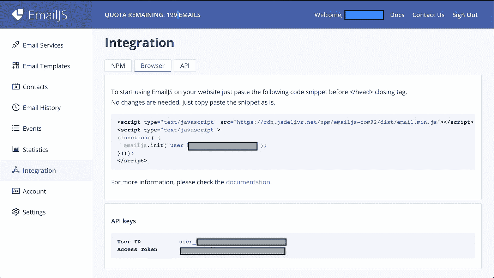
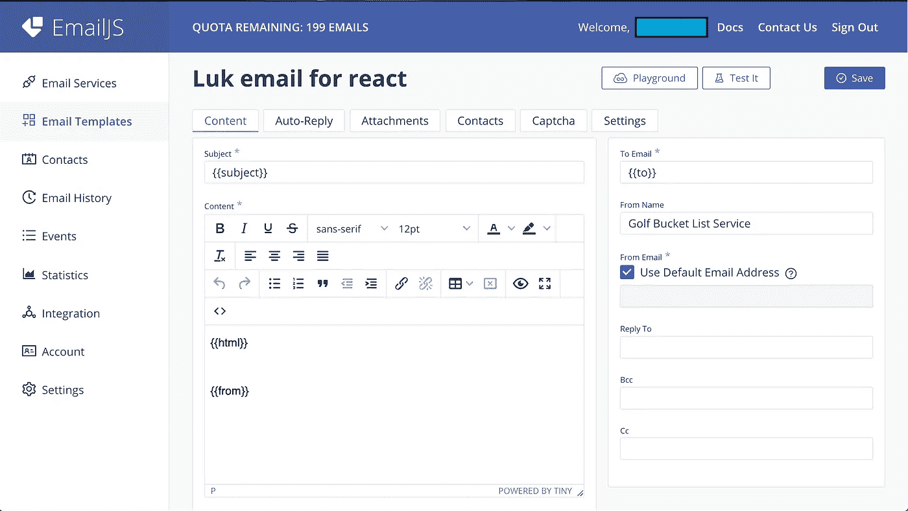
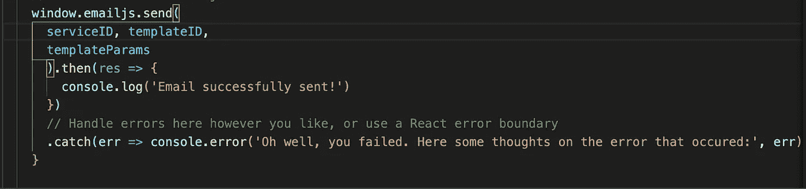
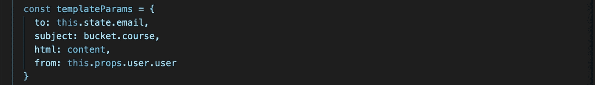

# 在 React 项目中使用 EmailJS

> 原文：<https://levelup.gitconnected.com/using-emailjs-in-your-react-project-5697a9aeb581>

在 React 项目中实现 EmailJS 非常简单。只需几个简单的步骤，你就可以直接从你的应用程序中生成自定义电子邮件。当然，首先你得注册 EmailJS 服务。这是免费的，但你每月的限额是 200 封电子邮件。除非你打算向你的朋友发送虚假的成人约会邮件，否则这应该是个不错的测试。

注册后，进入你的 EmailJS 账户，点击菜单面板上的 Integration 选项卡。

EmailJS 帐户仪表板

关于如何在应用程序中使用 EmailJS，你有几个选择。你可以先通过 NPM 像安装模块一样安装它。点击 NPM 按钮，它会告诉你怎么做。我选择了浏览器的方式，所以上面的截图告诉你点击浏览器按钮后要做什么。按照说明所述，只需将代码片段原样复制到项目中的 index.html 文件中，就可以开始了。

如果您想知道如何创建发送给实际收件人的实际电子邮件，请记住 EmailJS 是一个中间人服务，因此您需要向它提供 SMTP 服务器所需的实际电子邮件的信息。这就是模板发挥作用的地方。EmailJS 上的电子邮件模板就是它的本来面目——服务将使用该模板根据您提供的数据元素制作格式化的电子邮件。

单击菜单窗格上的电子邮件模板，然后单击创建新模板。您还可以修改提供的电子邮件模板示例。这是我做的一个简单的。

EmailJS 模板

你可以随意命名你的模板，但是要确保你点击了设置按钮并且复制了模板 ID。我相信它默认为所有的小写字母，基于模板名称用下划线代替空格。在任何情况下，这都是您在代码中需要的 ID。

这里有相当多的选项可以让你的电子邮件如你所愿的那样漂亮。最主要的当然是邮件的内容。如上面的截图所示，该模板提供了一个基本电子邮件表单的外观。红色*表示必填字段，而其他所有内容都是可选的，这意味着如果没有填写，您的收件人将会看到这些项目中的空白。那么，我如何为每个收件人制作一封看起来很定制的电子邮件呢？关键是参数变量——那些包含在{{}}中的东西！

同样，无论你想给它们起什么名字都可以。就把它们想象成 javaScript 对象中的对象键。一旦我给你看了代码，一切就都说得通了。我不确定参数变量的数量是否有限制，也不确定是否需要像您命名的那样传递精确的变量数量。发现了请随意评论。然而，并不是一切都需要变量。如果你希望每封邮件都有相同的内容，只需在框中键入任何文本，每封邮件都会显示出来(就像上面例子中的发件人姓名)。

保存模板后，您就可以将电子邮件发送到 EmailJS，以便发送给您的收件人。在你需要发送电子邮件的任何组件中，你只需要下面的代码。

通过 EmailJS 发送电子邮件的 javaScript 代码

您在 window.emailjs 中调用 send 函数，同时传入三个参数— serviceID、templateID 和 templateParms。ServiceID 是您用来注册 EmailJS 的电子邮件 ID，而 templateID 是您从自己创建的模板的设置中复制下来的。我只是将它们定义为 const，并在函数被调用之前赋予它们适当的值。

这就是 templateParms 在代码中的定义方式。

templateParms 对象

正如您在上面看到的，每个对象键都与模板中{{}}中的值相匹配。你可以提供一串用逗号分隔的电子邮件地址，EmailJS 会将电子邮件发送到这些地址中的每一个(收件人:"john.doe@gmail.com、jane.doe@abc.org、保罗. x@hotmail.com”)。因为 EmailJS 接受对象，将每个键与参数变量匹配，并根据模板布局应用值，所以您可以按照自己认为合适的方式在模板上排列变量。您还可以对它们应用任何可用的格式选项(例如，字体、缩进、文本颜色、背景颜色……)。

希望这有所帮助。开心滥发(一个月 200)；-)