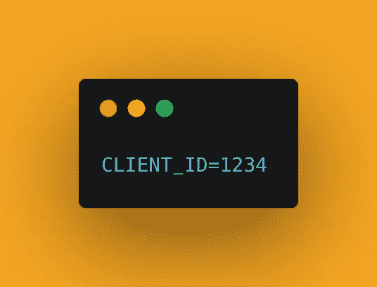
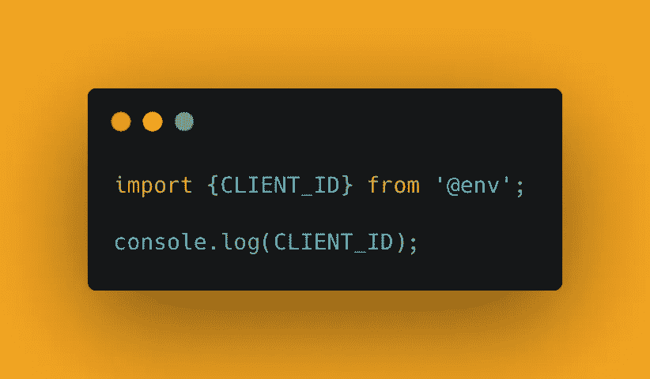
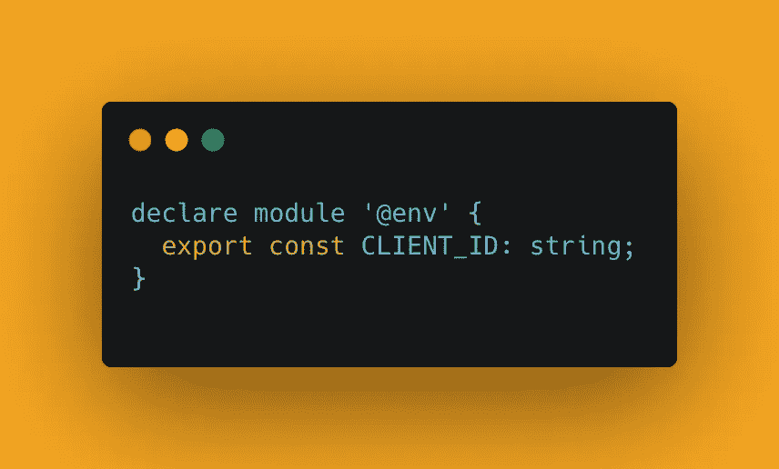

# 在 React 本机应用程序中使用环境变量。

> 原文：<https://levelup.gitconnected.com/using-environment-variables-in-a-react-native-app-f2dd005d2457>


照片由[摄影师](https://unsplash.com/@ffstop?utm_source=medium&utm_medium=referral)在 [Unsplash](https://unsplash.com?utm_source=medium&utm_medium=referral) 上拍摄

通过运行命令安装`react-native-dotenv`库/包

`npm i react-native-dotenv`

## 对于 iOS 来说，

1.  `cd /ios`
2.  `pod install`

配置您的`babel.configure.js`,允许您使用 dotenv 为多个环境将您的环境变量注入到您的 **react-native 环境**中。

## 基本设置:

在您的`babel.configure.js`文件中，添加以下代码:

```
module.exports = {
  "plugins": [
    ["module:react-native-dotenv", {
      "moduleName": "@env",
      "path": ".env",
      "blacklist": null,
      "whitelist": null,
      "safe": false,
      "allowUndefined": true
    }]
  ]
}
```

## 用法:

在项目文件夹的根目录下创建一个`.env`文件，并添加环境变量。



环境变量的示例

接下来，导入环境变量并在代码中使用它，如下所示:



## 对于使用 Typescript 的项目:

*   创建一个**类型**文件夹
*   在类型文件夹中创建一个文件，例如`env.d.ts`
*   打开`tsconfig.json`文件，将下面一行添加到“compilerOptions”中:{}对象:

`"typeRoots": ["./src/types"]`

*   现在回到`env.d.ts`文件，声明一个“@env”模块，添加所有的环境变量，并像这样导出:



声明“@env”模块并导出所有环境变量(typescript 选项)

## 总结:

在这篇博文中，我们通过安装 npm 包`react-native-dotenv`和配置 babel.config.js 文件，了解了如何在我们的 **react-native** 项目中使用环境变量。最后，我们创建了一个 **env** 文件，并在我们想要使用的文件/源代码中导入了环境变量。

暂时就这样了。请在下面的评论区给我你的反馈。谢谢大家！