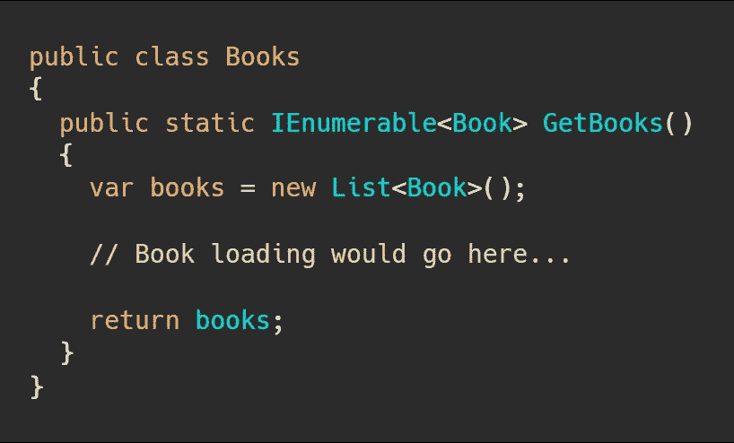
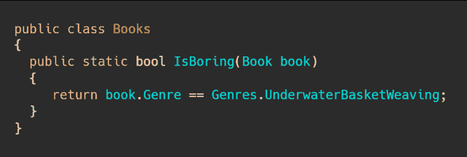
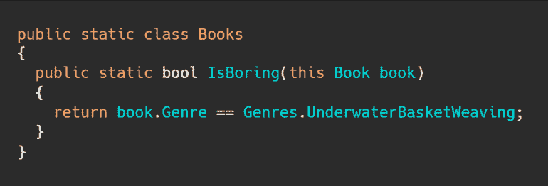
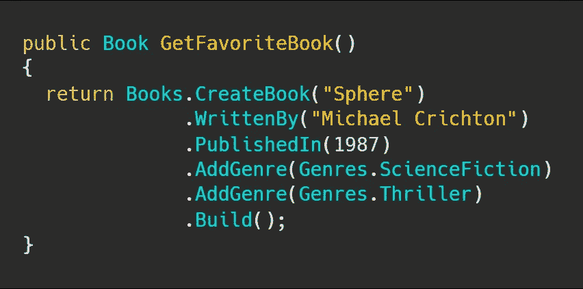
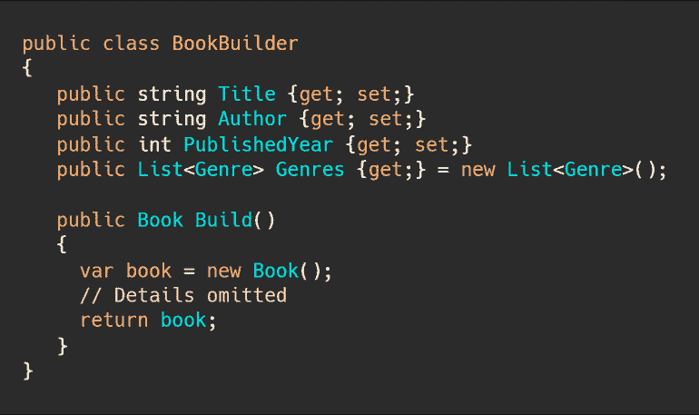
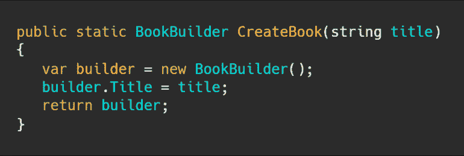
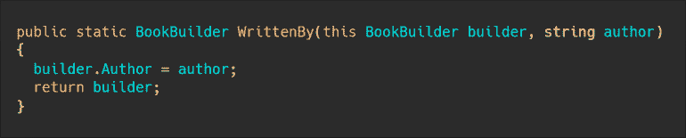
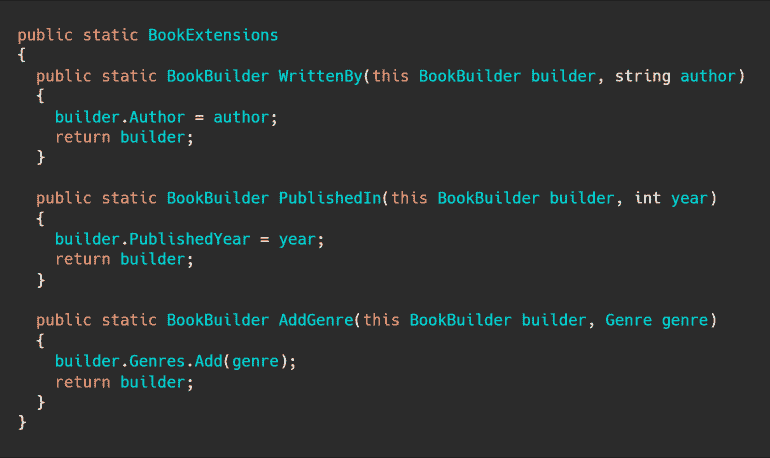

# 使用 C#中的扩展方法构建流畅的代码

> 原文：<https://levelup.gitconnected.com/using-extension-methods-in-c-to-build-fluent-code-1735fbc9b525>

扩展方法是现代。NET 和一些。NET 的最佳功能，如 LINQ。不幸的是，许多开发人员被它们吓住了，不明白在表面下发生了什么，也不知道如何构建新的。在本文中，我将试图揭开扩展方法的神秘面纱，并说明如何使用它们来构建优雅流畅的代码。

# 基础知识:静态方法

为了讨论扩展方法，我们必须首先讨论静态方法。

静态方法就是用`static`关键字声明的方法。这说明。NET 中，该方法不是在特定实例的基础上操作，而是作为一个整体附加到该类。因为这些方法是静态的，所以它们不能访问任何特定实例的状态，除非它作为参数传递给方法(稍后将详细介绍)。

与`String.IsNullOrEmpty`一样，`Integer.Parse`方法也是一个相当著名的静态方法。

在本文的整个过程中，我们将构建一个获取图书信息的方法，所以让我们创建一个静态方法来构建图书列表。

现在，要打电话去取我们的书，我们只需这样做:

`var books = Books.GetBooks();`

使用起来非常简单。

# 扩展方法

接下来让我们把注意力转向扩展方法。

简而言之，扩展方法是专门声明的静态方法，编译器允许您对匹配其签名的对象进行调用。

让我告诉你我的意思。

假设我们有以下静态方法:

这里我们可以取任何一个`Book`实例，并将其传递给`Books.IsBoring`，得到一个布尔响应。

我们把这个改成一个扩展方法吧。

由于扩展方法只能在静态类(不能被实例化并且只有静态成员的类)中声明，我们需要在我们的类中添加`static`关键字。

现在，我们通过将关键字`this`添加到第一个参数中，将`IsBoring`方法声明为扩展方法，如下所示:

`this`关键词在说明什么。NET 的一个特点是`IsBoring`是一个扩展方法，既可以通过静态方法语法调用，如`Books.IsBoring(someBook)`，也可以通过扩展方法语法调用，如`someBook.IsBoring()`。

注意扩展方法语法中的`this`关键字*只能*用于第一个参数，即该方法扩展的类型或接口。

扩展方法是让编译器将扩展方法样式调用替换为静态方法调用的语法糖。

然而，最终的结果是扩展方法让你*出现*以将新的功能附加到其他类或接口上。这是它们的主要优势，因为扩展方法允许您简化调用语法，代价是模糊了向普通读者声明方法的确切位置。

现在我们知道了什么是扩展方法，让我们看看如何使用它们来构建一种流畅的语法或特定于领域的语言。

# 将扩展方法链接在一起

假设您想要创建一本书，并且需要执行一些操作来创建一个有效的书。如果您想提供一个相当灵活和可读的 API，您可以使用扩展方法来创建一个小型领域特定语言(DSL)。

在本例中，我们的最终目标是创建一个根据我们配置的值定制的 book 对象。

让我们首先关注最终结果:

那里发生了很多事，但可能没有你想的那么多。

让我们从`Books.CreateBook`通话开始。这是一个静态方法调用，它接受一个表示书名的字符串，并返回某个神秘对象。

让我们称这个对象为`BookBuilder`，它看起来像这样:

好吧，现在这可能更有意义了。这意味着我们的`CreateBook`静态方法看起来像这样:

下一个例子是我们调用`WrittenBy`。嗯，`BookBuilder`类没有定义这个方法。在一个普通的应用程序中，我们可能只是将方法添加到`BookBuilder`，但是这不会让我们在这里使用扩展方法，所以让我们假设`BookBuilder`类是由一些我们无法控制和修改的代码定义的。

我们将通过添加一个扩展方法来处理`WrittenBy`方法:

这是一个非常简单的方法，但是这里有一些关键的东西。

首先，由于参数签名中的`this`关键字，该方法充当了`BookBuilder`实例的扩展方法。

第二，调用方法时只指定了**一个**参数(例如`WrittenBy("Michael Crichton")`，因为第一个参数是根据调用扩展方法的`BookBuilder`推断出来的。

第三，我们正在返回我们得到的同一个*构建器*实例。我们返回这个参数的原因完全是为了支持流畅的语法，就像我们在前面的例子中看到的那样，并且允许在前面的扩展方法的返回结果上调用扩展方法。

最终的静态类可能如下所示:

这可能看起来不像你见过的最漂亮的代码，但它可以创建的语法类型可以非常强大和漂亮。

# 让我们来谈谈 LINQ

扩展方法被明确地添加到 C#语言中，以便支持在中集成的语言(LINQ)。NET 框架 3.5。

就开发人员的生产力而言，LINQ 是我最喜欢的 C#特性之一，如果没有扩展方法，这一切都不可能实现。

LINQ 让你做的事情有:

也许这是一个有点傻的例子，但这一切都是通过使用扩展方法来实现的，这些方法接受`IEnumerable<T>`或`IQueryable<T>`并使用各种`Func`签名来过滤、排序或转换集合。

换句话说，如果你真的想，你可以使用扩展方法，用几乎完全相同的语法编写你自己版本的 LINQ。请不要这样做——微软已经做得很好了——但是扩展方法的能力允许你这样做。

# 结束语

希望这能揭开扩展方法、LINQ 以及静态和实例方法背后的神秘面纱。

我确信扩展方法(以及 LINQ 的扩展)是生产率提高的关键之一。NET 技术，以及像基础类库、公共语言运行库、Visual Studio 和泛型这样的东西。

虽然您可能没有创建或者甚至没有考虑过扩展方法，但是它们为我们在现代中所做的许多事情提供了动力。NET 和它们提供的灵活性可以成为一个好的工具。

马特是一线。NET 和 JavaScript 软件工程经理，重点关注指导、架构和软件质量。

*原载于 2020 年 1 月 18 日 https://killalldefects.com***。**