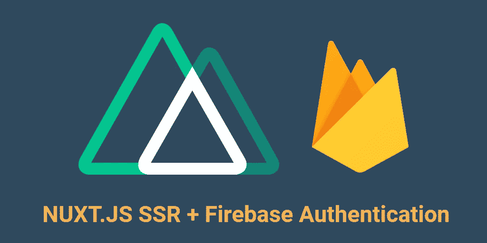

# 在 Nuxt 服务器端呈现的应用程序中使用 Firebase 身份验证

> 原文：<https://levelup.gitconnected.com/using-firebase-authentication-in-a-nuxt-server-side-rendered-application-c2a624a9e999>

在通用应用程序中使用 Firebase 身份验证可能不太直接。我这篇文章的目的是分享我让 Firebase 客户端认证在 Nuxt 上运行良好的经验。JS 框架，并且不牺牲 Nuxt 的任何内置功能。JS 框架。

# 前言

在 Medium、Stack Overflow 和其他一些网站上散布着大量的问题，更不用说你可能会发现的无数文章了。可悲的是，他们没有给出有效的答案，可能误导，重复别人过去的答案，过时，或者只是不适用于通用模式 Nuxt。JS 应用。

接下来，您可能会想看看市场上有哪些库。在撰写本文时，还没有多少即插即用模块/库可以让 Nuxt 与 Firebase 身份验证一起工作。在现有的那些库中，似乎没有一个能提供通用模式的解决方案。然而，由 Lupas——该库的作者——命名为 nuxt-fire 的库如果继续发展下去，看起来确实很有希望；我说“如果它继续发展下去，那将是有希望的”，因为它是最好的即插即用 Nuxt。JS 模块，但在为使用通用模式的身份验证提供可靠的解决方案方面，它还不是很好。

## 是时候让新火来拯救我们了

Lupas 的模块有助于将 Firebase 的许多服务集成到 Nuxt 中，同时也为其中的一些集成提供了一些他自己的实验功能——我们将在我们的应用程序中使用这个库。此外，卢帕斯似乎对他的图书馆充满热情，并希望它成为最好、最全面的解决方案。在其当前版本(3.5.5)中，您可以简单地启用 auth，方法是将一个布尔值传递到模块选项或一个对象中，该对象包含当某些 Firebase auth 事件发生时将调用的 Vuex 存储突变和操作的名称，以及一个设置 SSR 的选项。

现在，当我在配置 auth 集成的文档中看到 SSR 选项时，我眼前一亮。我想“哈利路亚！终于有人做到了！”在阅读了那个选项做了什么、结果启用了哪些代码以及 Firebase 文档之后，我开始有了新的想法。

## Lupas 认证解决方案的前提

Lupas 的解决方案附带了一个服务人员，即一块 Nuxt。JS 服务器中间件，和一个插件。服务工作人员处理 fetch 事件，以确保每当浏览器需要获取任何内容时，它都会劫持请求，并使用当前用户 id 令牌为特定请求设置授权头。服务器中间件查找先前设置的授权头，并将在响应对象上设置几个属性，这些属性包含来自解码声明的用户信息。最后，插件设置 onAuthStateChanged 事件监听器，该监听器将相应地提交和调度上述 Vuex 突变和动作。

我在 Lupas 的解决方案中遇到的核心问题是它所做的假设。首先，它要我注册一个服务工作者，这个服务工作者似乎是从 nuxt-fire 库内部复制到每个 nuxt 版本的 apps 静态目录中的。其次，我不知道这是特定于 Firebase 功能还是托管解决方案，但我注意到，如果我没有运行服务器框架(例如 express、fastify)，那么任何注册的 Nuxt 服务器中间件在 Firebase 功能上托管时都不会在生产中执行。然而，这并不是立即显而易见的，因为服务器中间件将在运行开发服务器时执行。

# 定义解决方案

注意了。我们将在接下来的解决方案中使用 nuxt-fire，Axios，一个定制的 nuxt 插件，以及 nuxtServerInit 调用。但是在我们开始之前，我将简要回顾一下这个高层次的概念。

## nuxtServerInit

nuxtServerInit 将检查我们将在客户端设置的包含当前登录用户的 ID 令牌的 cookie 是否存在。如果这个 cookie 存在，我们将尝试向 Firebase Admin 验证 ID 令牌。如果 id 令牌有效，我们将解码 ID 令牌，并将令牌中包含的声明提交给我们的 Vuex 存储，以便与我们的 auth-listener 插件一起使用。

## 授权监听器插件

auth-listener 插件是一个只在客户端运行的插件，负责检查 Vuex 存储以查看用户是否能够通过服务器的身份验证，还负责注册 Firebase 提供给我们的 onIdTokenChanged 事件侦听器。在这里记下来，因为这里进行的顺序很重要。该插件中的 Vuex 身份验证检查需要优先进行，因为我们需要在注册 onIdTokenChanged 事件侦听器之前调用$fireAuth.signOut()的能力，否则用户会话将被刷新。这很重要，如果服务器没有用用户信息初始化我们的 Vuex 存储，这意味着 id 令牌无效。接下来是我们的客户端插件运行的时候了，我们要确保它不会认为用户是经过认证的，这会导致客户端/服务器呈现不匹配。

## Axios 拦截器

最后，如果您正在发出需要认证的 API 请求，并且希望您的 ID 令牌作为认证用户的手段，那么您将需要使用请求拦截器。不符合这个要求也不用担心。跳过这一部分。谢天谢地，Axios 让拦截请求变得很容易。让我们概述一下需要拦截器的原因。在发送网络请求之前，我们需要确保在向我们的 API 发出请求之前，我们拥有最新的 ID 令牌。这将减少服务器向我们发回未授权请求的机会。想象一下，在给定的 ID 令牌过期之前，您有 1 秒钟的时间。假设您在一个慢速连接上发出一个请求，因此请求直到客户端发送请求后 2 秒钟才到达服务器。看到问题了吗？客户端认为我们通过了身份验证，但是由于时间延迟，服务器看到的是相反的情况。这就是为什么在发送令牌之前更新它很重要。

# **上班时间**

让我们从安装 6 个必要的 NPM 模块开始:

 [## firebase-管理

### Node.js 的 Firebase 管理 SDK

www.npmjs.com](https://www.npmjs.com/package/firebase-admin)  [## @nuxtjs/axios

### 安全轻松的 Axios 与 Nuxt.js 集成自动设置客户端和服务器端的基本 URL 暴露 setToken…

www.npmjs.com](https://www.npmjs.com/package/@nuxtjs/axios)  [## nuxt-火

### 轻松地将 Firebase 集成到您的 Nuxt 2 项目中。📖阅读完整文档📖访问 GitHub 页面安装 Nuxt-Fire…

www.npmjs.com](https://www.npmjs.com/package/nuxt-fire)  [## js-cookie

### 一个用于处理 cookies 的简单、轻量级的 JavaScript API

www.npmjs.com](https://www.npmjs.com/package/js-cookie)  [## 甜饼干

### HTTP 服务器的基本 HTTP cookie 解析器和序列化器。解析 HTTP Cookie 头字符串并返回一个对象…

www.npmjs.com](https://www.npmjs.com/package/cookie)  [## jwt-解码

### jwt-decode 是一个小的浏览器库，帮助解码 Base64Url 编码的 jwt 令牌。重要提示:这…

www.npmjs.com](https://www.npmjs.com/package/jwt-decode) 

安装好这些之后，让我们定义所需的 Vuex 存储操作、getters 和突变:

注意:cookie 名称在这里很重要，尤其是当您使用 Firebase 函数时；它必须是 _ _ 会话。

接下来，我们需要 auth-listener 插件:

前面代码中的 _handleAuthError 函数是供您实现的；这与这个例子无关。

接下来，我们需要 Axios 拦截器:

我承认，我认为 Lupas 让 Firebase auth 按需可用的做法非常酷。因此，主要思想是您等待一个承诺，该承诺执行 Firebase 的 onAuthStateChanged 事件侦听器，从而捕获取消订阅。然后，您立即取消订阅事件侦听器，一旦 auth 可用，您就可以获得用户并解析承诺。所以给那个想出这段代码的人一点鼓励吧。

最后，为了完整起见，我将提供 nuxt.config.js 的相关部分:

你需要遵循 Lupas 的 nuxt-fire 配置指南:[https://nuxt fire . netlify . com/guide/getting-started/# simple-Configuration](https://nuxtfire.netlify.com/guide/getting-started/#simple-configuration)

# 结论

你有它！我希望你觉得这是有帮助的，如果我错过了什么，请让我知道(这是一篇很长的文章)XD。此外，您可以扩展这个示例。假设您希望服务器在现有会话过期时将您重定向到一个更新会话的页面，然后该页面将您重定向回原始目的地。无论如何，祝你好运，下次再见。