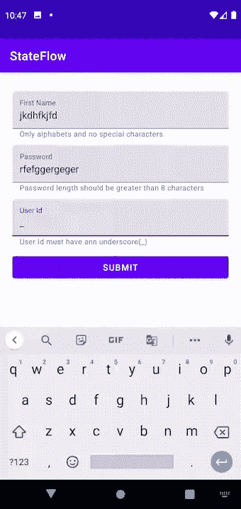

# 在 Android 中使用流进行表单验证。

> 原文：<https://levelup.gitconnected.com/using-flows-for-form-validation-in-android-79016b00c079>

在本文中，我们将使用最新的*Stateflow API*来创建一个验证表单。

我们将创建一个有 3 个输入文本字段的屏幕

*   名字-该字段仅接受字母。
*   密码—密码长度应大于 8 个字符。
*   用户 ID —此字段需要包含下划线(_)。

只有当所有三个字段都被正确填写时，**提交按钮**才被激活。

# 设置视图模型

在 Viewmodel 中，为每个输入字段初始化 val。

现在为每个输入字段创建一个 setter 函数，这个函数将在编辑字段时被调用。使用这些函数设置上述变量的值。

现在是时候创建一个流程来表示**提交**按钮的状态了(*启用/禁用*)。

使用 ***合并*** 操作符合并**_ 名字**流、**_ 密码**流和**_ 用户 Id** 流。只要它们中的任何一个发出一个值，这个函数就会被调用。检查该运算符中的所有三个字段是否有效，并返回它们是否正确(*真*)或不正确(*假*)。

# **设置活动/视图**

现在，在视图中，向所有三个输入编辑文本添加文本更改监听器。每当它们中的任何一个发生变化时，调用 viewmodel 中的 setter 函数。

我们需要从 viewmodel 中收集流，并根据流来改变按钮的状态。

# **就是这样！✅**

你可以在 Github 上找到这个应用，以及其他使用 flows 构建反应式 android 应用的例子。

 [## shivamdhuria/Stateflow

### 一个完全用 Kotlin 编写的 Android 应用程序，探索了流和协程在真实应用程序中的各种用法…

github.com](https://github.com/Shivamdhuria/stateFlows)