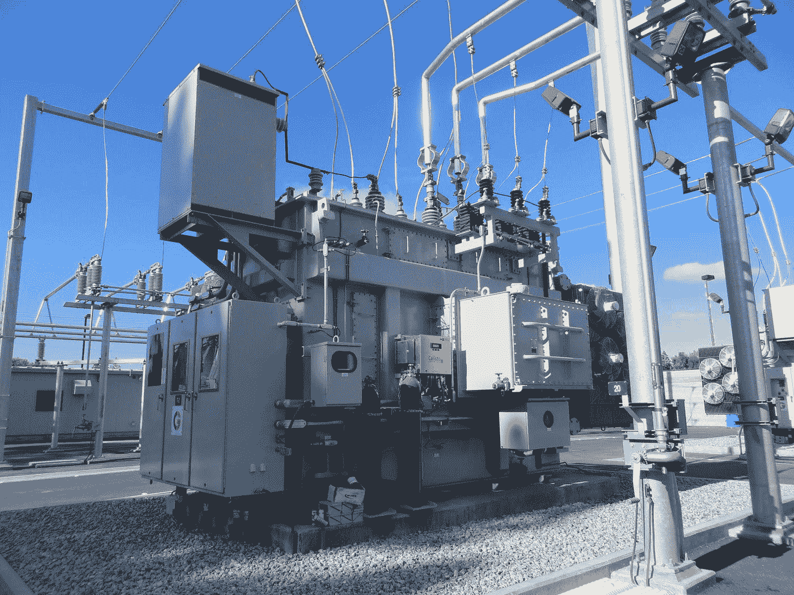

# 在 JavaScript 中使用生成器

> 原文：<https://levelup.gitconnected.com/using-generators-in-javascript-157420258408>


[卡斯滕·伍尔特(@karsten.wuerth)](https://unsplash.com/@karsten_wuerth?utm_source=medium&utm_medium=referral) 在 [Unsplash](https://unsplash.com?utm_source=medium&utm_medium=referral) 上的照片

在 JavaScript 中，生成器是返回生成器对象的特殊函数。生成器对象包含可迭代对象的`next`值。它用于让我们通过在一个`for...of`循环中使用 generator 函数来遍历一个对象集合。这意味着返回的生成器函数符合 iterable 协议。

# 同步发电机

任何符合 iterable 协议的东西都可以被一个`for...of`循环遍历。像`Array`或`Map`这样的对象符合这个协议。生成器函数也符合迭代器协议。这意味着它以标准的方式产生一系列值。它实现了`next`函数，该函数返回一个对象至少两个属性— `done`和`value`。`done`属性是一个布尔值，它返回迭代器超过迭代序列末尾的`true`。如果它能产生序列中的下一个项目，那么它就是`false`。`value`是迭代器返回的项。如果`done`是`true`，那么`value`可以省略。`next`方法总是返回具有上述两个属性的对象。如果返回非对象值，那么`TypeError`将被抛出。

为了编写一个生成器函数，我们使用下面的代码:

```
function* strGen() { 
  yield 'a';
  yield 'b';
  yield 'c';
}

const g = strGen();
for (let letter of g){
  console.log(letter)
}
```

function 关键字后的星号表示该函数是一个生成器函数。生成器函数将只返回生成器对象。使用生成器函数，`next`函数是自动生成的。生成器还有一个`return`函数返回给定值并结束生成器，还有一个`throw`函数抛出错误并结束生成器，除非在生成器中捕获到错误。为了从生成器返回下一个值，我们使用了`yield`关键字。每次调用`yield`语句时，发生器暂停，直到再次请求`next`值。

当执行上述示例时，我们记录了‘a’、‘b’和‘c’，因为生成器在`for...of`循环中运行。每次运行时，调用下一个`yield`语句，从`yield`语句列表中返回下一个值。

我们也可以编写一个生成器来生成无限个值。我们可以在生成器内部建立一个无限循环来不断返回新值。因为`yield`语句直到请求下一个值时才运行，所以我们可以保持无限循环运行，而不会使浏览器崩溃。例如，我们可以写:

```
function* genNum() {
  let index = 0;
  while(true){
    yield index += 2;
  }
}const gen = genNum();
console.log(gen.next().value);
console.log(gen.next().value);
console.log(gen.next().value);
```

如你所见，我们可以使用一个循环来重复运行`yield`。`yield`语句必须在代码的顶层运行。这意味着它们不能嵌套在另一个回调函数中。`next`函数自动包含在生成器对象中，该对象用于从生成器中获取下一个值。

迭代器结束时，调用`return`方法。也就是说，当获得最后一个值时，或者当用`thrown`方法抛出一个错误时。如果我们不想让它结束，我们可以将`yield`语句包装在`try...finally`子句中，如下面的代码所示:

```
function* genFn() {
  try {
    yield;
  } finally {
    yield 'Keep running';
  }
}
```

当运行生成器时调用`throw`方法，错误将停止生成器，除非在生成器函数中捕获到错误。为了捕捉、抛出和捕获错误，我们可以编写类似下面的代码:

```
function* genFn() {
  try {
    console.log('Start');
    yield; *// (A)*
  } catch (error) {
    console.log(`Caught: ${error}`);
  }
}const g = genFn();
g.next();
g.throw(new Error('Error'))
```

正如您所看到的，如果我们运行上面的代码，我们可以看到当第一行运行时记录了“Start ”,因为我们只是从生成器对象获取第一个值，这是`g.next()`行。然后运行抛出错误的`g.throw(new Error('Error'))`行，该错误记录在`catch`子句中。

有了生成器函数，我们还可以用`yield*`关键字调用它内部的其他生成器函数。以下示例不起作用:

```
function* genFn() {
  yield 'a'
}function* genFnToCallgenFn() {
  while (true) {
    yield genFn();
  }
}const g = genFnToCallgenFn()
console.log(g.next())
console.log(g.next())
```

如你所见，如果我们运行上面的代码，记录的`value`属性是生成器函数，这不是我们想要的。这是因为`yield`关键字没有直接从其他生成器中检索值。这就是`yield*`关键字有用的地方。如果我们用`yield* genFn();`替换`yield genFn();`，那么`genFn`返回的来自生成器的值将被检索。在这种情况下，它将不断获得字符串' a '。例如，如果我们改为运行以下代码:

```
function* genFn() {
  yield 'a'
}function* genFnToCallgenFn() {
  while (true) {
    yield* genFn();
  }
}const g = genFnToCallgenFn()
console.log(g.next())
console.log(g.next())
```

我们将看到两个记录的对象中的`value`属性都将`value`属性设置为‘a’。

有了生成器，我们可以编写一个迭代方法来递归地遍历一棵树。例如，我们可以这样写:

```
class Tree{
  constructor(value, left=null, center=null, right=null) {
    this.value = value;
    this.left = left;
    this.center = center;
    this.right = right;
  }

  *[Symbol.iterator]() {
    yield this.value;
    if (this.left) {
      yield* this.left;
    }
    if (this.center) {
      yield* this.center;
    }
    if (this.right) {
      yield* this.right;
    }
  }
}
```

在上面的代码中，我们拥有的唯一方法是一个生成器，它返回树的当前节点的左、中和右节点。注意，我们使用了关键字`yield*`而不是`yield`，因为 JavaScript 类是生成器函数，我们的类是生成器函数，因为我们有由符号`Symbol.iterator`表示的特殊函数，这意味着该类将创建一个生成器。

符号是 ES2015 的新功能。这是一个唯一且不可变的标识符。一旦创建，就无法复制。每次你创造一个新的符号，它都是独一无二的。它主要用于对象中的唯一标识符。这是一个符号的唯一目的。

有一些它自己的静态属性和方法公开全局符号注册表。它就像一个内置对象，但是它没有构造函数，所以我们不能写`new Symbol`用`new`关键字构造一个符号对象。

`Symbol.iterator`是一个特殊符号，表示该函数是迭代器。它内置于 JavaScript 标准库中。

如果我们已经定义了下面的代码，那么我们就可以建立树形数据结构了:

```
const tree = new Tree('a',
  new Tree('b',
    new Tree('c'),
    new Tree('d'),
    new Tree('e')
  ),
  new Tree('f'),
  new Tree('g',
    new Tree('h'),
    new Tree('i'),
    new Tree('j')
  )
);
```

然后当我们跑的时候:

```
for (const str of tree) {
    console.log(str);
}
```

我们按照定义树的顺序记录树的所有值。定义递归数据结构比没有生成器函数要容易得多。

我们可以在一个生成器函数中混合使用`yield`和`yield*`。例如，我们可以写:

```
function* genFn() {
  yield 'a'
}function* genFnToCallgenFn() {
  yield 'Start';
  while (true) {
    yield* genFn();
  }
}const g = genFnToCallgenFn()
console.log(g.next())
console.log(g.next())
console.log(g.next())
console.log(g.next())
```

如果我们运行上面的代码，我们得到“Start”作为由`g.next()`返回的第一个项目的`value`属性。那么记录的其他项目都有“a”作为`value`属性。

我们还可以使用`return`语句来返回您想要从迭代器返回的最后一个值。它的行为与生成器函数中的最后一个`yield`语句完全一样。例如，我们可以写:

```
function* genFn() {
  yield 'a';
  return 'result';
}
const g = genFn()
console.log(g.next())
console.log(g.next())
console.log(g.next())
console.log(g.next())
```

如果我们查看控制台日志，我们可以看到我们记录的前两行在`value`属性中返回了‘a ’,在前两行`console.log`的`value`属性中返回了‘result’。那么剩下的一个有`undefined`作为`value`。第一个`console.log`的`done`设置为`false`，其余的`done`设置为`true`。这是因为`return`语句结束了生成器函数的执行。它下面的任何东西都像常规的`return`语句一样不可达。



美国公共电力协会在 [Unsplash](https://unsplash.com?utm_source=medium&utm_medium=referral) 上拍摄的照片

# 异步发电机

生成器也可以用于异步代码。要为异步代码创建一个生成器函数，我们可以用特殊符号`Symbol.asyncIterator` function 表示的方法创建一个对象。例如，我们可以编写以下代码来循环遍历一系列数字，每次迭代间隔 1 秒钟:

```
const rangeGen = (from = 1, to = 5) => {
  return {
    from,
    to,
    [Symbol.asyncIterator]() {
      return {
        currentNum: this.from,
        lastNum: this.to,
        async next() {
          await new Promise(resolve => setTimeout(
            resolve, 1000)); if (this.currentNum <= this.lastNum) {
            return {
              done: false,
              value: this.currentNum++
            };
          } else {
            return {
              done: true
            };
          }
        }
      };
    }
  };}(async () => {
  for await (let value of rangeGen()) {
    console.log(value);
  }
})()
```

注意，promise 解析的值在`return`语句中。`next`函数应该总是返回一个承诺。我们可以通过使用`for await...of`循环来迭代生成器生成的值，该循环适用于迭代异步代码。这非常有用，因为可以循环异步代码，就像同步代码一样，这在我们有异步生成器函数和`async`和`await`语法之前是做不到的。与同步发电机一样，我们返回一个具有`done`和`value`属性的对象。

我们可以通过编写以下代码来缩短上面的代码:

```
async function* rangeGen(start = 1, end = 5) {
  for (let i = start; i <= end; i++) {
    await new Promise(resolve => setTimeout(resolve, 1000));
    yield i;
  }
}(async () => {
  for await (let value of rangeGen(1, 10)) {
    console.log(value);
  }
})()
```

注意，我们可以将`yield`操作符与`async`和`await`一起使用。在`rangeGen`的结尾仍然会返回一个承诺，但是这是一个更短的方法。它做的事情和前面的代码完全一样，但是它更短，更容易阅读。

生成器函数对于创建可用于`for...of`循环的迭代器非常有用。`yield`语句将获得迭代器从您选择的任何源返回的下一个值。这意味着我们可以把任何东西变成一个可迭代的对象。此外，我们可以通过使用符号`Symbol.iterator`表示的方法定义一个类来使用它遍历树结构，这将创建一个生成器函数，该函数使用`yield*`关键字获取下一级中的项目，该关键字直接从生成器函数中获取项目。此外，我们使用了`return`语句来返回生成器函数中的最后一项。对于异步代码，我们有`AsyncIterators`，我们可以通过使用`async`、`await`和`yield`来定义它，就像我们在上面所做的那样，来顺序地解析承诺。