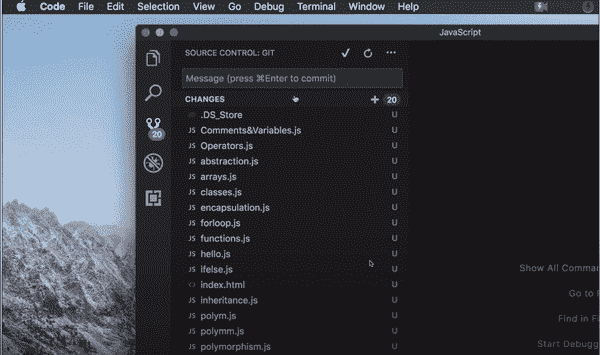
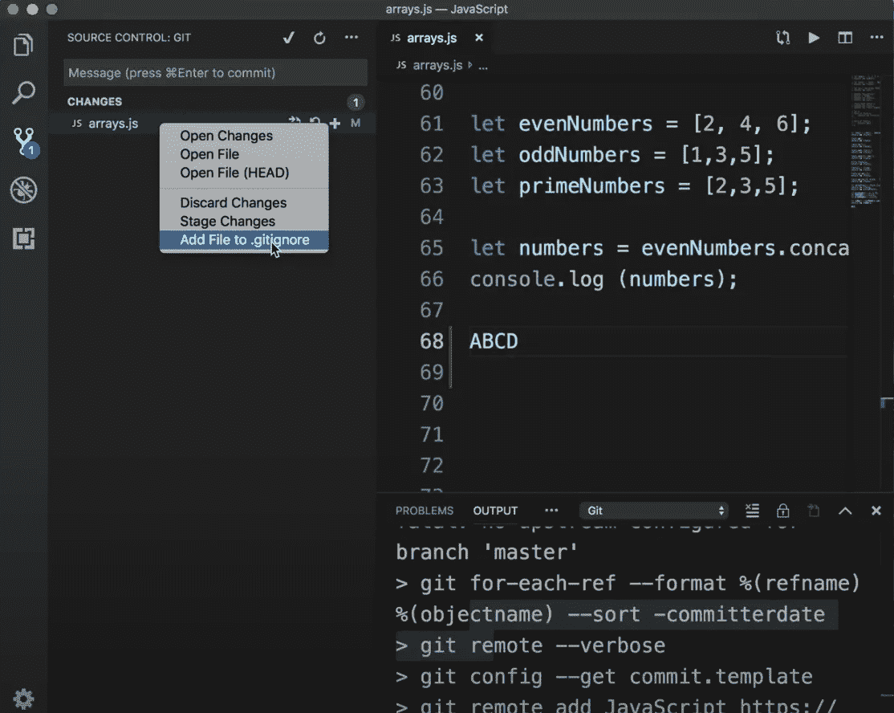

# 在 Visual Studio 代码中使用 Git

> 原文：<https://levelup.gitconnected.com/using-git-in-visual-studio-code-2f16fde8406e>

以及我们现在如何能够将 git 终端命令留在身后(主要是)🙌

感谢您访问本帖！一定也看看我在 [*LinkedIn*](https://www.linkedin.com/in/stephenandersondev/) *和*[*GitHub*](https://github.com/stephenandersondev)*上的其他作品。*

照片由[卢卡·布拉沃](https://unsplash.com/@lucabravo?utm_source=medium&utm_medium=referral)在 [Unsplash](https://unsplash.com?utm_source=medium&utm_medium=referral) 上拍摄

我们都知道 Visual Studio Code (VS Code)是目前最好的文本编辑器，但即使如此，大多数人仍然不知道它所有令人惊叹的特性。我们将深入探讨我认为最强大的工具之一，用于 VS 代码的内置版本控制工具。我们将看看如何利用它们来节省运行那些重复的 git 终端命令的时间。让我们投入进去吧！

VS 代码中的版本控制工具非常强大，我们不可能在一篇博文中涵盖所有内容，所以今天我们将讨论一些最基本的工具，它们将帮助您从第一天起就更有效率！此外，在这篇博客中，我们将使用的 git 平台是 GitHub，因为 1)我做我想做的事情，2) GitHub 是目前使用最广泛的平台。但是要知道，VS 代码能够与几乎所有基于 git 的平台一起工作。

# 从 GitHub 克隆一个 Repo

从 GitHub 克隆一个 repo 是软件工程师经常要做的事情。像我这样的编码训练营的学生甚至会在一天内为课程中不同的实验和作业做多次。我们都知道该怎么做，去获取克隆链接，cd 到我们系统上想要存储回购的位置，然后运行“git clone”并粘贴链接，然后 cd 到新克隆的文件夹并打开它，等等等等。现在…看看使用 VS 代码会有多简单快捷。这里是我们获得克隆链接的地方:

在 GitHub 中获取回购的克隆链接

但是我们不运行终端命令，而是简单地这样做:

在 VS 代码中克隆 repo

是不是很神奇？？！！所有这些终端命令缩小到只需点击几下。但这只是开始！

# 准备、提交和推送

假设你正在做一个项目，这个项目被托管在 GitHub 上的一个远程存储库中。您已经编辑了多个文件，现在您准备提交，这样您所有的世界级代码将被永久保存。通常，要做到这一点，您必须运行多个终端命令，例如:

*   git 添加。/或者 git add<file-name></file-name>
*   git commit-m " whatever-commit-message "
*   git 推送原始主机

但是同样，使用 VS 代码只需要几个简单的步骤就可以完成。让我们看看这个会是什么样子:

从 VS 代码提交

您可以键入提交消息，点击复选标记，然后就可以开始了。您甚至可以让它在每次提交时自动为您准备变更。但是等等！那你要求的提交呢？嗯，那部分更简单。让我们看看它在 VS 代码中是如何实现的:

从 VS 代码推送提交

底部的 *sync* 按钮不仅会将您的提交推送到 GitHub，该按钮还会获取其他人对远程存储库所做的任何更改。它甚至可以为您定期自动获取更改。此外，它还会告诉您准备好推送的提交数量，以及准备好获取的提交数量，如下所示。

VS 代码状态栏

哦，还有它左边写着“vnext*”的那个东西。这显示了你目前所在的分支。例如，在此映像中，我们当前位于名为“vnext”的默认分支中。是的，你甚至可以在 VS 代码中创建分支。

# 不要忘记小事情

VS 代码甚至让一些小事情变得更简单。在终端中完成这些任务不一定需要很长时间，但是 VS 代码仍然让它们变得更快！例如，假设您刚开始了一个新项目，还没有初始化 git。嗯，通常情况下，您必须 cd 到该目录并运行“git init”。但是在 VS 代码中，如果你已经打开了项目，你可以简单地点击“源代码控制”旁边的“+”，你就已经正式初始化了 git。

初始化 git 按钮

嗯嗯……如果我不需要将我的一个文件转移到远程存储库，该怎么办？为了防止这种情况发生，我通常必须将文件路径添加到。gitignore 文件。但是在 VS 代码中，这就像右击文件一样简单。

将文件添加到。gitignore

# 从那里来的还有更多

这篇博客中的例子只是 VS 代码版本控制库中众多特性中的一部分。只需单击版本控制选项卡和顶部的省略号，您就可以看到可用选项的完整列表。

所有 git 选项

我希望你和我一样喜欢这些节省时间的功能！如果你想了解更多关于 VS 代码中版本控制的知识，请点击这里查看官方的 Visual Studio 代码文档:【https://code.visualstudio.com/docs/editor/versioncontrol

 [## 斯蒂芬·安德森-软件工程学生-熨斗学校| LinkedIn

### 查看斯蒂芬·安德森在全球最大的职业社区 LinkedIn 上的个人资料。斯蒂芬有 3 份工作列在…

www.linkedin.com](https://www.linkedin.com/in/stephenandersondev/)