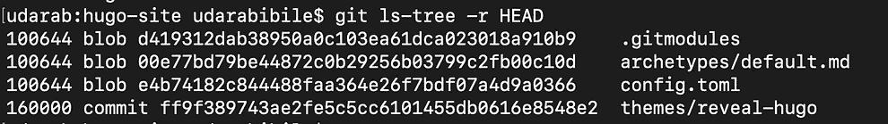

# 使用 Git 子模块在项目间集成代码

> 原文：<https://levelup.gitconnected.com/using-git-submodules-to-integrate-code-between-projects-74a913a41519>

在任何涉及多个项目或多个开发人员的生态系统中，可能存在重复的公共代码段。从长远来看，这种重复的代码会导致不可维护的代码库，在这种情况下，必须将微小的更改复制到许多代码库中，以使其保持一致。

因此，维护具有公共片段的代码库以在项目间共享是一种普遍的做法，并且很少有方法来集成代码库。当在公司的项目中共享时，这个共享代码可以是私有的和特定领域的。或者，共享代码可以是公共的和开源的，其中共享常见用例的解决方案。

## 使用 Git 子模块共享代码

Git 子模块可以被认为是 git 存储库中的 g **it 存储库。这个子存储库承载着需要在项目之间共享的代码。父库和子库之间有引用，所以可以在任何有 Git 的地方管理和重新创建它。**


## 通过演示了解

为了更好地理解，让我们举一个在静态网站生成器 Hugo 中使用的例子。(先决条件:这个需要电脑上安装`Hugo`跟进 demo，不过没有 demo 也可以理解。)

**启动 Hugo 站点**

这将在`hugo-site`中创建相关的文件夹，并且父`git`存储库在这里启动。让我们提交现有的内容，使工作树变得干净。

```
$ **hugo new site hugo-site**
$ **cd hugo-site** $ **git init** $ **git add . && git commit -m "initial commit"**
```

**使用 Git 子模块集成 Hugo 主题**

Hugo 允许我们在 GitHub 中集成现有的开源主题。例如可以使用`[http://github.com/dzello/reveal-hugo](http://github.com/dzello/reveal-hugo.)`。根据 Hugo 的说法，主题应该存在于`themes/`的母库中。

```
$ **git submodule add** [**https://github.com/dzello/reveal-hugo.git**](https://github.com/dzello/reveal-hugo.git) **themes/reveal-hugo**
```

上面的命令将启动一个存储库到`themes/reveal-hugo`目录中的给定目录。这将作为`git clone`，在这里将创建 git 存储库的全部内容，比如`.git`，一个工作树和设置为`master`的分支。


这将在父 git 存储库中启动子 git 存储库作为子模块。


让我们使用`git status`添加子模块来检查父存储库的变更。


这里`.gitmodules`将会有关于它被克隆到的子存储库和目录的信息。注意`themes/reveal-hugo`不是一个目录，因为它实际上在文件系统中，但是对于父存储库来说，它被认为是一个文件。这个新文件包含子存储库的提交散列作为引用。


因此从**子储存库 url** ，它的**提交散列**和它驻留在父储存库中的**目录可以重新创建 Git 子模块内容。让我们提交对`.gitmodules`的更改，并提交散列以集成到父存储库。**

**修改 Git 子模块**

Git 子模块实际上是父存储库中的子存储库。因此可以在本地或远程对这个子存储库进行更改。在这个场景中，这个子模块是一个主题，我们假设我们需要做出改变。



使用 ls-tree 命令检查提交

这里可以清楚地看到父存储库对子模块的引用，注意在`themes/reveal-hugo`中，git 使用`commit`的对象类型来标识提交 id，而不是通常的`blob`或`tree`。

```
$ **git submodule status**
+f6f35ef250... themes/reveal-hugo (heads/master)
```

需要注意的是，这个子存储库的行为就像 Git 存储库一样，可以进行任何需要的更改。子存储库的任何更改也应该在父存储库的子模块中进行跟踪。


列出子存储库的最后 10 次提交

注意，有一个重要的观察结果，父存储库跟踪子存储库中由`HEAD`引用的提交。因此，它总是跟踪当前的提交目录，而不是这个场景中的分支或标记。

让我们在子存储库中提交一个新的虚拟变更，而不对演示进行任何变更。

```
$ **cd themes/reveal-hugo**$ **git commit -m "dummy change" --allow-empty**
[master f6f35ef] dummy change$ **git log --pretty=oneline -n 3**
f6f35e (**HEAD -> master**) dummy change
ff9f38 (**origin/master**, **origin/HEAD**) Merge pull request #87
f71276 Add devops training implementation
```

注意，这为子模块添加了提交，并移动了它的`HEAD`。子模块中的这一变化由父存储库识别，它依赖于`HEAD`引用的提交。所以这个变化可以看出来:


如果将来要将父存储库中的这个更改用作子模块，那么应该提交它。这里需要注意的一点是，父库只知道**远程子库**和的**提交散列**。对于将来在`git clone`工作的子模块，这个本地提交应该可以通过**主分支**中的`git push`作为其`HEAD`在远程储存库中获得。这同样适用于对`git reset`、`git checkout`或`git commit`的任何更改，但要确保这些更改与**远程**、**存储库**同步**，并且在`**master**`分支上作为其`**HEAD**`可用。简单来说就是指`**submodule/.git/HEAD**`。**

简单地说，子存储库中与`HEAD`相关的所有提交都应该在远程可用。以及与父存储库中的`gitmodules`引用相关的所有更改都应该在远程可用。

## 克隆时重新创建子模块

一旦提交了带有子模块的父库，就知道不会复制子库工作树，但会保留对它的**引用，例如远程库 url、它的提交散列以及它应该复制到的目录**。

对于我的使用，我设置了一个带有`Hugo`站点的存储库，其中主题`reveal-hugo`作为子模块被添加。当克隆这个存储库时，我们希望有一个文件的工作副本，其中也克隆了子模块。这通过使用`git clone`处的`--recurse-submodules`来实现。

```
**git clone --recurse-submodules** [**https://github.com/udarabibile/code-koala-slides.git**](https://github.com/udarabibile/code-koala-blog.git)
```


请注意子模块是如何被克隆到给定的目录并检查给定的提交的。该`git clone`产生完整的文件和文件夹，包括子模块。

**使用分支或标签来简化版本控制**

这里可以看到，子模块的引用是使用提交 id 完成的，这对于管理或用于版本控制可能是一个挑战。因此也可以使用 git 标签或分支。

让我们添加一个指定了分支的临时子模块:

```
$ **git submodule add -b dzello-patch-1 https://github.com/dzello/reveal-hugo.git themes-temp/**$ **less .gitmodules**
[submodule "themes-temp"]
path = themes-temp
url = [https://github.com/dzello/reveal-hugo.git](https://github.com/dzello/reveal-hugo.git)
branch = dzello-patch-1$ **git submodule status**
f86d93... themes-temp (heads/dzello-patch-1)
+f6f35e... themes/reveal-hugo (v1.0)
```

这表明`themes-temp`将指向来自指定分支的提交 id。这里，分支在`.gitmodules`中指定，因此可以在克隆时正确地重新创建。

此外，标签也可以用在附加了`themes/reveal-hugo`标签的地方，但是它总是指向提交 id，而不是像 branch 那样指向标签本身。

```
$ **cd themes/reveal-hugo/**
$ **git tag -a v1.0 -m "version 1"**
```

**同步子模块的重要命令**

*   `git submodule update` →在每个子模块中执行`git pull`。有`--init`、`--recursive`、`--remote`等多个标志。
*   `git submodule sync` →更新有关子模块的元数据，如 URL 更改，只需用更新后的`.gitmodules`重新同步`.git/config`。

如需更多详细信息，请跟进:

[](https://git-scm.com/docs/git-submodule) [## git-git-子模块文档

### 不带参数，显示现有子模块的状态。有几个子命令可用于对…执行操作

git-scm.com](https://git-scm.com/docs/git-submodule) 

**Git 子模块的缺点**

当公开或私下共享代码时，Git 模块没有被广泛采用。这可能是由于多个开发者共享时**涉及同步子模块**的复杂性。简单来说 **git 用于** **管理源代码，而不是用于解析依赖关系**。因此，许多开发人员或公司倾向于使用包管理器来共享依赖关系的代码。

**库包管理器**

正如开始提到的，你们都知道，Git 子模块不是集成代码的唯一方式，包管理器更有名。

每种语言或技术栈可能都配备了自己的包管理器，不像 git 子模块，技术不是问题。

*   **Java** 使用 **Maven 仓库**来共享库/插件 **jar** 文件。
*   **。NET** 使用 **Nuget 包管理器**来共享 **dll** exe 文件。
*   **JavaScript** 使用 **NPM 注册表**共享**节点模块**文件。

这里的一个重要变化是这些包管理器大多由**编译或构建代码组成，而不是源代码。**所有这些选项都允许在公司内部使用私有包来获得更安全的、特定于域的包。

让我们看一个如何在 javascript 世界中使用 npm registry 的例子:


总之，我希望你们都熟悉使用 Git 子模块来**整合项目之间的代码**或者**以开源的方式**公开共享代码。